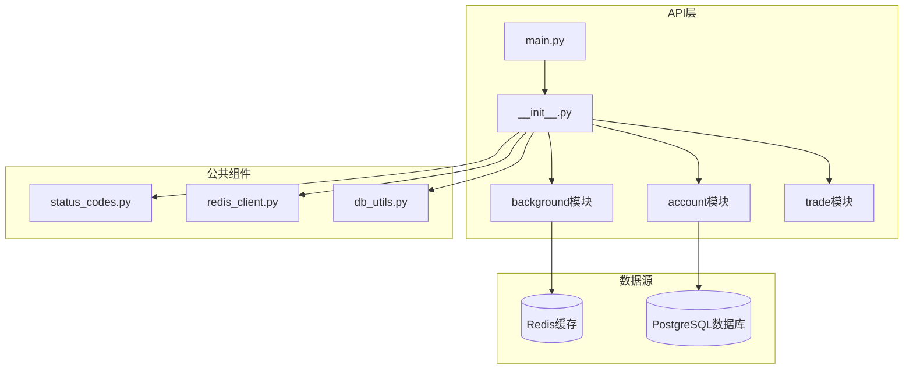
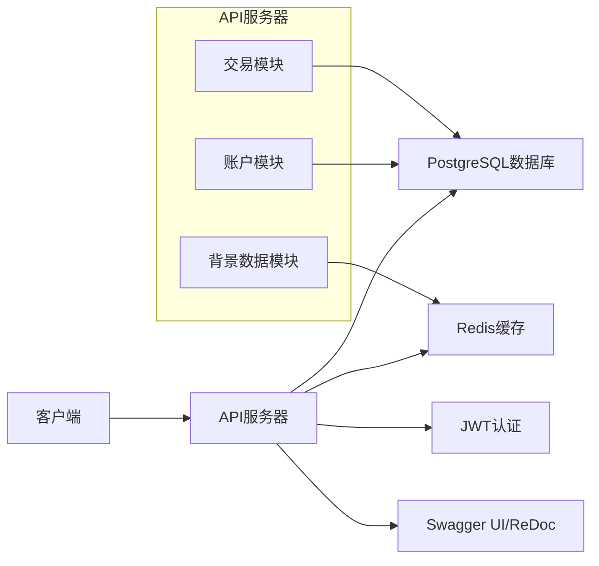
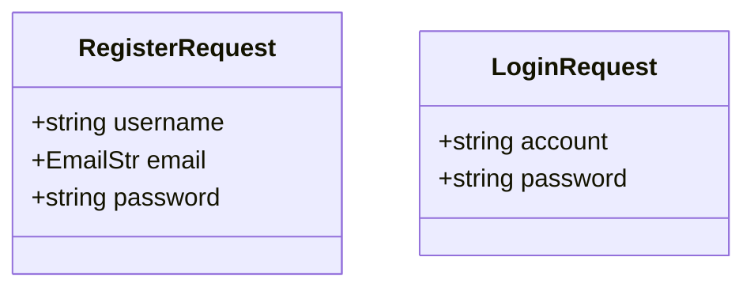
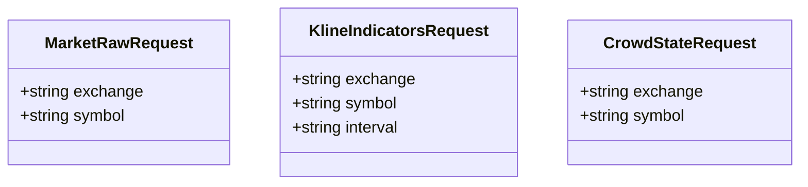
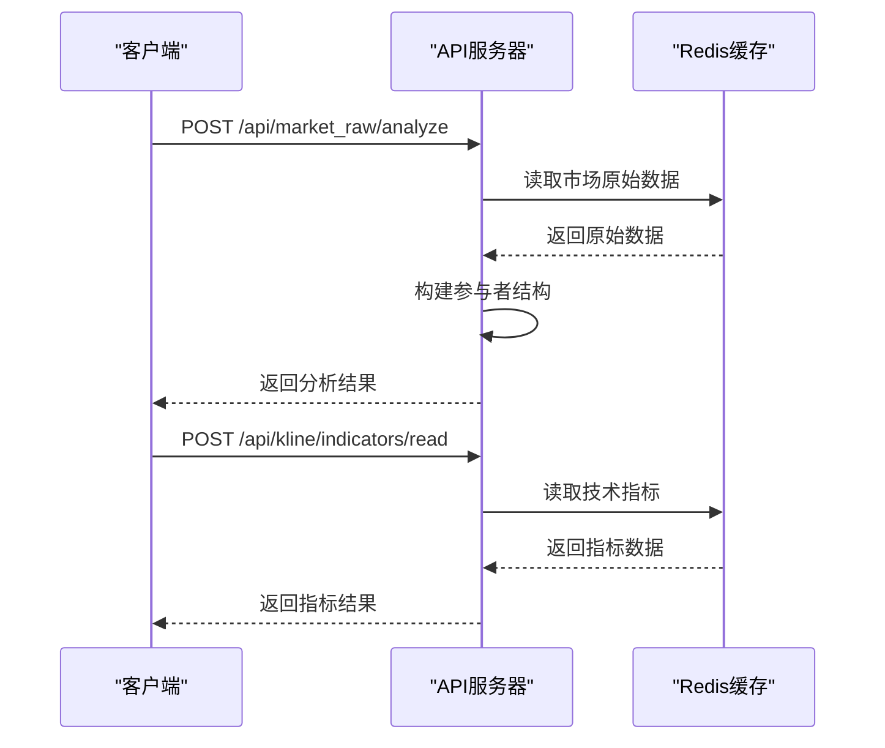
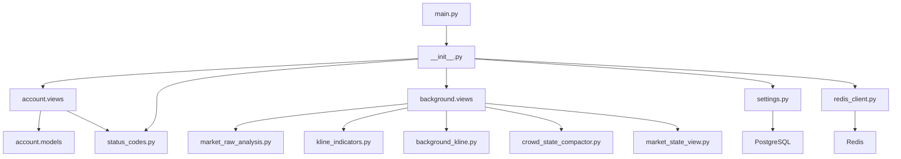
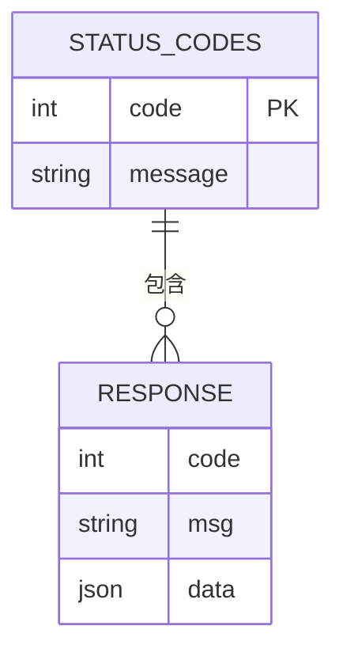

# API服务接口

<cite>
**本文档引用的文件**  
- [main.py](file://api/main.py)
- [__init__.py](file://api/application/__init__.py)
- [views.py](file://api/application/apps/account/views.py)
- [models.py](file://api/application/apps/account/models.py)
- [views.py](file://api/application/apps/background/views.py)
- [market_raw_analysis.py](file://api/application/apps/background/market_raw_analysis.py)
- [kline_indicators.py](file://api/application/apps/background/kline_indicators.py)
- [background_kline.py](file://api/application/apps/background/background_kline.py)
- [crowd_state_compactor.py](file://api/application/apps/background/crowd_state_compactor.py)
- [market_state_view.py](file://api/application/apps/background/market_state_view.py)
- [status_codes.py](file://api/application/common/status_codes.py)
- [redis_client.py](file://api/application/common/redis_client.py)
- [settings.py](file://api/application/settings.py)
</cite>

## 目录
1. [简介](#简介)
2. [项目结构](#项目结构)
3. [核心组件](#核心组件)
4. [架构概述](#架构概述)
5. [详细组件分析](#详细组件分析)
6. [依赖分析](#依赖分析)
7. [性能考虑](#性能考虑)
8. [故障排除指南](#故障排除指南)
9. [结论](#结论)

## 简介
本文档提供了API服务的完整接口文档，覆盖所有公开的RESTful端点。针对account、background（行情与背景数据）、trade等应用模块，详细列出了每个HTTP接口的URL路径、支持的方法（GET/POST）、请求参数、请求体结构与响应格式。使用Pydantic模型定义说明数据结构（如市场状态、指标数据、账户信息），并提供JSON示例。解释了认证机制与错误码体系（status_codes.py）。给出了客户端调用示例，包括使用curl和Python requests库的方式。说明了FastAPI自动生成文档（Swagger UI / ReDoc）的访问路径与使用方法，帮助前端与第三方开发者快速集成。

## 项目结构
该API服务基于FastAPI框架构建，采用模块化设计，主要分为账户管理、行情背景数据和交易三大模块。系统通过Redis缓存市场数据，使用PostgreSQL作为持久化存储，并通过JWT实现用户认证。

**图示来源**  
- [main.py](file://api/main.py#L1-L14)
- [__init__.py](file://api/application/__init__.py#L1-L40)
- [settings.py](file://api/application/settings.py#L1-L34)

**本节来源**  
- [main.py](file://api/main.py#L1-L14)
- [__init__.py](file://api/application/__init__.py#L1-L40)

## 核心组件
系统包含三个核心功能模块：账户管理模块处理用户注册和登录；背景数据模块提供市场行情和分析数据；交易模块记录交易活动和事件。所有模块遵循统一的响应格式，使用状态码进行错误处理，并通过Redis和PostgreSQL进行数据存储。

**本节来源**  
- [views.py](file://api/application/apps/account/views.py#L1-L129)
- [views.py](file://api/application/apps/background/views.py#L1-L273)
- [models.py](file://api/application/apps/trade/models.py#L1-L141)

## 架构概述
系统采用分层架构设计，前端通过HTTP请求与API服务器交互，API服务器处理业务逻辑并与数据存储层通信。认证采用JWT令牌机制，数据缓存使用Redis，持久化存储使用PostgreSQL。系统通过FastAPI的自动文档功能提供Swagger UI和ReDoc接口文档。

**图示来源**  
- [main.py](file://api/main.py#L1-L14)
- [__init__.py](file://api/application/__init__.py#L1-L40)
- [settings.py](file://api/application/settings.py#L1-L34)

## 详细组件分析
### 账户模块分析
账户模块提供用户注册和登录功能，使用JWT进行认证，密码使用bcrypt加密存储。系统支持从明文密码到哈希密码的自动迁移。

#### 请求模型

**图示来源**  
- [views.py](file://api/application/apps/account/views.py#L32-L41)

#### 接口详情
**POST /api/register** - 用户注册
- 请求体：RegisterRequest模型
- 响应：包含用户信息和JWT令牌
- 认证：无需认证

**POST /api/login** - 用户登录
- 请求体：LoginRequest模型
- 响应：包含用户信息和JWT令牌
- 认证：无需认证

**本节来源**  
- [views.py](file://api/application/apps/account/views.py#L43-L126)
- [models.py](file://api/application/apps/account/models.py#L1-L18)

### 背景数据模块分析
背景数据模块提供市场行情、技术指标和市场结构等数据，所有数据从Redis缓存中读取，确保快速响应。

#### 数据结构

**图示来源**  
- [views.py](file://api/application/apps/background/views.py#L18-L103)

#### 接口工作流程

**图示来源**  
- [views.py](file://api/application/apps/background/views.py#L23-L273)
- [market_raw_analysis.py](file://api/application/apps/background/market_raw_analysis.py#L42-L94)
- [kline_indicators.py](file://api/application/apps/background/kline_indicators.py#L17-L55)

#### 主要接口
**POST /api/market_raw/analyze** - 分析市场原始数据
- 请求体：MarketRawRequest模型
- 响应：包含参与者结构、ticker和资金费率分析结果

**POST /api/kline/indicators/read** - 读取技术指标
- 请求体：KlineIndicatorsRequest模型
- 响应：包含指定周期的技术指标数据

**POST /api/crowd_state/read** - 读取人群状态
- 请求体：CrowdStateRequest模型
- 响应：包含市场结构数据

**本节来源**  
- [views.py](file://api/application/apps/background/views.py#L23-L273)
- [market_raw_analysis.py](file://api/application/apps/background/market_raw_analysis.py#L42-L94)
- [kline_indicators.py](file://api/application/apps/background/kline_indicators.py#L17-L55)

## 依赖分析
系统依赖于多个外部组件和内部模块，形成了清晰的依赖关系。

**图示来源**  
- [main.py](file://api/main.py#L1-L14)
- [__init__.py](file://api/application/__init__.py#L1-L40)
- [settings.py](file://api/application/settings.py#L1-L34)

**本节来源**  
- [main.py](file://api/main.py#L1-L14)
- [__init__.py](file://api/application/__init__.py#L1-L40)
- [settings.py](file://api/application/settings.py#L1-L34)

## 性能考虑
系统在设计时考虑了性能优化，主要体现在以下几个方面：
1. 使用Redis缓存频繁访问的市场数据，减少数据库查询
2. 采用异步I/O操作，提高并发处理能力
3. 对数据库查询进行索引优化
4. 使用连接池管理数据库和Redis连接
5. 批量读取多周期指标数据，减少网络往返

## 故障排除指南
### 常见错误码

**本节来源**  
- [status_codes.py](file://api/application/common/status_codes.py#L1-L26)

### 常见问题
1. **连接超时**：检查Redis和PostgreSQL服务是否正常运行
2. **认证失败**：验证JWT令牌是否正确且未过期
3. **数据为空**：确认指定的交易所和交易对是否有数据
4. **接口返回500**：检查服务器日志获取详细错误信息

## 结论
本文档详细介绍了API服务的接口设计、架构和实现细节。系统采用现代化的Python技术栈，基于FastAPI构建，具有良好的可扩展性和性能表现。通过清晰的模块划分和统一的接口设计，为前端和第三方开发者提供了便捷的集成方式。建议在生产环境中配置适当的CORS策略和监控系统，以确保服务的稳定性和安全性。