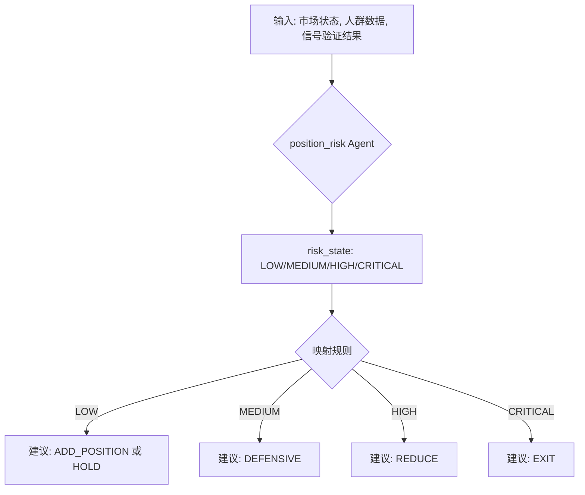
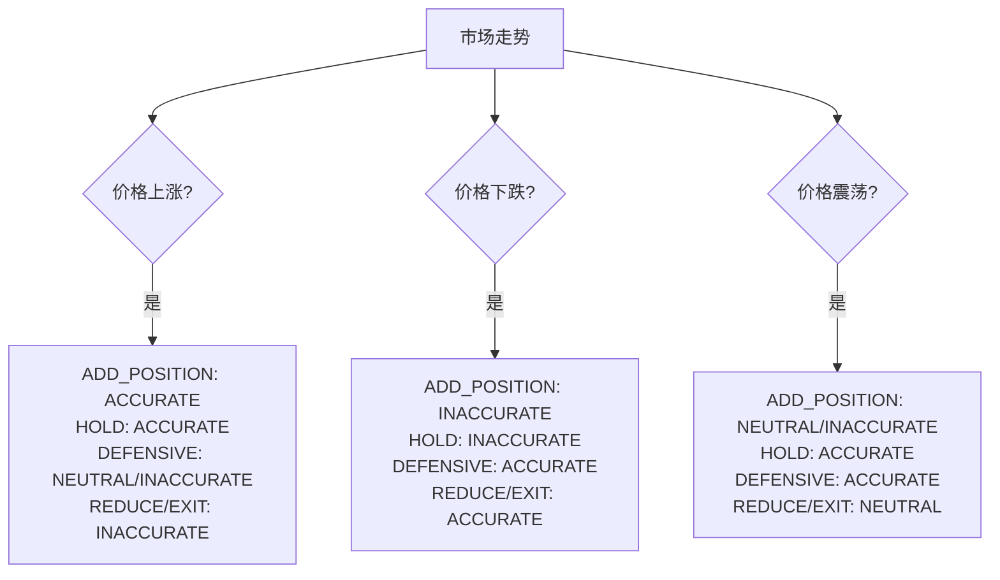
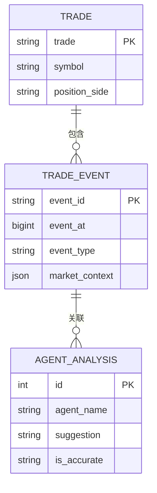

# Agent分析记录

<cite>
**本文档引用文件**  
- [models.py](file://api/application/apps/trade/models.py)
- [signal_validation_workflow.py](file://agent_server/agent_workflow/signal_validation_workflow.py)
- [position_risk_execution.py](file://agent_server/agent_workflow/components/executors/position_risk_execution.py)
- [signal_validation_execution.py](file://agent_server/agent_workflow/components/executors/signal_validation_execution.py)
- [position_risk.py](file://agent_server/agents/experts/analysis/position_risk.py)
- [signal_validation.py](file://agent_server/agents/experts/analysis/signal_validation.py)
- [position_risk.py](file://agent_server/configs/prompts/position_risk.py)
</cite>

## 目录
1. [引言](#引言)
2. [核心业务逻辑与评分机制](#核心业务逻辑与评分机制)
3. [Agent标识与模型追踪](#agent标识与模型追踪)
4. [持仓建议与风控策略](#持仓建议与风控策略)
5. [准确性判断逻辑](#准确性判断逻辑)
6. [决策过程调试与优化](#决策过程调试与优化)
7. [事件关联机制](#事件关联机制)

## 引言
Agent分析记录表（AgentAnalysis）是评估智能代理性能的核心数据结构，用于系统化记录各专家代理在特定交易事件中的分析结果。该表通过结构化字段设计，实现了对代理决策过程的全面追踪、建议准确性的量化评估以及后续模型优化的数据支持。

**Section sources**
- [models.py](file://api/application/apps/trade/models.py#L88-L137)

## 核心业务逻辑与评分机制
Agent分析记录表的核心在于其业务逻辑闭环：当交易过程中发生关键事件（如信号更新、风控检查）时，系统会触发相应的Agent进行分析。分析结果被持久化到AgentAnalysis表中，并通过外键关联到具体的TradeEvent。后续，系统会根据市场价格的实际走势，依据预设规则对Agent的建议进行回溯性准确性评级（is_accurate），形成“建议-结果-评分”的完整反馈循环，为模型迭代提供数据基础。

**Section sources**
- [models.py](file://api/application/apps/trade/models.py#L88-L137)
- [signal_validation_workflow.py](file://agent_server/agent_workflow/signal_validation_workflow.py#L10-L33)

## Agent标识与模型追踪
### agent_name字段
`agent_name`字段用于唯一标识执行分析的专家代理。系统中存在多种专业化的Agent，例如：
- `signal_validation`：负责验证技术信号的有效性。
- `position_risk`：负责评估持仓风险并给出操作建议。

该字段确保了分析结果的来源可追溯，便于按代理类型进行性能统计和问题定位。

### model_version字段
`model_version`字段记录了生成该分析结果所使用的底层大模型版本（如gpt-4-turbo, llama-3-70b）。此字段对于模型的A/B测试、性能对比和迭代追踪至关重要，能够精确地将分析结果与特定的模型版本关联起来，确保实验的可复现性。

**Section sources**
- [models.py](file://api/application/apps/trade/models.py#L114-L115)
- [signal_validation.py](file://agent_server/agents/experts/analysis/signal_validation.py#L24-L26)
- [position_risk.py](file://agent_server/agents/experts/analysis/position_risk.py#L22-L24)

## 持仓建议与风控策略
### suggestion字段
`suggestion`字段是风控Agent的核心产出，包含五种明确的持仓建议，每种建议都对应着特定的风控策略：

| 建议类型 | 风控策略说明 |
| :--- | :--- |
| **ADD_POSITION** | 建议加仓，通常在风险极低且趋势强劲时触发。 |
| **HOLD** | 建议持有，维持当前仓位，适用于稳定趋势或无明确信号时。 |
| **DEFENSIVE** | 建议进入防御状态，预警潜在风险，可能需要收紧止损。 |
| **REDUCE** | 建议减仓，主动降低风险敞口，通常在风险升高时触发。 |
| **EXIT** | 建议清仓，立即退出全部头寸，用于应对极端风险或信号失效。 |

这些建议直接映射到`position_risk`代理的输出规则，确保了建议的可执行性。

**Diagram sources**
- [position_risk.py](file://agent_server/configs/prompts/position_risk.py#L69-L73)
- [position_risk.py](file://agent_server/agents/experts/analysis/position_risk.py#L28-L31)

**Section sources**
- [models.py](file://api/application/apps/trade/models.py#L122)
- [position_risk.py](file://agent_server/configs/prompts/position_risk.py#L52-L66)

## 准确性判断逻辑
`is_accurate`字段的判断逻辑是评估Agent性能的核心，它根据市场价格的实际走势对建议进行评级，分为`ACCURATE`（正确）、`INACCURATE`（错误）和`NEUTRAL`（中性）三种。判断逻辑以持有多单（LONG）为例，空单（SHORT）逻辑相反。

### 价格上涨（有利方向）
当价格向有利方向上涨时：
- **ADD_POSITION** 和 **HOLD** 被评为 `ACCURATE`：前者是乘胜追击，后者是坐享其成。
- **DEFENSIVE** 被评为 `INACCURATE` 或 `NEUTRAL`：涨幅迅猛时为踏空，属于错误；涨幅较弱时可能合理，但总体偏保守。
- **REDUCE** 和 **EXIT** 被评为 `INACCURATE`：属于“卖飞”，错失了盈利机会。

### 价格下跌（不利方向）
当价格向不利方向下跌时：
- **ADD_POSITION** 和 **HOLD** 被评为 `INACCURATE`：前者是逆势加仓，后者是死扛亏损。
- **DEFENSIVE** 和 **REDUCE/EXIT** 被评为 `ACCURATE`：预警风险或及时止损，避免了更大损失。

### 价格震荡（幅度<0.5%）
当价格处于窄幅震荡时：
- **ADD_POSITION** 被评为 `NEUTRAL` 或 `INACCURATE`：容易因交易成本而磨损利润。
- **HOLD** 和 **DEFENSIVE** 被评为 `ACCURATE`：多看少动或保持警惕是合理的。
- **REDUCE/EXIT** 被评为 `NEUTRAL`：反应可能过度，但规避了不确定性。

**Diagram sources**
- [models.py](file://api/application/apps/trade/models.py#L94-L110)

**Section sources**
- [models.py](file://api/application/apps/trade/models.py#L94-L110)

## 决策过程调试与优化
### reasoning字段
`reasoning`字段以JSON格式存储了Agent做出决策的详细理由。它包含了分析过程中的关键推理链条、依据的市场特征和触发的规则标签（reason_tags）。这对于调试Agent的决策逻辑、理解其“思考”过程以及发现潜在的逻辑漏洞至关重要。

### full_output字段
`full_output`字段存储了Agent返回的原始完整输出（Raw JSON）。它保留了所有未经过滤的字段和元数据，是进行深度模型分析和优化的宝贵资源。通过分析`full_output`，可以评估模型的置信度、检查输出格式的合规性，并为Prompt Engineering提供直接的反馈。

**Section sources**
- [models.py](file://api/application/apps/trade/models.py#L131-L132)
- [signal_validation.py](file://agent_server/agents/experts/analysis/signal_validation.py#L60-L78)
- [position_risk.py](file://agent_server/agents/experts/analysis/position_risk.py#L58-L75)

## 事件关联机制
AgentAnalysis表通过外键`event`字段与`TradeEvent`表建立关联。这种设计实现了分析结果与具体市场事件的精确对齐。每一个Agent的分析都是针对一个特定的`TradeEvent`（如一个信号触发事件）进行的。通过这种关联，系统可以：
1.  回溯在某个事件发生时，各个Agent给出了什么建议。
2.  在事件发生后的市场走势明确后，为该事件的分析结果计算`is_accurate`评分。
3.  构建完整的交易决策时间线，将市场变化、事件触发、Agent分析和最终操作串联起来。

**Diagram sources**
- [models.py](file://api/application/apps/trade/models.py#L64-L85)
- [models.py](file://api/application/apps/trade/models.py#L113-L137)

**Section sources**
- [models.py](file://api/application/apps/trade/models.py#L113)
- [trade_event_recorder.py](file://agent_server/utils/trade_event_recorder.py#L240-L298)