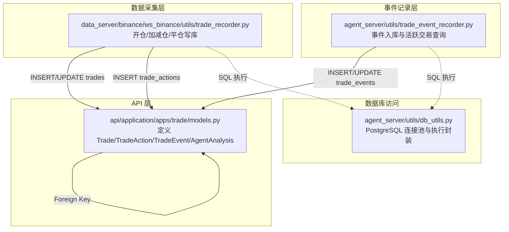
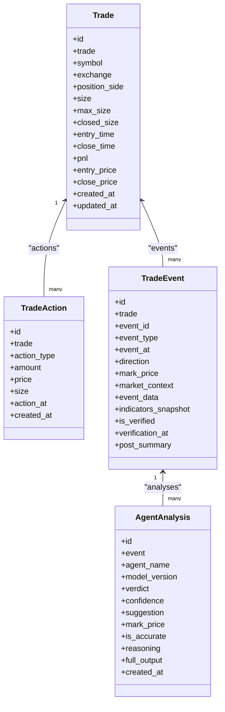
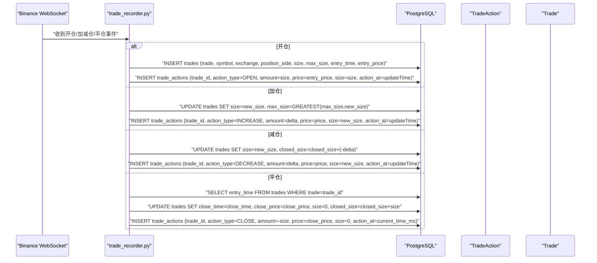
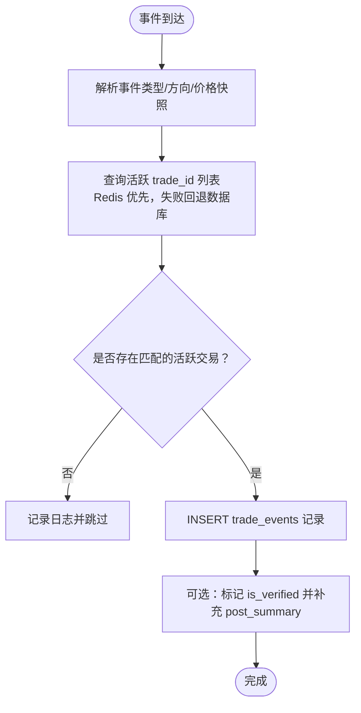
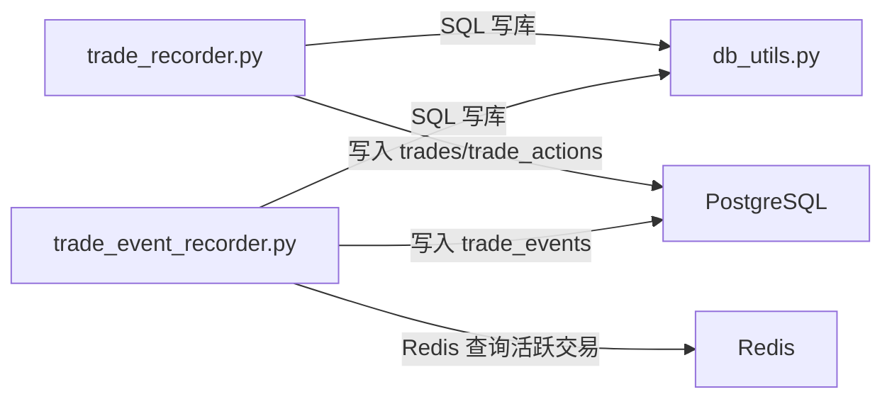

# 交易主记录

<cite>
**本文引用的文件列表**
- [api/application/apps/trade/models.py](file://api/application/apps/trade/models.py)
- [data_server/binance/ws_binance/utils/trade_recorder.py](file://data_server/binance/ws_binance/utils/trade_recorder.py)
- [agent_server/utils/trade_event_recorder.py](file://agent_server/utils/trade_event_recorder.py)
- [agent_server/utils/db_utils.py](file://agent_server/utils/db_utils.py)
</cite>

## 目录
1. [简介](#简介)
2. [项目结构](#项目结构)
3. [核心组件](#核心组件)
4. [架构概览](#架构概览)
5. [详细组件分析](#详细组件分析)
6. [依赖分析](#依赖分析)
7. [性能考量](#性能考量)
8. [故障排查指南](#故障排查指南)
9. [结论](#结论)
10. [附录](#附录)

## 简介
本文件围绕交易主表（Trade）进行系统化说明，重点阐述其在交易生命周期管理中的核心地位，以及如何作为 TradeAction、TradeEvent、AgentAnalysis 等关联表的根实体，支撑交易行为分析与 Agent 性能评估。文档覆盖字段的业务含义、复合索引的设计意图、典型交易从开仓到平仓的数据快照，以及与数据采集、事件记录、分析流程的衔接关系。

## 项目结构
Trade 模型位于 API 应用层的交易模块中，采用 Tortoise ORM 定义数据库表结构；数据采集侧通过 Binance WebSocket 工具将实时成交/仓位变化写入数据库；事件侧通过 Agent 事件记录器将关键事件持久化；数据库访问通过统一的 PostgreSQL 工具类封装。

图表来源
- [api/application/apps/trade/models.py](file://api/application/apps/trade/models.py#L1-L141)
- [data_server/binance/ws_binance/utils/trade_recorder.py](file://data_server/binance/ws_binance/utils/trade_recorder.py#L40-L149)
- [agent_server/utils/trade_event_recorder.py](file://agent_server/utils/trade_event_recorder.py#L1-L200)
- [agent_server/utils/db_utils.py](file://agent_server/utils/db_utils.py#L1-L200)

章节来源
- [api/application/apps/trade/models.py](file://api/application/apps/trade/models.py#L1-L141)
- [data_server/binance/ws_binance/utils/trade_recorder.py](file://data_server/binance/ws_binance/utils/trade_recorder.py#L40-L149)
- [agent_server/utils/trade_event_recorder.py](file://agent_server/utils/trade_event_recorder.py#L1-L200)
- [agent_server/utils/db_utils.py](file://agent_server/utils/db_utils.py#L1-L200)

## 核心组件
- Trade（交易主表）：记录一次完整交易的生命周期，包含交易标识、交易对、交易所、方向、持仓量、时间戳、资金快照等。
- TradeAction（交易操作记录表）：记录开仓、平仓、加仓、减仓等具体操作及其变动后的状态。
- TradeEvent（交易事件表）：记录持仓期间的关键事件，如风控检查、信号更新等，并保留市场背景与事件原始数据快照。
- AgentAnalysis（Agent 分析记录表）：记录各 Agent 对事件的分析结论、置信度、建议及准确性评价，用于后续性能评估。

章节来源
- [api/application/apps/trade/models.py](file://api/application/apps/trade/models.py#L1-L141)

## 架构概览
Trade 作为根实体，通过外键关系串联起交易行为（TradeAction）、事件（TradeEvent）与分析（AgentAnalysis）。数据采集侧负责将实时成交/仓位变化写入 Trade 与 TradeAction；事件侧负责将关键事件写入 TradeEvent，并在 Agent 分析完成后回填验证与总结；最终形成“交易主表 + 行为 + 事件 + 分析”的闭环。

图表来源
- [api/application/apps/trade/models.py](file://api/application/apps/trade/models.py#L1-L141)

## 详细组件分析

### Trade 字段与业务含义
- id：自增主键，用于内部标识。
- trade：交易唯一标识（UUID），作为关联外键的锚点，确保跨表一致性。
- symbol：交易对（如 ETHUSDT）。
- exchange：交易所（如 binance）。
- position_side：多空方向（LONG/SHORT）。
- size：当前持仓量（positionAmt）。
- max_size：历史最大持仓量，用于跟踪策略的加仓幅度。
- closed_size：已平仓量，累计平仓数量。
- entry_time：开仓时间（UTC 时间）。
- close_time：平仓时间（UTC 时间），未平仓时为空。
- pnl：已实现盈亏，通常由外部接口或结算流程填充。
- entry_price：开仓均价，用于计算盈亏与成本。
- close_price：平仓均价，用于计算已实现盈亏。
- created_at/updated_at：记录创建与更新时间，便于审计与排序。

复合索引设计（Meta.indexes）：
- 索引：(symbol, close_time)
- 设计意图：优化按交易对与时间范围的查询，常用于“查询某交易对在某时间段内的已平仓交易”场景，减少全表扫描，提升检索效率。

章节来源
- [api/application/apps/trade/models.py](file://api/application/apps/trade/models.py#L1-L33)

### 交易生命周期写入流程
- 开仓：写入 Trade 表（设置 size=max_size=初始持仓量，entry_time=开仓时间，entry_price=开仓均价），同时写入 TradeAction 表（action_type=OPEN）。
- 加减仓：更新 Trade.size 与 max_size（加仓时若新 size 大于 max_size 则更新），或更新 closed_size（减仓时增加平仓量），并写入 TradeAction 表（action_type=INCREASE/DECREASE）。
- 平仓：查询 entry_time 计算持仓时长，更新 Trade.close_time、close_price、size=0、closed_size 累加平仓量，并写入 TradeAction 表（action_type=CLOSE）。

图表来源
- [data_server/binance/ws_binance/utils/trade_recorder.py](file://data_server/binance/ws_binance/utils/trade_recorder.py#L40-L149)

章节来源
- [data_server/binance/ws_binance/utils/trade_recorder.py](file://data_server/binance/ws_binance/utils/trade_recorder.py#L40-L149)

### 事件与分析的落地
- 事件入库：事件记录器将事件写入 TradeEvent，包含事件类型、时间戳、方向、价格快照、市场背景与事件原始数据快照等。
- 活跃交易查询：事件记录器优先从 Redis 获取当前活跃 trade_id 列表，若 Redis 不可用则回退到查询未平仓的 Trade 记录，支持多空双开场景。
- 分析回填：AgentAnalysis 记录各 Agent 的结论与建议，可在事件验证与总结阶段回填到 TradeEvent。

图表来源
- [agent_server/utils/trade_event_recorder.py](file://agent_server/utils/trade_event_recorder.py#L1-L200)

章节来源
- [agent_server/utils/trade_event_recorder.py](file://agent_server/utils/trade_event_recorder.py#L1-L200)

### 数据快照示例（从开仓到平仓）
以下为一次完整交易的典型数据快照路径（字段映射与业务语义来自模型定义）：
- 开仓时刻
  - Trade：trade、symbol、exchange、position_side、size=初始持仓量、max_size=初始持仓量、closed_size=0、entry_time=开仓时间、entry_price=开仓均价、pnl=0、close_time=null
  - TradeAction：action_type=OPEN、amount=初始持仓量、price=entry_price、size=初始持仓量、action_at=开仓时间戳
- 加仓/减仓时刻
  - Trade：size=新持仓量、max_size=max(max_size, 新持仓量) 或 closed_size 增加（减仓）
  - TradeAction：action_type=INCREASE/DECREASE、amount=变动量、price=成交价、size=变动后总持仓量
- 平仓时刻
  - Trade：close_time=平仓时间、close_price=平仓均价、size=0、closed_size 累加平仓量
  - TradeAction：action_type=CLOSE、amount=-当前持仓量、price=close_price、size=0

章节来源
- [api/application/apps/trade/models.py](file://api/application/apps/trade/models.py#L1-L33)
- [data_server/binance/ws_binance/utils/trade_recorder.py](file://data_server/binance/ws_binance/utils/trade_recorder.py#L40-L149)

### 作为根实体的支撑能力
- TradeAction：以 trade 为外键，记录每次操作的金额、价格与变动后总持仓，便于还原交易过程与计算成本。
- TradeEvent：以 trade 为外键，记录事件发生时的市场背景与原始数据快照，便于事后复盘与验证。
- AgentAnalysis：以 TradeEvent 为外键，记录 Agent 的结论、置信度与建议，支撑策略准确性评估与性能归因。

章节来源
- [api/application/apps/trade/models.py](file://api/application/apps/trade/models.py#L35-L141)

## 依赖分析
- 组件耦合
  - Trade 与 TradeAction/TradeEvent/AgentAnalysis 通过外键关联，形成“主表-行为-事件-分析”的层级依赖。
  - 数据采集侧与事件侧均通过 SQL 写库，依赖统一的数据库访问工具类。
- 外部依赖
  - PostgreSQL：通过连接池与批量执行封装，保证高并发下的稳定性与吞吐。
  - Redis：事件记录器优先从 Redis 获取活跃交易，降低数据库压力。

图表来源
- [data_server/binance/ws_binance/utils/trade_recorder.py](file://data_server/binance/ws_binance/utils/trade_recorder.py#L40-L149)
- [agent_server/utils/trade_event_recorder.py](file://agent_server/utils/trade_event_recorder.py#L1-L200)
- [agent_server/utils/db_utils.py](file://agent_server/utils/db_utils.py#L1-L200)

章节来源
- [agent_server/utils/db_utils.py](file://agent_server/utils/db_utils.py#L1-L200)
- [agent_server/utils/trade_event_recorder.py](file://agent_server/utils/trade_event_recorder.py#L1-L200)
- [data_server/binance/ws_binance/utils/trade_recorder.py](file://data_server/binance/ws_binance/utils/trade_recorder.py#L40-L149)

## 性能考量
- 复合索引优化：(symbol, close_time) 有效加速“按交易对 + 时间范围”的查询，建议在统计报表与回测筛选中优先使用该组合条件。
- 数据写入批量化：TradeAction/TradeEvent 的写入应尽量批量提交，减少事务开销。
- Redis 缓存命中：事件记录器优先从 Redis 获取活跃交易，可显著降低数据库查询压力。
- 连接池与重试：统一的数据库访问封装具备连接池与重试机制，建议在高并发场景下合理配置连接数与重试参数。

章节来源
- [api/application/apps/trade/models.py](file://api/application/apps/trade/models.py#L30-L33)
- [agent_server/utils/db_utils.py](file://agent_server/utils/db_utils.py#L1-L200)
- [agent_server/utils/trade_event_recorder.py](file://agent_server/utils/trade_event_recorder.py#L1-L200)

## 故障排查指南
- 写库失败
  - 检查数据库连接池状态与重试日志，确认主机、端口、凭据配置正确。
  - 关注 SQL 执行异常与回滚日志，定位具体失败语句与参数。
- 事件重复/遗漏
  - 核对 TradeEvent 的 event_id 唯一性约束与去重逻辑，避免重复写入。
  - 检查事件路由与提取逻辑，确保 market_context、event_data、indicators_snapshot 等字段正确填充。
- 活跃交易查询异常
  - 若 Redis 不可用，回退到数据库查询时需确认未平仓条件与排序逻辑。
  - 多空双开场景下，需按 position_side 过滤，避免误匹配。

章节来源
- [agent_server/utils/db_utils.py](file://agent_server/utils/db_utils.py#L1-L200)
- [agent_server/utils/trade_event_recorder.py](file://agent_server/utils/trade_event_recorder.py#L1-L200)

## 结论
Trade 作为交易生命周期的根实体，通过清晰的字段定义与复合索引设计，为交易行为、事件与分析提供了稳固的数据基础。结合数据采集侧的实时写入与事件侧的高效落库，形成了从开仓到平仓的完整闭环，支撑后续的策略评估与 Agent 性能分析。

## 附录
- 字段清单与业务含义（来自模型定义）
  - id：自增主键
  - trade：交易唯一标识（UUID）
  - symbol：交易对
  - exchange：交易所
  - position_side：方向（LONG/SHORT）
  - size：当前持仓量
  - max_size：最大持仓量
  - closed_size：已平仓量
  - entry_time：开仓时间
  - close_time：平仓时间
  - pnl：已实现盈亏
  - entry_price：开仓均价
  - close_price：平仓均价
  - created_at/updated_at：记录创建与更新时间

章节来源
- [api/application/apps/trade/models.py](file://api/application/apps/trade/models.py#L1-L33)