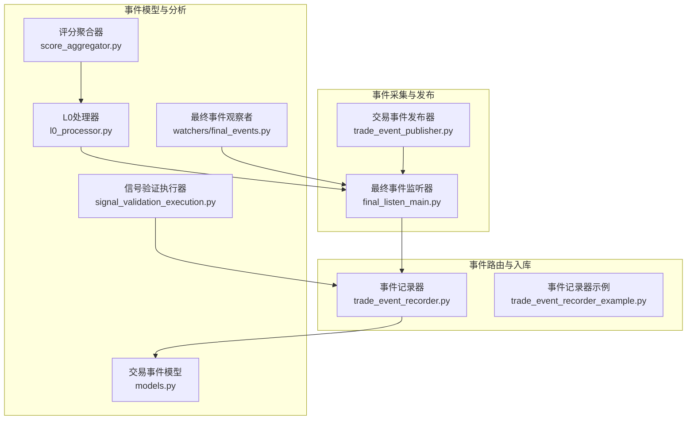
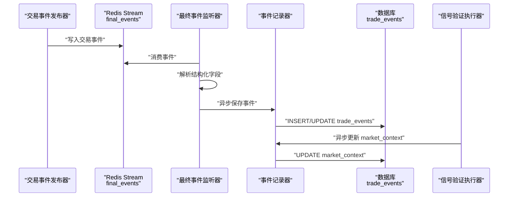
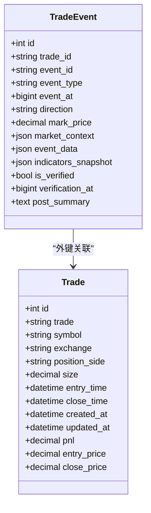
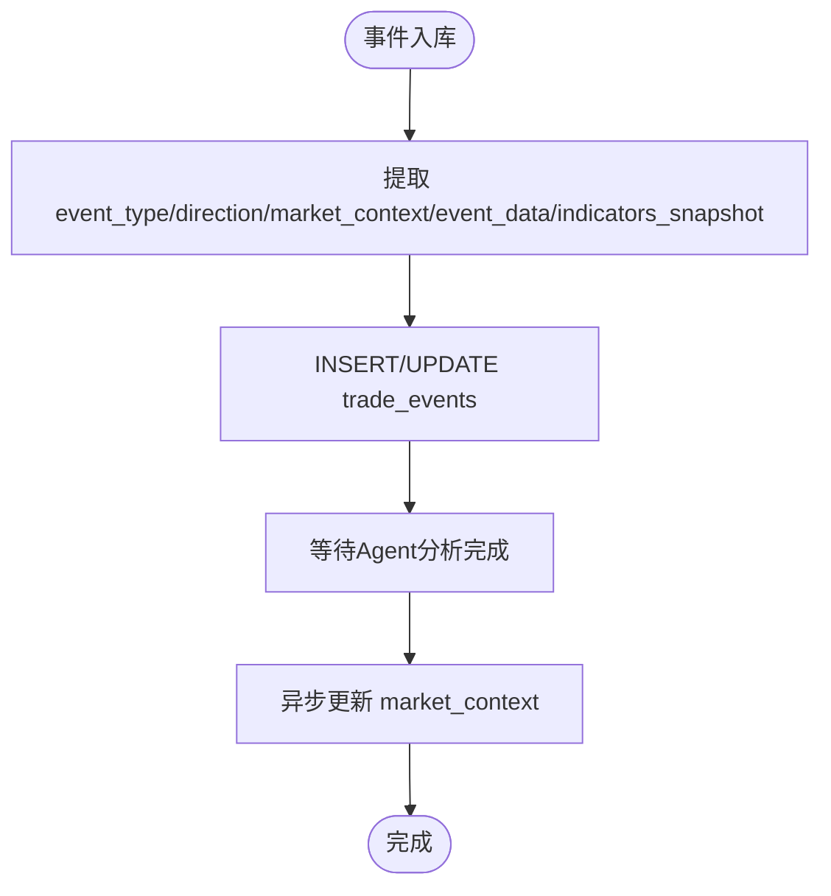
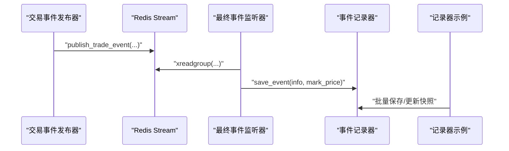
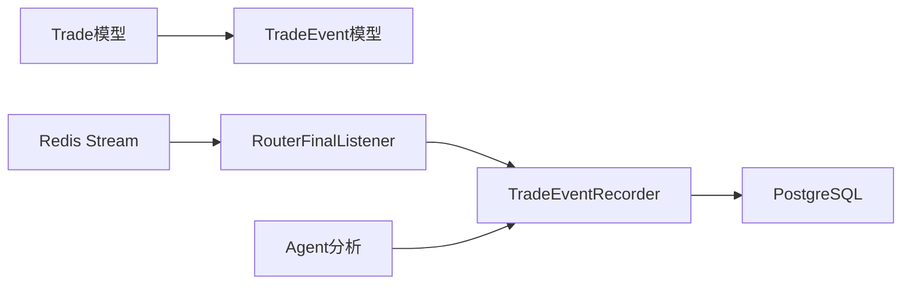

# 交易事件记录

<cite>
**本文引用的文件**
- [api/application/apps/trade/models.py](file://api/application/apps/trade/models.py)
- [agent_server/utils/trade_event_recorder.py](file://agent_server/utils/trade_event_recorder.py)
- [agent_server/utils/trade_event_recorder_example.py](file://agent_server/utils/trade_event_recorder_example.py)
- [agent_server/final_listen_main.py](file://agent_server/final_listen_main.py)
- [data_server/binance/ws_binance/utils/trade_event_publisher.py](file://data_server/binance/ws_binance/utils/trade_event_publisher.py)
- [agent_server/agent_workflow/components/executors/signal_validation_execution.py](file://agent_server/agent_workflow/components/executors/signal_validation_execution.py)
- [event_center/pipeline/l0_processor.py](file://event_center/pipeline/l0_processor.py)
- [event_center/indicators_event/scoring/score_aggregator.py](file://event_center/indicators_event/scoring/score_aggregator.py)
- [agent_server/utils/watchers/final_events.py](file://agent_server/utils/watchers/final_events.py)
</cite>

## 目录
1. [简介](#简介)
2. [项目结构](#项目结构)
3. [核心组件](#核心组件)
4. [架构总览](#架构总览)
5. [详细组件分析](#详细组件分析)
6. [依赖关系分析](#依赖关系分析)
7. [性能考量](#性能考量)
8. [故障排查指南](#故障排查指南)
9. [结论](#结论)

## 简介
本文件围绕“交易事件表（TradeEvent）”进行系统化文档化，重点阐明其作为交易过程“黑匣子”的关键作用。TradeEvent用于记录持仓期间发生的各类市场与系统事件，包括但不限于价格波动、风控触发、信号更新等。本文将从字段设计、事件分类与追踪、市场方向表达、JSON字段的三类快照、准确性验证与人工复盘流程，以及按时间轴检索的索引优化等方面进行全面解读，并结合实际代码路径给出可视化图示与实操指引。

## 项目结构
TradeEvent位于交易应用层的ORM模型中，配合事件采集、路由与入库组件共同构成“事件采集—路由—入库—复盘”的闭环。下图展示与TradeEvent相关的核心模块及其交互关系。

图表来源
- [data_server/binance/ws_binance/utils/trade_event_publisher.py](file://data_server/binance/ws_binance/utils/trade_event_publisher.py#L1-L114)
- [agent_server/final_listen_main.py](file://agent_server/final_listen_main.py#L1-L166)
- [agent_server/utils/trade_event_recorder.py](file://agent_server/utils/trade_event_recorder.py#L1-L451)
- [api/application/apps/trade/models.py](file://api/application/apps/trade/models.py#L59-L86)
- [agent_server/agent_workflow/components/executors/signal_validation_execution.py](file://agent_server/agent_workflow/components/executors/signal_validation_execution.py#L28-L70)
- [event_center/pipeline/l0_processor.py](file://event_center/pipeline/l0_processor.py#L181-L264)
- [event_center/indicators_event/scoring/score_aggregator.py](file://event_center/indicators_event/scoring/score_aggregator.py#L121-L152)
- [agent_server/utils/watchers/final_events.py](file://agent_server/utils/watchers/final_events.py#L75-L96)

章节来源
- [api/application/apps/trade/models.py](file://api/application/apps/trade/models.py#L59-L86)
- [agent_server/utils/trade_event_recorder.py](file://agent_server/utils/trade_event_recorder.py#L1-L451)
- [agent_server/final_listen_main.py](file://agent_server/final_listen_main.py#L1-L166)
- [data_server/binance/ws_binance/utils/trade_event_publisher.py](file://data_server/binance/ws_binance/utils/trade_event_publisher.py#L1-L114)

## 核心组件
- 交易事件模型（TradeEvent）：定义事件表结构、字段语义与索引策略，承载事件的唯一标识、类型、方向、时间戳及三类JSON快照。
- 事件记录器（TradeEventRecorder）：负责从Redis Stream读取事件、解析并入库，支持多空双开场景下的重复事件去重与并发入库。
- 事件发布器（TradeEventPublisher）：将交易变更事件（开仓、平仓、加仓、减仓）标准化后写入Redis Stream，供下游统一消费。
- 事件监听与路由（RouterFinalListener）：从final_events流中提取结构化信息，异步触发入库与工作流分发。
- 信号验证执行器（SignalValidationExecution）：在Agent分析完成后，异步更新事件的市场背景快照（market_context）。

章节来源
- [api/application/apps/trade/models.py](file://api/application/apps/trade/models.py#L59-L86)
- [agent_server/utils/trade_event_recorder.py](file://agent_server/utils/trade_event_recorder.py#L1-L451)
- [data_server/binance/ws_binance/utils/trade_event_publisher.py](file://data_server/binance/ws_binance/utils/trade_event_publisher.py#L1-L114)
- [agent_server/final_listen_main.py](file://agent_server/final_listen_main.py#L1-L166)
- [agent_server/agent_workflow/components/executors/signal_validation_execution.py](file://agent_server/agent_workflow/components/executors/signal_validation_execution.py#L28-L70)

## 架构总览
下图展示从事件产生到入库与复盘的端到端流程，突出event_id与event_type在事件分类与追踪中的作用，以及direction对市场动向的刻画。

图表来源
- [data_server/binance/ws_binance/utils/trade_event_publisher.py](file://data_server/binance/ws_binance/utils/trade_event_publisher.py#L1-L114)
- [agent_server/final_listen_main.py](file://agent_server/final_listen_main.py#L1-L166)
- [agent_server/utils/trade_event_recorder.py](file://agent_server/utils/trade_event_recorder.py#L219-L300)
- [agent_server/agent_workflow/components/executors/signal_validation_execution.py](file://agent_server/agent_workflow/components/executors/signal_validation_execution.py#L28-L70)

## 详细组件分析

### TradeEvent模型与字段语义
- 关键字段
  - event_id：事件唯一标识，用于跨交易对、跨方向的事件去重与关联。
  - event_type：事件类型，如“RISK_CHECK”、“SIGNAL_UPDATE”等，用于分类与追踪。
  - event_at：事件发生的时间戳（毫秒），用于按时间轴检索。
  - direction：市场方向（bullish/bearish/neutral），反映事件发生时的市场动向。
  - mark_price：事件发生时的标记价格，便于事后回溯与损益计算。
  - market_context：市场背景快照（趋势、波动等），由Agent分析后补充。
  - event_data：事件原始数据（analysis_context或trade_details），保留分析上下文。
  - indicators_snapshot：关键技术指标快照（EMA、MACD、RSI等），便于技术复盘。
  - is_verified、verification_at、post_summary：准确性验证与人工复盘流程字段。
- 索引设计
  - (trade, event_at)：按交易与时间排序，优化按时间轴检索事件序列的性能。

图表来源
- [api/application/apps/trade/models.py](file://api/application/apps/trade/models.py#L59-L86)

章节来源
- [api/application/apps/trade/models.py](file://api/application/apps/trade/models.py#L59-L86)

### event_id与event_type：分类与追踪
- event_id：保证同一事件在不同持仓（多空双开）场景下的唯一性与可关联性。记录器通过(event_id, trade_id)联合唯一区分不同持仓的事件。
- event_type：事件类型用于分类与追踪，如“RISK_CHECK”、“SIGNAL_UPDATE”。上游在final_events中会携带event_type字段，记录器优先使用该字段，若缺失则回退到route映射。

章节来源
- [agent_server/utils/trade_event_recorder.py](file://agent_server/utils/trade_event_recorder.py#L65-L75)
- [agent_server/final_listen_main.py](file://agent_server/final_listen_main.py#L73-L100)

### direction：市场动向表达
- direction字段用于刻画事件发生时的市场动向，取值为bullish、bearish或neutral。上游在事件构建阶段会根据规则（如价格涨跌、买卖压力等）推导方向，记录器会进行规范化处理。

章节来源
- [agent_server/utils/trade_event_recorder.py](file://agent_server/utils/trade_event_recorder.py#L76-L85)
- [event_center/indicators_event/scoring/score_aggregator.py](file://event_center/indicators_event/scoring/score_aggregator.py#L121-L152)
- [event_center/pipeline/l0_processor.py](file://event_center/pipeline/l0_processor.py#L181-L264)

### 三类JSON字段：市场背景、原始分析上下文与指标快照
- market_context：市场背景快照，记录事件发生时的宏观市场状态（如趋势、波动、结构等）。记录器在事件入库时写入占位数据，随后由Agent分析完成后异步更新真实快照。
- event_data：事件原始数据，对于indicators事件存储analysis_context，对于trade事件存储trade_details，确保分析上下文可追溯。
- indicators_snapshot：关键技术指标快照，记录事件发生时的关键技术指标（如EMA、MACD、RSI等），便于事后技术复盘。

图表来源
- [agent_server/utils/trade_event_recorder.py](file://agent_server/utils/trade_event_recorder.py#L219-L300)
- [agent_server/agent_workflow/components/executors/signal_validation_execution.py](file://agent_server/agent_workflow/components/executors/signal_validation_execution.py#L28-L70)

章节来源
- [agent_server/utils/trade_event_recorder.py](file://agent_server/utils/trade_event_recorder.py#L86-L140)
- [agent_server/agent_workflow/components/executors/signal_validation_execution.py](file://agent_server/agent_workflow/components/executors/signal_validation_execution.py#L28-L70)

### 准确性验证与人工复盘流程
- is_verified：事件是否已验证准确性。
- verification_at：验证时间戳。
- post_summary：事后总结，包含准确性复盘内容。
- 实践流程：事件入库后，Agent分析完成后异步更新market_context；在验证阶段，可将is_verified置为真、记录verification_at并填写post_summary，形成可审计的复盘闭环。

章节来源
- [api/application/apps/trade/models.py](file://api/application/apps/trade/models.py#L78-L82)
- [agent_server/agent_workflow/components/executors/signal_validation_execution.py](file://agent_server/agent_workflow/components/executors/signal_validation_execution.py#L28-L70)

### (trade, event_at)索引：按时间轴检索的性能优化
- 索引设计：(trade, event_at)复合索引，使按交易维度与时间顺序检索事件序列成为高效操作。
- 场景价值：在多空双开场景下，同一event_id可能对应多个trade_id，通过该索引可快速定位某笔持仓的事件序列，支持回放与复盘。

章节来源
- [api/application/apps/trade/models.py](file://api/application/apps/trade/models.py#L83-L86)

### 事件发布与消费链路
- 发布：交易事件发布器将交易变更事件标准化后写入Redis Stream（final_events）。
- 消费：最终事件监听器从Stream中读取事件，解析结构化字段，异步触发入库与工作流分发。
- 示例：记录器示例文件展示了单个事件入库、批量入库、集成监听器、更新市场背景快照、多空双开场景与错误处理等典型用法。

图表来源
- [data_server/binance/ws_binance/utils/trade_event_publisher.py](file://data_server/binance/ws_binance/utils/trade_event_publisher.py#L1-L114)
- [agent_server/final_listen_main.py](file://agent_server/final_listen_main.py#L1-L166)
- [agent_server/utils/trade_event_recorder.py](file://agent_server/utils/trade_event_recorder.py#L304-L371)
- [agent_server/utils/trade_event_recorder_example.py](file://agent_server/utils/trade_event_recorder_example.py#L1-L298)

章节来源
- [data_server/binance/ws_binance/utils/trade_event_publisher.py](file://data_server/binance/ws_binance/utils/trade_event_publisher.py#L1-L114)
- [agent_server/final_listen_main.py](file://agent_server/final_listen_main.py#L1-L166)
- [agent_server/utils/trade_event_recorder_example.py](file://agent_server/utils/trade_event_recorder_example.py#L1-L298)

## 依赖关系分析
- TradeEvent与Trade：通过外键trade_id关联，支持按交易维度检索事件序列。
- TradeEventRecorder与Redis/PostgreSQL：从Redis读取活跃交易信息，向PostgreSQL写入事件记录；支持并发入库与去重。
- RouterFinalListener与Redis Stream：从final_events流中读取事件，解析并触发入库与工作流。
- Agent分析：在信号验证执行器中，异步更新market_context，完善事件的市场背景快照。

图表来源
- [api/application/apps/trade/models.py](file://api/application/apps/trade/models.py#L59-L86)
- [agent_server/final_listen_main.py](file://agent_server/final_listen_main.py#L1-L166)
- [agent_server/utils/trade_event_recorder.py](file://agent_server/utils/trade_event_recorder.py#L1-L451)
- [agent_server/agent_workflow/components/executors/signal_validation_execution.py](file://agent_server/agent_workflow/components/executors/signal_validation_execution.py#L28-L70)

章节来源
- [api/application/apps/trade/models.py](file://api/application/apps/trade/models.py#L59-L86)
- [agent_server/utils/trade_event_recorder.py](file://agent_server/utils/trade_event_recorder.py#L1-L451)
- [agent_server/final_listen_main.py](file://agent_server/final_listen_main.py#L1-L166)

## 性能考量
- 索引优化：(trade, event_at)复合索引显著提升按交易与时间顺序检索事件序列的效率，尤其在多空双开场景下。
- 并发入库：记录器使用线程池执行同步数据库操作，同时支持批量保存与并发任务，降低事件入库延迟。
- 去重策略：通过(event_id, trade_id)联合唯一约束，避免重复事件入库带来的冗余与查询开销。
- 流式消费：RouterFinalListener基于Redis Stream的xreadgroup消费模式，具备良好的背压与扩展能力。

章节来源
- [api/application/apps/trade/models.py](file://api/application/apps/trade/models.py#L83-L86)
- [agent_server/utils/trade_event_recorder.py](file://agent_server/utils/trade_event_recorder.py#L372-L384)
- [agent_server/final_listen_main.py](file://agent_server/final_listen_main.py#L31-L132)

## 故障排查指南
- 缺少必要字段：当exchange或symbol缺失时，记录器会跳过入库并记录警告。
- 无法关联到活跃交易：若Redis与数据库均未找到活跃交易，则跳过入库。
- 事件重复入库：记录器通过(event_id, trade_id)联合唯一检查，重复事件将被更新而非插入。
- Agent未更新market_context：若未调用update_event_context，事件仍保留占位数据，可在Agent分析完成后补全。

章节来源
- [agent_server/utils/trade_event_recorder.py](file://agent_server/utils/trade_event_recorder.py#L314-L345)
- [agent_server/utils/trade_event_recorder_example.py](file://agent_server/utils/trade_event_recorder_example.py#L231-L259)

## 结论
TradeEvent作为交易过程的“黑匣子”，通过event_id与event_type实现事件的分类与追踪，通过direction刻画市场动向，通过三类JSON字段提供丰富的市场背景、原始分析上下文与技术指标快照，再辅以is_verified、verification_at与post_summary完成准确性验证与人工复盘闭环。配合(trade, event_at)索引与并发入库机制，系统在多空双开场景下仍能高效地按时间轴检索事件序列，满足事后复盘与审计需求。