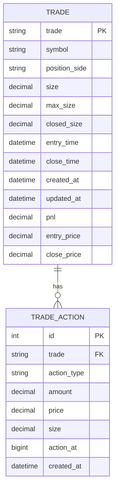
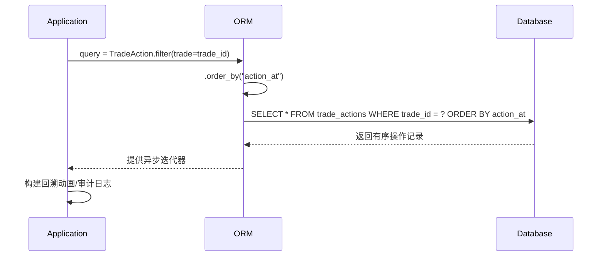

# 交易操作记录

<cite>
**本文档引用的文件**
- [models.py](file://api/application/apps/trade/models.py)
- [trade_recorder.py](file://data_server/binance/ws_binance/utils/trade_recorder.py)
</cite>

## 目录
1. [引言](#引言)
2. [核心数据模型](#核心数据模型)
3. [操作类型与业务场景](#操作类型与业务场景)
4. [数据一致性逻辑](#数据一致性逻辑)
5. [时间戳设计与审计意义](#时间戳设计与审计意义)
6. [索引设计与操作流回放](#索引设计与操作流回放)
7. [Tortoise ORM查询示例](#tortoise-orm查询示例)

## 引言
交易操作记录表（TradeAction）作为交易主表（Trade）的明细扩展，用于精确记录每一笔交易的开仓、平仓、加仓和减仓等具体操作。该表通过精细化的操作记录，为交易行为的审计追踪、策略回溯分析和风控验证提供了坚实的数据基础。

**Section sources**
- [models.py](file://api/application/apps/trade/models.py#L35-L56)

## 核心数据模型
交易操作记录表（TradeAction）的核心设计如下：



**Diagram sources**
- [models.py](file://api/application/apps/trade/models.py#L35-L56)

## 操作类型与业务场景
`action_type` 字段定义了四种核心操作类型，每种类型对应特定的业务场景：

| 操作类型 | 业务场景 | 说明 |
|---------|--------|------|
| OPEN | 开仓 | 交易的初始建立，`amount`等于初始持仓量，`size`为开仓后的总持仓 |
| INCREASE | 加仓 | 在原有持仓基础上增加仓位，`amount`为正数，`size`为加仓后的总持仓量 |
| DECREASE | 减仓 | 部分平仓，减少持仓量，`amount`为负数，`size`为减仓后的总持仓量 |
| CLOSE | 平仓 | 完全结束交易，`amount`为负的最终持仓量，`size`固定为0 |

**Section sources**
- [models.py](file://api/application/apps/trade/models.py#L41)
- [trade_recorder.py](file://data_server/binance/ws_binance/utils/trade_recorder.py#L121)

## 数据一致性逻辑
`amount`（变动数量）、`price`（成交价格）和`size`（变动后总持仓量）三者之间存在严格的数据一致性关系：

1. **数学关系**：`size` = 上一次操作后的`size` + `amount`
2. **逻辑验证**：系统在记录操作时，会通过`old_size`和`new_size`计算`amount`，确保数据的准确性
3. **状态快照**：`size`字段作为变动后的状态快照，提供了操作完成后的最终持仓状态

例如，在加仓操作中，系统会计算`amount = new_size - old_size`，然后将`new_size`作为`size`字段的值进行记录。

**Section sources**
- [trade_recorder.py](file://data_server/binance/ws_binance/utils/trade_recorder.py#L124-L125)

## 时间戳设计与审计意义
系统采用双时间戳设计，区分操作发生的真实时间和记录创建时间：

| 时间戳 | 类型 | 精度 | 来源 | 审计意义 |
|-------|-----|-----|------|---------|
| action_at | BigInt | 毫秒级 | `updateTime` | 记录操作发生的真实时间，用于精确的事件排序和时序分析 |
| created_at | DateTime | 秒级 | 数据库`NOW()` | 记录数据写入数据库的时间，用于追踪数据处理延迟 |

这种设计使得系统能够区分"事件发生时间"和"数据记录时间"，在审计追踪中具有重要意义。毫秒级的`action_at`确保了高频率交易操作的精确排序，而`created_at`则可用于监控数据管道的性能。

**Section sources**
- [models.py](file://api/application/apps/trade/models.py#L51-L52)
- [trade_recorder.py](file://data_server/binance/ws_binance/utils/trade_recorder.py#L53)

## 索引设计与操作流回放
系统在`(trade, action_at)`字段上建立了复合索引，这一设计支持高效的按交易和时间顺序回放操作流：

```mermaid
flowchart TD
A[查询某笔交易] --> B[使用(trade, action_at)索引]
B --> C[按action_at排序]
C --> D[获取有序操作序列]
D --> E[构建交易回溯动画]
E --> F[生成审计日志]
```

该索引的设计优势包括：
- **高效查询**：通过`trade`字段快速定位特定交易的所有操作
- **有序访问**：`action_at`的排序使得操作流天然有序，无需额外排序开销
- **范围查询**：支持按时间范围查询特定时间段内的操作

**Diagram sources**
- [models.py](file://api/application/apps/trade/models.py#L56)

## Tortoise ORM查询示例
通过Tortoise ORM可以方便地查询某笔交易的所有操作历史，用于构建交易回溯动画或审计日志：



实际代码示例：
```python
# 查询某笔交易的所有操作历史
actions = await TradeAction.filter(trade=trade_id).order_by("action_at")

# 构建操作流
for action in actions:
    print(f"{action.action_type}: {action.amount}@{action.price}, size={action.size}")
```

**Diagram sources**
- [models.py](file://api/application/apps/trade/models.py#L40)
- [trade_recorder.py](file://data_server/binance/ws_binance/utils/trade_recorder.py#L156)

**Section sources**
- [models.py](file://api/application/apps/trade/models.py#L35-L56)
- [trade_recorder.py](file://data_server/binance/ws_binance/utils/trade_recorder.py#L152-L156)