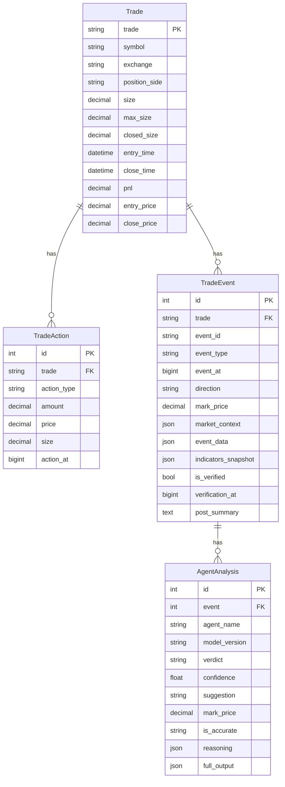
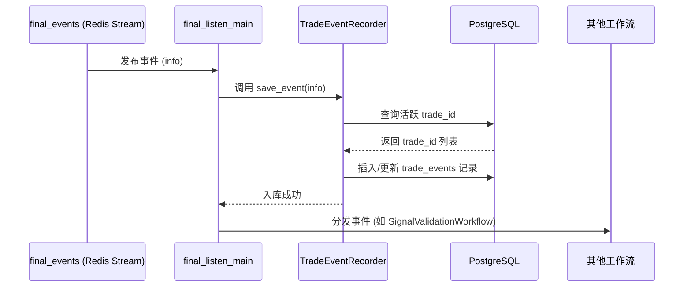

# 交易相关接口

<cite>
**本文档引用的文件**   
- [models.py](file://api/application/apps/trade/models.py)
- [trade_event_recorder.py](file://agent_server/utils/trade_event_recorder.py)
- [db_utils.py](file://agent_server/utils/db_utils.py)
- [final_listen_main.py](file://agent_server/final_listen_main.py)
</cite>

## 目录
1. [引言](#引言)
2. [核心数据模型](#核心数据模型)
3. [表间关系与索引设计](#表间关系与索引设计)
4. [Agent分析准确性判断逻辑](#agent分析准确性判断逻辑)
5. [数据序列化与应用](#数据序列化与应用)
6. [数据流与系统集成](#数据流与系统集成)

## 引言
本文档详细说明了交易系统中的四个核心数据库表：Trade（交易主表）、TradeAction（交易操作记录表）、TradeEvent（交易事件表）和AgentAnalysis（Agent分析记录表）。这些表共同构成了交易生命周期的完整数据模型，用于记录从开仓到平仓的全过程，以及在此期间发生的各种关键事件和AI代理的分析决策。该模型支持多空双开等复杂交易场景，为交易复盘和Agent性能评估提供了坚实的数据基础。

## 核心数据模型

### Trade（交易主表）
`Trade` 表是交易系统的中心，记录了一次完整交易的生命周期。

**字段定义：**
- `trade`: 交易的唯一标识符（UUID），作为与其他表关联的外键。
- `symbol`: 交易的资产对，如 ETHUSDT。
- `exchange`: 交易发生的交易所，如 binance。
- `position_side`: 持仓方向，取值为 LONG（多头）或 SHORT（空头）。
- `size`: 当前的总持仓量。
- `max_size`: 交易生命周期内的最大持仓量，用于衡量加仓行为。
- `closed_size`: 已经平仓的累计数量。
- `entry_time`: 开仓时间。
- `close_time`: 平仓时间，为空时表示交易仍在进行中。
- `pnl`: 已实现盈亏。
- `entry_price`: 开仓均价。
- `close_price`: 平仓均价。

此表通过 `symbol` 和 `close_time` 的复合索引优化按交易对和时间范围的查询性能。

**Section sources**
- [models.py](file://api/application/apps/trade/models.py#L4-L33)

### TradeAction（交易操作记录表）
`TradeAction` 表记录了与主交易相关的每一次具体操作，如开仓、平仓、加仓和减仓。

**字段定义：**
- `trade`: 外键，关联到 `Trade` 表的 `trade` 字段，表示该操作属于哪笔交易。
- `action_type`: 操作类型，包括 OPEN（开仓）、CLOSE（平仓）、INCREASE（加仓）、DECREASE（减仓）。
- `amount`: 本次操作的变动数量。
- `price`: 本次操作的成交价格或标记价格。
- `size`: 操作完成后的总持仓量。
- `action_at`: 操作发生的时间戳（毫秒）。

该表通过 `trade` 和 `action_at` 的复合索引，能够高效地查询某笔交易在特定时间点的所有操作。

**Section sources**
- [models.py](file://api/application/apps/trade/models.py#L35-L57)
- [trade_recorder.py](file://data_server/binance/ws_binance/utils/trade_recorder.py#L114-L149)

### TradeEvent（交易事件表）
`TradeEvent` 表记录了在持仓期间发生的各种关键事件，如市场信号更新、风控检查等。

**字段定义：**
- `trade`: 外键，关联到 `Trade` 表。
- `event_id`: 事件的唯一ID，用于去重和更新。
- `event_type`: 事件类型，如 RISK_CHECK（风控检查）、SIGNAL_UPDATE（信号更新）。
- `event_at`: 事件发生的时间戳（毫秒）。
- `direction`: 事件发生时的市场方向，取值为 bullish（看涨）、bearish（看跌）或 neutral（中性）。
- `mark_price`: 事件发生时的标记价格。
- `market_context`: JSON字段，存储事件发生时的市场背景快照（如趋势、波动率）。
- `event_data`: JSON字段，存储事件的原始数据，如 `analysis_context`。
- `indicators_snapshot`: JSON字段，可选，存储关键技术指标的快照。
- `is_verified`: 布尔值，标记该事件的分析结果是否已被验证。
- `verification_at`: 验证发生的时间戳。
- `post_summary`: 文本字段，用于存储事后总结和准确性复盘。

该表通过 `trade` 和 `event_at` 的复合索引，支持按交易和时间快速检索事件。

**Section sources**
- [models.py](file://api/application/apps/trade/models.py#L59-L86)
- [trade_event_recorder.py](file://agent_server/utils/trade_event_recorder.py#L80-L300)

### AgentAnalysis（Agent分析记录表）
`AgentAnalysis` 表记录了每个AI代理（Agent）对特定 `TradeEvent` 的分析结果。

**字段定义：**
- `event`: 外键，关联到 `TradeEvent` 表。
- `agent_name`: 发出分析的Agent名称，如 signal_validation、position_risk。
- `model_version`: 使用的模型版本，如 gpt-4-turbo。
- `verdict`: 分析得出的结论，如 VALID（有效）、INVALID（无效）。
- `confidence`: 结论的置信度，范围为0到1。
- `suggestion`: 针对持仓的建议，这是判断准确性的核心依据，取值包括：
  - `ADD_POSITION`: 加仓
  - `HOLD`: 持有
  - `DEFENSIVE`: 防守（预警风险）
  - `REDUCE`: 减仓
  - `EXIT`: 平仓
- `mark_price`: Agent进行分析时的标记价格。
- `is_accurate`: 建议的准确性评估，取值为：
  - `ACCURATE`: 正确预判行情
  - `INACCURATE`: 误判/卖飞/死扛
  - `NEUTRAL`: 震荡期防守/无功无过
- `reasoning`: JSON字段，存储分析的理由。
- `full_output`: JSON字段，存储Agent的完整原始输出。

**Section sources**
- [models.py](file://api/application/apps/trade/models.py#L88-L137)

## 表间关系与索引设计



**Diagram sources**
- [models.py](file://api/application/apps/trade/models.py#L4-L137)

### 外键关联
- `TradeAction.trade` 和 `TradeEvent.trade` 均外键关联到 `Trade.trade`，确保所有操作和事件都归属于一笔具体的交易。
- `AgentAnalysis.event` 外键关联到 `TradeEvent.id`，将每个Agent的分析结果与具体的事件绑定。

### 索引设计与查询性能
- **`Trade` 表的 `("symbol", "close_time")` 索引**：此复合索引对于按交易对和时间范围查询已平仓的交易极为高效。例如，查询“ETHUSDT在2023年第四季度的所有交易”可以利用此索引快速定位。
- **`TradeAction` 表的 `("trade", "action_at")` 索引**：此索引允许快速检索某笔交易的所有操作历史，并按时间排序，对于复盘交易过程至关重要。
- **`TradeEvent` 表的 `("trade", "event_at")` 索引**：与操作表类似，此索引支持按交易和时间快速获取事件流，便于分析特定持仓期间的市场动态。

## Agent分析准确性判断逻辑

`AgentAnalysis` 表中的 `is_accurate` 字段是评估Agent性能的核心。其判断逻辑以持仓方向（LONG/SHORT）为基础，结合后续的市场走势，对Agent的 `suggestion` 进行评分。

### 三种场景下的评分标准

#### 1. 价格上涨（有利方向，以持多单LONG为例）
当市场朝着持仓的有利方向上涨时，正确的策略是顺势而为。
- **ADD_POSITION (加仓)**: **正确**。在上涨趋势中加仓，乘胜追击，扩大收益。
- **HOLD (持有)**: **正确**。坐享其成，不进行任何操作也是正确的。
- **DEFENSIVE (防守)**: **半对半错或偏向错误**。如果涨幅迅猛，此建议属于踏空；如果涨幅较弱，可能属于合理保守。总体偏向错误。
- **REDUCE/EXIT (减仓/平仓)**: **错误**。过早卖出，属于“卖飞”，错失后续利润。

#### 2. 价格下跌（不利方向，以持多单LONG为例）
当市场朝着持仓的不利方向下跌时，正确的策略是控制风险。
- **ADD_POSITION (加仓)**: **错误**。逆势加仓，会扩大亏损。
- **HOLD (持有)**: **错误**。死扛亏损，没有采取任何风险控制措施。
- **DEFENSIVE (防守)**: **正确**。预警风险，可能避免了更大损失。
- **REDUCE/EXIT (减仓/平仓)**: **正确**。及时止损，是正确的风险控制行为。

#### 3. 价格震荡（幅度<0.5%）
在价格波动不大的震荡行情中，频繁操作会增加交易成本。
- **ADD_POSITION (加仓)**: **中性/错误**。容易因磨损成本而亏损。
- **HOLD (持有)**: **正确**。多看少动，是最佳策略。
- **DEFENSIVE (防守)**: **正确**。保持警惕，可能是变盘前兆。
- **REDUCE/EXIT (减仓/平仓)**: **中性**。反应可能过度，但规避了不确定性。

**Section sources**
- [models.py](file://api/application/apps/trade/models.py#L92-L111)

## 数据序列化与应用

### JSON序列化示例
以下是 `AgentAnalysis` 记录的JSON序列化示例：

```json
{
  "event": 123,
  "agent_name": "position_risk",
  "model_version": "gpt-4-turbo",
  "verdict": "VALID",
  "confidence": 0.85,
  "suggestion": "DEFENSIVE",
  "mark_price": 3500.5,
  "is_accurate": "ACCURATE",
  "reasoning": {
    "reason_tags": ["HTF_BULLISH", "LTF_RISK_HIGH"],
    "summary": "长期趋势看涨，但短期波动率上升，建议保持警惕。"
  },
  "full_output": {
    "agent": "position_risk",
    "content": {
      "suggestion": "DEFENSIVE",
      "summary": "长期趋势看涨，但短期波动率上升，建议保持警惕。"
    },
    "metrics": {
      "auto_score": 0.85
    }
  }
}
```

### 在事后复盘与Agent性能评估中的应用
- **事后复盘**：通过查询 `Trade`、`TradeEvent` 和 `AgentAnalysis` 表，可以完整复盘一笔交易的决策过程。`post_summary` 字段可以记录最终的复盘结论，而 `is_verified` 和 `verification_at` 字段则标记了复盘的完成状态。
- **Agent性能评估**：`is_accurate` 字段是量化Agent表现的关键。通过统计每个Agent在不同市场场景（上涨、下跌、震荡）下的 `ACCURATE`、`INACCURATE` 和 `NEUTRAL` 的比例，可以客观地评估其决策质量，并用于模型的迭代优化。

**Section sources**
- [models.py](file://api/application/apps/trade/models.py#L130-L132)
- [final_grader.py](file://event_center/pipeline/final_grader.py#L264-L280)

## 数据流与系统集成



**Diagram sources**
- [final_listen_main.py](file://agent_server/final_listen_main.py#L31-L130)
- [trade_event_recorder.py](file://agent_server/utils/trade_event_recorder.py#L304-L367)

交易数据模型的构建始于 `final_events` Redis Stream。`final_listen_main.py` 作为监听器，消费流中的事件，并通过 `TradeEventRecorder` 将其异步写入数据库。`TradeEventRecorder` 负责解析事件、关联到正确的 `trade_id`（支持多空双开），并执行数据库的插入或更新操作。这一设计确保了数据采集的实时性和高吞吐量，为上层的分析和决策提供了可靠的数据支持。

**Section sources**
- [final_listen_main.py](file://agent_server/final_listen_main.py#L7-L130)
- [trade_event_recorder.py](file://agent_server/utils/trade_event_recorder.py#L12-L367)