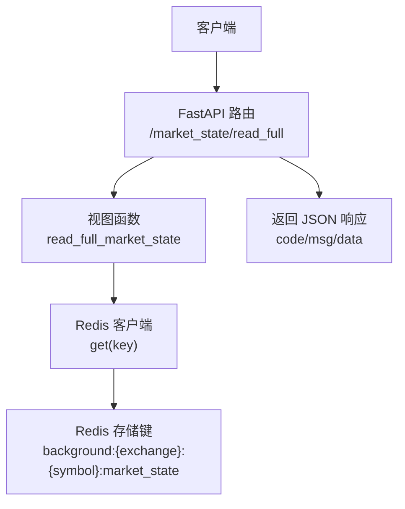
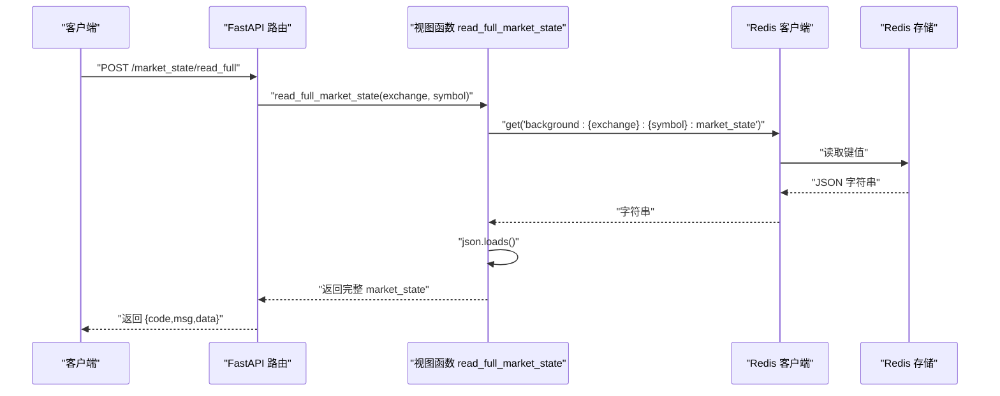
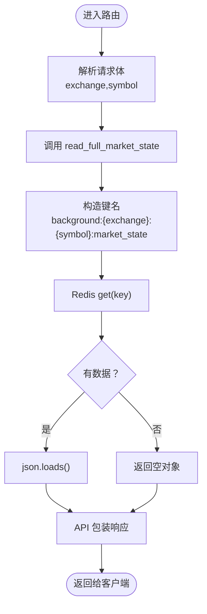
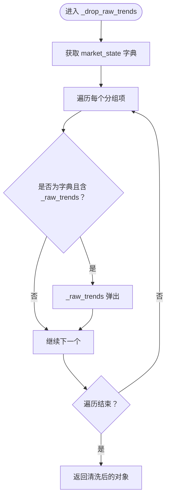
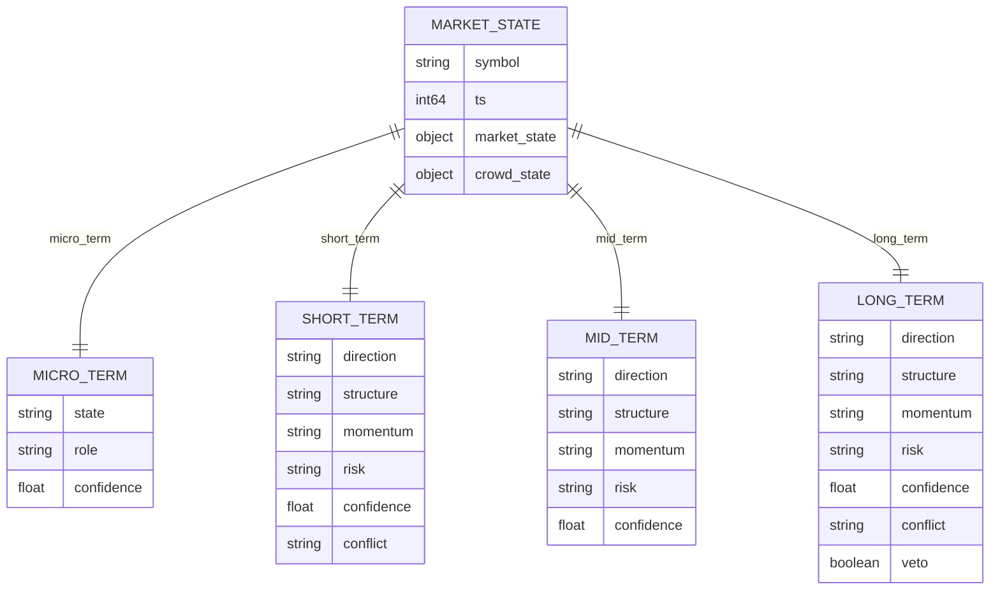
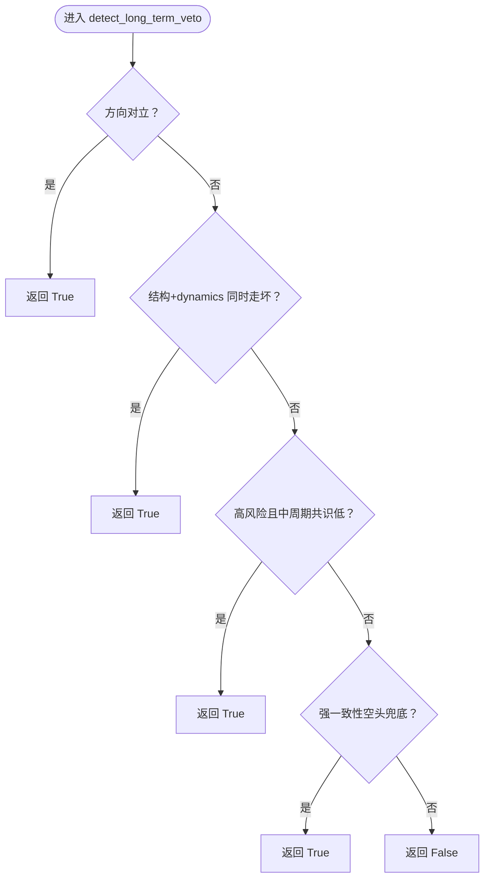
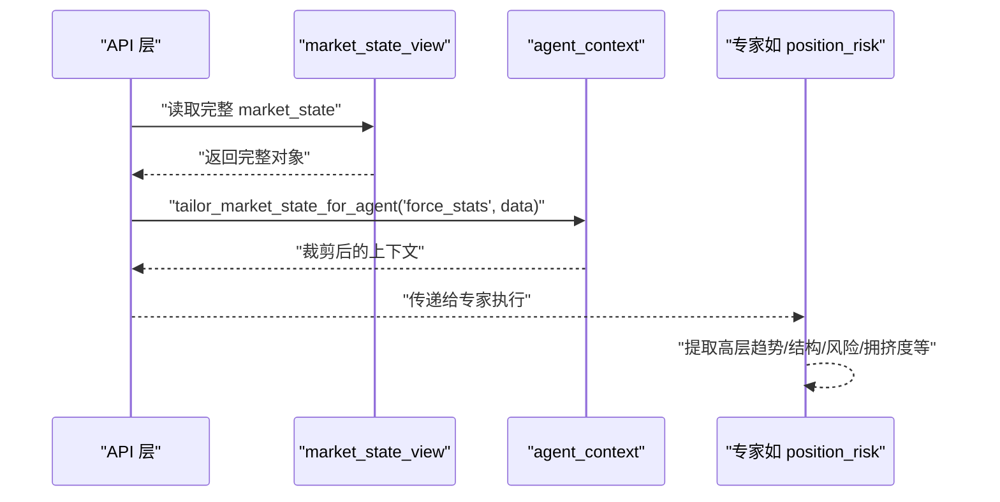
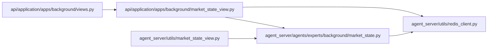

# 市场状态接口

<cite>
**本文引用的文件**
- [views.py](file://api/application/apps/background/views.py)
- [market_state_view.py](file://api/application/apps/background/market_state_view.py)
- [redis_client.py](file://agent_server/utils/redis_client.py)
- [market_state.py](file://agent_server/agents/experts/background/market_state.py)
- [market_state_view.py](file://agent_server/utils/market_state_view.py)
- [position_risk.py](file://agent_server/agents/experts/analysis/position_risk.py)
- [test_market_state_aggregator.py](file://tests/test_market_state_aggregator.py)
- [test_market_state_context_config.py](file://tests/test_market_state_context_config.py)
- [schema.py](file://agent_server/memory/schema.py)
- [config.py](file://agent_server/config.py)
</cite>

## 目录
1. [简介](#简介)
2. [项目结构](#项目结构)
3. [核心组件](#核心组件)
4. [架构总览](#架构总览)
5. [详细组件分析](#详细组件分析)
6. [依赖关系分析](#依赖关系分析)
7. [性能考量](#性能考量)
8. [故障排查指南](#故障排查指南)
9. [结论](#结论)
10. [附录](#附录)

## 简介
本文件面向“市场状态接口”的API文档，聚焦于后端服务提供的 /market_state/read_full 端点，系统性阐述以下内容：
- read_full_market_state 函数如何从 Redis 中读取完整的 market_state 数据结构；
- _drop_raw_trends 过滤内部字段（如 _raw_trends）的处理逻辑；
- market_state 在智能代理分析中的核心作用：短期、中期、长期市场方向判断与风险评估维度；
- 实际响应示例：展示 market_state 的嵌套结构与关键字段含义；
- 该接口与 agent_server 的集成方式，以及在信号验证与投资组合分析中的应用场景。

## 项目结构
围绕“市场状态接口”，涉及的关键模块分布如下：
- API 层：FastAPI 路由定义与请求模型，负责对外暴露 /market_state/read_full 接口；
- 视图层：封装 Redis 访问与数据读取逻辑；
- 工具层：Redis 客户端与市场状态裁剪工具；
- 业务层：市场状态聚合器，负责将多周期背景数据整合为 market_state；
- 测试与配置：验证聚合逻辑与上下文裁剪行为，以及全局配置。

图表来源
- [views.py](file://api/application/apps/background/views.py#L46-L76)
- [market_state_view.py](file://api/application/apps/background/market_state_view.py#L25-L34)
- [redis_client.py](file://agent_server/utils/redis_client.py#L20-L31)

章节来源
- [views.py](file://api/application/apps/background/views.py#L1-L273)
- [market_state_view.py](file://api/application/apps/background/market_state_view.py#L1-L41)
- [redis_client.py](file://agent_server/utils/redis_client.py#L1-L53)

## 核心组件
- FastAPI 路由与请求模型
  - 定义 POST /market_state/read_full，接收 exchange 与 symbol 参数，返回标准结构的 JSON 响应。
- 视图函数 read_full_market_state
  - 通过 Redis 客户端按键 background:{exchange}:{symbol}:market_state 读取完整 market_state；
  - 返回空字典或解析后的 JSON 对象。
- Redis 客户端
  - 提供异步 get(key) 方法，用于读取字符串值；
  - 支持自定义数据库索引与连接参数。
- 市场状态裁剪工具 _drop_raw_trends
  - 遍历 market_state 下各分组，移除内部字段 _raw_trends，避免向外部泄露内部聚合细节。
- 市场状态聚合器 market_state_aggregator
  - 将多周期背景数据按微、短、中、长四个时间框架分组；
  - 计算方向、结构、动量、风险等维度的多数投票与置信度；
  - 长期维度应用“一票否决”规则，决定是否设置 veto；
  - 可选融合人群状态，对短期风险与信心进行调整，并在长期维度根据一致性冲突设置 veto。

章节来源
- [views.py](file://api/application/apps/background/views.py#L46-L76)
- [market_state_view.py](file://api/application/apps/background/market_state_view.py#L25-L34)
- [redis_client.py](file://agent_server/utils/redis_client.py#L20-L31)
- [market_state_view.py](file://agent_server/utils/market_state_view.py#L1-L42)
- [market_state.py](file://agent_server/agents/experts/background/market_state.py#L1-L177)

## 架构总览
下面的序列图展示了从客户端到 Redis，再到 API 响应的完整调用链路，以及内部裁剪逻辑的插入位置。

图表来源
- [views.py](file://api/application/apps/background/views.py#L46-L76)
- [market_state_view.py](file://api/application/apps/background/market_state_view.py#L25-L34)
- [redis_client.py](file://agent_server/utils/redis_client.py#L20-L31)

## 详细组件分析

### 组件A：/market_state/read_full 端点与 read_full_market_state
- 路由定义
  - POST /market_state/read_full，请求体包含 exchange 与 symbol；
  - 成功时返回 code、msg、data；data 即为完整 market_state；
  - 异常时返回服务器错误码与消息。
- 视图函数
  - 通过 Redis 客户端按固定键名读取；
  - 若未命中返回空对象，避免异常传播；
  - 返回前由 API 层统一包装为标准响应结构。

图表来源
- [views.py](file://api/application/apps/background/views.py#L46-L76)
- [market_state_view.py](file://api/application/apps/background/market_state_view.py#L25-L34)

章节来源
- [views.py](file://api/application/apps/background/views.py#L46-L76)
- [market_state_view.py](file://api/application/apps/background/market_state_view.py#L1-L41)

### 组件B：_drop_raw_trends 内部字段过滤
- 设计目的
  - market_state_aggregator 在长期聚合时会临时写入 _raw_trends 作为“一票否决”规则的输入；
  - 该字段仅用于内部决策，不应对外暴露，因此在 API 返回前统一移除。
- 处理逻辑
  - 遍历 market_state 下的每个分组；
  - 若某分组为字典且包含 _raw_trends 键，则删除之；
  - 返回清洗后的完整对象。

图表来源
- [market_state_view.py](file://agent_server/utils/market_state_view.py#L1-L12)

章节来源
- [market_state_view.py](file://agent_server/utils/market_state_view.py#L1-L42)

### 组件C：market_state 数据结构与维度说明
- 结构组成
  - symbol：交易对标识；
  - ts：时间戳；
  - market_state：按时间框架分组的市场状态；
  - crowd_state：可选的人群背景信息（由外部融合）。
- 时间框架与维度
  - 微观（micro_term）：触发信号角色，状态由结构与关键位接近程度组合而成；
  - 短期（short_term）：方向、结构、动量、风险、置信度、冲突检测；
  - 中期（mid_term）：方向、结构、动量、风险、置信度；
  - 长期（long_term）：方向、结构、动量、风险、置信度、冲突检测、veto（一票否决）。
- 关键字段含义
  - direction：趋势方向（如 bullish/bearish/neutral 等）；
  - structure：市场结构状态（如 consolidating/range/trend 等）；
  - momentum：动量状态（如 strengthening/weakening/exhausted 等）；
  - risk：风险状态（如 normal/elevated/high/extreme 等）；
  - confidence：聚合置信度（基于多数投票与权重计算）；
  - conflict：冲突类型（如趋势分歧/动量分歧）；
  - veto：长期一票否决标志（由规则判定）；
  - _raw_trends：内部聚合输入，API 层返回前会被移除。

图表来源
- [market_state.py](file://agent_server/agents/experts/background/market_state.py#L1-L177)
- [test_market_state_aggregator.py](file://tests/test_market_state_aggregator.py#L1-L100)

章节来源
- [market_state.py](file://agent_server/agents/experts/background/market_state.py#L1-L177)
- [test_market_state_aggregator.py](file://tests/test_market_state_aggregator.py#L1-L100)
- [schema.py](file://agent_server/memory/schema.py#L1-L19)

### 组件D：长期“一票否决”规则与 crowd_state 融合
- 长期 veto 规则
  - 方向级对立（4h vs 1d）；
  - 结构+动量同时走坏；
  - 高风险环境且中周期无共识；
  - 强一致性空头（兜底规则）。
- crowd_state 融合
  - 当短期风险为 high 或短期偏见与crowd_state偏见一致时，降低短期置信度；
  - 当长期一致性冲突且拥挤度高时，设置长期 veto。

图表来源
- [market_state.py](file://agent_server/agents/experts/background/market_state.py#L45-L76)

章节来源
- [market_state.py](file://agent_server/agents/experts/background/market_state.py#L113-L177)
- [test_market_state_aggregator.py](file://tests/test_market_state_aggregator.py#L58-L100)

### 组件E：与 agent_server 的集成与应用场景
- 与 agent_context 的协作
  - agent_server 提供 tailor_market_state_for_agent 与 PROFILES，按专家需求裁剪返回字段；
  - 例如 force_stats 专家仅需短期方向、风险、置信度与长期 veto，以及人群脆弱性等。
- 在信号验证与投资组合分析中的应用
  - position_risk 专家从 market_state 中提取高层趋势、短期结构、波动风险与距离关键位比例等特征；
  - crowd_state 用于刻画市场拥挤度、资金压力与脆弱性，辅助风险评估与仓位管理。

图表来源
- [market_state_view.py](file://agent_server/utils/market_state_view.py#L78-L88)
- [position_risk.py](file://agent_server/agents/experts/analysis/position_risk.py#L143-L159)

章节来源
- [market_state_view.py](file://agent_server/utils/market_state_view.py#L45-L88)
- [position_risk.py](file://agent_server/agents/experts/analysis/position_risk.py#L143-L159)
- [test_market_state_context_config.py](file://tests/test_market_state_context_config.py#L1-L26)

## 依赖关系分析
- API 层依赖视图层与 Redis 客户端；
- 视图层依赖 Redis 客户端；
- 市场状态聚合器独立于 API，但其输出被写入 Redis；
- agent_server 的裁剪工具与 API 层的 _drop_raw_trends 共同保证对外暴露字段的安全性与最小化。

图表来源
- [views.py](file://api/application/apps/background/views.py#L1-L273)
- [market_state_view.py](file://api/application/apps/background/market_state_view.py#L1-L41)
- [market_state.py](file://agent_server/agents/experts/background/market_state.py#L1-L177)
- [redis_client.py](file://agent_server/utils/redis_client.py#L1-L53)

章节来源
- [views.py](file://api/application/apps/background/views.py#L1-L273)
- [market_state_view.py](file://api/application/apps/background/market_state_view.py#L1-L41)
- [market_state.py](file://agent_server/agents/experts/background/market_state.py#L1-L177)
- [redis_client.py](file://agent_server/utils/redis_client.py#L1-L53)

## 性能考量
- Redis 访问为单键读取，复杂度 O(1)，延迟主要受网络与 Redis 延迟影响；
- API 层返回前不进行额外计算，仅做 JSON 解析与包装；
- _drop_raw_trends 遍历 market_state 分组，复杂度与分组数量线性相关，通常很小；
- 建议：
  - 合理设置 Redis 连接参数（主机、端口、密码、数据库）；
  - 在高并发场景下复用 Redis 客户端实例；
  - 对频繁访问的 symbol 做缓存策略（若需要）。

[本节为通用建议，无需特定文件来源]

## 故障排查指南
- 无法获取数据
  - 确认 Redis 中是否存在键 background:{exchange}:{symbol}:market_state；
  - 检查 Redis 连接参数（主机、端口、密码、数据库）是否正确；
  - 检查 market_state 是否已由聚合器写入。
- 返回为空
  - API 层在未命中时返回空对象，属预期行为；
  - 可通过前端或日志确认请求参数 exchange 与 symbol 是否正确。
- 字段缺失或异常
  - 确认 market_state_aggregator 是否已生成所需时间框架数据；
  - 检查 crowd_state 是否传入并被正确融合；
  - 确认 _drop_raw_trends 是否在 API 层生效（内部字段不会对外暴露）。
- 集成问题
  - agent_server 的 tailor_market_state_for_agent 应与 PROFILES 配置一致；
  - 如需自定义裁剪路径，使用 set_context_profile 注册。

章节来源
- [redis_client.py](file://agent_server/utils/redis_client.py#L1-L53)
- [market_state_view.py](file://agent_server/utils/market_state_view.py#L78-L88)
- [test_market_state_context_config.py](file://tests/test_market_state_context_config.py#L1-L26)

## 结论
/market_state/read_full 端点提供了完整、可裁剪的 market_state 数据，既满足 API 层直接消费，也便于 agent_server 按专家需求进行字段裁剪。通过 _drop_raw_trends 与长期 veto 规则，系统在安全性与稳健性之间取得平衡。在信号验证与投资组合分析中，market_state 的短期、中期、长期维度与 crowd_state 融合，为高层决策提供了可靠依据。

[本节为总结性内容，无需特定文件来源]

## 附录

### 接口定义与响应示例
- 接口
  - 方法：POST
  - 路径：/market_state/read_full
  - 请求体字段：
    - exchange：交易所名称（如 binance）
    - symbol：交易对符号（如 BTCUSDT）
  - 返回体字段：
    - code：状态码
    - msg：状态信息
    - data：完整 market_state（已移除内部 _raw_trends）

- 响应示例（示意）
  - data.market_state.micro_term
    - state：微观状态（如 range_near_R1）
    - role：触发信号角色（trigger_only）
    - confidence：置信度（微周期权重）
  - data.market_state.short_term
    - direction：短期方向（如 bullish）
    - structure：短期结构（如 consolidating）
    - momentum：短期动量（如 neutral/strengthening/weakening）
    - risk：短期风险（如 normal/elevated/high）
    - confidence：短期置信度
    - conflict：冲突类型（如 momentum_divergence）
  - data.market_state.mid_term
    - direction：中期方向
    - structure：中期结构
    - momentum：中期动量
    - risk：中期风险
    - confidence：中期置信度
  - data.market_state.long_term
    - direction：长期方向
    - structure：长期结构
    - momentum：长期动量
    - risk：长期风险
    - confidence：长期置信度
    - conflict：冲突类型
    - veto：长期一票否决（布尔）
  - data.crowd_state（可选）
    - bias：市场偏见（如 long/short）
    - fragility：脆弱性（如 high/medium/low）
    - crowding_level：拥挤度（如 high/medium/low）
    - consistency：跨周期一致性（如 aligned/conflicted）
    - funding_pressure：资金压力（如 high/medium/low）

章节来源
- [views.py](file://api/application/apps/background/views.py#L46-L76)
- [market_state.py](file://agent_server/agents/experts/background/market_state.py#L1-L177)
- [test_market_state_aggregator.py](file://tests/test_market_state_aggregator.py#L1-L100)