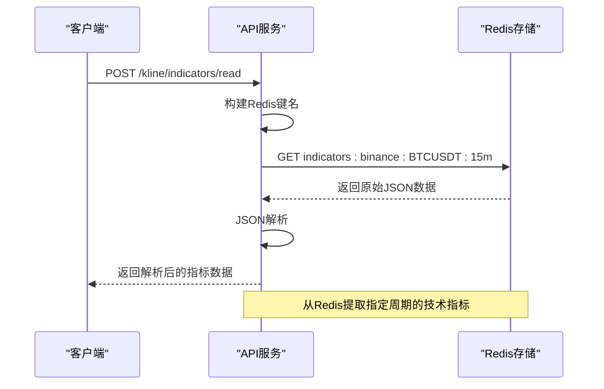
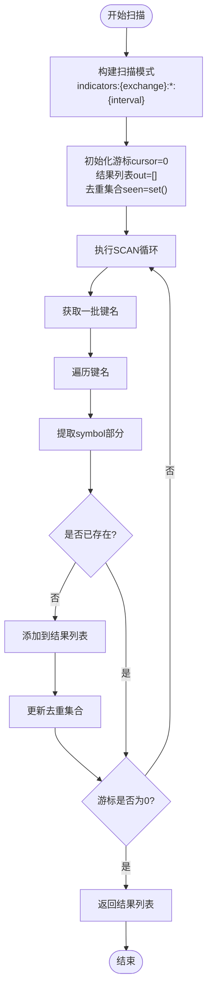
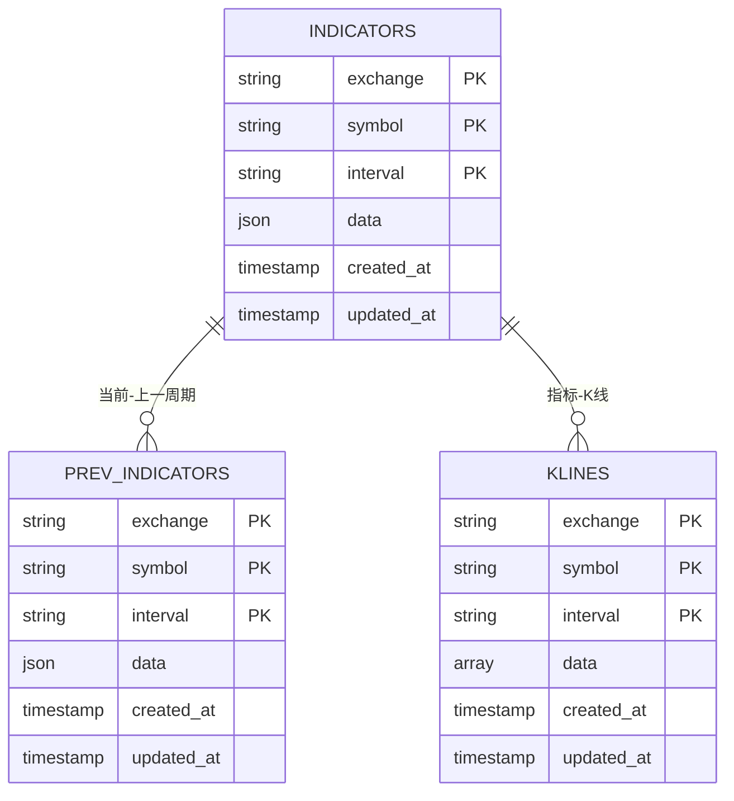
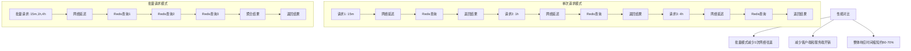
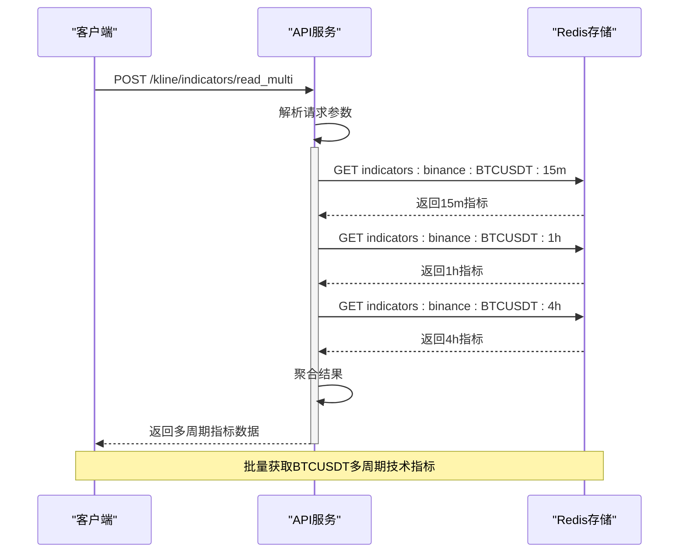
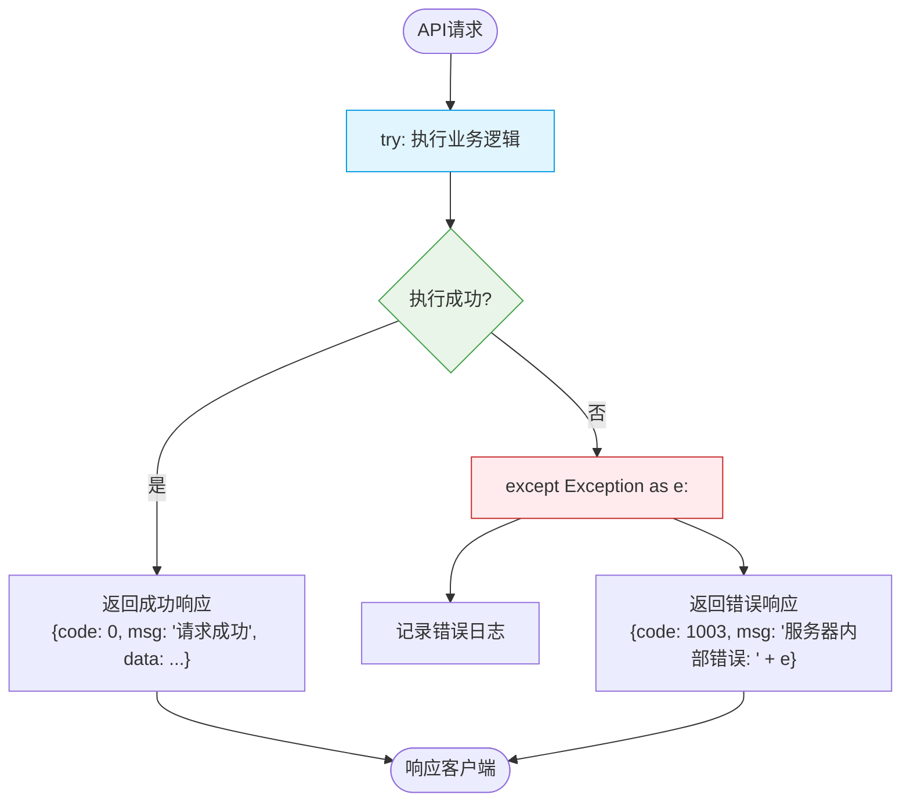

# 技术指标接口

<cite>
**本文档引用的文件**
- [views.py](file://api/application/apps/background/views.py)
- [kline_indicators.py](file://api/application/apps/background/kline_indicators.py)
- [status_codes.py](file://api/application/common/status_codes.py)
- [redis_client.py](file://api/application/common/redis_client.py)
- [indicators_producer.py](file://data_server/binance/rest_binance/app/indicators_producer.py)
</cite>

## 目录
1. [简介](#简介)
2. [API端点说明](#api端点说明)
3. [核心功能实现](#核心功能实现)
4. [Redis键空间与数据结构](#redis键空间与数据结构)
5. [性能优化与批量读取](#性能优化与批量读取)
6. [实际调用示例](#实际调用示例)
7. [错误处理与降级方案](#错误处理与降级方案)
8. [总结](#总结)

## 简介
本文档详细说明了技术指标接口的实现与使用，重点覆盖`/kline/indicators/read`、`/kline/indicators/symbols`和`/kline/indicators/read_multi`三个核心API端点。系统通过Redis缓存存储和管理技术指标数据，提供高效的数据读取服务。文档详细解释了各接口的HTTP方法、请求参数、返回结构以及底层实现机制，包括`read_indicators`函数如何从Redis中提取指定周期的技术指标数据，以及`read_multi_period`批量读取的性能优势。同时说明了`scan_symbols`接口在发现可用交易对时的扫描逻辑与性能优化策略，并提供了完整的错误处理机制和Redis键空间失效时的降级方案。

## API端点说明

### `/kline/indicators/read` 端点
该端点用于读取指定交易所、币种和周期的技术指标数据。

**请求信息**
- **HTTP方法**: POST
- **路径**: `/kline/indicators/read`

**请求参数**
- `exchange`: 交易所名称（字符串）
- `symbol`: 币种符号（字符串）
- `interval`: 周期（字符串，如"1m"、"5m"、"1h"）

**返回结构**
```json
{
  "code": 0,
  "msg": "请求成功",
  "data": { /* 技术指标字典 */ }
}
```
其中`data`字段包含从Redis中读取的技术指标数据，不包含`prev_indicators`和`klines`。

**Section sources**
- [views.py](file://api/application/apps/background/views.py#L79-L96)

### `/kline/indicators/symbols` 端点
该端点用于扫描指定交易所与周期下存在指标数据的符号列表。

**请求信息**
- **HTTP方法**: POST
- **路径**: `/kline/indicators/symbols`

**请求参数**
- `exchange`: 交易所名称（字符串）
- `interval`: 周期（字符串）

**返回结构**
```json
{
  "code": 0,
  "msg": "请求成功",
  "data": {
    "symbols": ["BTCUSDT", "ETHUSDT", ...]
  }
}
```
其中`data.symbols`为可用的symbol列表。

**Section sources**
- [views.py](file://api/application/apps/background/views.py#L162-L178)

### `/kline/indicators/read_multi` 端点
该端点用于批量读取多周期的技术指标数据。

**请求信息**
- **HTTP方法**: POST
- **路径**: `/kline/indicators/read_multi`

**请求参数**
- `exchange`: 交易所名称（字符串）
- `symbol`: 币种符号（字符串）
- `intervals`: 周期列表（字符串数组，如["1m","5m","1h"]）

**返回结构**
```json
{
  "code": 0,
  "msg": "请求成功",
  "data": {
    "15m": { /* 15分钟周期指标 */ },
    "1h": { /* 1小时周期指标 */ },
    "4h": { /* 4小时周期指标 */ }
  }
}
```
其中`data`为以周期为键的技术指标字典映射。

**Section sources**
- [views.py](file://api/application/apps/background/views.py#L191-L208)

## 核心功能实现

### `read_indicators` 函数实现
`read_indicators`函数负责从Redis中提取指定周期的技术指标数据。函数通过构建Redis键名`indicators:{exchange}:{symbol}:{interval}`，使用GET命令从Redis中获取原始数据，然后进行JSON解析返回。



**Diagram sources**
- [kline_indicators.py](file://api/application/apps/background/kline_indicators.py#L45-L55)
- [views.py](file://api/application/apps/background/views.py#L89-L95)

### `scan_symbols` 扫描逻辑
`scan_symbols`函数实现了扫描指定交易所与周期下所有可用交易对的功能。该函数使用Redis的SCAN命令进行渐进式遍历，避免了KEYS命令可能造成的性能问题。



**Diagram sources**
- [kline_indicators.py](file://api/application/apps/background/kline_indicators.py#L57-L78)

## Redis键空间与数据结构

### Redis键命名规范
系统采用统一的Redis键命名规范，便于数据管理和查询：

- **技术指标数据**: `indicators:{exchange}:{symbol}:{interval}`
- **上一周期指标**: `indicators:prev:{exchange}:{symbol}:{interval}`
- **K线数据**: `klines:{exchange}:{symbol}:{interval}`
- **价格数据**: `price:{exchange}:{symbol}`

这种命名模式支持高效的模式匹配查询，如使用`indicators:binance:*:15m`模式扫描所有15分钟周期的指标数据。



**Diagram sources**
- [kline_indicators.py](file://api/application/apps/background/kline_indicators.py#L24-L26)
- [indicators_producer.py](file://data_server/binance/rest_binance/app/indicators_producer.py#L23-L26)

## 性能优化与批量读取

### `read_multi_period` 批量读取优势
`read_multi_period`函数提供了批量读取多周期技术指标的能力，相比多次单次请求具有显著的性能优势。



**Diagram sources**
- [kline_indicators.py](file://api/application/apps/background/kline_indicators.py#L81-L91)
- [views.py](file://api/application/apps/background/views.py#L202-L207)

## 实际调用示例

### 获取BTCUSDT多周期指标
以下示例展示如何获取BTCUSDT在15m、1h、4h周期的技术指标数据：



**Section sources**
- [kline_indicators.py](file://api/application/apps/background/kline_indicators.py#L81-L91)
- [views.py](file://api/application/apps/background/views.py#L191-L208)

## 错误处理与降级方案

### 统一错误处理机制
系统采用统一的错误处理机制，确保API返回格式的一致性。



**Diagram sources**
- [views.py](file://api/application/apps/background/views.py#L89-L100)
- [status_codes.py](file://api/application/common/status_codes.py#L3-L26)

### Redis键空间失效降级方案
当Redis键空间失效或数据不存在时，系统提供以下降级方案：

1. **空值处理**: 当Redis中无对应键时，返回空字典而非错误
2. **异常捕获**: 捕获所有Redis操作异常，避免服务崩溃
3. **默认值返回**: 对于扫描操作，返回空列表作为默认值
4. **日志记录**: 记录关键错误日志，便于问题追踪

```python
# 伪代码示例
def read_indicators(exchange, symbol, interval):
    try:
        ind_raw = await cli.get(f"indicators:{exchange}:{symbol}:{interval}")
        return json.loads(ind_raw) if ind_raw else {}
    except Exception as e:
        # 记录错误但不抛出
        logger.error(f"读取指标失败: {e}")
        return {}
```

**Section sources**
- [kline_indicators.py](file://api/application/apps/background/kline_indicators.py#L53-L54)
- [redis_client.py](file://api/application/common/redis_client.py#L30-L33)

## 总结
本文档详细介绍了技术指标接口的设计与实现。系统通过三个核心API端点提供灵活的技术指标数据访问能力：`/kline/indicators/read`用于单周期指标读取，`/kline/indicators/symbols`用于可用交易对发现，`/kline/indicators/read_multi`用于多周期批量读取。基于Redis的存储方案确保了数据访问的高性能，SCAN命令的使用避免了大规模数据扫描的性能问题。批量读取接口相比多次单次请求显著减少了网络开销和响应时间。完善的错误处理机制和降级方案保证了服务的稳定性和可靠性。整体设计兼顾了性能、可扩展性和易用性，为上层应用提供了坚实的技术指标数据支持。