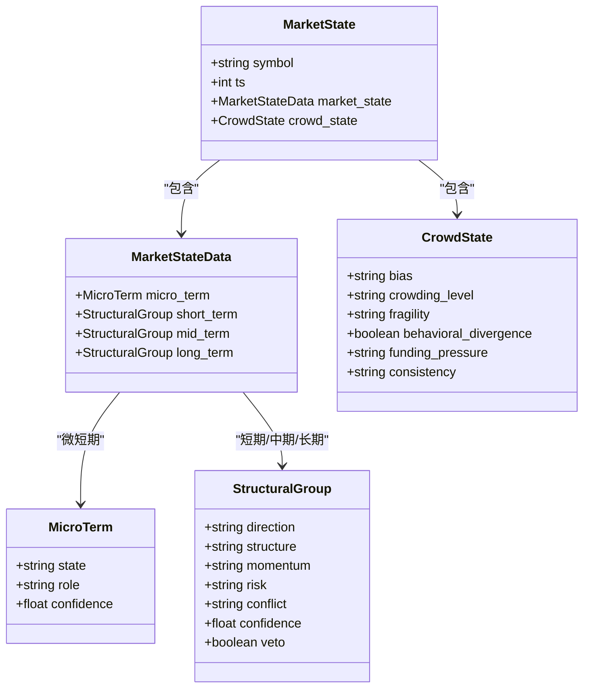
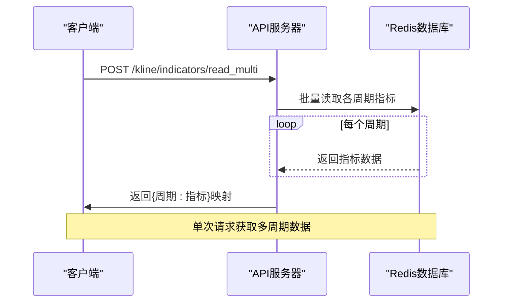
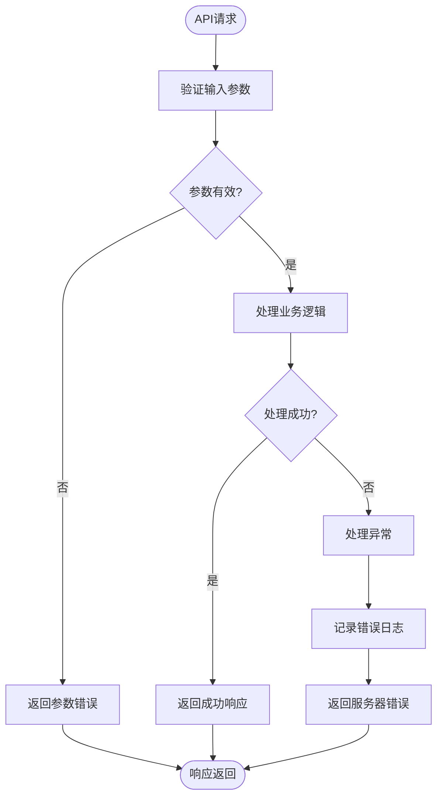

# 行情与背景数据接口

<cite>
**本文档引用的文件**
- [market_raw_analysis.py](file://api/application/apps/background/market_raw_analysis.py)
- [kline_indicators.py](file://api/application/apps/background/kline_indicators.py)
- [background_kline.py](file://api/application/apps/background/background_kline.py)
- [views.py](file://api/application/apps/background/views.py)
- [market_state.py](file://agent_server/agents/experts/background/market_state.py)
- [crowd_state_compactor.py](file://agent_server/agents/experts/background/crowd_state_compactor.py)
- [market_state_view.py](file://api/application/apps/background/market_state_view.py)
- [redis_client.py](file://api/application/common/redis_client.py)
- [redis_client.py](file://agent_server/utils/redis_client.py)
- [status_codes.py](file://api/application/common/status_codes.py)
- [config.py](file://agent_server/config.py)
</cite>

## 目录
1. [简介](#简介)
2. [核心API端点](#核心api端点)
3. [核心数据模型](#核心数据模型)
4. [多周期批量读取接口](#多周期批量读取接口)
5. [Redis客户端角色](#redis客户端角色)
6. [调用示例与异常处理](#调用示例与异常处理)

## 简介
本API文档详细描述了行情与背景数据模块的核心功能，包括市场原始数据分析、技术指标读取、资金流状态查询等。系统通过多个API端点提供结构化的市场数据，支持从原始市场数据到高级市场状态的多层次分析。所有数据通过Redis进行高效存储和检索，确保低延迟的数据访问。

## 核心API端点

### 市场原始数据分析
`/market_raw/analyze` 端点用于分析市场原始数据并构建参与者结构与摘要。

**请求参数**
- exchange: 交易所名称
- symbol: 币种符号

**调用逻辑**
该端点首先从Redis读取指定交易所和币种的市场原始数据，然后通过`build_participant_structure`函数对数据进行分析和结构化处理。

**返回数据结构**
```json
{
  "code": 0,
  "msg": "请求成功",
  "data": {
    "symbol": "BTCUSDT",
    "generated_at": 1700000000000,
    "ticker": {
      "price": 90000.0,
      "price_change_pct_24h": 0.05,
      "high_24h": 92000.0,
      "low_24h": 88000.0,
      "quote_volume_24h": 100000000.0,
      "volatility_24h": "medium",
      "trend_24h": "up"
    },
    "funding_rate": {
      "current": 0.001,
      "mean": 0.0008,
      "delta": 0.0001,
      "volatility": 0.0002,
      "trend": "up",
      "stability": "stable",
      "bias": "bullish"
    },
    "participant_structure": {
      "globalLongShortAccountRatio": {
        "5m": {
          "current": {"long_pct": 0.6, "short_pct": 0.4, "ls_ratio": 1.5},
          "stats": {"mean_ls_ratio": 1.4, "delta_ls_ratio": 0.1, "vol_ls_ratio": 0.2},
          "trend": {"ls_trend": "up", "long_trend": "up", "short_trend": "down"},
          "labels": {"bias": "long", "strength": "strong", "stability": "volatile"}
        }
      }
    },
    "summary": {
      "cross_period_bias": "long",
      "cross_period_stability": "volatile",
      "funding_bias": "bullish",
      "funding_stability": "stable",
      "price_trend_24h": "up",
      "market_context": "strong_uptrend",
      "alignment_score": 0.8,
      "notes": "跨周期加权判断为 long，一致性评分 0.8，结构稳定性 volatile。 平均波动 0.0002。"
    }
  }
}
```

**Section sources**
- [market_raw_analysis.py](file://api/application/apps/background/market_raw_analysis.py#L42-L94)
- [views.py](file://api/application/apps/background/views.py#L23-L45)

### 技术指标读取
`/kline/indicators/read` 端点用于读取指定交易所、币种和周期的技术指标。

**请求参数**
- exchange: 交易所名称
- symbol: 币种符号
- interval: 周期（如 1m/5m/1h）

**调用逻辑**
该端点从Redis中读取指定周期的技术指标数据，包括BOLL、EMA、MACD、RSI等指标。

**返回数据结构**
```json
{
  "code": 0,
  "msg": "请求成功",
  "data": {
    "boll": {
      "upper_band": 90392.31,
      "middle_band": 90069.12,
      "lower_band": 89745.93,
      "bandwidth": 0.0072,
      "percent_b": 0.77
    },
    "ema": {
      "ema5": 90215.37,
      "ema7": 90204.17,
      "ema12": 90162.39,
      "ema20": 90102.87,
      "ema26": 90072.19,
      "ema50": 90053.77,
      "ema100": 90247.03,
      "ema200": 90675.07
    },
    "macd": {
      "dif": 90.19,
      "dea": 75.71,
      "macd": 28.97
    }
  }
}
```

**Section sources**
- [kline_indicators.py](file://api/application/apps/background/kline_indicators.py#L17-L43)
- [views.py](file://api/application/apps/background/views.py#L79-L100)

### 资金流状态查询
`/crowd_state/read` 端点用于读取指定交易所和币种的资金流状态。

**请求参数**
- exchange: 交易所名称
- symbol: 币种符号

**调用逻辑**
该端点从Redis读取市场参与者结构分析的完整数据，并通过`crowd_state_compactor`函数将其压缩为低噪声的`crowd_state`对象。

**返回数据结构**
```json
{
  "code": 0,
  "msg": "请求成功",
  "data": {
    "bias": "long",
    "crowding_level": "high",
    "fragility": "high",
    "behavioral_divergence": true,
    "funding_pressure": "active_squeeze",
    "consistency": "conflicted"
  }
}
```

**Section sources**
- [crowd_state_compactor.py](file://agent_server/agents/experts/background/crowd_state_compactor.py#L4-L67)
- [views.py](file://api/application/apps/background/views.py#L108-L128)

## 核心数据模型

### market_state模型
`market_state`是系统的核心数据模型，它聚合了多周期K线背景和人群状态，形成对市场的综合判断。

**模型构成**
```json
{
  "symbol": "BTCUSDT",
  "ts": 1700000000000,
  "market_state": {
    "micro_term": {
      "state": "range_near_R1",
      "role": "trigger_only",
      "confidence": 0.3
    },
    "short_term": {
      "direction": "bullish",
      "structure": "consolidating",
      "momentum": "strengthening",
      "risk": "high",
      "conflict": null,
      "confidence": 0.7
    },
    "mid_term": {
      "direction": "bullish",
      "structure": "accumulation",
      "momentum": "neutral",
      "risk": "normal",
      "conflict": null,
      "confidence": 1.0
    },
    "long_term": {
      "direction": "bullish",
      "structure": "breakout",
      "momentum": "strengthening",
      "risk": "normal",
      "conflict": null,
      "confidence": 1.2,
      "veto": false
    }
  },
  "crowd_state": {
    "bias": "long",
    "crowding_level": "high",
    "fragility": "high",
    "behavioral_divergence": true,
    "funding_pressure": "active_squeeze",
    "consistency": "conflicted"
  }
}
```

**智能分析作用**
- **周期分组**: 将不同周期分为微短期、短期、中期和长期四个组别
- **权重分配**: 不同周期组别有不同的置信度权重，长期>中期>短期>微短期
- **一票否决**: 长期趋势具有否决权，当出现方向对立、结构+动能同时走坏等情况时，会触发否决机制
- **人群状态调整**: 根据人群状态调整短期风险和置信度，当人群脆弱性高时提升风险等级



**Diagram sources**
- [market_state.py](file://agent_server/agents/experts/background/market_state.py#L113-L176)

**Section sources**
- [market_state.py](file://agent_server/agents/experts/background/market_state.py#L5-L191)

### crowd_state模型
`crowd_state`模型是对市场参与者行为的压缩表示，主要用于风险、置信度和否决机制的调整。

**模型构成**
- bias: 整体偏向（long/short/neutral）
- crowding_level: 拥挤程度（low/medium/high）
- fragility: 脆弱性（low/medium/high）
- behavioral_divergence: 行为分歧
- funding_pressure: 资金压力（none/potential_squeeze/active_squeeze）
- consistency: 一致性（aligned/conflicted/mixed）

**智能分析作用**
- **风险调整**: 当人群脆弱性高时，提升短期风险等级
- **置信度调整**: 当人群拥挤且方向一致时，降低短期置信度
- **否决机制**: 当长期一致性冲突且人群拥挤时，触发长期否决

**Section sources**
- [crowd_state_compactor.py](file://agent_server/agents/experts/background/crowd_state_compactor.py#L4-L67)

## 多周期批量读取接口

### 设计优势
`read_multi`接口设计用于批量读取多周期数据，具有以下优势：

1. **减少网络开销**: 单次请求获取多个周期数据，减少HTTP请求次数
2. **提高效率**: 避免多次Redis连接和查询的开销
3. **数据一致性**: 批量获取的数据在同一时间点，保证了数据的一致性
4. **简化客户端逻辑**: 客户端无需管理多个异步请求的并发和合并

### 性能考量
- **批量处理**: 通过循环依次读取各周期数据，虽然为串行操作，但Redis查询速度极快
- **内存使用**: 所有数据在内存中构建，需考虑大数据量时的内存占用
- **超时控制**: 单个请求处理时间随周期数量线性增长，需合理设置超时



**Diagram sources**
- [kline_indicators.py](file://api/application/apps/background/kline_indicators.py#L81-L91)
- [background_kline.py](file://api/application/apps/background/background_kline.py#L44-L54)

**Section sources**
- [kline_indicators.py](file://api/application/apps/background/kline_indicators.py#L81-L91)
- [background_kline.py](file://api/application/apps/background/background_kline.py#L44-L54)

## Redis客户端角色
Redis客户端在数据获取中扮演着核心角色，主要职责包括：

1. **数据存储**: 将市场原始数据、技术指标、背景分析结果等存储在Redis中
2. **数据检索**: 提供高效的数据读取接口，支持按键值查询和模式扫描
3. **连接管理**: 通过连接池管理Redis连接，提高连接复用率
4. **序列化处理**: 自动处理JSON序列化和反序列化

**Redis键值设计**
- `market_raw:{exchange}:{symbol}:*`: 市场原始数据
- `indicators:{exchange}:{symbol}:{interval}`: 技术指标数据
- `background:{exchange}:{symbol}:{interval}`: 背景K线指标
- `background:{exchange}:{symbol}:market_state`: 综合市场状态

```mermaid
graph TB
subgraph "客户端"
Client[API客户端]
end
subgraph "服务器"
API[API服务器]
Redis[(Redis数据库)]
end
Client --> API
API --> Redis
Redis --> API
API --> Client
style Redis fill:#f9f,stroke:#333
style API fill:#bbf,stroke:#333
style Client fill:#9f9,stroke:#333
Note over API,Redis: Redis作为数据缓存层
```

**Diagram sources**
- [redis_client.py](file://api/application/common/redis_client.py#L30-L33)
- [redis_client.py](file://agent_server/utils/redis_client.py#L9-L17)

**Section sources**
- [redis_client.py](file://api/application/common/redis_client.py#L1-L33)
- [redis_client.py](file://agent_server/utils/redis_client.py#L1-L53)

## 调用示例与异常处理

### 调用示例
```python
import requests

# 市场原始数据分析
response = requests.post(
    "http://localhost:9931/api/market_raw/analyze",
    json={"exchange": "binance", "symbol": "BTCUSDT"}
)
print(response.json())

# 多周期技术指标读取
response = requests.post(
    "http://localhost:9931/api/kline/indicators/read_multi",
    json={
        "exchange": "binance",
        "symbol": "BTCUSDT",
        "intervals": ["1m", "5m", "15m", "1h"]
    }
)
print(response.json())

# 资金流状态查询
response = requests.post(
    "http://localhost:9931/api/crowd_state/read",
    json={"exchange": "binance", "symbol": "BTCUSDT"}
)
print(response.json())
```

### 异常处理策略
系统采用统一的异常处理机制，返回标准化的错误响应：

**错误响应结构**
```json
{
  "code": 1003,
  "msg": "服务器内部错误: [错误详情]"
}
```

**状态码定义**
- 0: 请求成功
- 1: 请求失败
- 1001: 参数错误
- 1002: 资源未找到
- 1003: 服务器内部错误
- 1004: 数据验证错误
- 1005: 数据库操作错误

**异常处理流程**
1. 捕获所有异常
2. 记录错误日志
3. 返回标准化错误响应
4. 确保API不会因未处理异常而崩溃



**Diagram sources**
- [status_codes.py](file://api/application/common/status_codes.py#L3-L26)
- [views.py](file://api/application/apps/background/views.py#L40-L44)

**Section sources**
- [status_codes.py](file://api/application/common/status_codes.py#L1-L26)
- [views.py](file://api/application/apps/background/views.py#L23-L272)