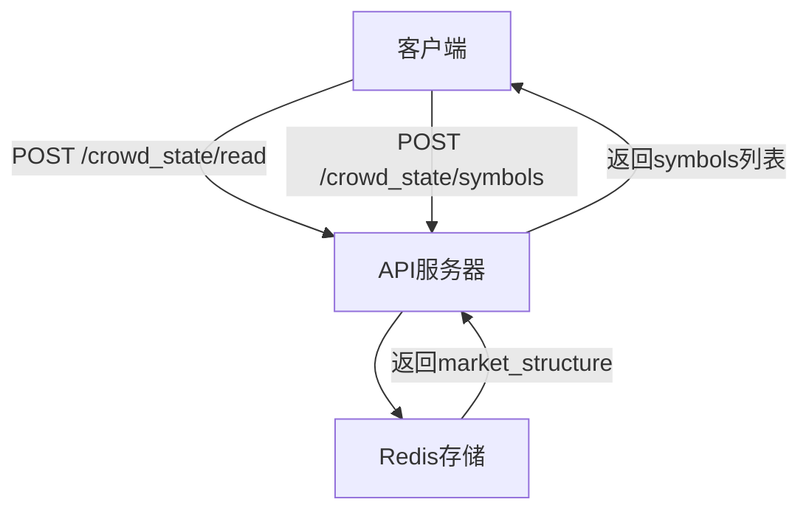
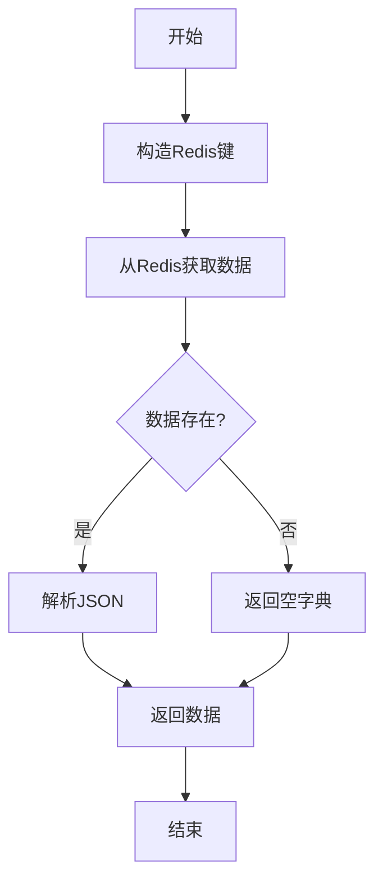
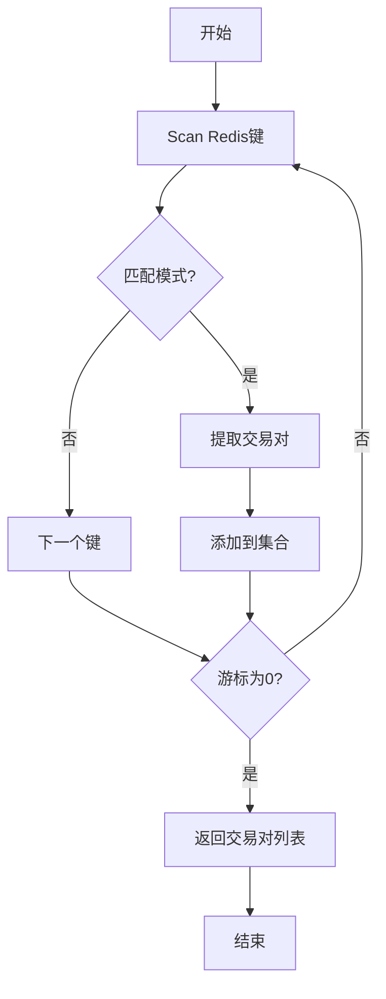
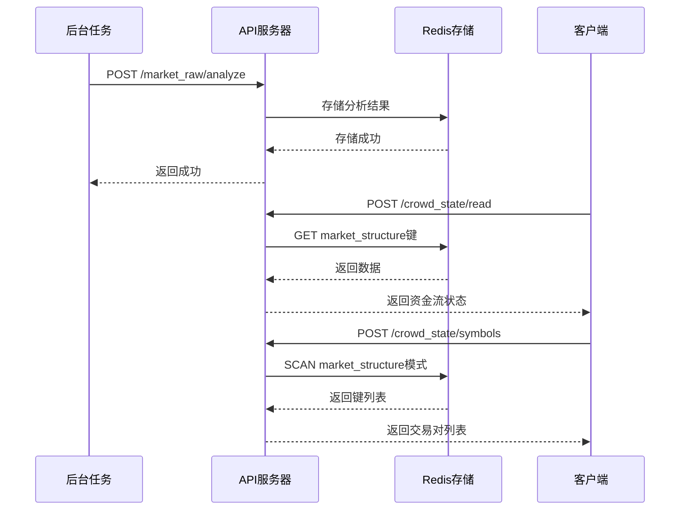

# 资金流与市场结构接口

<cite>
**本文档引用文件**  
- [views.py](file://api/application/apps/background/views.py)
- [crowd_state_compactor.py](file://api/application/apps/background/crowd_state_compactor.py)
- [market_raw_analysis.py](file://api/application/apps/background/market_raw_analysis.py)
- [crowd_state_compactor.py](file://agent_server/agents/experts/background/crowd_state_compactor.py)
- [market_state.py](file://agent_server/agents/experts/background/market_state.py)
- [market_structure.py](file://agent_server/agents/experts/background/market_structure.py)
</cite>

## 目录
1. [简介](#简介)
2. [核心端点](#核心端点)
3. [资金流状态获取机制](#资金流状态获取机制)
4. [原始市场数据到资金流状态的转换](#原始市场数据到资金流状态的转换)
5. [交易对发现机制](#交易对发现机制)
6. [数据示例与智能代理决策影响](#数据示例与智能代理决策影响)
7. [系统集成与调用流程](#系统集成与调用流程)

## 简介
本系统提供资金流与市场结构分析服务，通过两个核心端点 `/crowd_state/read` 和 `/crowd_state/symbols`，为智能代理提供市场参与者结构、情绪背景和结构脆弱性等关键指标。系统从Redis中读取原始市场数据，经过多层分析和压缩，生成低噪音、结构化的资金流状态（crowd_state），用于下游多代理体系的决策支持。

**Section sources**
- [views.py](file://api/application/apps/background/views.py#L1-L159)

## 核心端点
系统提供两个核心API端点：

1. **`/crowd_state/read`**：读取指定交易所/币种的资金流/市场结构背景，返回市场结构的字典。
2. **`/crowd_state/symbols`**：扫描指定交易所下存在资金流/市场结构背景的符号列表。

这些端点通过FastAPI实现，封装了底层的数据获取和处理逻辑，为上层应用提供统一的接口。



**Diagram sources**
- [views.py](file://api/application/apps/background/views.py#L108-L128)
- [views.py](file://api/application/apps/background/views.py#L135-L154)

**Section sources**
- [views.py](file://api/application/apps/background/views.py#L103-L159)

## 资金流状态获取机制
`read_market_structure` 函数负责获取压缩后的资金流状态。该函数从Redis中读取预计算的市场结构数据，这些数据由后台任务定期更新。

函数通过构造特定的Redis键（`background:{exchange}:{symbol}:market_structure`）来获取数据，并将其解析为JSON格式返回。如果数据不存在，则返回空字典。



**Diagram sources**
- [crowd_state_compactor.py](file://api/application/apps/background/crowd_state_compactor.py#L21-L30)

**Section sources**
- [crowd_state_compactor.py](file://api/application/apps/background/crowd_state_compactor.py#L21-L30)

## 原始市场数据到资金流状态的转换
从原始市场数据到资金流状态的转换过程分为多个步骤：

1. **原始数据读取**：`read_market_raw` 函数从Redis中读取多周期的市场原始数据，包括多空比、资金费率等。
2. **参与者结构构建**：`build_participant_structure` 函数将原始数据转换为结构化的参与者画像，包括趋势分析、波动率计算和跨周期一致性评分。
3. **大模型分析**：`MarketStructureExpert` 使用大模型对参与者结构进行深度分析，生成市场参与者摘要、情绪按周期分布、资金分析和跨周期一致性等高级指标。
4. **状态压缩**：`crowd_state_compactor` 函数将大模型输出的详细分析结果压缩为低噪音的资金流状态，用于风险调整和决策支持。


**Diagram sources**
- [market_raw_analysis.py](file://api/application/apps/background/market_raw_analysis.py#L42-L94)
- [market_raw_analysis.py](file://api/application/apps/background/market_raw_analysis.py#L274-L348)
- [market_structure.py](file://agent_server/agents/experts/background/market_structure.py#L21-L74)
- [crowd_state_compactor.py](file://agent_server/agents/experts/background/crowd_state_compactor.py#L4-L67)

**Section sources**
- [market_raw_analysis.py](file://api/application/apps/background/market_raw_analysis.py#L42-L376)
- [crowd_state_compactor.py](file://agent_server/agents/experts/background/crowd_state_compactor.py#L4-L67)

## 交易对发现机制
`scan_crowd_symbols` 接口用于发现系统中可用的交易对。该接口通过Redis的scan命令，查找符合特定模式（`background:{exchange}:*:market_structure`）的键，从而获取所有存在市场结构数据的交易对。

该机制允许系统动态发现和管理交易对，无需硬编码或手动配置，提高了系统的灵活性和可扩展性。



**Diagram sources**
- [crowd_state_compactor.py](file://api/application/apps/background/crowd_state_compactor.py#L32-L52)

**Section sources**
- [crowd_state_compactor.py](file://api/application/apps/background/crowd_state_compactor.py#L32-L52)

## 数据示例与智能代理决策影响
以下是一个资金流状态的实际示例及其对智能代理决策的影响：

```json
{
  "bias": "long",
  "crowding_level": "high",
  "fragility": "high",
  "behavioral_divergence": true,
  "funding_pressure": "active_squeeze",
  "consistency": "conflicted"
}
```

在智能代理的决策过程中，这些指标被用于风险调整和信心校准。例如，在 `market_state_aggregator` 函数中，如果短周期结构的拥挤度为"high"且方向与资金流偏好多头一致，系统会降低该结构的置信度，以避免在过度拥挤的市场中做出错误决策。

此外，如果长周期结构的跨周期一致性为"conflicted"且拥挤度为"high"，系统会触发一票否决机制，阻止相关交易信号的执行，从而有效控制风险。

**Section sources**
- [crowd_state_compactor.py](file://agent_server/agents/experts/background/crowd_state_compactor.py#L4-L67)
- [market_state.py](file://agent_server/agents/experts/background/market_state.py#L164-L172)

## 系统集成与调用流程
整个系统的集成与调用流程如下：

1. 后台任务定期调用 `/market_raw/analyze` 端点，触发市场原始数据分析。
2. 分析结果被存储到Redis中，键名为 `background:{exchange}:{symbol}:market_structure`。
3. 当需要获取资金流状态时，调用 `/crowd_state/read` 端点，从Redis中读取预计算的数据。
4. 当需要发现可用交易对时，调用 `/crowd_state/symbols` 端点，扫描Redis中的相关键。

这种设计实现了计算与查询的分离，提高了系统的响应速度和可扩展性。



**Diagram sources**
- [views.py](file://api/application/apps/background/views.py#L108-L154)
- [crowd_state_compactor.py](file://api/application/apps/background/crowd_state_compactor.py#L21-L52)
- [background_tasks.py](file://agent_server/utils/background_tasks.py#L34-L96)

**Section sources**
- [views.py](file://api/application/apps/background/views.py#L23-L44)
- [crowd_state_compactor.py](file://api/application/apps/background/crowd_state_compactor.py#L21-L52)
- [background_tasks.py](file://agent_server/utils/background_tasks.py#L34-L96)