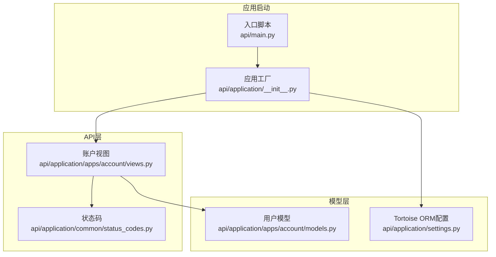
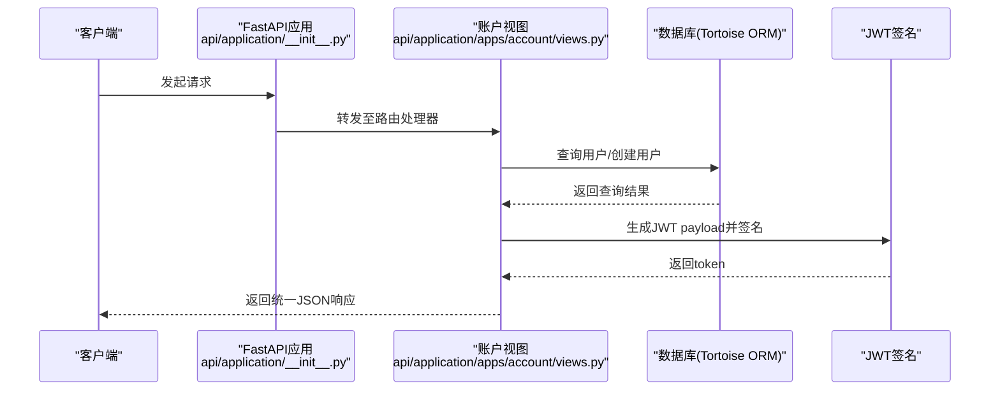
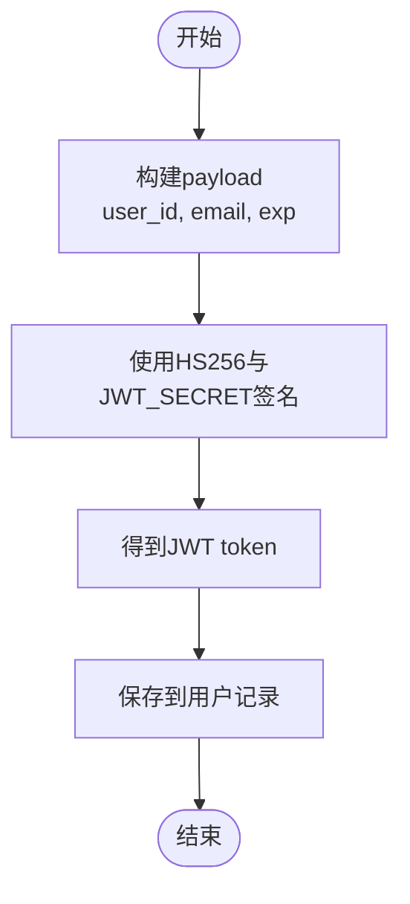
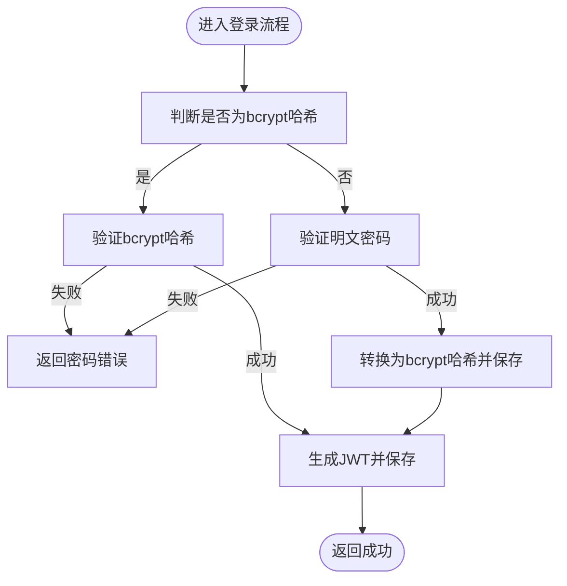
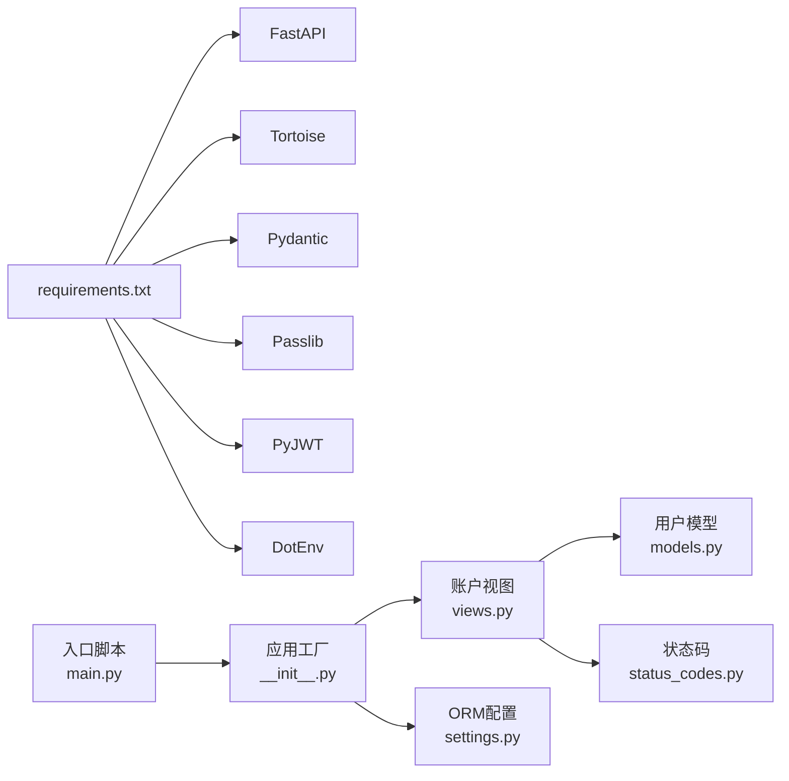

# 账户接口

<cite>
**本文引用的文件**
- [api/application/apps/account/views.py](file://api/application/apps/account/views.py)
- [api/application/apps/account/models.py](file://api/application/apps/account/models.py)
- [api/application/common/status_codes.py](file://api/application/common/status_codes.py)
- [api/application/__init__.py](file://api/application/__init__.py)
- [api/main.py](file://api/main.py)
- [api/application/settings.py](file://api/application/settings.py)
- [requirements.txt](file://requirements.txt)
</cite>

## 目录
1. [简介](#简介)
2. [项目结构](#项目结构)
3. [核心组件](#核心组件)
4. [架构总览](#架构总览)
5. [详细组件分析](#详细组件分析)
6. [依赖关系分析](#依赖关系分析)
7. [性能考量](#性能考量)
8. [故障排查指南](#故障排查指南)
9. [结论](#结论)
10. [附录](#附录)

## 简介
本文件为账户服务的完整API文档，聚焦于用户注册与登录两个核心端点。内容覆盖：
- 接口HTTP方法与路径
- 请求体结构（基于Pydantic模型RegisterRequest与LoginRequest）
- 字段验证规则（用户名格式、密码长度、邮箱合法性）
- 密码加密机制（bcrypt哈希与明文迁移策略）
- JWT令牌生成逻辑（payload字段与返回格式）
- 成功与失败响应示例及错误码触发条件
- curl与Python requests调用示例
- Swagger UI在线测试指引

## 项目结构
账户相关代码位于api子项目中，采用FastAPI + Tortoise ORM + Pydantic + Passlib + PyJWT的组合：
- FastAPI路由与业务逻辑集中在账户应用视图文件
- 用户实体模型由Tortoise ORM定义
- 统一状态码集中管理
- 应用启动与路由注册在应用工厂中完成
- 数据库连接与ORM配置在settings中定义

图表来源
- [api/application/apps/account/views.py](file://api/application/apps/account/views.py#L1-L129)
- [api/application/apps/account/models.py](file://api/application/apps/account/models.py#L1-L18)
- [api/application/common/status_codes.py](file://api/application/common/status_codes.py#L1-L26)
- [api/application/__init__.py](file://api/application/__init__.py#L1-L39)
- [api/main.py](file://api/main.py#L1-L14)
- [api/application/settings.py](file://api/application/settings.py#L1-L34)

章节来源
- [api/application/apps/account/views.py](file://api/application/apps/account/views.py#L1-L129)
- [api/application/apps/account/models.py](file://api/application/apps/account/models.py#L1-L18)
- [api/application/common/status_codes.py](file://api/application/common/status_codes.py#L1-L26)
- [api/application/__init__.py](file://api/application/__init__.py#L1-L39)
- [api/main.py](file://api/main.py#L1-L14)
- [api/application/settings.py](file://api/application/settings.py#L1-L34)

## 核心组件
- 路由与控制器
  - 账户应用路由：注册与登录两个POST端点
  - 使用Pydantic模型进行请求体校验
  - 使用Passlib bcrypt进行密码哈希
  - 使用PyJWT生成JWT令牌
- 数据模型
  - 用户实体包含用户名、邮箱、密码、是否激活、令牌等字段
- 状态码
  - 统一的状态码与消息映射，便于前后端一致化处理

章节来源
- [api/application/apps/account/views.py](file://api/application/apps/account/views.py#L1-L129)
- [api/application/apps/account/models.py](file://api/application/apps/account/models.py#L1-L18)
- [api/application/common/status_codes.py](file://api/application/common/status_codes.py#L1-L26)

## 架构总览
账户服务的调用链路如下：
- 客户端请求到达FastAPI应用
- 应用工厂注册路由与ORM
- 视图函数执行业务逻辑（校验、查询、哈希、迁移、签发JWT）
- 返回统一结构的JSON响应

图表来源
- [api/application/__init__.py](file://api/application/__init__.py#L1-L39)
- [api/application/apps/account/views.py](file://api/application/apps/account/views.py#L1-L129)
- [api/application/settings.py](file://api/application/settings.py#L1-L34)

## 详细组件分析

### 注册接口 /api/register
- 方法与路径
  - POST /api/register
- 请求体结构（RegisterRequest）
  - 字段
    - username: 字符串，必填
    - email: 邮箱字符串，必填
    - password: 字符串，必填
- 字段验证规则
  - 用户名格式：仅允许字母、数字、下划线，且不能为空
  - 密码长度：至少6位
  - 邮箱唯一性：数据库中不允许重复
  - 用户名唯一性：数据库中不允许重复
- 密码处理
  - 使用bcrypt进行哈希存储
- JWT签发
  - payload包含user_id、email、exp（当前实现为长期不过期）
  - 使用HS256算法与JWT_SECRET密钥签名
- 成功响应
  - 返回统一结构，包含token、user_id、username、email
- 失败响应
  - 参数错误、资源不存在、服务器内部错误等，均返回统一结构

章节来源
- [api/application/apps/account/views.py](file://api/application/apps/account/views.py#L32-L92)
- [api/application/common/status_codes.py](file://api/application/common/status_codes.py#L1-L26)
- [api/application/apps/account/models.py](file://api/application/apps/account/models.py#L1-L18)

### 登录接口 /api/login
- 方法与路径
  - POST /api/login
- 请求体结构（LoginRequest）
  - 字段
    - account: 字符串，必填（当前实现仅支持邮箱登录）
    - password: 字符串，必填
- 认证流程
  - 仅支持邮箱登录
  - 若用户不存在或被禁用，返回相应错误
  - 支持旧明文密码自动迁移至bcrypt哈希
  - bcrypt哈希验证失败则返回错误
- JWT签发
  - payload包含user_id、email、exp（当前实现为长期不过期）
  - 使用HS256算法与JWT_SECRET密钥签名
- 成功响应
  - 返回统一结构，包含token、user_id、username、email
- 失败响应
  - 参数错误、资源不存在、服务器内部错误等，均返回统一结构

章节来源
- [api/application/apps/account/views.py](file://api/application/apps/account/views.py#L94-L129)
- [api/application/common/status_codes.py](file://api/application/common/status_codes.py#L1-L26)
- [api/application/apps/account/models.py](file://api/application/apps/account/models.py#L1-L18)

### 数据模型 User
- 字段
  - id: 整型，主键
  - username: 字符串，最大长度128
  - email: 字符串，唯一，最大长度128
  - password: 字符串，最大长度128（可为空，兼容明文迁移）
  - is_active: 布尔，默认True
  - token: 字符串，最大长度256（用于保存JWT）
- 约束
  - email唯一
- 表名
  - user

章节来源
- [api/application/apps/account/models.py](file://api/application/apps/account/models.py#L1-L18)

### JWT生成与验证流程
- 生成
  - payload包含user_id、email、exp
  - 使用HS256算法与JWT_SECRET密钥签名
- 验证
  - 后续可通过相同密钥与算法进行解码与校验（本仓库未在此处显式展示解码逻辑）

图表来源
- [api/application/apps/account/views.py](file://api/application/apps/account/views.py#L80-L87)
- [api/application/apps/account/views.py](file://api/application/apps/account/views.py#L116-L123)

### 明文密码迁移策略
- 判断逻辑
  - 通过简单前缀与长度判断是否为bcrypt哈希
- 迁移过程
  - 若非哈希（明文），验证通过后将其转换为bcrypt哈希并持久化
- 安全性
  - 保证历史明文数据逐步过渡到安全存储

图表来源
- [api/application/apps/account/views.py](file://api/application/apps/account/views.py#L104-L116)

## 依赖关系分析
- 外部依赖
  - FastAPI：Web框架与路由
  - Tortoise ORM：异步数据库访问
  - Pydantic：请求体模型与验证
  - Passlib：bcrypt密码哈希
  - PyJWT：JWT令牌生成
  - python-dotenv：读取环境变量
- 内部模块
  - 账户视图依赖用户模型与状态码
  - 应用工厂负责注册路由与ORM

图表来源
- [requirements.txt](file://requirements.txt#L1-L107)
- [api/application/apps/account/views.py](file://api/application/apps/account/views.py#L1-L129)
- [api/application/apps/account/models.py](file://api/application/apps/account/models.py#L1-L18)
- [api/application/common/status_codes.py](file://api/application/common/status_codes.py#L1-L26)
- [api/application/__init__.py](file://api/application/__init__.py#L1-L39)
- [api/application/settings.py](file://api/application/settings.py#L1-L34)
- [api/main.py](file://api/main.py#L1-L14)

章节来源
- [requirements.txt](file://requirements.txt#L1-L107)
- [api/application/apps/account/views.py](file://api/application/apps/account/views.py#L1-L129)
- [api/application/apps/account/models.py](file://api/application/apps/account/models.py#L1-L18)
- [api/application/common/status_codes.py](file://api/application/common/status_codes.py#L1-L26)
- [api/application/__init__.py](file://api/application/__init__.py#L1-L39)
- [api/application/settings.py](file://api/application/settings.py#L1-L34)
- [api/main.py](file://api/main.py#L1-L14)

## 性能考量
- 数据库查询
  - 注册时对邮箱与用户名进行唯一性检查，建议在数据库层面确保索引完善
- 密码处理
  - bcrypt哈希计算有一定开销，建议在高并发场景下关注I/O与CPU负载
- JWT签发
  - HS256算法开销较低，适合高频签发场景
- CORS与中间件
  - 应用已启用CORS中间件，生产环境建议限制允许的源与方法

[本节为通用指导，不直接分析具体文件]

## 故障排查指南
- 常见错误码与触发条件
  - 参数错误（1001）：用户名格式不正确、用户名/邮箱/密码为空、密码长度不足、邮箱已存在、用户名已存在、用户不存在、用户被禁用、密码错误
  - 资源未找到（1002）：用户不存在
  - 服务器内部错误（1003）：服务器异常
  - 数据验证错误（1004）：数据验证失败
  - 数据库操作错误（1005）：数据库异常
- 环境变量
  - JWT_SECRET：JWT签名密钥
  - DB_*：数据库连接参数
  - APP_HOST/APP_PORT/APP_DEBUG：应用运行参数
- 建议排查步骤
  - 检查JWT_SECRET是否正确设置
  - 检查数据库连接参数与网络连通性
  - 确认邮箱唯一约束与索引是否存在
  - 查看应用日志定位异常

章节来源
- [api/application/common/status_codes.py](file://api/application/common/status_codes.py#L1-L26)
- [api/application/apps/account/views.py](file://api/application/apps/account/views.py#L43-L129)
- [api/application/settings.py](file://api/application/settings.py#L1-L34)
- [api/main.py](file://api/main.py#L1-L14)

## 结论
账户服务提供了简洁可靠的注册与登录能力，具备完善的请求体校验、密码安全存储与JWT签发机制。通过统一的状态码与响应结构，便于前后端协作与问题定位。建议在生产环境中进一步完善JWT过期策略、CORS白名单与数据库索引优化。

[本节为总结性内容，不直接分析具体文件]

## 附录

### API定义与示例

- 注册接口
  - 方法：POST
  - 路径：/api/register
  - 请求体模型：RegisterRequest
    - username: 字符串，必填
    - email: 邮箱字符串，必填
    - password: 字符串，必填
  - 成功响应示例（简化）
    - {
      "code": 0,
      "msg": "注册成功",
      "token": "<JWT>",
      "user_id": 123,
      "username": "alice",
      "email": "alice@example.com"
    }
  - 失败响应示例（参数错误）
    - {
      "code": 1001,
      "msg": "用户名格式不正确"
    }

- 登录接口
  - 方法：POST
  - 路径：/api/login
  - 请求体模型：LoginRequest
    - account: 字符串，必填（当前实现仅支持邮箱）
    - password: 字符串，必填
  - 成功响应示例（简化）
    - {
      "code": 0,
      "msg": "登录成功",
      "token": "<JWT>",
      "user_id": 123,
      "username": "alice",
      "email": "alice@example.com"
    }
  - 失败响应示例（用户不存在）
    - {
      "code": 1001,
      "msg": "用户不存在"
    }

章节来源
- [api/application/apps/account/views.py](file://api/application/apps/account/views.py#L32-L129)
- [api/application/common/status_codes.py](file://api/application/common/status_codes.py#L1-L26)

### curl调用示例
- 注册
  - curl -X POST "$BASE_URL/api/register" -H "Content-Type: application/json" -d '{"username":"alice","email":"alice@example.com","password":"mypassword"}'
- 登录
  - curl -X POST "$BASE_URL/api/login" -H "Content-Type: application/json" -d '{"account":"alice@example.com","password":"mypassword"}'

章节来源
- [api/application/apps/account/views.py](file://api/application/apps/account/views.py#L43-L129)

### Python requests调用示例
- 注册
  - import requests
  - resp = requests.post(f"{BASE_URL}/api/register", json={"username":"alice","email":"alice@example.com","password":"mypassword"})
  - print(resp.json())
- 登录
  - import requests
  - resp = requests.post(f"{BASE_URL}/api/login", json={"account":"alice@example.com","password":"mypassword"})
  - print(resp.json())

章节来源
- [api/application/apps/account/views.py](file://api/application/apps/account/views.py#L43-L129)

### Swagger UI在线测试
- 启动应用后，在浏览器访问：
  - http://localhost:8000/docs
- 在页面中找到“注册登录接口”标签，即可看到注册与登录接口的交互式文档与测试界面

章节来源
- [api/application/__init__.py](file://api/application/__init__.py#L35-L39)
- [api/main.py](file://api/main.py#L1-L14)