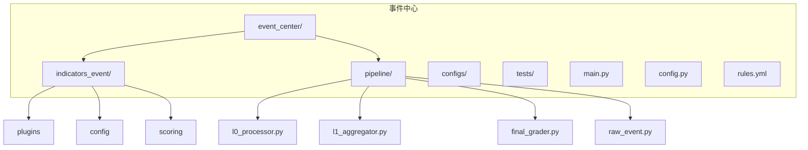
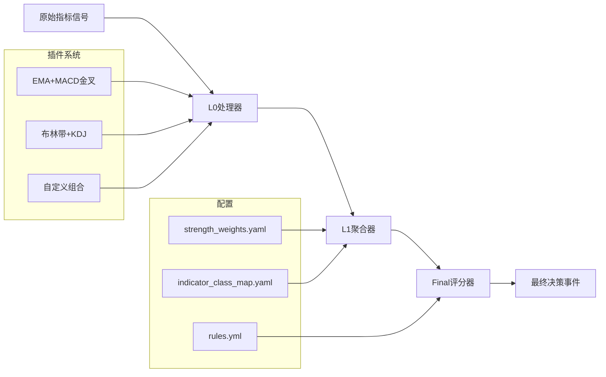
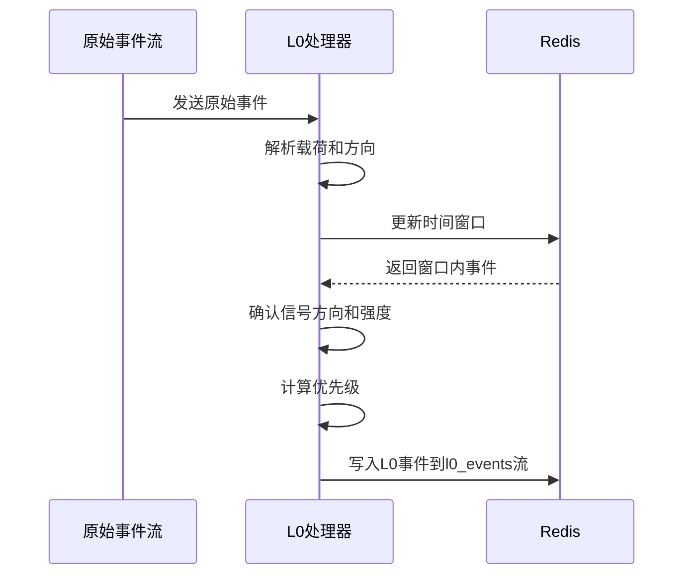
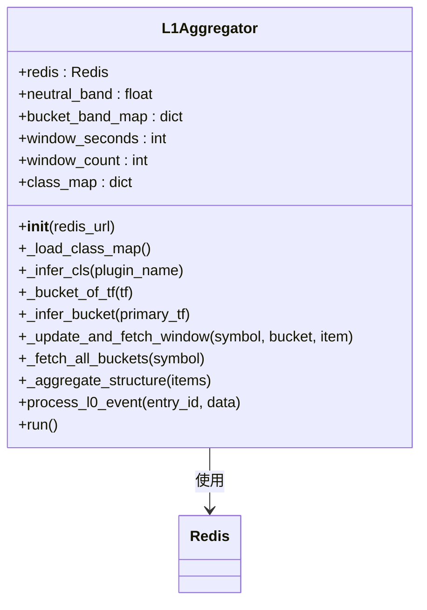
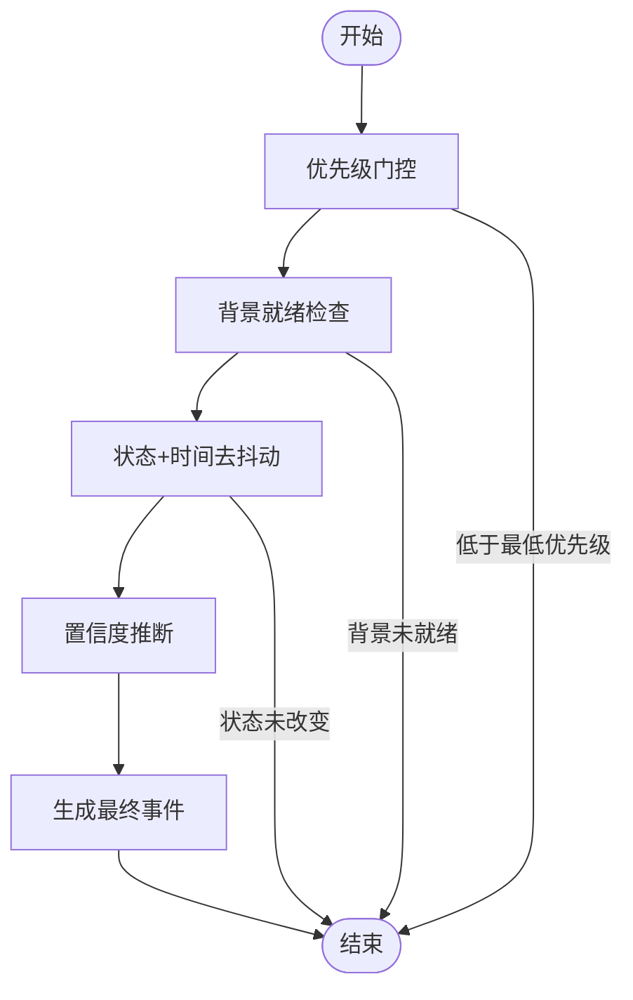
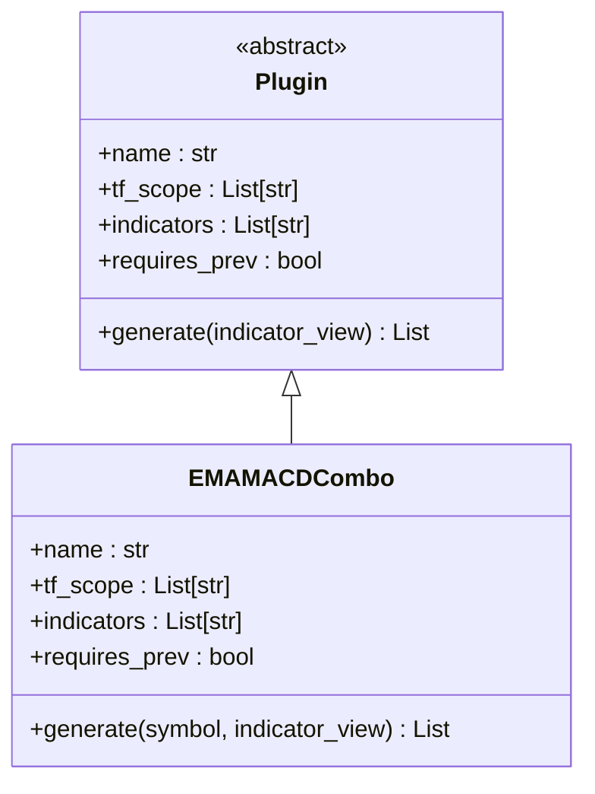
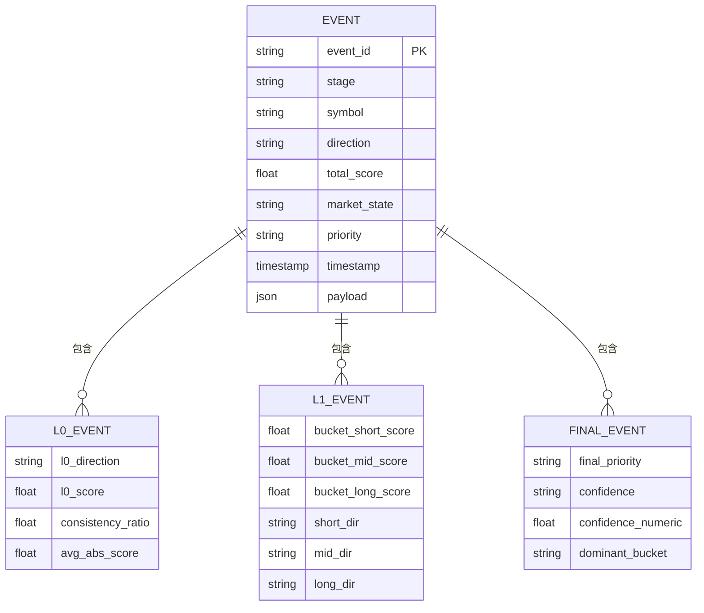
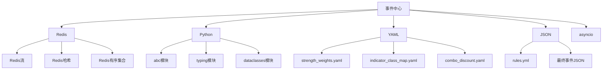

# 事件中心

<cite>
**本文档引用的文件**
- [l0_processor.py](file://event_center/pipeline/l0_processor.py)
- [l1_aggregator.py](file://event_center/pipeline/l1_aggregator.py)
- [final_grader.py](file://event_center/pipeline/final_grader.py)
- [raw_event.py](file://event_center/pipeline/raw_event.py)
- [base.py](file://event_center/indicators_event/plugins/base.py)
- [ema_macd_combo.py](file://event_center/indicators_event/plugins/ema_macd_combo.py)
- [strength_weights.yaml](file://event_center/indicators_event/config/strength_weights.yaml)
- [rules.yml](file://event_center/rules.yml)
- [config.py](file://event_center/config.py)
- [score_aggregator.py](file://event_center/indicators_event/scoring/score_aggregator.py)
- [score_mapper.py](file://event_center/indicators_event/scoring/score_mapper.py)
</cite>

## 目录
1. [简介](#简介)
2. [项目结构](#项目结构)
3. [核心组件](#核心组件)
4. [架构概述](#架构概述)
5. [详细组件分析](#详细组件分析)
6. [依赖分析](#依赖分析)
7. [性能考虑](#性能考虑)
8. [故障排除指南](#故障排除指南)
9. [结论](#结论)

## 简介
本文档全面介绍了事件中心系统，该系统负责处理和生成金融交易信号事件。系统采用三级处理流水线（L0原始事件 → L1聚合事件 → Final最终事件）架构，通过插件化机制支持自定义指标组合，并利用Redis流进行事件传递。文档详细解释了各处理阶段的工作原理、插件系统机制、配置文件结构以及事件模型定义。

## 项目结构
事件中心位于`event_center/`目录下，主要包含以下子目录：
- `indicators_event/`：指标事件引擎，包含插件系统、评分逻辑和配置
- `pipeline/`：核心事件处理流水线，包含L0、L1和Final处理组件
- `configs/`：系统配置文件
- `tests/`：测试用例

关键文件包括`main.py`（主入口）、`config.py`（配置管理）和`rules.yml`（规则配置）。

**图源**
- [main.py](file://event_center/main.py)
- [config.py](file://event_center/config.py)

## 核心组件
事件中心的核心组件包括L0处理器、L1聚合器和Final评分器，它们共同构成了三级事件处理流水线。系统还包含插件系统用于扩展指标组合，以及配置文件用于动态调整评分逻辑。

**节源**
- [l0_processor.py](file://event_center/pipeline/l0_processor.py)
- [l1_aggregator.py](file://event_center/pipeline/l1_aggregator.py)
- [final_grader.py](file://event_center/pipeline/final_grader.py)

## 架构概述
事件中心采用分层处理架构，从原始指标信号到最终决策事件的完整处理流程如下：

**图源**
- [l0_processor.py](file://event_center/pipeline/l0_processor.py)
- [l1_aggregator.py](file://event_center/pipeline/l1_aggregator.py)
- [final_grader.py](file://event_center/pipeline/final_grader.py)

## 详细组件分析

### L0处理器分析
L0处理器负责接收原始指标信号并生成基础事件。它通过Redis流从`raw_event_stream`读取原始事件，进行信号确认和优先级评估，然后输出到`l0_events`流。

**图源**
- [l0_processor.py](file://event_center/pipeline/l0_processor.py#L153-L265)

**节源**
- [l0_processor.py](file://event_center/pipeline/l0_processor.py)

### L1聚合器分析
L1聚合器负责融合多源事件进行去重与增强。它从`l0_events`流读取L0事件，按时间框架分桶聚合，计算市场状态和方向，然后输出到`l1_events`流。

**图源**
- [l1_aggregator.py](file://event_center/pipeline/l1_aggregator.py#L11-L415)

**节源**
- [l1_aggregator.py](file://event_center/pipeline/l1_aggregator.py)

### Final评分器分析
Final评分器基于评分规则与权重配置生成最终决策事件。它从`l1_events`流读取L1事件，进行优先级门控、状态和时间去抖动处理，然后输出到`final_events`流。

**图源**
- [final_grader.py](file://event_center/pipeline/final_grader.py#L9-L305)

**节源**
- [final_grader.py](file://event_center/pipeline/final_grader.py)

### 插件系统分析
插件系统允许通过继承`base.py`开发自定义指标组合插件。系统提供了`ema_macd_combo.py`等示例插件，开发者可以基于此创建新的指标组合。

**图源**
- [base.py](file://event_center/indicators_event/plugins/base.py#L4-L18)
- [ema_macd_combo.py](file://event_center/indicators_event/plugins/ema_macd_combo.py#L5-L32)

**节源**
- [base.py](file://event_center/indicators_event/plugins/base.py)
- [ema_macd_combo.py](file://event_center/indicators_event/plugins/ema_macd_combo.py)

### 事件模型分析
事件模型定义了事件的结构，包括方向、优先级、时间窗口等属性。系统使用JSON格式表示事件，便于序列化和传输。

**图源**
- [l0_processor.py](file://event_center/pipeline/l0_processor.py#L244-L263)
- [l1_aggregator.py](file://event_center/pipeline/l1_aggregator.py#L341-L363)
- [final_grader.py](file://event_center/pipeline/final_grader.py#L243-L297)

**节源**
- [l0_processor.py](file://event_center/pipeline/l0_processor.py)
- [l1_aggregator.py](file://event_center/pipeline/l1_aggregator.py)
- [final_grader.py](file://event_center/pipeline/final_grader.py)

## 依赖分析
事件中心系统依赖于Redis进行事件存储和传递，依赖于YAML和JSON格式进行配置和数据序列化。系统内部组件之间通过Redis流进行解耦通信。

**图源**
- [config.py](file://event_center/config.py#L7-L20)
- [requirements.txt](file://requirements.txt)

**节源**
- [config.py](file://event_center/config.py)

## 性能考虑
事件中心在设计时考虑了多项性能优化：
1. 使用Redis管道批量操作减少网络往返
2. 使用有序集合和哈希结构高效管理时间窗口
3. 异步处理避免阻塞
4. 批量清理过期数据
5. 缓存配置文件减少文件I/O

系统通过`window_seconds`和`window_count`等参数控制内存使用，确保在高吞吐量下仍能保持稳定性能。

## 故障排除指南
常见问题及解决方案：
1. **事件处理延迟**：检查Redis连接和网络状况，确保Redis服务器有足够的资源
2. **事件丢失**：确认消费组确认机制正常工作，检查日志中的错误信息
3. **配置未生效**：确保配置文件路径正确，重启服务使配置生效
4. **插件不工作**：检查插件是否正确继承`Plugin`基类，确保`generate`方法正确实现
5. **评分异常**：检查`strength_weights.yaml`和`rules.yml`配置是否正确

测试用例位于`tests/`目录，可通过运行`pytest`进行验证。

**节源**
- [test_alerts_consumer_grading.py](file://tests/test_alerts_consumer_grading.py)
- [test_indicators_event_generator_mapping.py](file://tests/test_indicators_event_generator_mapping.py)

## 结论
事件中心提供了一个完整的事件处理解决方案，通过三级流水线架构实现了从原始指标到最终决策的转化。系统具有良好的扩展性，通过插件机制支持自定义指标组合，通过配置文件支持动态调整评分逻辑。整体架构清晰，性能优化充分，为金融交易信号处理提供了可靠的基础。