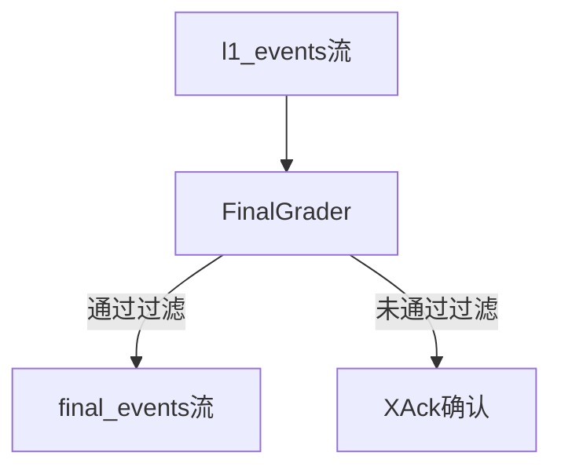
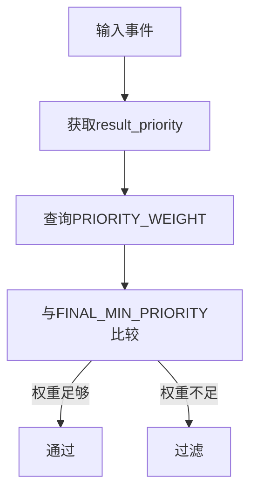
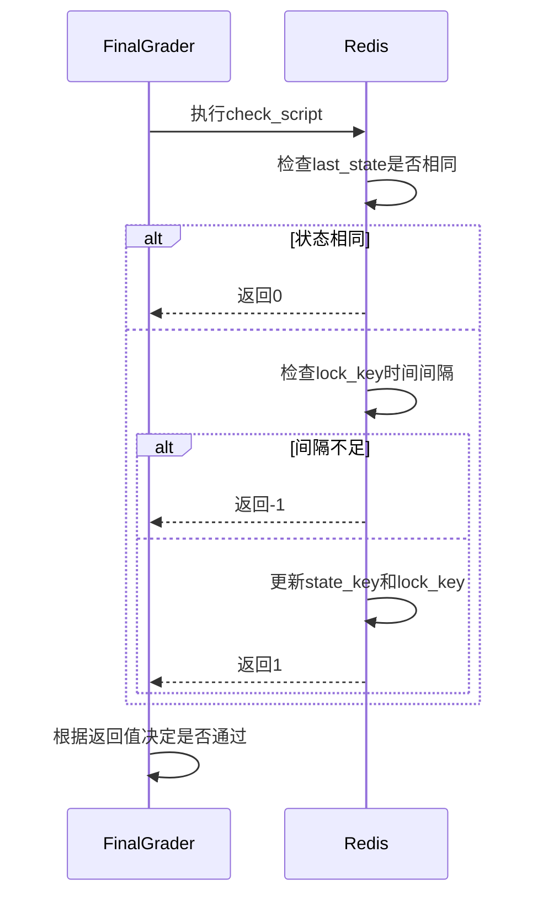
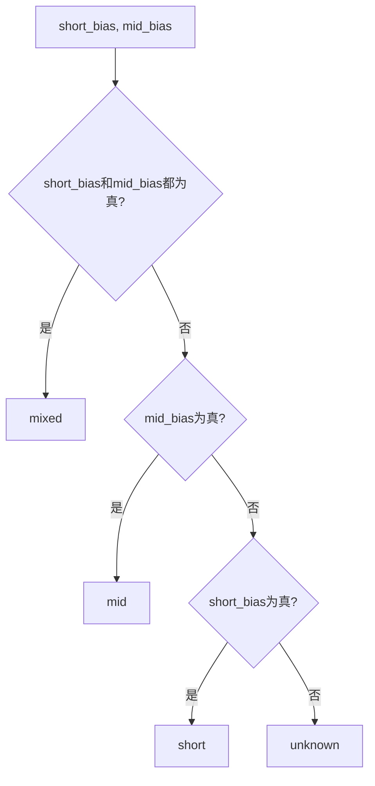
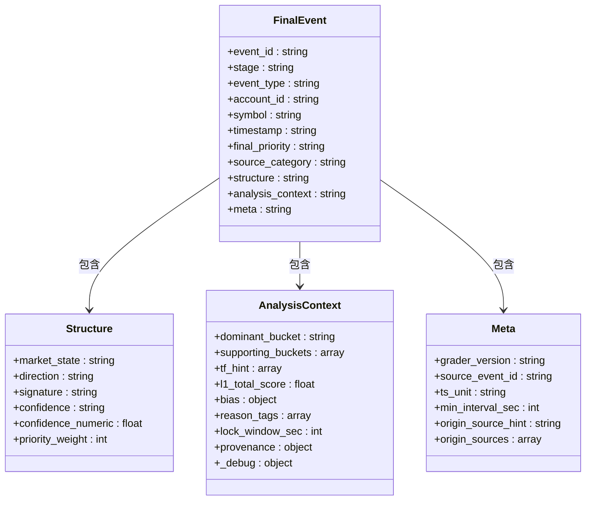
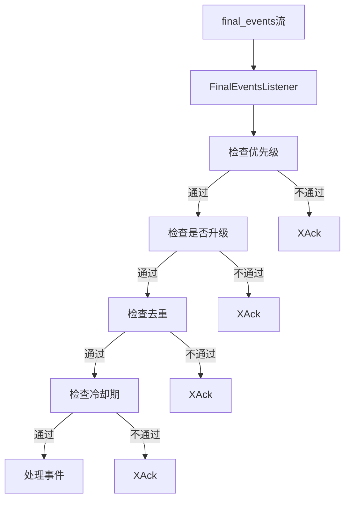

# Final最终事件评分器

<cite>
**本文档引用的文件**  
- [final_grader.py](file://event_center/pipeline/final_grader.py)
- [l1_aggregator.py](file://event_center/pipeline/l1_aggregator.py)
- [l0_processor.py](file://event_center/pipeline/l0_processor.py)
- [config.py](file://event_center/config.py)
- [final_events.py](file://agent_server/utils/watchers/final_events.py)
- [indicator_class_map.yaml](file://event_center/indicators_event/config/indicator_class_map.yaml)
- [tf_buckets.yaml](file://event_center/indicators_event/config/tf_buckets.yaml)
- [tf_weights.yaml](file://event_center/indicators_event/config/tf_weights.yaml)
</cite>

## 目录
1. [简介](#简介)
2. [核心架构与处理流程](#核心架构与处理流程)
3. [三级过滤机制详解](#三级过滤机制详解)
4. [优先级门控机制](#优先级门控机制)
5. [基于Redis Lua脚本的原子化状态去抖](#基于redis-lua脚本的原子化状态去抖)
6. [置信度推断与主导时间框架判断](#置信度推断与主导时间框架判断)
7. [背景依赖检查](#背景依赖检查)
8. [输出结构设计](#输出结构设计)
9. [下游消费端处理](#下游消费端处理)
10. [配置文件与权重表](#配置文件与权重表)

## 简介
Final最终事件评分器是UTaker系统中的关键组件，负责将L1聚合器输出的市场信号进行最终处理，生成标准化的、可供下游智能代理消费的高质量事件。该评分器通过三级过滤机制，确保只有高价值、非重复且背景完整的信号才能通过，从而提升整个系统的决策质量和稳定性。

## 核心架构与处理流程
FinalGrader作为事件处理流水线的最终阶段，接收来自L1聚合器的事件流，经过优先级门控、状态去抖和背景检查三重过滤后，生成最终事件并发布到`final_events`流中。其处理流程如下：
1. 从`l1_events`流中读取事件
2. 进行优先级门控，过滤低优先级信号
3. 检查市场结构和市场状态背景是否就绪
4. 执行原子化的状态去抖逻辑，防止短时间内重复触发
5. 计算置信度和主导时间框架
6. 构建标准化的最终事件并发布



**Diagram sources**
- [final_grader.py](file://event_center/pipeline/final_grader.py#L96-L305)
- [config.py](file://event_center/config.py#L13-L14)

**Section sources**
- [final_grader.py](file://event_center/pipeline/final_grader.py#L96-L305)
- [config.py](file://event_center/config.py#L13-L14)

## 三级过滤机制详解
FinalGrader实施严格的三级过滤机制，确保最终事件的质量和有效性。

### 优先级门控
根据`FINAL_MIN_PRIORITY`配置，过滤掉低于指定优先级的事件。优先级权重由`PRIORITY_WEIGHT`字典定义。

### 背景依赖检查
通过`FINAL_REQUIRE_BACKGROUND`开关控制，确保在推送最终事件前，相关的市场结构和市场状态数据已准备就绪。

### 状态去抖
利用Redis Lua脚本实现原子化的状态去抖，确保相同市场状态在最短间隔内不会重复触发。

**Section sources**
- [final_grader.py](file://event_center/pipeline/final_grader.py#L18-L20)
- [final_grader.py](file://event_center/pipeline/final_grader.py#L153-L168)
- [final_grader.py](file://event_center/pipeline/final_grader.py#L170-L186)

## 优先级门控机制
FinalGrader使用`PRIORITY_WEIGHT`权重表来实现优先级门控机制。该机制基于事件的优先级权重与`FINAL_MIN_PRIORITY`的比较来决定是否通过。

```python
PRIORITY_WEIGHT = {
    "low": 10,
    "medium": 50,
    "high": 80,
    "critical": 100,
}
```

当事件的优先级权重低于`FINAL_MIN_PRIORITY`对应的权重时，该事件将被过滤掉。



**Diagram sources**
- [final_grader.py](file://event_center/pipeline/final_grader.py#L21-L26)
- [final_grader.py](file://event_center/pipeline/final_grader.py#L153-L156)

**Section sources**
- [final_grader.py](file://event_center/pipeline/final_grader.py#L153-L156)

## 基于Redis Lua脚本的原子化状态去抖
FinalGrader使用Redis Lua脚本实现原子化的状态去抖逻辑，确保在高并发环境下也能正确处理状态变更。

### Lua脚本逻辑
```lua
local state_key = KEYS[1]
local lock_key = KEYS[2]
local new_state = ARGV[1]
local new_ts = tonumber(ARGV[2])
local min_int = tonumber(ARGV[3])

local last_state = redis.call('get', state_key)
if last_state and last_state == new_state then
    return 0
end

local last_lock = redis.call('get', lock_key)
if last_lock then
    local last_ts = tonumber(last_lock)
    if last_ts > 0 and (new_ts - last_ts) < min_int then
        return -1
    end
end

redis.call('set', state_key, new_state)
redis.call('set', lock_key, new_ts)
return 1
```

### 去抖机制说明
1. **状态键**：`final:last_state:{account}:{symbol}` 用于存储最后的市场状态
2. **锁键**：`final:lock:{account}:{symbol}:{market_state}:{direction}` 用于实现时间窗口锁
3. **最小间隔**：根据`mid_bias`标志位动态设置，有中期偏好的为900秒，否则为300秒



**Diagram sources**
- [final_grader.py](file://event_center/pipeline/final_grader.py#L40-L63)
- [final_grader.py](file://event_center/pipeline/final_grader.py#L170-L186)

**Section sources**
- [final_grader.py](file://event_center/pipeline/final_grader.py#L40-L63)
- [final_grader.py](file://event_center/pipeline/final_grader.py#L170-L186)

## 置信度推断与主导时间框架判断
FinalGrader实现了置信度推断算法和主导时间框架判断逻辑，为下游代理提供更丰富的决策依据。

### 置信度推断算法
置信度根据`total_score`和`market_state`计算得出：

```python
def _infer_confidence(total_score: float, market_state: str) -> str:
    if market_state == "trend" and abs(total_score) >= 3.0:
        return "high"
    if abs(total_score) >= 1.5:
        return "medium"
    return "low"
```

### 主导时间框架判断
根据短期和中期偏好的布尔值判断主导时间框架：

```python
def _dominant_bucket(short_bias: bool, mid_bias: bool) -> str:
    if short_bias and mid_bias:
        return "mixed"
    if mid_bias:
        return "mid"
    if short_bias:
        return "short"
    return "unknown"
```



**Diagram sources**
- [final_grader.py](file://event_center/pipeline/final_grader.py#L72-L77)
- [final_grader.py](file://event_center/pipeline/final_grader.py#L87-L94)

**Section sources**
- [final_grader.py](file://event_center/pipeline/final_grader.py#L72-L94)

## 背景依赖检查
FinalGrader通过`FINAL_REQUIRE_BACKGROUND`配置项控制是否需要检查背景数据的就绪状态。

### 检查逻辑
```python
if require_bg and exchange and symbol:
    try:
        k1 = f"background:{exchange}:{symbol}:market_structure"
        k2 = f"background:{exchange}:{symbol}:market_state"
        e1 = await self.redis.exists(k1)
        e2 = await self.redis.exists(k2)
    except Exception:
        e1, e2 = 0, 0
    if not (e1 and e2):
        await self.redis.xack(cfg.l1_stream, group, entry_id)
        continue
```

该检查确保在推送最终事件前，相关的市场结构和市场状态数据已由背景服务生成并存储在Redis中。

**Section sources**
- [final_grader.py](file://event_center/pipeline/final_grader.py#L158-L168)
- [market_state.py](file://agent_server/agents/experts/background/market_state.py#L179-L183)

## 输出结构设计
FinalGrader生成的最终事件采用三层输出结构设计，分别为`structure`、`analysis_context`和`meta`，便于下游智能代理消费。

### 结构层(structure)
包含核心的市场状态信息，是下游代理主要读取的内容。

```json
"structure": {
    "market_state": "trend",
    "direction": "bullish",
    "signature": "trend:bearish",
    "confidence": "high",
    "confidence_numeric": 0.8,
    "priority_weight": 80
}
```

### 分析上下文层(analysis_context)
提供结构级的分析上下文，包括主导时间框架、支持性框架、时间框架提示等。

```json
"analysis_context": {
    "dominant_bucket": "mixed",
    "supporting_buckets": ["short", "mid"],
    "tf_hint": ["15m", "30m", "1h"],
    "l1_total_score": 3.5,
    "bias": {"short": true, "mid": true},
    "reason_tags": ["multi_tf_alignment", "high_structure_score"],
    "lock_window_sec": 900,
    "provenance": {"origin_sources": [...], "origin_source_hint": "mixed"},
    "_debug": {...}
}
```

### 元数据层(meta)
包含评分器版本、源事件ID、时间单位等元信息。

```json
"meta": {
    "grader_version": "1.2.0",
    "source_event_id": "...",
    "ts_unit": "ms",
    "min_interval_sec": 900,
    "origin_source_hint": "mixed",
    "origin_sources": [...]
}
```



**Diagram sources**
- [final_grader.py](file://event_center/pipeline/final_grader.py#L253-L290)

**Section sources**
- [final_grader.py](file://event_center/pipeline/final_grader.py#L253-L290)

## 下游消费端处理
下游智能代理通过`FinalEventsListener`监听`final_events`流，对最终事件进行消费处理。

### 消费端过滤机制
1. **优先级门控**：根据`AGENT_MIN_FINAL_PRIORITY`环境变量设置最低消费优先级
2. **升级检查**：可配置`AGENT_ONLY_UPGRADED`仅消费优先级提升的事件
3. **冷却期**：通过`AGENT_FINAL_COOLDOWN_S`设置冷却期，防止频繁触发
4. **去重**：通过`AGENT_FINAL_DEDUP_S`设置去重时间窗口



**Diagram sources**
- [final_events.py](file://agent_server/utils/watchers/final_events.py#L52-L96)

**Section sources**
- [final_events.py](file://agent_server/utils/watchers/final_events.py#L52-L96)

## 配置文件与权重表
FinalGrader依赖多个配置文件和权重表来定义其行为。

### indicator_class_map.yaml
定义了指标插件与类别的映射关系。

```yaml
by_indicator:
  trend:
    - "ma"
    - "ema"
    - "macd"
  momentum:
    - "rsi"
    - "kdj"
    - "williams_r"
  volatility:
    - "boll"
    - "atr"
  structure:
    - "sr"
    - "pattern"
    - "fractal"
by_plugin:
  trend:
    - "ema_macd_combo"
```

### tf_buckets.yaml
定义了时间框架与时间桶的映射关系。

```yaml
short:
  - "1m"
  - "5m"
mid:
  - "15m"
  - "30m"
  - "1h"
long:
  - "2h"
  - "4h"
  - "1d"
```

### tf_weights.yaml
定义了不同时间框架的权重。

```yaml
1m: 1.0
5m: 1.5
15m: 2.0
30m: 2.5
1h: 3.0
2h: 3.5
4h: 4.0
1d: 4.5
```

**Section sources**
- [indicator_class_map.yaml](file://event_center/indicators_event/config/indicator_class_map.yaml)
- [tf_buckets.yaml](file://event_center/indicators_event/config/tf_buckets.yaml)
- [tf_weights.yaml](file://event_center/indicators_event/config/tf_weights.yaml)