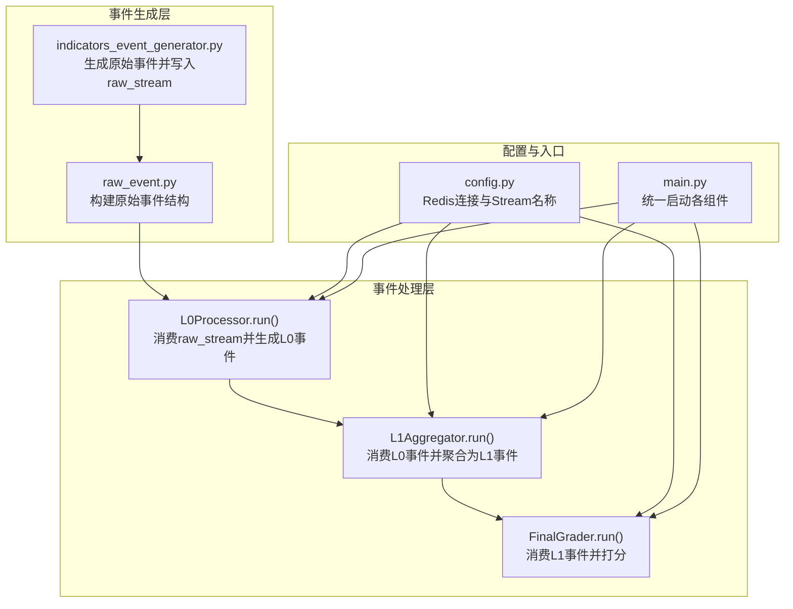
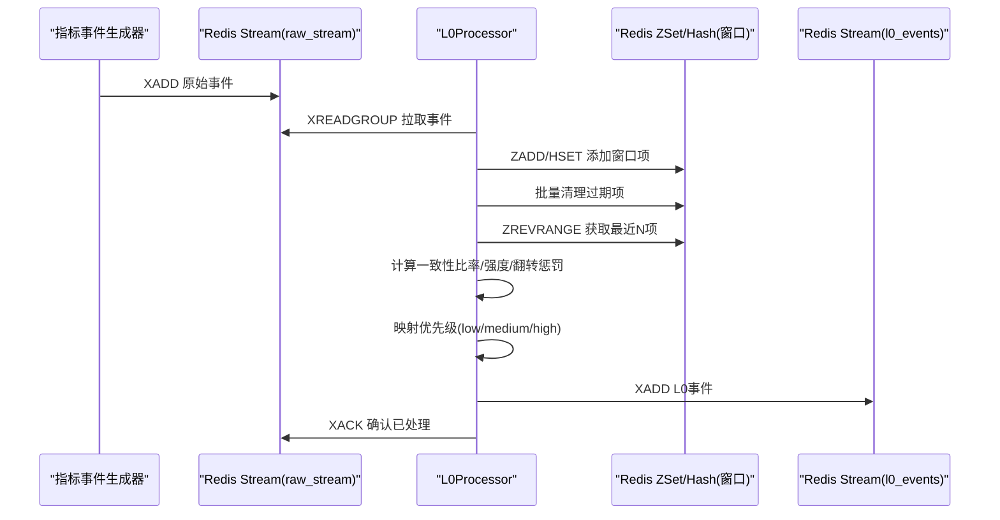
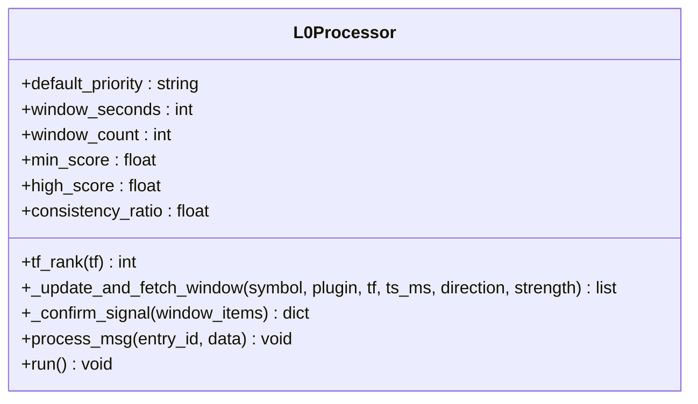
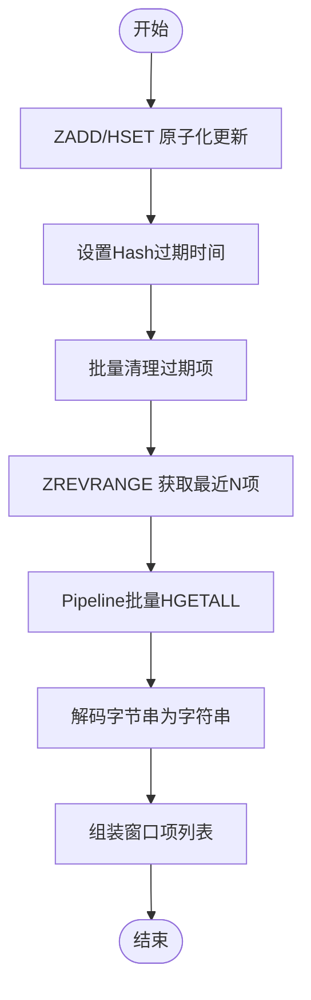
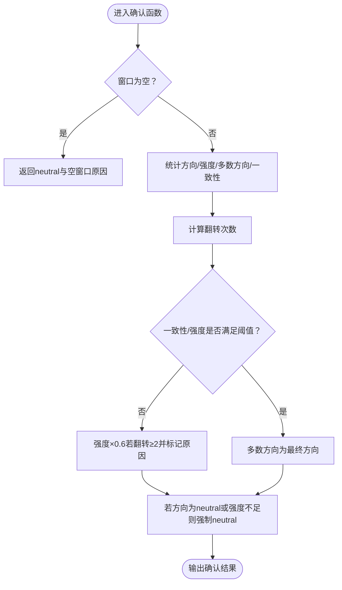
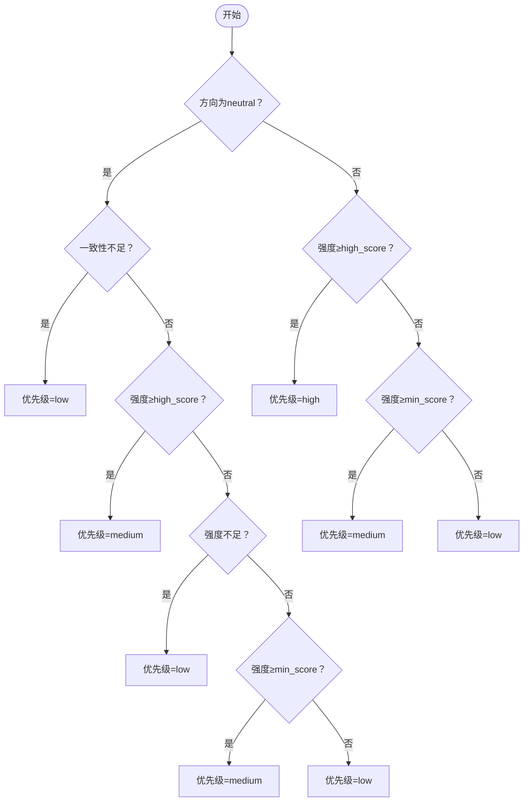
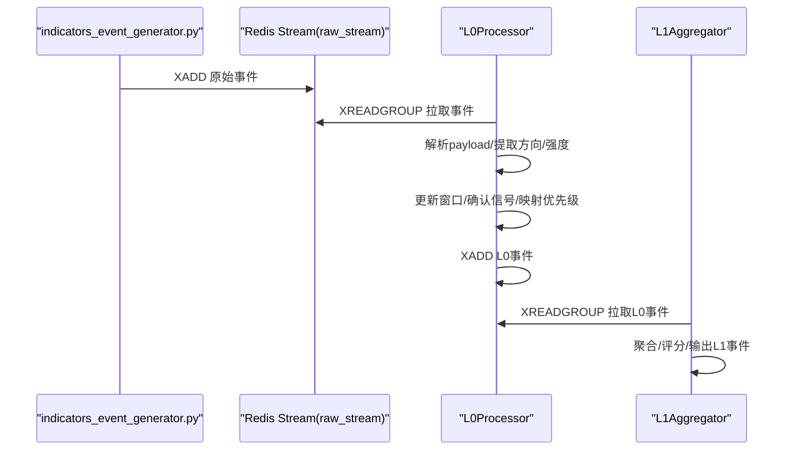
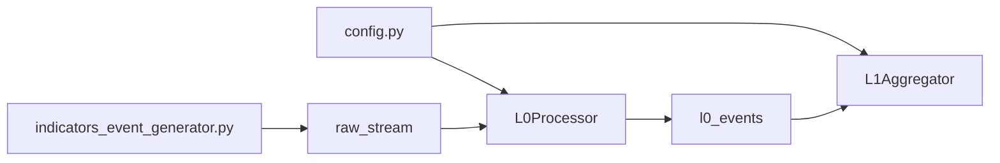

# L0原始事件处理器

<cite>
**本文引用的文件**
- [event_center/pipeline/l0_processor.py](file://event_center/pipeline/l0_processor.py)
- [event_center/indicators_event_generator.py](file://event_center/indicators_event_generator.py)
- [event_center/pipeline/raw_event.py](file://event_center/pipeline/raw_event.py)
- [event_center/config.py](file://event_center/config.py)
- [event_center/main.py](file://event_center/main.py)
- [event_center/pipeline/l1_aggregator.py](file://event_center/pipeline/l1_aggregator.py)
- [event_center/indicators_event/engine/event_engine.py](file://event_center/indicators_event/engine/event_engine.py)
</cite>

## 目录
1. [简介](#简介)
2. [项目结构](#项目结构)
3. [核心组件](#核心组件)
4. [架构总览](#架构总览)
5. [组件详解](#组件详解)
6. [依赖关系分析](#依赖关系分析)
7. [性能考量](#性能考量)
8. [故障排查指南](#故障排查指南)
9. [结论](#结论)
10. [附录](#附录)

## 简介
本文件系统性阐述L0原始事件处理器（L0Processor）的设计与实现，重点覆盖以下方面：
- 如何从原始事件流（raw_stream）消费原始信号并生成基础事件（L0事件）
- 基于时间窗口（300秒）与数量窗口（5条事件）的聚合机制
- 通过一致性比率（consistency_ratio=0.6）与最小强度（min_score=2.0）进行信号确认的逻辑
- 翻转惩罚（flip_count）对信号质量的影响
- 优先级映射规则（low/medium/high）
- Redis ZSet与Hash在窗口管理中的高效应用，包含批量操作（pipeline）、过期清理策略与数据序列化格式
- 异常处理、日志记录与性能调优最佳实践
- 与indicators_event_generator的数据流关系与端到端流程

## 项目结构
L0Processor位于事件中心的流水线层，负责将来自指标事件生成器（indicators_event_generator）的原始事件转换为L0基础事件，并写入L0事件流。其运行依赖Redis Streams与ZSet/Hash结构进行窗口管理与事件持久化。

图表来源
- [event_center/indicators_event_generator.py](file://event_center/indicators_event_generator.py#L155-L248)
- [event_center/pipeline/l0_processor.py](file://event_center/pipeline/l0_processor.py#L266-L301)
- [event_center/pipeline/l1_aggregator.py](file://event_center/pipeline/l1_aggregator.py#L317-L342)
- [event_center/config.py](file://event_center/config.py#L1-L23)
- [event_center/main.py](file://event_center/main.py#L13-L99)

章节来源
- [event_center/pipeline/l0_processor.py](file://event_center/pipeline/l0_processor.py#L1-L305)
- [event_center/indicators_event_generator.py](file://event_center/indicators_event_generator.py#L1-L256)
- [event_center/pipeline/raw_event.py](file://event_center/pipeline/raw_event.py#L1-L55)
- [event_center/config.py](file://event_center/config.py#L1-L23)
- [event_center/main.py](file://event_center/main.py#L1-L106)

## 核心组件
- L0Processor：从raw_stream消费原始事件，维护时间窗口与数量窗口，计算一致性比率与强度阈值，执行翻转惩罚，映射优先级，并输出L0事件至l0_events流。
- indicators_event_generator：从指标引擎产出的信号中生成原始事件，规范化事件类型与强度等级，写入raw_stream。
- raw_event：构建标准化的原始事件结构，包含元数据与payload。
- 配置模块：提供Redis连接参数与各事件流名称。
- 入口脚本：统一启动L0/L1/Final组件与其他消费者。

章节来源
- [event_center/pipeline/l0_processor.py](file://event_center/pipeline/l0_processor.py#L1-L305)
- [event_center/indicators_event_generator.py](file://event_center/indicators_event_generator.py#L1-L256)
- [event_center/pipeline/raw_event.py](file://event_center/pipeline/raw_event.py#L1-L55)
- [event_center/config.py](file://event_center/config.py#L1-L23)
- [event_center/main.py](file://event_center/main.py#L1-L106)

## 架构总览
L0Processor的处理链路如下：
- 从raw_stream读取事件（XREADGROUP），解析payload
- 更新窗口（ZSET成员为时间戳+随机后缀，Hash存储事件字段）
- 清理过期窗口项（批量删除Hash键并修剪ZSET区间）
- 批量读取最近N条事件（ZSET逆序取前N）
- 计算一致性比率、平均强度、翻转次数，判定方向与强度阈值
- 映射优先级（low/medium/high）
- 写入L0事件流（XADD）

图表来源
- [event_center/pipeline/l0_processor.py](file://event_center/pipeline/l0_processor.py#L23-L100)
- [event_center/pipeline/l0_processor.py](file://event_center/pipeline/l0_processor.py#L102-L151)
- [event_center/pipeline/l0_processor.py](file://event_center/pipeline/l0_processor.py#L153-L265)
- [event_center/pipeline/l0_processor.py](file://event_center/pipeline/l0_processor.py#L266-L301)

## 组件详解

### L0Processor类设计与职责
- 初始化参数：默认优先级、时间窗口（秒）、数量窗口（条）、最小强度、高强阈值、一致性比率
- 时间粒度排序：按1m/5m/15m/30m/1h/2h/4h/1d的优先级映射，用于选择主时间框架
- 窗口更新与读取：使用ZSET存储时间戳，Hash存储事件字段；通过pipeline原子化更新与批量清理；批量读取最近N条
- 信号确认：统计方向一致性、平均强度、翻转次数；若一致性低于阈值或强度不足则置为中性；翻转≥2时对强度乘以惩罚系数
- 优先级映射：根据方向是否中性与强度阈值映射为low/medium/high
- 输出：构造L0事件并写入l0_events流

图表来源
- [event_center/pipeline/l0_processor.py](file://event_center/pipeline/l0_processor.py#L9-L305)

章节来源
- [event_center/pipeline/l0_processor.py](file://event_center/pipeline/l0_processor.py#L9-L305)

### 窗口管理：ZSet与Hash的高效应用
- ZSET键命名：l0:win:{symbol}:{plugin}:{tf}
- ZSET成员：{ts_ms}:{随机后缀}，确保同秒内不冲突
- Hash键命名：{key}:{member}
- Hash字段：ts、dir、score
- 原子化更新：pipeline ZADD/HSET/EXPIRE
- 过期清理：批量查询过期成员，逐个删除Hash键，再修剪ZSET区间
- 批量读取：ZREVRANGE取最近N条，pipeline批量HGETALL
- 数据序列化：所有数值型字段以字符串形式存储，便于Redis直接比较与排序

图表来源
- [event_center/pipeline/l0_processor.py](file://event_center/pipeline/l0_processor.py#L23-L100)

章节来源
- [event_center/pipeline/l0_processor.py](file://event_center/pipeline/l0_processor.py#L23-L100)

### 信号确认与翻转惩罚
- 输入：窗口内的事件列表（含方向与强度）
- 计算：
  - 方向集合仅统计bullish/bearish
  - 平均绝对强度 = sum(|score|)/count
  - 多数方向 = bull或bear中占比更高者
  - 一致性比率 = 多数方向计数/总数
  - 翻转次数：相邻方向不同即+1
- 判定：
  - 若一致性比率 < 0.6 或平均强度 < 2.0，则方向置为neutral
  - 若翻转次数 ≥ 2，则将强度乘以0.6作为惩罚
  - 若最终方向为neutral或强度仍低于阈值，则保持neutral
- 输出：包含方向、强度、一致性比率、翻转次数、窗口计数等字段

图表来源
- [event_center/pipeline/l0_processor.py](file://event_center/pipeline/l0_processor.py#L102-L151)

章节来源
- [event_center/pipeline/l0_processor.py](file://event_center/pipeline/l0_processor.py#L102-L151)

### 优先级映射规则（low/medium/high）
- 若方向为neutral：
  - 若一致性不足则优先级设为low
  - 若强度≥high_score(3.0)则优先级medium
  - 若强度不足则优先级low
  - 若强度≥min_score(2.0)则优先级medium
  - 否则low
- 若方向非neutral：
  - 若强度≥high_score(3.0)则优先级high
  - 若强度≥min_score(2.0)则优先级medium
  - 否则low

图表来源
- [event_center/pipeline/l0_processor.py](file://event_center/pipeline/l0_processor.py#L218-L238)

章节来源
- [event_center/pipeline/l0_processor.py](file://event_center/pipeline/l0_processor.py#L218-L238)

### 与indicators_event_generator的数据流关系
- 指标事件生成器通过RedisEventWriter将事件写入raw_stream，事件payload包含技术分析信号、强度、周期等信息
- L0Processor从raw_stream消费事件，解析payload，提取方向与强度，更新窗口并生成L0事件
- L1Aggregator随后从L0事件流消费，进行更高层级的聚合与评分

图表来源
- [event_center/indicators_event_generator.py](file://event_center/indicators_event_generator.py#L155-L248)
- [event_center/pipeline/l0_processor.py](file://event_center/pipeline/l0_processor.py#L266-L301)
- [event_center/pipeline/l1_aggregator.py](file://event_center/pipeline/l1_aggregator.py#L317-L342)

章节来源
- [event_center/indicators_event_generator.py](file://event_center/indicators_event_generator.py#L1-L256)
- [event_center/pipeline/l0_processor.py](file://event_center/pipeline/l0_processor.py#L153-L265)
- [event_center/pipeline/l1_aggregator.py](file://event_center/pipeline/l1_aggregator.py#L317-L342)

## 依赖关系分析
- L0Processor依赖Redis Streams与ZSet/Hash结构进行窗口管理
- 依赖配置模块提供Redis连接与Stream名称
- 与指标事件生成器形成“生产-消费”关系，L0Processor消费raw_stream，L1Aggregator消费L0事件流
- 与L1Aggregator共享窗口管理模式（ZSET+Hash），但L0更关注信号确认与优先级映射

图表来源
- [event_center/config.py](file://event_center/config.py#L1-L23)
- [event_center/pipeline/l0_processor.py](file://event_center/pipeline/l0_processor.py#L266-L301)
- [event_center/pipeline/l1_aggregator.py](file://event_center/pipeline/l1_aggregator.py#L317-L342)
- [event_center/indicators_event_generator.py](file://event_center/indicators_event_generator.py#L155-L248)

章节来源
- [event_center/config.py](file://event_center/config.py#L1-L23)
- [event_center/pipeline/l0_processor.py](file://event_center/pipeline/l0_processor.py#L266-L301)
- [event_center/pipeline/l1_aggregator.py](file://event_center/pipeline/l1_aggregator.py#L317-L342)
- [event_center/indicators_event_generator.py](file://event_center/indicators_event_generator.py#L155-L248)

## 性能考量
- 管道化（pipeline）：
  - 原子化更新：ZADD/HSET/EXPIRE一次性提交，减少RTT
  - 批量清理：先批量删除Hash键，再修剪ZSET区间
  - 批量读取：ZREVRANGE后用pipeline一次性HGETALL
- 过期清理策略：
  - 以时间窗口为基准，定期清理过期Hash键，避免内存膨胀
  - Hash过期时间远大于窗口时间，作为安全兜底
- 序列化与比较：
  - 数值字段以字符串存储，便于Redis排序与比较
- 日志与可观测性：
  - 在关键路径打印事件ID、字段与处理状态，便于定位问题
- 异常处理：
  - 对每个异步操作使用try/except包裹，避免单点失败影响整体
  - 对JSON解析、类型转换、Redis调用进行容错

章节来源
- [event_center/pipeline/l0_processor.py](file://event_center/pipeline/l0_processor.py#L23-L100)
- [event_center/pipeline/l0_processor.py](file://event_center/pipeline/l0_processor.py#L266-L301)

## 故障排查指南
- 无法从raw_stream读取事件：
  - 检查消费组是否存在且未被破坏；确认block与count参数合理
  - 查看XREADGROUP返回是否为空，确认raw_stream中是否有事件
- 事件未写入l0_events：
  - 检查XADD是否成功；确认l0_events流名与配置一致
  - 查看process_msg是否抛出异常并被吞掉
- 窗口数据异常：
  - 检查ZSET键与Hash键命名是否一致
  - 确认过期清理是否生效，避免Hash键堆积
- 信号确认不符合预期：
  - 核对一致性比率与最小强度阈值
  - 检查翻转惩罚是否触发（连续方向变化≥2）
- 优先级映射错误：
  - 核对方向是否为neutral，以及强度阈值分支
- 指标事件未产生：
  - 检查RedisEventWriter的最小级别与去重窗口设置
  - 确认指标引擎是否正常产出

章节来源
- [event_center/pipeline/l0_processor.py](file://event_center/pipeline/l0_processor.py#L266-L301)
- [event_center/indicators_event_generator.py](file://event_center/indicators_event_generator.py#L161-L248)

## 结论
L0Processor通过Redis ZSet与Hash实现了高效的窗口管理，结合管道化与批量操作，在时间窗口与数量窗口约束下完成信号确认、翻转惩罚与优先级映射，并将标准化的L0事件输出至下游。该设计在保证实时性的同时兼顾了可扩展性与可维护性，为后续L1聚合与最终评分提供了高质量的基础事件。

## 附录
- 关键实现位置参考：
  - 窗口更新与读取：[event_center/pipeline/l0_processor.py](file://event_center/pipeline/l0_processor.py#L23-L100)
  - 信号确认与翻转惩罚：[event_center/pipeline/l0_processor.py](file://event_center/pipeline/l0_processor.py#L102-L151)
  - 优先级映射：[event_center/pipeline/l0_processor.py](file://event_center/pipeline/l0_processor.py#L218-L238)
  - 事件消费与输出：[event_center/pipeline/l0_processor.py](file://event_center/pipeline/l0_processor.py#L153-L265)
  - 指标事件生成与写入：[event_center/indicators_event_generator.py](file://event_center/indicators_event_generator.py#L155-L248)
  - 原始事件构建：[event_center/pipeline/raw_event.py](file://event_center/pipeline/raw_event.py#L19-L55)
  - 配置与入口：[event_center/config.py](file://event_center/config.py#L1-L23), [event_center/main.py](file://event_center/main.py#L13-L99)