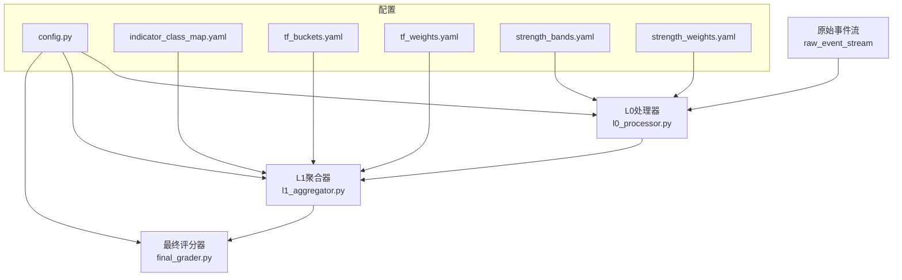
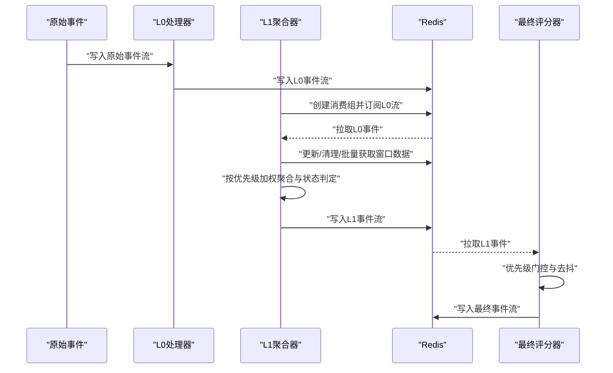
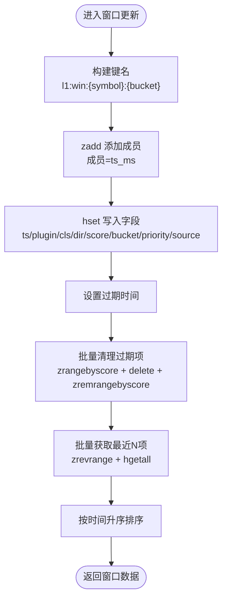
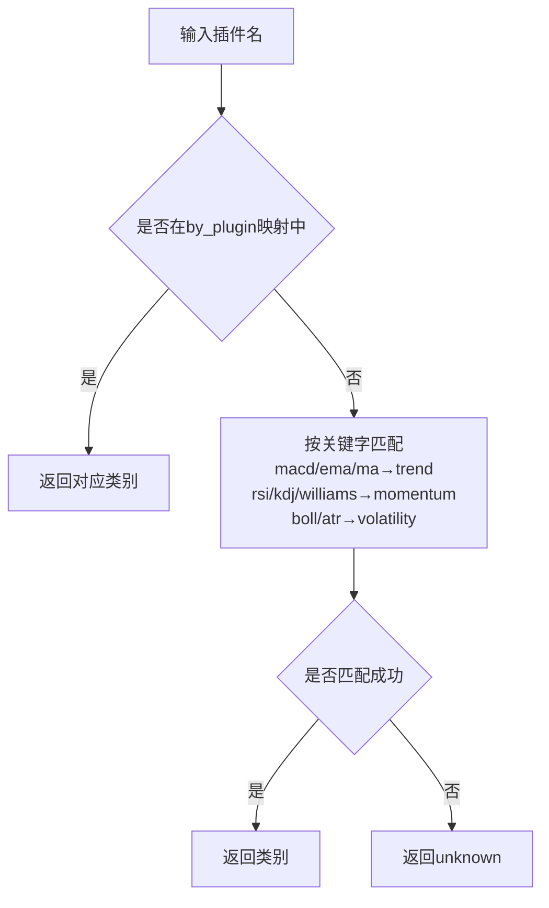
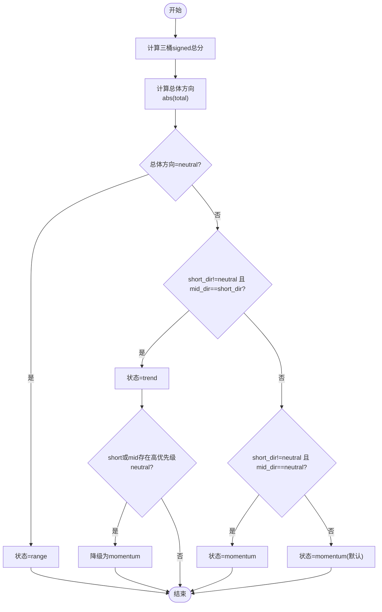
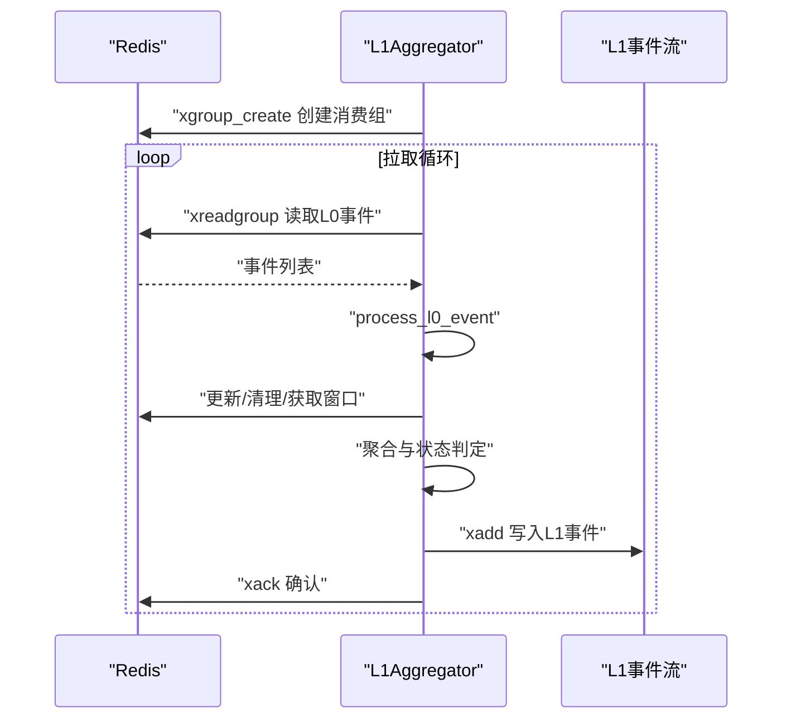
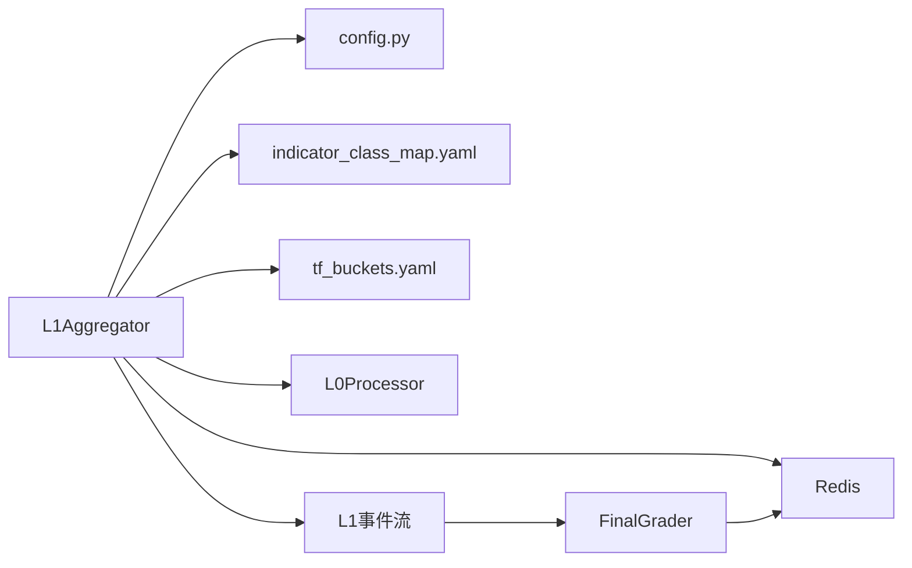

# L1聚合事件处理器

<cite>
**本文引用的文件列表**
- [event_center/pipeline/l1_aggregator.py](file://event_center/pipeline/l1_aggregator.py)
- [event_center/pipeline/l0_processor.py](file://event_center/pipeline/l0_processor.py)
- [event_center/config.py](file://event_center/config.py)
- [event_center/pipeline/final_grader.py](file://event_center/pipeline/final_grader.py)
- [event_center/indicators_event/config/indicator_class_map.yaml](file://event_center/indicators_event/config/indicator_class_map.yaml)
- [event_center/indicators_event/config/tf_buckets.yaml](file://event_center/indicators_event/config/tf_buckets.yaml)
- [event_center/indicators_event/config/tf_weights.yaml](file://event_center/indicators_event/config/tf_weights.yaml)
- [event_center/indicators_event/config/strength_bands.yaml](file://event_center/indicators_event/config/strength_bands.yaml)
- [event_center/indicators_event/config/strength_weights.yaml](file://event_center/indicators_event/config/strength_weights.yaml)
- [tools/read_l1_stream.py](file://tools/read_l1_stream.py)
- [tools/publish_l1_test.py](file://tools/publish_l1_test.py)
- [event_center/main.py](file://event_center/main.py)
</cite>

## 目录
1. [引言](#引言)
2. [项目结构](#项目结构)
3. [核心组件](#核心组件)
4. [架构总览](#架构总览)
5. [详细组件分析](#详细组件分析)
6. [依赖关系分析](#依赖关系分析)
7. [性能考量](#性能考量)
8. [故障排查指南](#故障排查指南)
9. [结论](#结论)
10. [附录](#附录)

## 引言
本文件面向开发者与分析师，系统化解读L1聚合事件处理器（L1Aggregator）如何将来自L0层的多源技术/基本面事件，按时间框架（short/mid/long）进行分桶聚合，形成统一的市场结构分析结果。重点覆盖：
- 时间框架映射规则（_bucket_of_tf）
- 指标分类逻辑（_infer_cls，基于indicator_class_map.yaml）
- 优先级加权的分数累加机制（_aggregate_structure）
- 市场状态判定算法（trend/momentum/range）
- neutral_medium_presence对趋势抑制的作用
- Redis Stream消费、多桶状态窗口维护与结构化输出（indicator_values、component_scores）
- 性能优化策略与错误处理机制

## 项目结构
事件中心采用“原始事件→L0→L1→最终评分”的流水线式设计，L1聚合器位于L0与最终评分之间，负责跨时间框架的结构化聚合与状态输出。

图表来源
- [event_center/main.py](file://event_center/main.py#L1-L106)
- [event_center/pipeline/l0_processor.py](file://event_center/pipeline/l0_processor.py#L1-L305)
- [event_center/pipeline/l1_aggregator.py](file://event_center/pipeline/l1_aggregator.py#L1-L415)
- [event_center/pipeline/final_grader.py](file://event_center/pipeline/final_grader.py#L1-L305)
- [event_center/config.py](file://event_center/config.py#L1-L23)
- [event_center/indicators_event/config/indicator_class_map.yaml](file://event_center/indicators_event/config/indicator_class_map.yaml#L1-L22)
- [event_center/indicators_event/config/tf_buckets.yaml](file://event_center/indicators_event/config/tf_buckets.yaml#L1-L12)
- [event_center/indicators_event/config/tf_weights.yaml](file://event_center/indicators_event/config/tf_weights.yaml#L1-L9)
- [event_center/indicators_event/config/strength_bands.yaml](file://event_center/indicators_event/config/strength_bands.yaml#L1-L3)
- [event_center/indicators_event/config/strength_weights.yaml](file://event_center/indicators_event/config/strength_weights.yaml#L1-L4)

章节来源
- [event_center/main.py](file://event_center/main.py#L1-L106)
- [event_center/config.py](file://event_center/config.py#L1-L23)

## 核心组件
- L1Aggregator：负责Redis Stream消费、按时间框架分桶、优先级加权聚合、市场状态判定与结构化输出。
- L0Processor：负责将原始事件窗口化、一致性与强度阈值校验，输出L0信号。
- FinalGrader：负责优先级门控、状态+时间去抖、结构化上下文打包，输出最终事件。
- 配置模块：提供Redis连接参数与流名称；指标分类、时间框架映射、强度带宽等配置。

章节来源
- [event_center/pipeline/l1_aggregator.py](file://event_center/pipeline/l1_aggregator.py#L1-L415)
- [event_center/pipeline/l0_processor.py](file://event_center/pipeline/l0_processor.py#L1-L305)
- [event_center/pipeline/final_grader.py](file://event_center/pipeline/final_grader.py#L1-L305)
- [event_center/config.py](file://event_center/config.py#L1-L23)

## 架构总览
L1聚合器在Redis中维护每个symbol在short/mid/long三个时间框架的滑动窗口，窗口内按优先级加权累计各指标的正负得分，再综合三桶得分判定市场状态与方向，并输出到L1流供下游FinalGrader消费。

图表来源
- [event_center/pipeline/l1_aggregator.py](file://event_center/pipeline/l1_aggregator.py#L317-L411)
- [event_center/pipeline/l0_processor.py](file://event_center/pipeline/l0_processor.py#L153-L300)
- [event_center/pipeline/final_grader.py](file://event_center/pipeline/final_grader.py#L96-L301)
- [event_center/config.py](file://event_center/config.py#L1-L23)

## 详细组件分析

### 时间框架映射与窗口管理
- 时间框架映射规则（_bucket_of_tf）：将具体时间周期映射到short/mid/long三档，用于后续分桶聚合。
- 窗口键命名规范：l1:win:{symbol}:{bucket}，成员为毫秒时间戳，哈希键为l1:win:{symbol}:{bucket}:{member}，包含插件名、类别、方向、得分、桶、优先级、来源等字段。
- 窗口维护策略：
  - 原子更新：使用pipeline保证zadd与hset的原子性。
  - 批量清理：按时间阈值批量删除过期哈希键并修剪zset范围。
  - 批量获取：按zrevrange取最近N条，再批量hgetall，减少RTT。
  - 过期策略：哈希键设置过期时间，避免内存膨胀。

图表来源
- [event_center/pipeline/l1_aggregator.py](file://event_center/pipeline/l1_aggregator.py#L68-L150)

章节来源
- [event_center/pipeline/l1_aggregator.py](file://event_center/pipeline/l1_aggregator.py#L53-L150)

### 指标分类逻辑（_infer_cls）
- 优先级：先按by_plugin映射，若未命中则按插件名关键字匹配到趋势/动量/波动率等类别，否则标记为unknown。
- 配置来源：indicator_class_map.yaml定义了by_indicator与by_plugin两类映射规则，L1Aggregator加载后用于分类。

图表来源
- [event_center/pipeline/l1_aggregator.py](file://event_center/pipeline/l1_aggregator.py#L22-L51)
- [event_center/indicators_event/config/indicator_class_map.yaml](file://event_center/indicators_event/config/indicator_class_map.yaml#L1-L22)

章节来源
- [event_center/pipeline/l1_aggregator.py](file://event_center/pipeline/l1_aggregator.py#L22-L51)
- [event_center/indicators_event/config/indicator_class_map.yaml](file://event_center/indicators_event/config/indicator_class_map.yaml#L1-L22)

### 优先级加权与分数累加机制
- 优先级权重：low/medium/high/critical分别乘以1.0/1.2/1.5/2.0。
- 加权计算：final_score = score × priority_multiplier；方向为bullish取正值，bearish取负值，neutral跳过（但高优先级neutral会触发中性抑制）。
- 组件分数：按类别（cls）累加signed分数，便于下游分析各指标类别的贡献。
- 桶方向：对short/mid/long三桶分别求和，绝对值小于带宽即为neutral，否则按符号确定方向。
- 总体方向：三桶合计得分绝对值小于全局中性带则为neutral，否则按符号确定方向。

章节来源
- [event_center/pipeline/l1_aggregator.py](file://event_center/pipeline/l1_aggregator.py#L197-L315)

### 市场状态判定算法
- 判定流程：
  - 若总体方向为neutral，则状态为range；
  - 否则，若short_dir非neutral且mid_dir与short_dir一致，则状态为trend；
  - 若short_dir非neutral且mid_dir为neutral，则状态为momentum；
  - 其他情况默认为momentum，以避免长周期主导导致误判。
- 中性抑制：当short或mid桶出现高优先级neutral事件时，trend会被降级为momentum，体现对“中性信号”的抑制作用。
- 短/中/长期方向：分别由short_dir/mid_dir/long_dir给出，配合short_term_bias/mid_term_bias指示是否存在趋势偏移。

图表来源
- [event_center/pipeline/l1_aggregator.py](file://event_center/pipeline/l1_aggregator.py#L255-L280)

章节来源
- [event_center/pipeline/l1_aggregator.py](file://event_center/pipeline/l1_aggregator.py#L255-L280)

### Redis Stream消费与输出
- 消费组与流：L1聚合器在启动时尝试创建消费组，从L0流读取事件，逐条处理并ack。
- 处理流程：提取symbol、类型、L0方向与强度、主时间框架、优先级与来源，构造窗口项，更新当前桶窗口，再汇总所有桶，生成L1事件并写入L1流，同时写入last缓存键以便快速查询最新状态。
- 输出字段：包含方向、总分、市场状态、短期/中期偏移、桶方向与得分、组件分数、指标明细、来源集合与提示等。

图表来源
- [event_center/pipeline/l1_aggregator.py](file://event_center/pipeline/l1_aggregator.py#L317-L411)

章节来源
- [event_center/pipeline/l1_aggregator.py](file://event_center/pipeline/l1_aggregator.py#L317-L411)

### 与L0的关系与数据衔接
- L0负责将原始事件按插件+时间框架窗口化，计算一致性比率、翻转次数、强度阈值与方向，输出L0事件（含l0_direction、l0_score等）。
- L1从L0事件中抽取方向、强度、主时间框架、优先级与来源，按主时间框架推导桶位，进行跨桶聚合与状态判定。

章节来源
- [event_center/pipeline/l0_processor.py](file://event_center/pipeline/l0_processor.py#L102-L151)
- [event_center/pipeline/l0_processor.py](file://event_center/pipeline/l0_processor.py#L153-L265)
- [event_center/pipeline/l1_aggregator.py](file://event_center/pipeline/l1_aggregator.py#L317-L365)

### 结构化输出与下游集成
- L1输出包含：
  - 结构级字段：direction、total_score、market_state、short_term_bias、mid_term_bias、short_dir、mid_dir、long_dir、bucket_*_score
  - 组件级字段：component_scores（JSON字符串）、indicator_values（JSON数组）
  - 来源信息：origin_sources（JSON数组）、origin_source_hint（字符串）
- FinalGrader读取L1事件，进行优先级门控、状态+时间去抖、结构化上下文打包，输出最终事件流。

章节来源
- [event_center/pipeline/l1_aggregator.py](file://event_center/pipeline/l1_aggregator.py#L341-L381)
- [event_center/pipeline/final_grader.py](file://event_center/pipeline/final_grader.py#L146-L301)

## 依赖关系分析
- L1Aggregator依赖：
  - Redis连接与流配置（config.py）
  - 指标分类映射（indicator_class_map.yaml）
  - 时间框架映射（tf_buckets.yaml）
  - L0事件格式（l0_processor.py输出字段）
- FinalGrader依赖：
  - L1事件格式（字段约定）
  - 背景就绪键（market_structure、market_state）

图表来源
- [event_center/pipeline/l1_aggregator.py](file://event_center/pipeline/l1_aggregator.py#L1-L415)
- [event_center/pipeline/l0_processor.py](file://event_center/pipeline/l0_processor.py#L1-L305)
- [event_center/pipeline/final_grader.py](file://event_center/pipeline/final_grader.py#L1-L305)
- [event_center/config.py](file://event_center/config.py#L1-L23)

章节来源
- [event_center/pipeline/l1_aggregator.py](file://event_center/pipeline/l1_aggregator.py#L1-L415)
- [event_center/pipeline/l0_processor.py](file://event_center/pipeline/l0_processor.py#L1-L305)
- [event_center/pipeline/final_grader.py](file://event_center/pipeline/final_grader.py#L1-L305)
- [event_center/config.py](file://event_center/config.py#L1-L23)

## 性能考量
- Redis操作优化：
  - 使用pipeline进行原子更新与批量删除，降低网络往返。
  - 批量获取窗口项，减少多次网络请求。
  - 设置哈希键过期时间，避免无限增长。
- 数据结构选择：
  - 使用有序集合zset存储时间戳，便于按时间范围裁剪与排序。
  - 使用哈希hset存储每条记录的完整字段，便于批量读取。
- 流处理：
  - 使用xreadgroup分组消费，支持ack确认，避免重复处理。
  - 控制每次拉取数量与阻塞等待时间，平衡吞吐与延迟。
- 内存与CPU：
  - 限制窗口长度与时间范围，避免内存膨胀。
  - 对空窗口与异常输入进行快速失败，减少无效计算。

章节来源
- [event_center/pipeline/l1_aggregator.py](file://event_center/pipeline/l1_aggregator.py#L68-L150)
- [event_center/pipeline/l1_aggregator.py](file://event_center/pipeline/l1_aggregator.py#L383-L411)
- [event_center/pipeline/l0_processor.py](file://event_center/pipeline/l0_processor.py#L23-L100)

## 故障排查指南
- Redis连接问题：
  - 检查环境变量REDIS_HOST/REDIS_PORT/REDIS_DB/REDIS_PASSWORD是否正确，确认config.py生成的redis_url可用。
- 流不存在或消费组未创建：
  - L1在启动时尝试创建消费组，若已存在则忽略；确认L0与L1流名称一致。
- 事件格式异常：
  - L1对payload进行JSON解析，失败时回退为空对象；确保上游事件格式正确。
- 窗口数据为空：
  - 当前桶无数据或窗口清理后为空时，L1返回默认结构；检查上游L0是否正常写入。
- 输出为空或状态异常：
  - 检查优先级权重、中性带与桶带宽设置；确认neutral_medium_presence逻辑是否触发。
- 调试工具：
  - 使用read_l1_stream.py查看L1事件流最近条目。
  - 使用publish_l1_test.py发布一条测试L1事件，验证下游FinalGrader处理链路。

章节来源
- [event_center/config.py](file://event_center/config.py#L1-L23)
- [event_center/pipeline/l1_aggregator.py](file://event_center/pipeline/l1_aggregator.py#L383-L411)
- [tools/read_l1_stream.py](file://tools/read_l1_stream.py#L1-L22)
- [tools/publish_l1_test.py](file://tools/publish_l1_test.py#L1-L43)

## 结论
L1聚合事件处理器通过“时间框架分桶+优先级加权+一致性判定”的组合，实现了对多源事件的稳健聚合与状态输出。其关键优势在于：
- 明确的时间框架映射与窗口管理，确保跨时间尺度的一致性；
- 优先级加权与中性抑制机制，有效提升趋势识别的鲁棒性；
- 结构化输出（component_scores、indicator_values）为下游分析提供可追溯的证据；
- Redis流水线与批处理优化，保障高吞吐场景下的稳定性。

## 附录

### 关键配置与含义
- 指标分类映射（indicator_class_map.yaml）：定义by_indicator与by_plugin两类映射，决定指标类别（trend/momentum/volatility/structure）。
- 时间框架映射（tf_buckets.yaml）：定义short/mid/long三档对应的具体时间周期。
- 强度带宽（strength_bands.yaml）：弱/中强度阈值，用于L0强度门控。
- 强度权重（strength_weights.yaml）：强度等级到权重的映射，用于L0优先级计算。

章节来源
- [event_center/indicators_event/config/indicator_class_map.yaml](file://event_center/indicators_event/config/indicator_class_map.yaml#L1-L22)
- [event_center/indicators_event/config/tf_buckets.yaml](file://event_center/indicators_event/config/tf_buckets.yaml#L1-L12)
- [event_center/indicators_event/config/strength_bands.yaml](file://event_center/indicators_event/config/strength_bands.yaml#L1-L3)
- [event_center/indicators_event/config/strength_weights.yaml](file://event_center/indicators_event/config/strength_weights.yaml#L1-L4)