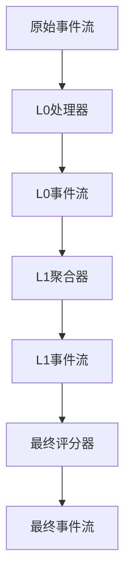
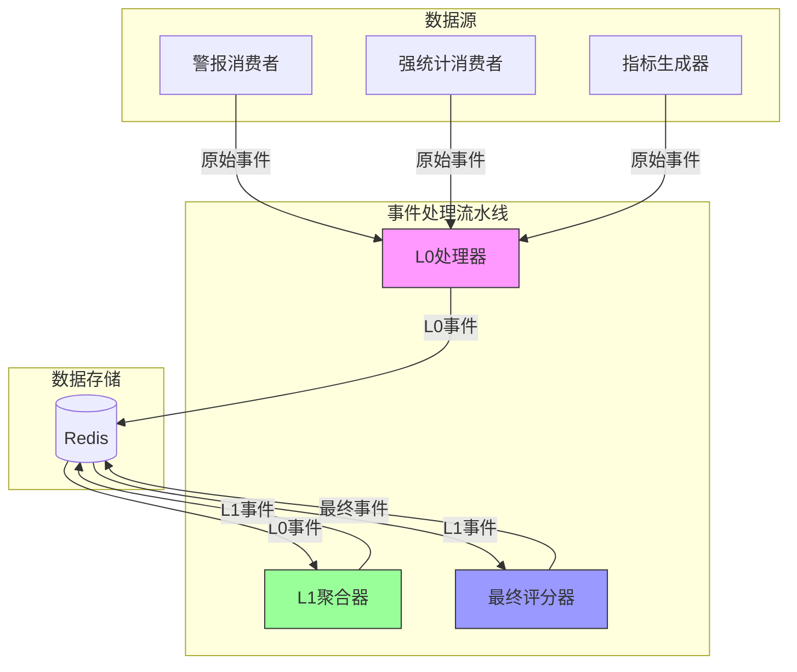
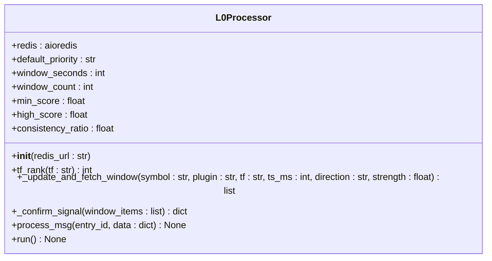
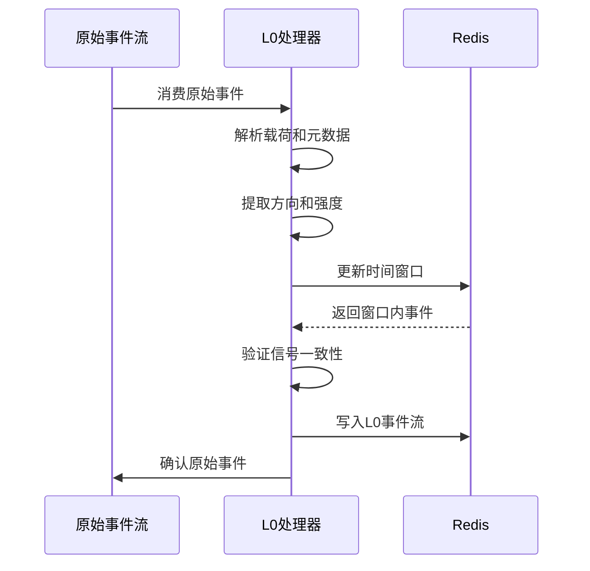
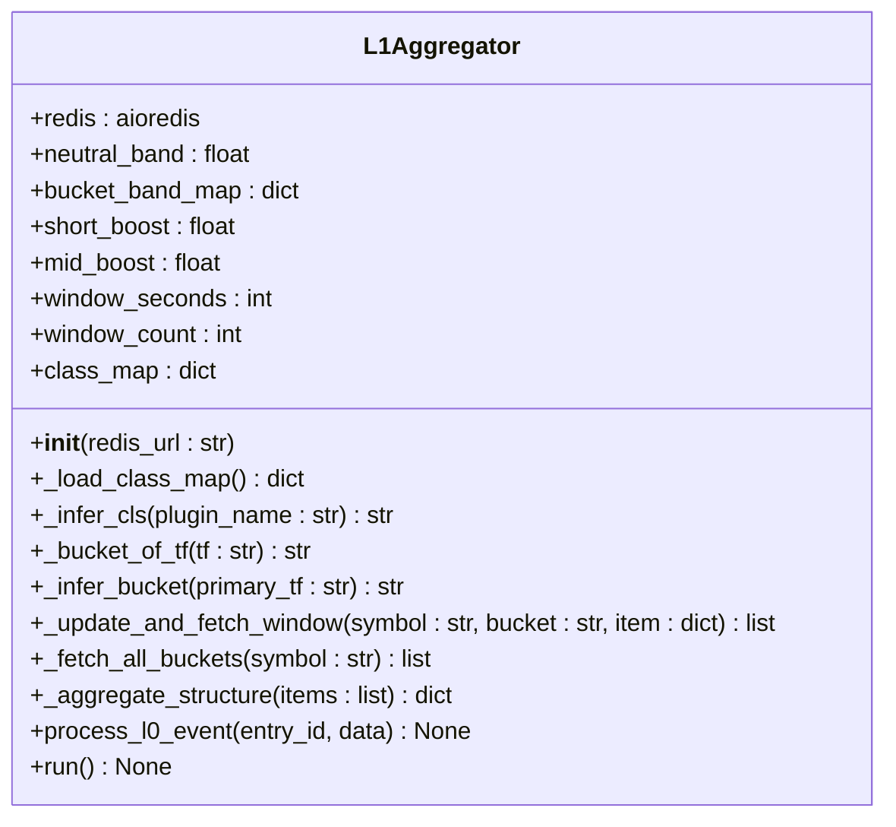
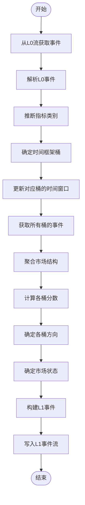
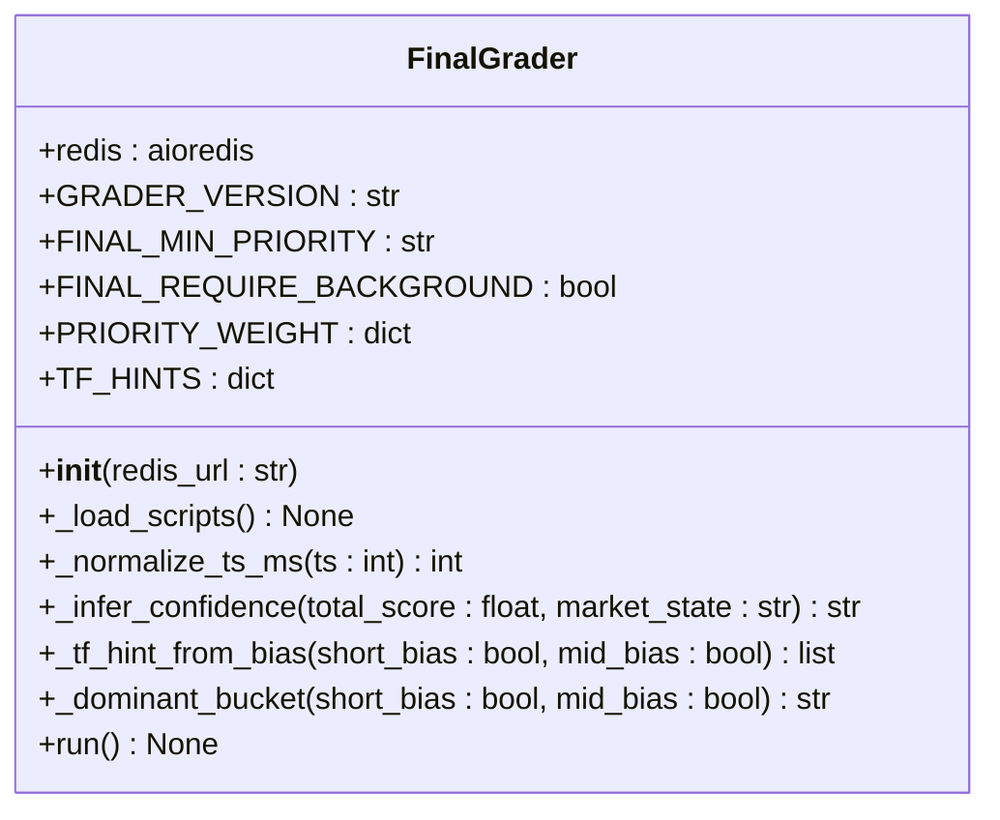
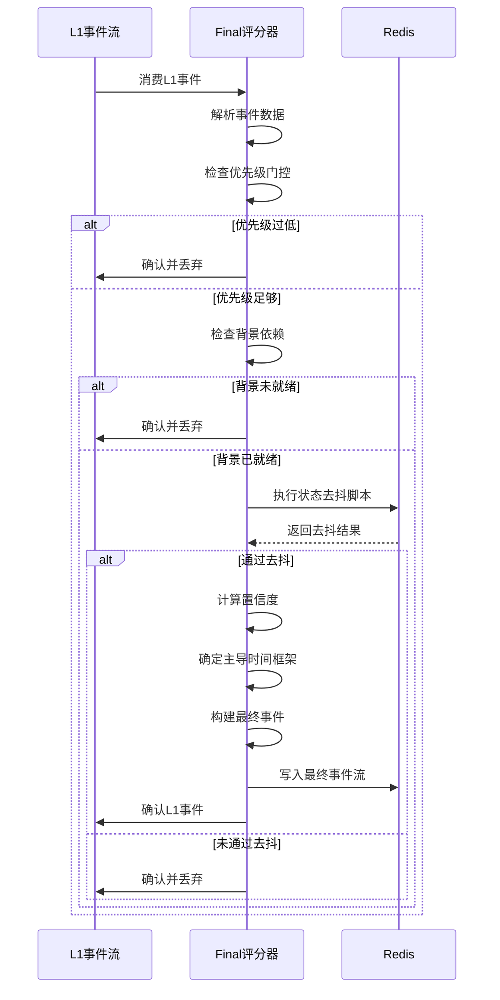
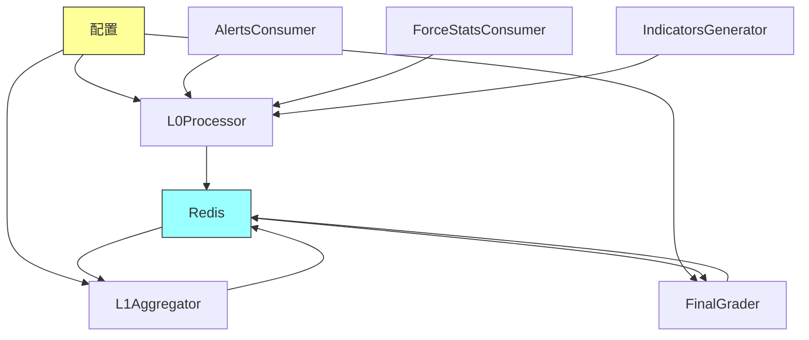

# 事件处理流水线

<cite>
**本文档引用的文件**  
- [l0_processor.py](file://event_center/pipeline/l0_processor.py)
- [l1_aggregator.py](file://event_center/pipeline/l1_aggregator.py)
- [final_grader.py](file://event_center/pipeline/final_grader.py)
- [raw_event.py](file://event_center/pipeline/raw_event.py)
- [config.py](file://event_center/config.py)
- [indicator_class_map.yaml](file://event_center/indicators_event/config/indicator_class_map.yaml)
- [tf_buckets.yaml](file://event_center/indicators_event/config/tf_buckets.yaml)
- [tf_weights.yaml](file://event_center/indicators_event/config/tf_weights.yaml)
- [alerts_consumer.py](file://event_center/alerts_consumer.py)
- [force_stats_consumer.py](file://event_center/force_stats_consumer.py)
- [main.py](file://event_center/main.py)
</cite>

## 目录
1. [简介](#简介)
2. [项目结构](#项目结构)
3. [核心组件](#核心组件)
4. [架构概述](#架构概述)
5. [详细组件分析](#详细组件分析)
6. [依赖分析](#依赖分析)
7. [性能考量](#性能考量)
8. [故障排除指南](#故障排除指南)
9. [结论](#结论)

## 简介
本文档详细阐述了事件处理流水线的三级处理机制，包括L0原始事件、L1聚合事件和Final最终事件的生成过程。系统通过消费原始信号流，经过多级处理和验证，最终生成标准化的市场结构事件，供下游智能代理消费。

## 项目结构
事件处理流水线位于`event_center/pipeline/`目录下，包含三个核心处理组件：L0Processor、L1Aggregator和FinalGrader。这些组件通过Redis Stream进行解耦通信，形成一个完整的事件处理流水线。

**图示来源**
- [l0_processor.py](file://event_center/pipeline/l0_processor.py#L266-L304)
- [l1_aggregator.py](file://event_center/pipeline/l1_aggregator.py#L383-L415)
- [final_grader.py](file://event_center/pipeline/final_grader.py#L96-L305)

**本节来源**
- [l0_processor.py](file://event_center/pipeline/l0_processor.py)
- [l1_aggregator.py](file://event_center/pipeline/l1_aggregator.py)
- [final_grader.py](file://event_center/pipeline/final_grader.py)

## 核心组件
事件处理流水线由三个核心组件构成：L0Processor负责从原始流消费信号并生成基础事件；L1Aggregator对L0事件进行跨时间框架聚合，计算市场结构状态；FinalGrader实施优先级门控和状态去抖，生成标准化的最终事件。

**本节来源**
- [l0_processor.py](file://event_center/pipeline/l0_processor.py#L9-L305)
- [l1_aggregator.py](file://event_center/pipeline/l1_aggregator.py#L11-L415)
- [final_grader.py](file://event_center/pipeline/final_grader.py#L9-L305)

## 架构概述
事件处理流水线采用分层处理架构，将事件处理过程分为三个逻辑层级，每个层级专注于特定的处理任务，通过Redis Stream实现组件间的解耦和异步通信。

**图示来源**
- [main.py](file://event_center/main.py#L13-L98)
- [config.py](file://event_center/config.py#L5-L23)

## 详细组件分析

### L0处理器分析
L0Processor是事件处理流水线的第一级，负责从原始事件流消费信号，通过时间窗口聚合与一致性验证生成基础事件。

#### L0处理器类图

**图示来源**
- [l0_processor.py](file://event_center/pipeline/l0_processor.py#L9-L305)

#### L0事件处理流程

**图示来源**
- [l0_processor.py](file://event_center/pipeline/l0_processor.py#L153-L265)
- [raw_event.py](file://event_center/pipeline/raw_event.py#L19-L55)

**本节来源**
- [l0_processor.py](file://event_center/pipeline/l0_processor.py#L9-L305)
- [raw_event.py](file://event_center/pipeline/raw_event.py#L6-L55)

### L1聚合器分析
L1Aggregator是事件处理流水线的第二级，负责基于多时间框架对L0事件进行跨桶聚合，计算市场结构状态并输出结构化分析结果。

#### L1聚合器类图

**图示来源**
- [l1_aggregator.py](file://event_center/pipeline/l1_aggregator.py#L11-L415)

#### L1聚合流程

**图示来源**
- [l1_aggregator.py](file://event_center/pipeline/l1_aggregator.py#L317-L382)

**本节来源**
- [l1_aggregator.py](file://event_center/pipeline/l1_aggregator.py#L11-L415)
- [indicator_class_map.yaml](file://event_center/indicators_event/config/indicator_class_map.yaml)
- [tf_buckets.yaml](file://event_center/indicators_event/config/tf_buckets.yaml)

### Final评分器分析
FinalGrader是事件处理流水线的第三级，负责实施优先级门控、状态去抖与背景依赖检查，生成下游智能代理可消费的标准化最终事件。

#### Final评分器类图

**图示来源**
- [final_grader.py](file://event_center/pipeline/final_grader.py#L9-L305)

#### Final评分流程

**图示来源**
- [final_grader.py](file://event_center/pipeline/final_grader.py#L96-L305)

**本节来源**
- [final_grader.py](file://event_center/pipeline/final_grader.py#L9-L305)
- [config.py](file://event_center/config.py#L5-L23)

## 依赖分析
事件处理流水线的各个组件之间通过Redis Stream进行通信，实现了松耦合的设计。配置通过环境变量和配置文件集中管理，确保了系统的可配置性和灵活性。

**图示来源**
- [config.py](file://event_center/config.py#L5-L23)
- [main.py](file://event_center/main.py#L13-L98)

**本节来源**
- [config.py](file://event_center/config.py#L5-L23)
- [main.py](file://event_center/main.py#L13-L98)

## 性能考量
事件处理流水线在设计时充分考虑了性能优化，采用了多种技术来提高处理效率和系统吞吐量。

### Redis Pipeline批量操作
所有Redis操作都使用Pipeline进行批量处理，减少了网络往返次数，提高了操作效率。在L0Processor和L1Aggregator中，更新窗口和清理过期数据的操作都使用了事务性Pipeline。

### 时间窗口优化
系统使用ZSET数据结构来维护时间窗口，通过zadd、zrangebyscore和zremrangebyscore等操作高效地管理窗口内的事件。批量清理和批量获取操作进一步优化了性能。

### 并发处理
主程序通过asyncio.gather并发启动所有处理组件，实现了真正的并行处理。每个处理组件都使用异步I/O，能够高效处理大量事件。

**本节来源**
- [l0_processor.py](file://event_center/pipeline/l0_processor.py#L29-L35)
- [l1_aggregator.py](file://event_center/pipeline/l1_aggregator.py#L76-L89)
- [main.py](file://event_center/main.py#L84-L98)

## 故障排除指南
### 常见问题及解决方案
1. **事件处理延迟**：检查Redis连接是否正常，确认各处理组件是否正常运行。
2. **事件丢失**：确认消费组的确认机制是否正确，检查日志中的错误信息。
3. **内存占用过高**：检查时间窗口配置，确保过期数据被及时清理。

### 调试日志最佳实践
系统在关键处理步骤都添加了详细的日志输出，包括事件处理、错误信息和性能指标。通过分析这些日志，可以快速定位和解决问题。

**本节来源**
- [l0_processor.py](file://event_center/pipeline/l0_processor.py#L294-L299)
- [l1_aggregator.py](file://event_center/pipeline/l1_aggregator.py#L404-L409)
- [final_grader.py](file://event_center/pipeline/final_grader.py#L176-L182)

## 结论
事件处理流水线通过三级处理机制，实现了从原始信号到标准化市场事件的转换。系统设计合理，性能优化充分，能够稳定高效地处理大量事件，为下游智能代理提供可靠的市场分析结果。