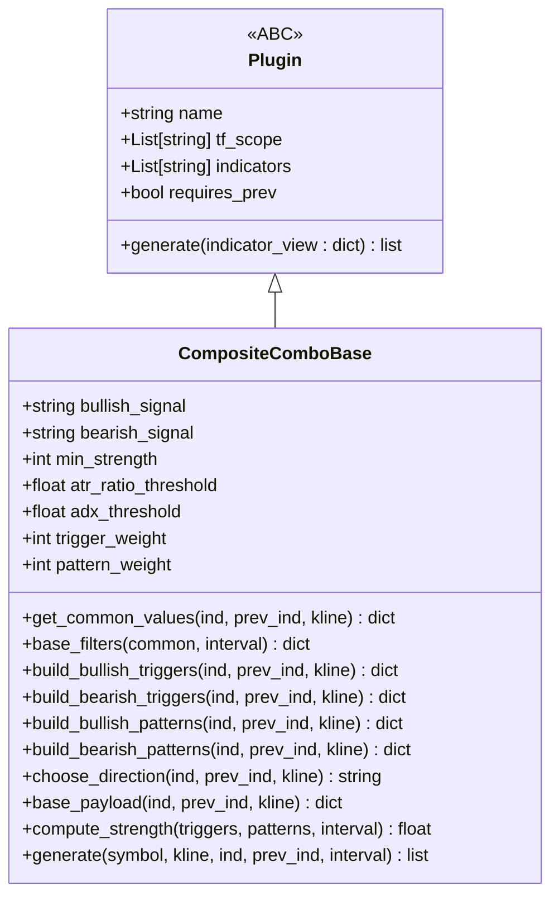
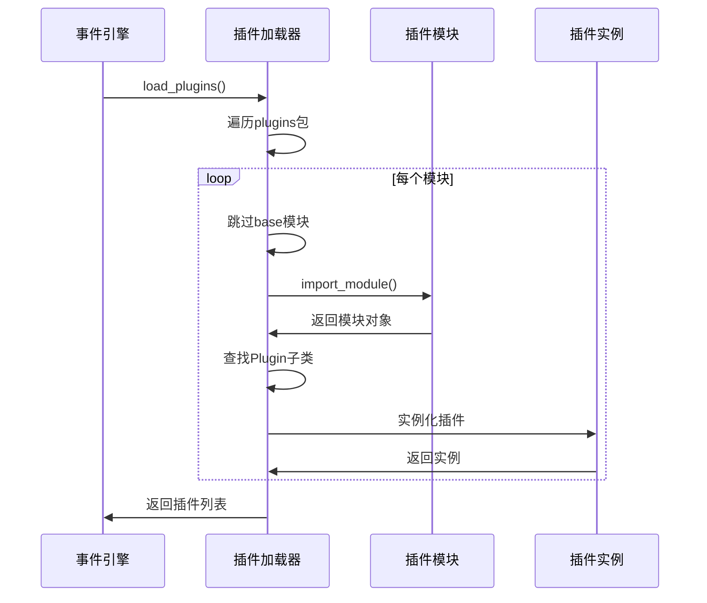
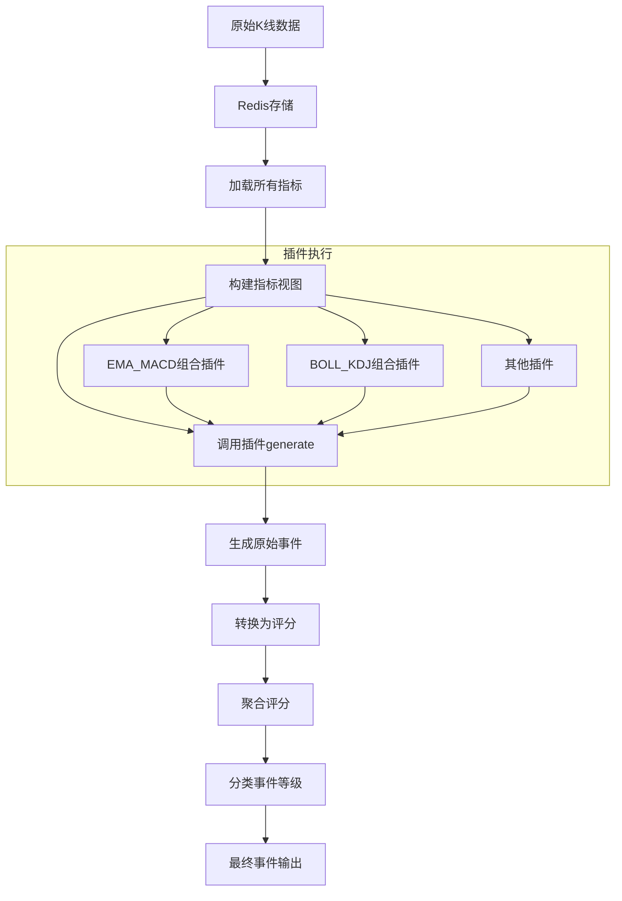
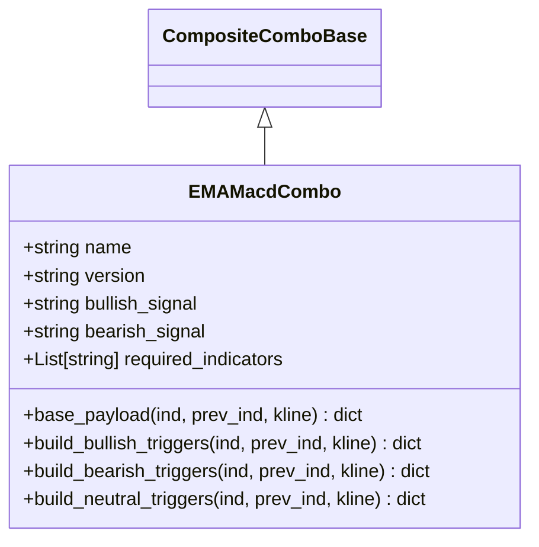
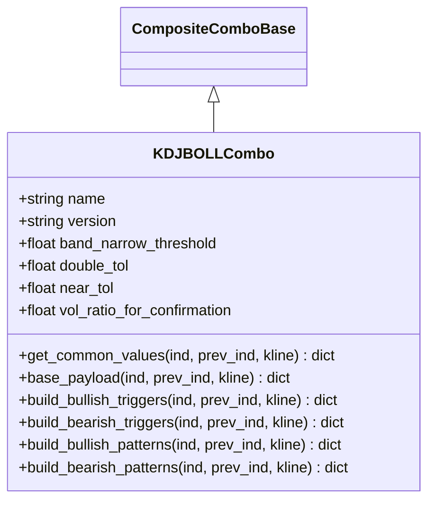
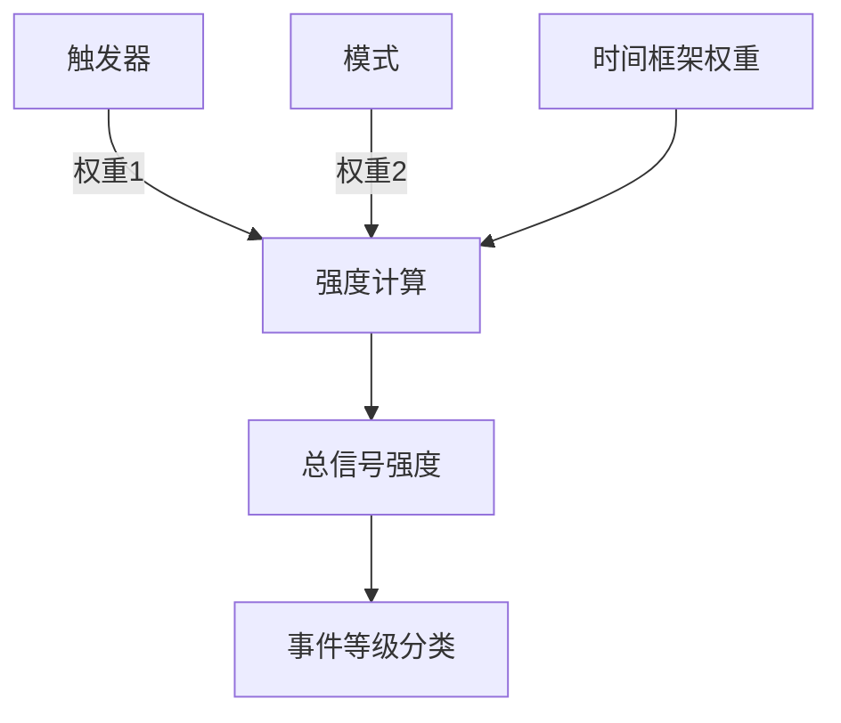
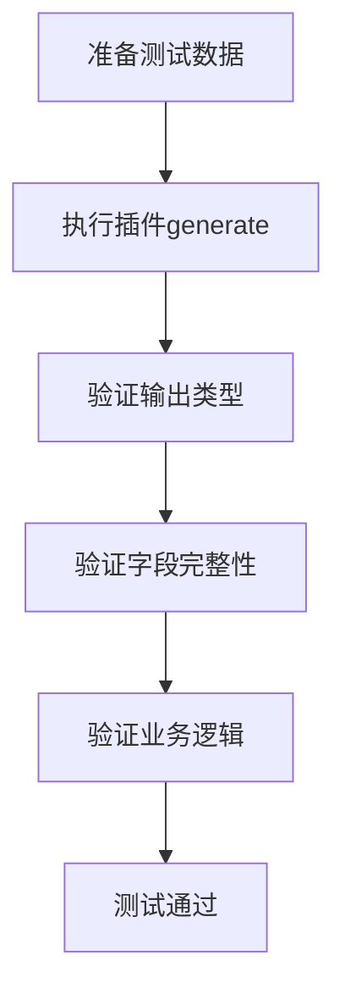

# 插件开发指南

<cite>
**本文档引用的文件**  
- [base.py](file://event_center/indicators_event/plugins/base.py)
- [plugin_loader.py](file://event_center/indicators_event/engine/plugin_loader.py)
- [event_engine.py](file://event_center/indicators_event/engine/event_engine.py)
- [indicator_loader.py](file://event_center/indicators_event/engine/indicator_loader.py)
- [indicator_view.py](file://event_center/indicators_event/engine/indicator_view.py)
- [ema_macd_combo.py](file://event_center/indicators_event_plugins/ema_macd_combo.py)
- [boll_kdj_combo.py](file://event_center/indicators_event_plugins/boll_kdj_combo.py)
- [__init__.py](file://event_center/indicators_event_plugins/__init__.py)
- [CompositeComboBase](file://event_center/indicators_event_plugins/base.py)
- [score_mapper.py](file://event_center/indicators_event/scoring/score_mapper.py)
- [score_aggregator.py](file://event_center/indicators_event/scoring/score_aggregator.py)
- [test_composite_combo_base_compat.py](file://tests/test_composite_combo_base_compat.py)
</cite>

## 目录
1. [插件系统概述](#插件系统概述)
2. [核心基类与接口定义](#核心基类与接口定义)
3. [插件加载机制](#插件加载机制)
4. [执行流程与数据流](#执行流程与数据流)
5. [多指标协同触发逻辑实现](#多指标协同触发逻辑实现)
6. [时间框架适配与信号强度计算](#时间框架适配与信号强度计算)
7. [注册方式与插件发现](#注册方式与插件发现)
8. [插件调试方法](#插件调试方法)
9. [单元测试编写规范](#单元测试编写规范)
10. [与事件中心集成工作流](#与事件中心集成工作流)

## 插件系统概述

本文档详细说明了基于 `base.py` 中定义的抽象基类创建自定义指标组合插件的完整开发流程。系统通过插件化架构实现了技术指标的灵活组合与动态扩展，支持多指标协同分析、时间框架适配和信号强度量化评估。插件系统由事件引擎驱动，通过 `plugin_loader` 动态加载所有注册的插件，并将其与指标数据源连接，最终生成标准化的事件信号。

**Section sources**
- [event_engine.py](file://event_center/indicators_event/engine/event_engine.py#L1-L73)
- [plugin_loader.py](file://event_center/indicators_event/engine/plugin_loader.py#L1-L29)

## 核心基类与接口定义

插件系统的核心是抽象基类 `Plugin` 和功能更丰富的 `CompositeComboBase`。所有自定义插件必须继承这些基类并实现必要的接口。

`Plugin` 基类定义了插件的基本元数据和生成接口：
- `name`: 插件唯一标识符
- `tf_scope`: 支持的时间框架列表
- `indicators`: 依赖的指标类型列表
- `requires_prev`: 是否需要前一时刻的指标数据
- `generate(indicator_view: dict) -> list`: 核心生成方法，接收裁剪后的指标视图并返回事件列表

`CompositeComboBase` 是一个功能更强大的可复用基类，提供了统一的数据提取、过滤、权重计算和事件构建能力，特别适用于多指标组合策略。



**Diagram sources**
- [base.py](file://event_center/indicators_event/plugins/base.py#L4-L18)
- [base.py](file://event_center/indicators_event_plugins/base.py#L105-L411)

**Section sources**
- [base.py](file://event_center/indicators_event/plugins/base.py#L1-L18)
- [base.py](file://event_center/indicators_event_plugins/base.py#L105-L411)

## 插件加载机制

插件加载由 `plugin_loader.py` 模块实现，采用动态导入机制自动发现和实例化所有可用插件。

加载流程如下：
1. 遍历 `event_center.indicators_event.plugins` 包下的所有模块
2. 跳过 `base.py` 等基础模块
3. 动态导入每个插件模块
4. 查找并实例化所有继承自 `Plugin` 的非抽象类
5. 返回已实例化的插件列表

该机制允许在不修改核心代码的情况下添加新插件，只需将新插件文件放入指定目录即可被自动发现和加载。



**Diagram sources**
- [plugin_loader.py](file://event_center/indicators_event/engine/plugin_loader.py#L7-L23)

**Section sources**
- [plugin_loader.py](file://event_center/indicators_event/engine/plugin_loader.py#L1-L29)

## 执行流程与数据流

插件系统的执行流程从原始K线数据开始，经过多个处理阶段，最终生成标准化的事件信号。

主要流程包括：
1. 从Redis加载全周期、全指标数据
2. 为每个插件构建裁剪后的指标视图
3. 调用插件的generate方法生成原始事件
4. 将原始事件转换为评分
5. 聚合各插件评分并分类事件等级



**Diagram sources**
- [event_engine.py](file://event_center/indicators_event/engine/event_engine.py#L19-L67)
- [indicator_loader.py](file://event_center/indicators_event/engine/indicator_loader.py#L16-L48)
- [indicator_view.py](file://event_center/indicators_event/engine/indicator_view.py#L1-L45)

**Section sources**
- [event_engine.py](file://event_center/indicators_event/engine/event_engine.py#L1-L73)
- [indicator_loader.py](file://event_center/indicators_event/engine/indicator_loader.py#L1-L54)
- [indicator_view.py](file://event_center/indicators_event/engine/indicator_view.py#L1-L58)

## 多指标协同触发逻辑实现

以 `ema_macd_combo.py` 和 `boll_kdj_combo.py` 为例，展示如何实现多指标协同触发逻辑。

### EMA_MACD组合插件

该插件结合EMA趋势指标和MACD动量指标，实现趋势与动能的双重确认。



**Diagram sources**
- [ema_macd_combo.py](file://event_center/indicators_event_plugins/ema_macd_combo.py#L6-L186)

### BOLL_KDJ组合插件

该插件结合布林带价格通道和KDJ超买超卖指标，识别价格边界与动量转折。



**Diagram sources**
- [boll_kdj_combo.py](file://event_center/indicators_event_plugins/boll_kdj_combo.py#L6-L183)

**Section sources**
- [ema_macd_combo.py](file://event_center/indicators_event_plugins/ema_macd_combo.py#L1-L186)
- [boll_kdj_combo.py](file://event_center/indicators_event_plugins/boll_kdj_combo.py#L1-L183)

## 时间框架适配与信号强度计算

插件系统支持多时间框架适配和信号强度量化计算。

### 时间框架适配

通过 `tf_scope` 字段定义插件支持的时间框架，系统会自动为每个插件构建相应时间框架的指标视图。

### 信号强度计算

信号强度通过触发器（triggers）和模式（patterns）的加权和计算：
- 触发器：基本条件，权重为1
- 模式：结构性形态，权重为2
- 总强度 = Σ(触发器数量 × 触发器权重) + Σ(模式数量 × 模式权重)

系统还支持通过配置文件动态调整权重和阈值。



**Diagram sources**
- [score_mapper.py](file://event_center/indicators_event/scoring/score_mapper.py#L35-L58)
- [score_aggregator.py](file://event_center/indicators_event/scoring/score_aggregator.py#L37-L175)

**Section sources**
- [score_mapper.py](file://event_center/indicators_event/scoring/score_mapper.py#L1-L58)
- [score_aggregator.py](file://event_center/indicators_event/scoring/score_aggregator.py#L1-L175)

## 注册方式与插件发现

插件通过装饰器模式进行注册，确保被系统自动发现。

### 注册机制

`__init__.py` 文件中定义了 `register_plugin` 装饰器，所有使用该装饰器的插件类都会被自动添加到全局插件列表中。

```python
@register_plugin
class MyCustomCombo(CompositeComboBase):
    name = "my_custom_combo"
    # 插件实现
```

### 插件发现

`get_plugins()` 函数负责发现和加载所有注册的插件：
1. 遍历 `indicators_event_plugins` 包下的所有模块
2. 导入每个模块以触发装饰器注册
3. 返回已注册的插件实例列表

这种机制确保了插件的自动发现和热加载能力。

**Section sources**
- [__init__.py](file://event_center/indicators_event_plugins/__init__.py#L1-L18)

## 插件调试方法

插件调试可以通过以下几种方式进行：

### 单元测试调试

使用 `pytest` 编写单元测试，模拟输入数据并验证输出结果。

### 日志调试

在插件代码中添加日志输出，观察关键变量的值和执行流程。

### 交互式调试

直接运行 `event_engine.py` 脚本，传入测试参数，观察完整执行流程。

### Redis数据检查

通过Redis CLI检查原始指标数据，确保输入数据的正确性。

```bash
redis-cli get "indicators:binance:BTCUSDT:1h"
```

**Section sources**
- [test_composite_combo_base_compat.py](file://tests/test_composite_combo_base_compat.py#L1-L117)

## 单元测试编写规范

单元测试应遵循以下规范：

### 测试用例结构

每个插件应包含以下类型的测试用例：
- 插件发现测试：验证插件能被正确加载
- 基本功能测试：验证正常情况下的信号生成
- 边界条件测试：验证极端情况的处理
- 错误处理测试：验证异常情况的鲁棒性

### 测试数据准备

使用 `_kline_pair`、`_base_ind` 等辅助函数创建标准化的测试数据。

### 断言规范

确保对输出结果进行充分验证：
- 结果类型是否正确
- 必需字段是否存在
- 业务逻辑是否符合预期



**Diagram sources**
- [test_composite_combo_base_compat.py](file://tests/test_composite_combo_base_compat.py#L59-L117)

**Section sources**
- [test_composite_combo_base_compat.py](file://tests/test_composite_combo_base_compat.py#L1-L117)

## 与事件中心集成工作流

新插件接入事件生成引擎的完整工作流如下：

### 开发阶段
1. 继承 `CompositeComboBase` 创建新插件类
2. 实现必要的触发器和模式方法
3. 配置插件元数据（名称、依赖指标等）
4. 编写单元测试验证功能

### 部署阶段
1. 将插件文件放入 `indicators_event_plugins` 目录
2. 确保使用 `@register_plugin` 装饰器
3. 重启事件引擎服务

### 验证阶段
1. 检查插件是否被正确加载
2. 监控生成的事件信号
3. 验证信号质量和业务逻辑

该工作流确保了新插件能够无缝接入现有系统，无需修改核心代码即可扩展功能。


**Section sources**
- [event_engine.py](file://event_center/indicators_event/engine/event_engine.py#L1-L73)
- [__init__.py](file://event_center/indicators_event_plugins/__init__.py#L1-L18)