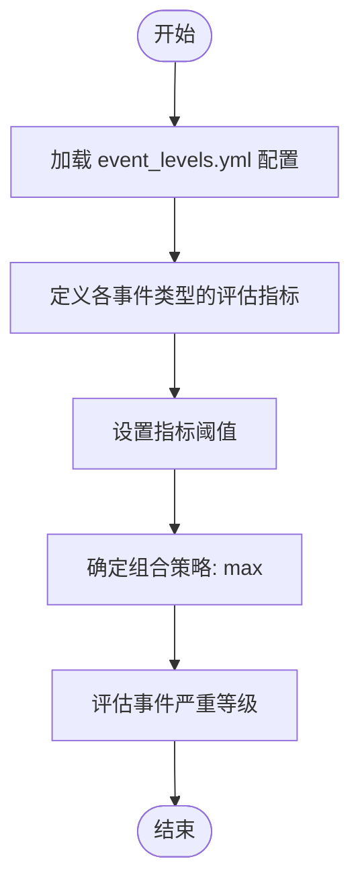
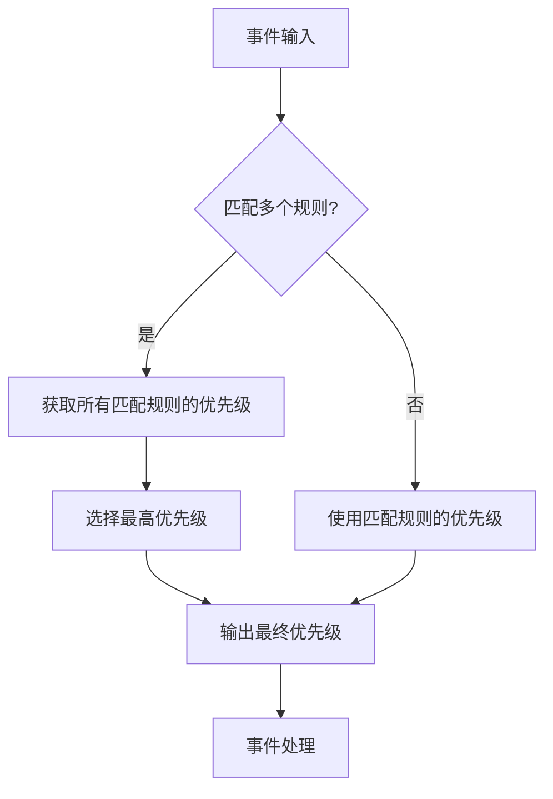
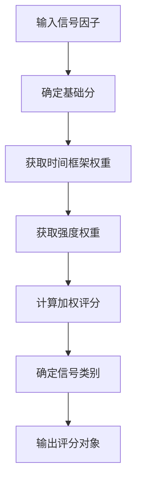
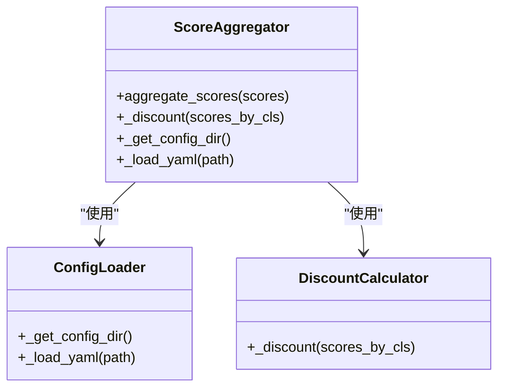
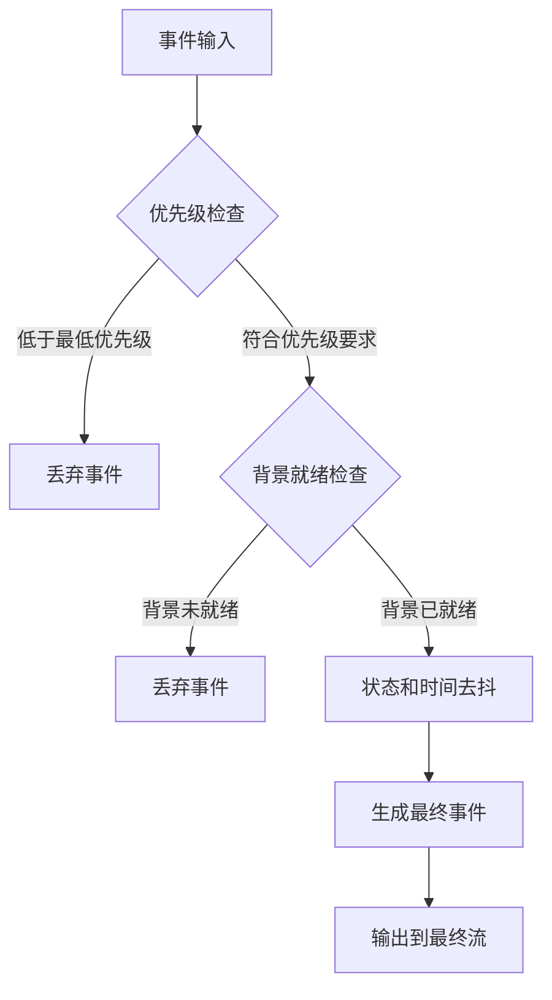

# 评分与规则配置

<cite>
**本文档引用的文件**
- [rules.yml](file://event_center/rules.yml)
- [event_levels.yml](file://event_center/event_levels.yml)
- [strength_weights.yaml](file://event_center/indicators_event/config/strength_weights.yaml)
- [tf_weights.yaml](file://event_center/indicators_event/config/tf_weights.yaml)
- [final_grader.py](file://event_center/pipeline/final_grader.py)
- [score_aggregator.py](file://event_center/indicators_event/scoring/score_aggregator.py)
- [score_mapper.py](file://event_center/indicators_event/scoring/score_mapper.py)
- [config.py](file://event_center/config.py)
</cite>

## 目录
1. [引言](#引言)
2. [事件分级规则详解](#事件分级规则详解)
3. [优先级映射逻辑](#优先级映射逻辑)
4. [权重配置体系](#权重配置体系)
5. [评分计算流程](#评分计算流程)
6. [最终评分器配置](#最终评分器配置)
7. [配置热更新策略](#配置热更新策略)
8. [实际配置示例与效果分析](#实际配置示例与效果分析)
9. [结论](#结论)

## 引言
本文档旨在提供评分与规则配置的权威指南，深入解析系统中各项评分规则、优先级映射逻辑与权重配置机制。通过详细分析rules.yml中定义的事件分级规则、event_levels.yml中的事件严重等级定义，以及strength_weights.yaml和tf_weights.yaml对指标组合评分计算的影响，帮助用户全面理解系统的评分体系决策依据。同时，本文档将深入分析FinalGrader中的关键配置项对最终事件过滤的影响，并提供配置热更新策略，确保用户能够有效调整和优化系统行为。

## 事件分级规则详解

### 即时规则（Instant Rules）
即时规则用于对单个事件进行即时评估和优先级分配。在rules.yml中定义的即时规则包括：

- **l0_unrealized_20**: 当单笔浮亏达到或超过20%时，触发关键（critical）优先级事件
- **l0_unrealized_10**: 当单笔浮亏达到或超过10%时，触发高（high）优先级事件
- **l0_add_position_freq**: 当短时间内频繁加仓时，触发低（low）优先级事件

这些规则通过匹配事件类型和负载条件来确定是否触发，并直接分配相应的优先级。

**Section sources**
- [rules.yml](file://event_center/rules.yml#L13-L33)

### 聚合规则（Aggregation Rules）
聚合规则用于对一段时间内的多个事件进行聚合分析，以识别更复杂的模式。在rules.yml中定义的聚合规则包括：

- **a1_cumulative_losses**: 在30分钟内累计出现3次浮亏≥5%的事件，触发高优先级
- **a2_add_pos_spike**: 在10分钟内连续3次加仓，触发中等优先级
- **a_combo_bullish_burst**: 在10分钟内同向看涨组合信号达到3次，触发中等优先级
- **a_combo_bearish_burst**: 在10分钟内同向看跌组合信号达到3次，触发中等优先级

这些规则通过设置回溯时间窗口、分组条件和计数条件来识别特定模式，并根据结果优先级分配相应的优先级。

**Section sources**
- [rules.yml](file://event_center/rules.yml#L34-L82)

### 事件严重等级定义
event_levels.yml文件定义了不同事件类型的严重等级评估标准，通过多个指标的组合来确定事件的严重程度。主要的事件类型包括：

- **force_spike_sell/buy**: 通过delta_sell_qty、delta_sell等指标的百分位阈值来评估
- **force_intensity**: 通过intensity指标的百分位阈值来评估
- **force_sell/buy_dominance**: 通过dominance_sell_ratio等指标的绝对阈值和百分位阈值组合来评估

每个事件类型都定义了多个指标及其相应的阈值，采用最大值（max）组合策略来确定最终的严重等级。



**Diagram sources**
- [event_levels.yml](file://event_center/event_levels.yml#L1-L47)

## 优先级映射逻辑

### 优先级权重配置
系统中的优先级权重配置定义了不同优先级的相对重要性。在rules.yml中，优先级权重配置如下：

- **low**: 权重为10
- **medium**: 权重为50
- **high**: 权重为80
- **critical**: 权重为100

这些权重值用于在后续的评分计算和事件过滤中进行量化比较。

**Section sources**
- [rules.yml](file://event_center/rules.yml#L3-L11)

### 优先级组合策略
系统采用"max_priority"作为优先级组合策略，即在多个规则匹配的情况下，选择最高优先级作为最终结果优先级。这种策略确保了最严重的事件能够得到及时关注和处理。



**Diagram sources**
- [rules.yml](file://event_center/rules.yml#L83)

## 权重配置体系

### 强度权重配置
strength_weights.yaml文件定义了不同信号强度的权重系数，用于调整评分计算中的强度影响：

- **1级强度**: 权重为1.0
- **2级强度**: 权重为1.2
- **3级强度**: 权重为1.5

这些权重值在评分映射过程中与时间框架权重相乘，共同影响最终的评分结果。

**Section sources**
- [strength_weights.yaml](file://event_center/indicators_event/config/strength_weights.yaml#L1-L4)

### 时间框架权重配置
tf_weights.yaml文件定义了不同时间框架的权重系数，反映了不同时间周期信号的重要性差异：

- **1m**: 权重为1.0
- **5m**: 权重为1.5
- **15m**: 权重为2.0
- **30m**: 权重为2.5
- **1h**: 权重为3.0
- **2h**: 权重为3.5
- **4h**: 权重为4.0
- **1d**: 权重为4.5

较长的时间框架被赋予更高的权重，体现了系统对长期趋势信号的重视。

**Section sources**
- [tf_weights.yaml](file://event_center/indicators_event/config/tf_weights.yaml#L1-L9)

## 评分计算流程

### 评分映射过程
评分映射过程将原始信号因子转换为标准化的评分。score_mapper.py中的factor_to_score函数执行以下步骤：

1. 根据信号方向确定基础分（看涨/看跌为1.0，中性为0.0）
2. 获取时间框架权重和强度权重
3. 计算加权评分
4. 确定信号类别



**Diagram sources**
- [score_mapper.py](file://event_center/indicators_event/scoring/score_mapper.py#L35-L58)

### 评分聚合过程
评分聚合过程将多个评分进行综合，生成最终的结构评分。score_aggregator.py中的aggregate_scores函数执行以下步骤：

1. 按时间框架分组评分
2. 在每个时间框架内按类别聚合，保留绝对值最大的分数
3. 使用折扣函数对同一周期的跨类别分数进行聚合
4. 按短、中、长期分桶聚合
5. 判断市场状态和方向
6. 应用分歧降级和强反向禁止等策略



**Diagram sources**
- [score_aggregator.py](file://event_center/indicators_event/scoring/score_aggregator.py#L37-L175)

## 最终评分器配置

### FinalGrader核心配置
FinalGrader类中的关键配置项对最终事件过滤起着决定性作用：

- **GRADER_VERSION**: 评分器版本号，用于追踪配置变更
- **FINAL_MIN_PRIORITY**: 最低优先级阈值，低于此优先级的事件将被忽略
- **FINAL_REQUIRE_BACKGROUND**: 是否要求背景就绪后再推送最终事件
- **PRIORITY_WEIGHT**: 优先级权重映射，用于量化比较不同优先级



**Section sources**
- [final_grader.py](file://event_center/pipeline/final_grader.py#L17-L26)

### 事件过滤逻辑
FinalGrader的事件过滤逻辑包括多个层次的检查：

1. **优先级门控**: 检查事件优先级是否达到最低要求
2. **背景就绪检查**: 确保市场结构和市场状态背景数据已准备就绪
3. **状态和时间去抖**: 防止短时间内重复推送相同状态的事件
4. **置信度推断**: 根据总评分和市场状态推断事件置信度

这些过滤机制共同确保了最终输出事件的质量和有效性。

**Section sources**
- [final_grader.py](file://event_center/pipeline/final_grader.py#L105-L186)

## 配置热更新策略

### 配置文件热加载
系统支持配置文件的热更新，无需重启服务即可应用新的配置。主要的配置文件包括：

- rules.yml: 事件规则配置
- event_levels.yml: 事件等级配置
- strength_weights.yaml: 强度权重配置
- tf_weights.yaml: 时间框架权重配置

当这些配置文件发生变化时，相关组件会自动重新加载配置，确保新规则立即生效。

### 配置更新验证
在应用新的配置之前，建议进行以下验证：

1. **语法检查**: 确保YAML文件语法正确
2. **逻辑验证**: 检查规则之间的逻辑一致性
3. **影响评估**: 评估配置变更对现有事件流的潜在影响
4. **测试验证**: 在测试环境中验证新配置的效果

通过这些验证步骤，可以确保配置更新的安全性和有效性。

## 实际配置示例与效果分析

### 配置调整示例
假设我们需要调整看涨爆发信号的敏感度，可以修改rules.yml中的a_combo_bullish_burst规则：

```yaml
  - id: a_combo_bullish_burst
    description: 5分钟内同向bullish组合信号达到2次
    lookback_seconds: 300
    group_by: symbol
    condition:
      event_filter:
        type: combo.*.bullish
      count:
        operator: ">="
        value: 2
    result_priority: medium
```

此调整将检测窗口从10分钟缩短到5分钟，触发条件从3次降低到2次，使系统对看涨信号更加敏感。

### 效果分析
通过调整配置，系统的行为将发生以下变化：

- **检测速度**: 事件检测速度提高，能够在更短时间内识别看涨趋势
- **误报率**: 可能增加误报率，因为更宽松的条件可能导致更多噪声事件被触发
- **响应时间**: 系统响应时间缩短，能够更快地对市场变化做出反应

这些变化需要在提高灵敏度和控制误报率之间进行权衡，根据实际需求调整配置参数。

## 结论
本文档详细解析了评分与规则配置的各个方面，包括事件分级规则、优先级映射逻辑、权重配置体系、评分计算流程以及最终评分器的配置。通过理解这些配置机制，用户可以有效地调整和优化系统行为，以适应不同的市场环境和业务需求。同时，配置热更新策略确保了系统能够灵活应对不断变化的市场条件，而无需中断服务。建议用户在调整配置时，充分考虑各项参数之间的相互影响，并通过测试验证确保配置变更的效果符合预期。