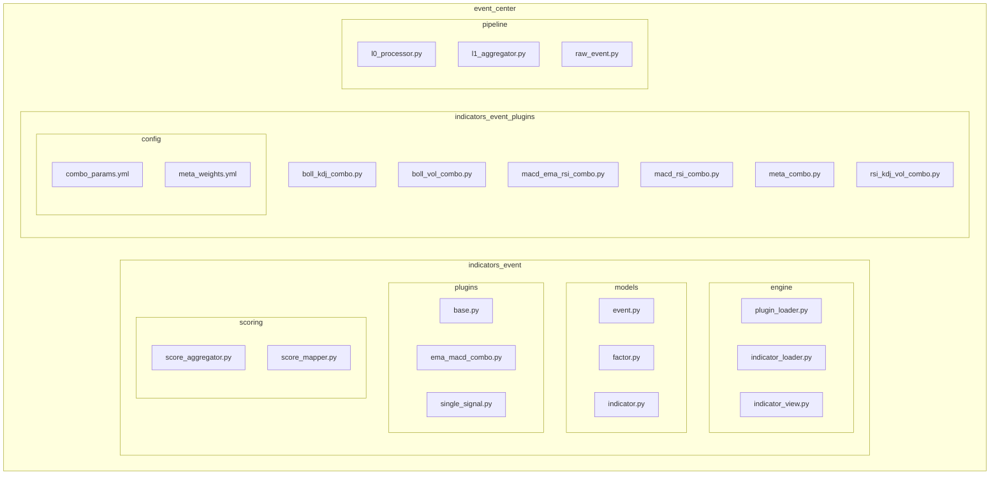
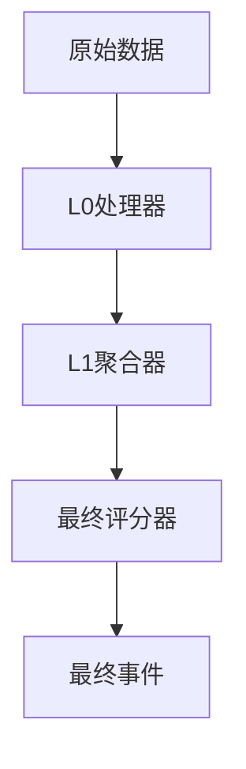
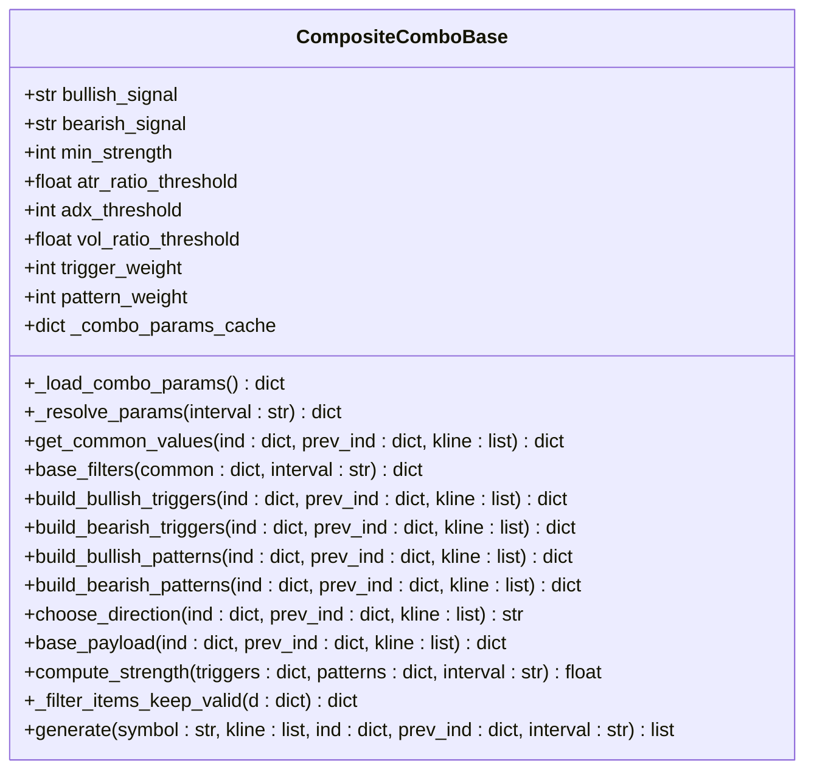
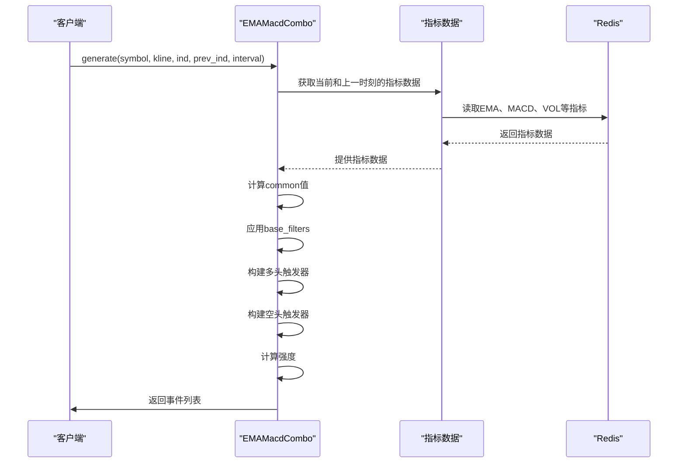
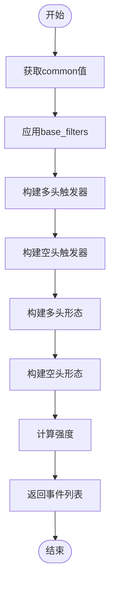
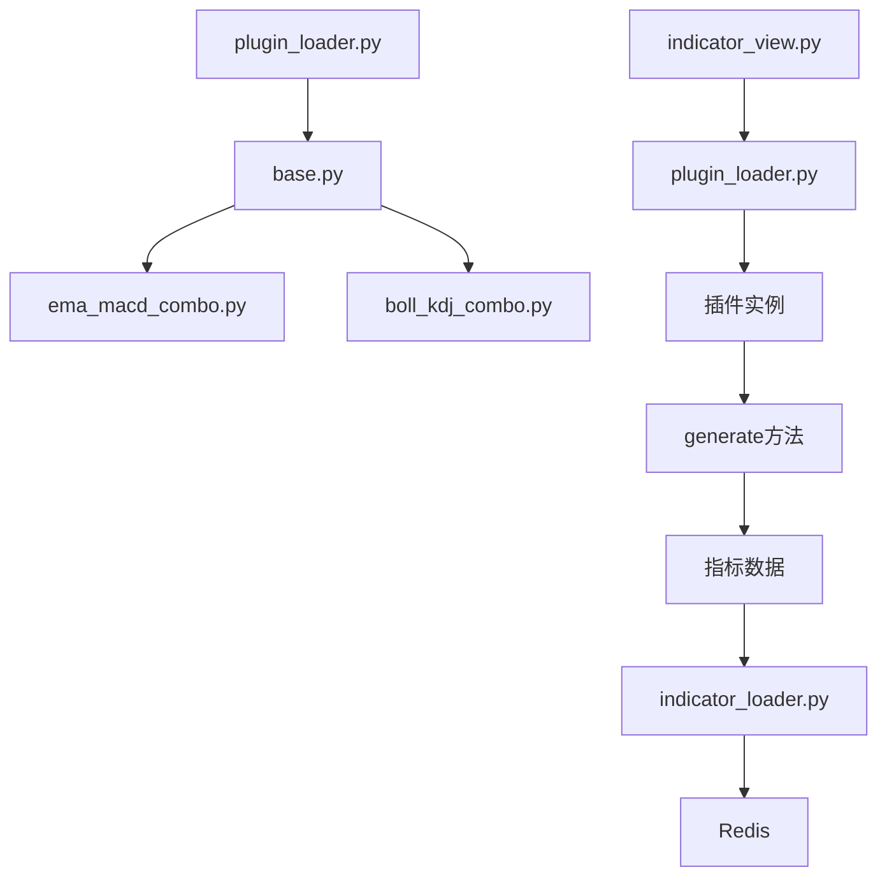

# 开发事件组合插件

<cite>
**本文档引用的文件**   
- [base.py](file://event_center/indicators_event/plugins/base.py)
- [base.py](file://event_center/indicators_event_plugins/base.py)
- [ema_macd_combo.py](file://event_center/indicators_event_plugins/ema_macd_combo.py)
- [boll_kdj_combo.py](file://event_center/indicators_event_plugins/boll_kdj_combo.py)
- [plugin_loader.py](file://event_center/indicators_event/engine/plugin_loader.py)
- [indicator_loader.py](file://event_center/indicators_event/engine/indicator_loader.py)
- [indicator_view.py](file://event_center/indicators_event/engine/indicator_view.py)
- [l0_processor.py](file://event_center/pipeline/l0_processor.py)
- [l1_aggregator.py](file://event_center/pipeline/l1_aggregator.py)
- [final_grader.py](file://event_center/pipeline/final_grader.py)
- [combo_params.yml](file://event_center/indicators_event_plugins/config/combo_params.yml)
- [meta_weights.yml](file://event_center/indicators_event_plugins/config/meta_weights.yml)
- [indicator_class_map.yaml](file://event_center/indicators_event/config/indicator_class_map.yaml)
</cite>

## 目录
1. [引言](#引言)
2. [项目结构](#项目结构)
3. [核心组件](#核心组件)
4. [架构概述](#架构概述)
5. [详细组件分析](#详细组件分析)
6. [依赖分析](#依赖分析)
7. [性能考虑](#性能考虑)
8. [故障排除指南](#故障排除指南)
9. [结论](#结论)

## 引言
本文档旨在为开发者提供一个全面的指南，以创建基于`event_center`插件系统的复合信号检测逻辑。我们将深入探讨如何继承`base.py`中的`BaseIndicatorPlugin`类，并实现`match()`和`generate()`方法来定义触发条件与事件生成规则。通过具体的例子，如EMA+MACD金叉、BOLL+KDJ超卖等组合，展示多指标协同判断的编码模式。此外，文档还将解释如何通过YAML配置文件激活插件、设置权重参数与时间窗口，涵盖插件生命周期管理、错误隔离机制以及性能监控埋点。最后，提供调试技巧，确保新插件能够兼容L0→L1→Final流水线。

## 项目结构
本项目的结构遵循模块化设计原则，将不同功能划分为独立的目录和文件。主要分为以下几个部分：`agent_server`、`api`、`data_server`、`event_center`、`tests`、`tools`等。其中，`event_center`是本次文档关注的核心，它包含了事件组合插件的开发所需的所有组件。

**图表来源**
- [event_center/indicators_event/engine/plugin_loader.py](file://event_center/indicators_event/engine/plugin_loader.py)
- [event_center/indicators_event/engine/indicator_loader.py](file://event_center/indicators_event/engine/indicator_loader.py)
- [event_center/indicators_event/engine/indicator_view.py](file://event_center/indicators_event/engine/indicator_view.py)
- [event_center/indicators_event/plugins/base.py](file://event_center/indicators_event/plugins/base.py)
- [event_center/indicators_event_plugins/base.py](file://event_center/indicators_event_plugins/base.py)
- [event_center/indicators_event_plugins/boll_kdj_combo.py](file://event_center/indicators_event_plugins/boll_kdj_combo.py)
- [event_center/indicators_event_plugins/ema_macd_combo.py](file://event_center/indicators_event_plugins/ema_macd_combo.py)
- [event_center/pipeline/l0_processor.py](file://event_center/pipeline/l0_processor.py)
- [event_center/pipeline/l1_aggregator.py](file://event_center/pipeline/l1_aggregator.py)
- [event_center/pipeline/final_grader.py](file://event_center/pipeline/final_grader.py)

**章节来源**
- [event_center/indicators_event/engine/plugin_loader.py](file://event_center/indicators_event/engine/plugin_loader.py)
- [event_center/indicators_event/engine/indicator_loader.py](file://event_center/indicators_event/engine/indicator_loader.py)
- [event_center/indicators_event/engine/indicator_view.py](file://event_center/indicators_event/engine/indicator_view.py)
- [event_center/indicators_event/plugins/base.py](file://event_center/indicators_event/plugins/base.py)
- [event_center/indicators_event_plugins/base.py](file://event_center/indicators_event_plugins/base.py)
- [event_center/indicators_event_plugins/boll_kdj_combo.py](file://event_center/indicators_event_plugins/boll_kdj_combo.py)
- [event_center/indicators_event_plugins/ema_macd_combo.py](file://event_center/indicators_event_plugins/ema_macd_combo.py)
- [event_center/pipeline/l0_processor.py](file://event_center/pipeline/l0_processor.py)
- [event_center/pipeline/l1_aggregator.py](file://event_center/pipeline/l1_aggregator.py)
- [event_center/pipeline/final_grader.py](file://event_center/pipeline/final_grader.py)

## 核心组件
在`event_center`中，核心组件主要包括插件系统、指标加载器、视图构建器以及评分聚合器。这些组件共同协作，实现了从原始数据到最终事件的完整处理流程。

**章节来源**
- [event_center/indicators_event/plugins/base.py](file://event_center/indicators_event/plugins/base.py)
- [event_center/indicators_event_plugins/base.py](file://event_center/indicators_event_plugins/base.py)
- [event_center/indicators_event/engine/indicator_loader.py](file://event_center/indicators_event/engine/indicator_loader.py)
- [event_center/indicators_event/engine/indicator_view.py](file://event_center/indicators_event/engine/indicator_view.py)
- [event_center/indicators_event/scoring/score_aggregator.py](file://event_center/indicators_event/scoring/score_aggregator.py)

## 架构概述
整个系统的架构可以分为三个主要阶段：L0处理器、L1聚合器和最终评分器。每个阶段都有其特定的功能和职责，确保了事件处理的高效性和准确性。

**图表来源**
- [event_center/pipeline/l0_processor.py](file://event_center/pipeline/l0_processor.py)
- [event_center/pipeline/l1_aggregator.py](file://event_center/pipeline/l1_aggregator.py)
- [event_center/pipeline/final_grader.py](file://event_center/pipeline/final_grader.py)

## 详细组件分析

### 插件基类分析
`CompositeComboBase`是所有事件组合插件的基类，提供了统一的数据抽取、通用过滤、权重化强度计算等功能。通过继承此类，开发者可以快速实现自己的插件逻辑。

#### 类图

**图表来源**
- [event_center/indicators_event_plugins/base.py](file://event_center/indicators_event_plugins/base.py)

**章节来源**
- [event_center/indicators_event_plugins/base.py](file://event_center/indicators_event_plugins/base.py)

### EMA+MACD组合插件分析
`EMAMacdCombo`插件实现了EMA与MACD指标的组合策略，通过金叉/死叉、柱状图翻转、DIF/DEA交叉等条件来确认趋势方向和动能变化。

#### 序列图

**图表来源**
- [event_center/indicators_event_plugins/ema_macd_combo.py](file://event_center/indicators_event_plugins/ema_macd_combo.py)

**章节来源**
- [event_center/indicators_event_plugins/ema_macd_combo.py](file://event_center/indicators_event_plugins/ema_macd_combo.py)

### BOLL+KDJ组合插件分析
`KDJBOLLCombo`插件结合了布林带和KDJ指标，利用带宽收窄、价格触及上下轨、金叉/死叉等条件来识别超卖或超买状态。

#### 流程图

**图表来源**
- [event_center/indicators_event_plugins/boll_kdj_combo.py](file://event_center/indicators_event_plugins/boll_kdj_combo.py)

**章节来源**
- [event_center/indicators_event_plugins/boll_kdj_combo.py](file://event_center/indicators_event_plugins/boll_kdj_combo.py)

## 依赖分析
系统中的各个组件之间存在复杂的依赖关系。例如，`plugin_loader.py`负责加载所有插件，而`indicator_loader.py`则从Redis中读取指标数据。`indicator_view.py`根据插件声明的`tf_scope`和`indicators`构造裁剪后的视图，供插件使用。

**图表来源**
- [event_center/indicators_event/engine/plugin_loader.py](file://event_center/indicators_event/engine/plugin_loader.py)
- [event_center/indicators_event/engine/indicator_loader.py](file://event_center/indicators_event/engine/indicator_loader.py)
- [event_center/indicators_event/engine/indicator_view.py](file://event_center/indicators_event/engine/indicator_view.py)
- [event_center/indicators_event/plugins/base.py](file://event_center/indicators_event/plugins/base.py)
- [event_center/indicators_event_plugins/ema_macd_combo.py](file://event_center/indicators_event_plugins/ema_macd_combo.py)
- [event_center/indicators_event_plugins/boll_kdj_combo.py](file://event_center/indicators_event_plugins/boll_kdj_combo.py)

**章节来源**
- [event_center/indicators_event/engine/plugin_loader.py](file://event_center/indicators_event/engine/plugin_loader.py)
- [event_center/indicators_event/engine/indicator_loader.py](file://event_center/indicators_event/engine/indicator_loader.py)
- [event_center/indicators_event/engine/indicator_view.py](file://event_center/indicators_event/engine/indicator_view.py)

## 性能考虑
为了保证系统的高性能，采用了多种优化策略。例如，在`l0_processor.py`中使用了Redis管道来批量执行命令，减少了网络往返次数。同时，通过设置合理的窗口大小和时间间隔，避免了不必要的计算开销。

## 故障排除指南
当遇到问题时，可以通过以下步骤进行排查：
1. 检查Redis连接是否正常。
2. 确认插件是否正确注册并被加载。
3. 验证指标数据是否准确无误。
4. 查看日志输出，定位具体错误信息。

**章节来源**
- [event_center/pipeline/l0_processor.py](file://event_center/pipeline/l0_processor.py)
- [event_center/pipeline/l1_aggregator.py](file://event_center/pipeline/l1_aggregator.py)
- [event_center/pipeline/final_grader.py](file://event_center/pipeline/final_grader.py)

## 结论
本文档详细介绍了如何基于`event_center`的插件系统开发复合信号检测逻辑。通过继承`CompositeComboBase`类并实现相应的触发器和形态构建方法，开发者可以轻松创建自己的事件组合插件。同时，通过YAML配置文件灵活调整参数，确保了系统的可扩展性和适应性。希望这份指南能帮助您快速上手并成功开发出高质量的事件组合插件。