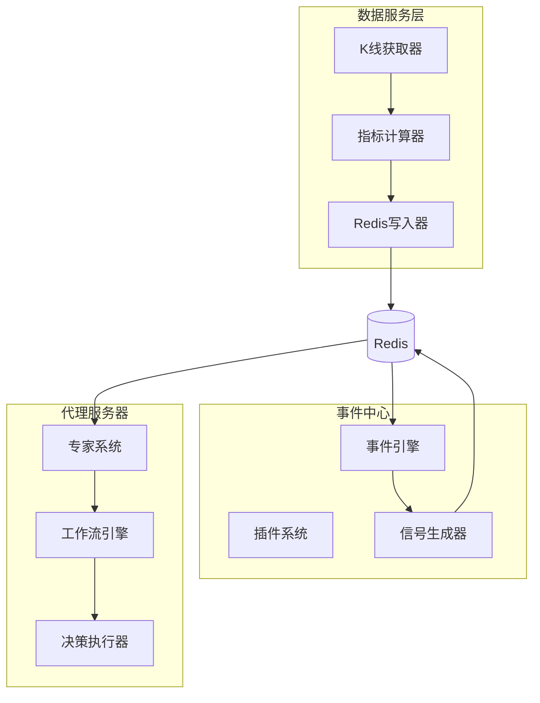
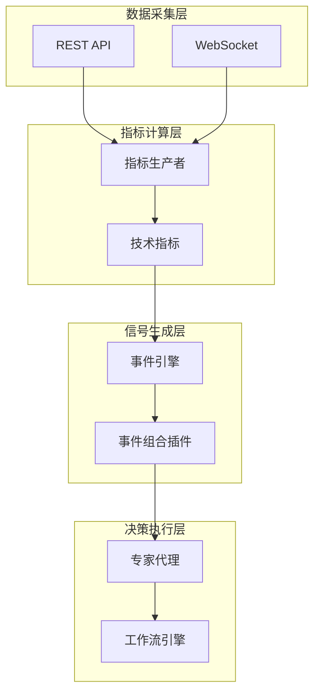
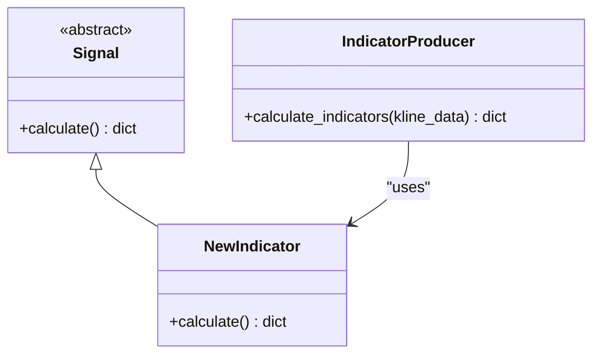
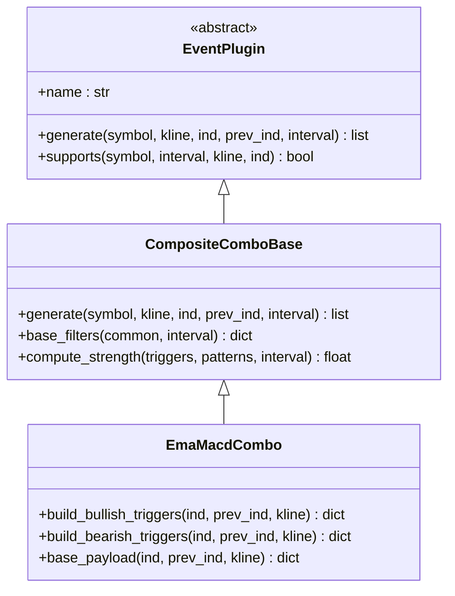
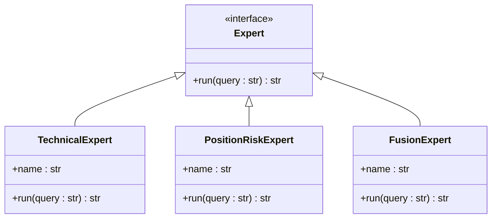
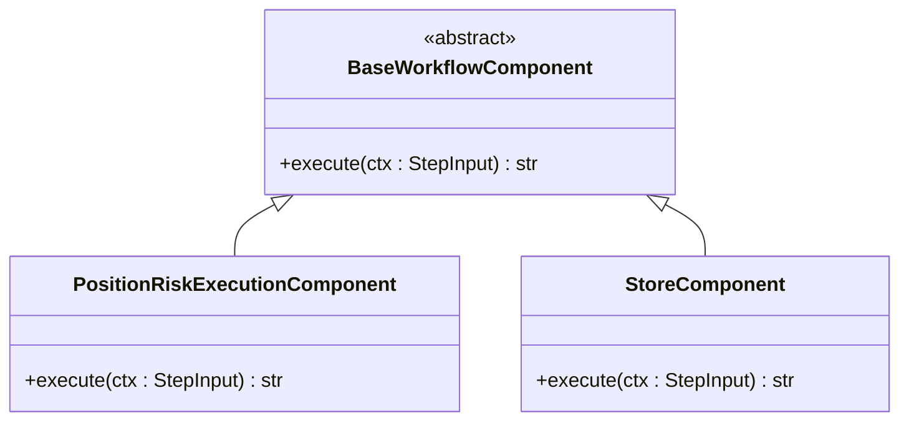
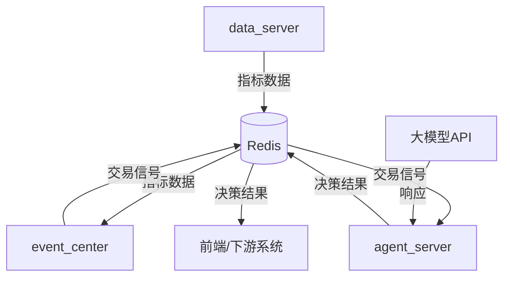

# 扩展开发指南

<cite>
**本文档中引用的文件**  
- [technical.py](file://agent_server/agents/experts/analysis/technical.py)
- [position_risk_execution.py](file://agent_server/agent_workflow/components/executors/position_risk_execution.py)
- [store.py](file://agent_server/agent_workflow/components/store.py)
- [registry.py](file://agent_server/agent_context/registry.py)
- [base.py](file://event_center/indicators_event/plugins/base.py)
- [plugin_loader.py](file://event_center/indicators_event/engine/plugin_loader.py)
- [indicators_producer.py](file://data_server/binance/rest_binance/app/indicators_producer.py)
- [aggregate.py](file://data_server/binance/rest_binance/app/signals/aggregate.py)
- [__init__.py](file://data_server/binance/rest_binance/app/signals/__init__.py)
- [ema_macd_combo.py](file://event_center/indicators_event_plugins/ema_macd_combo.py)
- [CompositeComboBase.py](file://event_center/indicators_event_plugins/base.py)
- [__init__.py](file://agent_server/agents/experts/__init__.py)
</cite>

## 目录
1. [简介](#简介)
2. [项目结构](#项目结构)
3. [核心组件](#核心组件)
4. [架构概述](#架构概述)
5. [详细组件分析](#详细组件分析)
6. [依赖分析](#依赖分析)
7. [性能考虑](#性能考虑)
8. [故障排除指南](#故障排除指南)
9. [结论](#结论)

## 简介
本指南旨在为开发者提供在现有系统基础上进行功能扩展的完整指导。重点涵盖如何添加新的技术指标、创建事件组合插件、注册专家代理以及开发自定义工作流。通过遵循本文档中的模式和约定，开发者可以确保新增功能与系统架构兼容，并能无缝集成到现有流程中。

## 项目结构
系统采用模块化设计，主要分为数据服务层、事件中心和代理服务器三大核心部分。数据服务负责从交易所获取原始K线数据并计算技术指标；事件中心基于这些指标生成交易信号；代理服务器则利用这些信号进行智能决策。各模块通过Redis进行数据交换，确保松耦合和高可扩展性。

**图示来源**
- [indicators_producer.py](file://data_server/binance/rest_binance/app/indicators_producer.py)
- [plugin_loader.py](file://event_center/indicators_event/engine/plugin_loader.py)
- [position_risk_execution.py](file://agent_server/agent_workflow/components/executors/position_risk_execution.py)

**章节来源**
- [indicators_producer.py](file://data_server/binance/rest_binance/app/indicators_producer.py#L1-L42)
- [plugin_loader.py](file://event_center/indicators_event/engine/plugin_loader.py#L1-L29)

## 核心组件
系统的核心组件包括技术指标生产者、事件组合插件、专家代理和工作流执行器。技术指标生产者负责计算并持久化各类技术分析指标；事件组合插件通过组合多个基础指标生成高级交易信号；专家代理基于上下文信息进行智能决策；工作流执行器则协调各组件完成完整的决策流程。

**章节来源**
- [technical.py](file://agent_server/agents/experts/analysis/technical.py#L1-L25)
- [position_risk_execution.py](file://agent_server/agent_workflow/components/executors/position_risk_execution.py#L1-L184)

## 架构概述
系统采用分层架构设计，从下至上分别为数据采集层、指标计算层、信号生成层和决策执行层。数据采集层通过REST和WebSocket接口获取市场数据；指标计算层实现各类技术分析算法；信号生成层通过插件机制组合基础指标形成交易信号；决策执行层利用大模型专家系统进行综合判断。各层之间通过Redis消息队列进行异步通信。

**图示来源**
- [indicators_producer.py](file://data_server/binance/rest_binance/app/indicators_producer.py#L6-L7)
- [plugin_loader.py](file://event_center/indicators_event/engine/plugin_loader.py#L7-L23)
- [position_risk_execution.py](file://agent_server/agent_workflow/components/executors/position_risk_execution.py#L14-L184)

## 详细组件分析

### 技术指标扩展
要添加新的技术指标，需在`data_server/binance/rest_binance/app/signals/`目录下创建新的信号类，并在`aggregate.py`中注册。新类应继承基础信号类，实现`calculate`方法，返回计算结果。最后在`__init__.py`中导出新类，使其可被指标生产者调用。

**图示来源**
- [aggregate.py](file://data_server/binance/rest_binance/app/signals/aggregate.py#L12-L45)
- [__init__.py](file://data_server/binance/rest_binance/app/signals/__init__.py#L1-L24)

**章节来源**
- [aggregate.py](file://data_server/binance/rest_binance/app/signals/aggregate.py#L12-L45)
- [__init__.py](file://data_server/binance/rest_binance/app/signals/__init__.py#L1-L24)

### 事件组合插件开发
创建事件组合插件需要继承`event_center/indicators_event_plugins/base.py`中的`CompositeComboBase`类，实现`build_bullish_triggers`、`build_bearish_triggers`等方法。插件通过YAML配置文件进行参数化，支持动态调整阈值和权重。每个插件必须定义`name`属性，并通过`@register_plugin`装饰器注册。

**图示来源**
- [base.py](file://event_center/indicators_event_plugins/base.py#L50-L411)
- [ema_macd_combo.py](file://event_center/indicators_event_plugins/ema_macd_combo.py#L6-L186)

**章节来源**
- [base.py](file://event_center/indicators_event_plugins/base.py#L50-L411)
- [ema_macd_combo.py](file://event_center/indicators_event_plugins/ema_macd_combo.py#L6-L186)

### 专家代理注册
注册新的专家代理需要在`agent_server/agents/experts/`目录下创建新模块，实现分析逻辑类。该类需包含`run`异步方法，接收查询字符串并返回分析结果。然后在`__init__.py`的`load_expert`函数中添加新代理的加载逻辑，并在`registry.py`中配置代理元信息，包括角色、作用域和访问路径等。

**图示来源**
- [technical.py](file://agent_server/agents/experts/analysis/technical.py#L1-L25)
- [__init__.py](file://agent_server/agents/experts/__init__.py#L3-L39)
- [registry.py](file://agent_server/agent_context/registry.py#L6-L122)

**章节来源**
- [technical.py](file://agent_server/agents/experts/analysis/technical.py#L1-L25)
- [__init__.py](file://agent_server/agents/experts/__init__.py#L3-L39)
- [registry.py](file://agent_server/agent_context/registry.py#L6-L122)

### 自定义工作流开发
自定义工作流的开发涉及创建新的执行器（executor）和状态存储机制。执行器需继承`BaseWorkflowComponent`，实现`execute`方法，定义具体的业务逻辑。状态存储组件负责持久化工作流状态，确保流程的可靠性和可追溯性。工作流通过配置文件定义执行顺序，支持条件分支和并行执行。

**图示来源**
- [position_risk_execution.py](file://agent_server/agent_workflow/components/executors/position_risk_execution.py#L14-L184)
- [store.py](file://agent_server/agent_workflow/components/store.py#L6-L52)

**章节来源**
- [position_risk_execution.py](file://agent_server/agent_workflow/components/executors/position_risk_execution.py#L14-L184)
- [store.py](file://agent_server/agent_workflow/components/store.py#L6-L52)

## 依赖分析
系统各组件之间通过明确定义的接口进行交互，确保低耦合和高内聚。数据服务层与事件中心通过Redis共享指标数据；事件中心与代理服务器通过事件流传递信号；代理服务器内部各专家代理通过工作流引擎协调工作。外部依赖主要包括Redis用于数据存储和消息传递，以及大模型API用于智能决策。

**图示来源**
- [indicators_producer.py](file://data_server/binance/rest_binance/app/indicators_producer.py#L21-L34)
- [position_risk_execution.py](file://agent_server/agent_workflow/components/executors/position_risk_execution.py#L79-L89)
- [technical.py](file://agent_server/agents/experts/analysis/technical.py#L18-L24)

**章节来源**
- [indicators_producer.py](file://data_server/binance/rest_binance/app/indicators_producer.py#L21-L34)
- [position_risk_execution.py](file://agent_server/agent_workflow/components/executors/position_risk_execution.py#L79-L89)
- [technical.py](file://agent_server/agents/experts/analysis/technical.py#L18-L24)

## 性能考虑
系统设计时充分考虑了性能因素。指标计算采用批量处理和异步I/O，确保高吞吐量；事件生成使用插件化架构，支持动态加载和热更新；决策执行采用并发处理，提高响应速度。建议新增功能时遵循相同模式，避免阻塞操作，合理使用缓存，并对关键路径进行性能测试。

## 故障排除指南
常见问题包括指标数据缺失、信号生成失败和决策延迟。检查Redis连接状态和数据完整性是首要步骤。对于插件相关问题，验证配置文件语法和参数范围。专家代理问题通常与大模型API调用有关，检查网络连接和API配额。工作流执行问题可通过查看日志和状态存储来诊断。

**章节来源**
- [indicators_producer.py](file://data_server/binance/rest_binance/app/indicators_producer.py#L27-L33)
- [position_risk_execution.py](file://agent_server/agent_workflow/components/executors/position_risk_execution.py#L80-L91)
- [technical.py](file://agent_server/agents/experts/analysis/technical.py#L18-L21)

## 结论
本指南详细介绍了系统扩展开发的各个方面，从技术指标添加到专家代理注册，再到自定义工作流开发。通过遵循这些模式和最佳实践，开发者可以高效地扩展系统功能，同时保持代码质量和系统稳定性。建议在开发新功能时参考现有实现，确保风格一致性和架构兼容性。