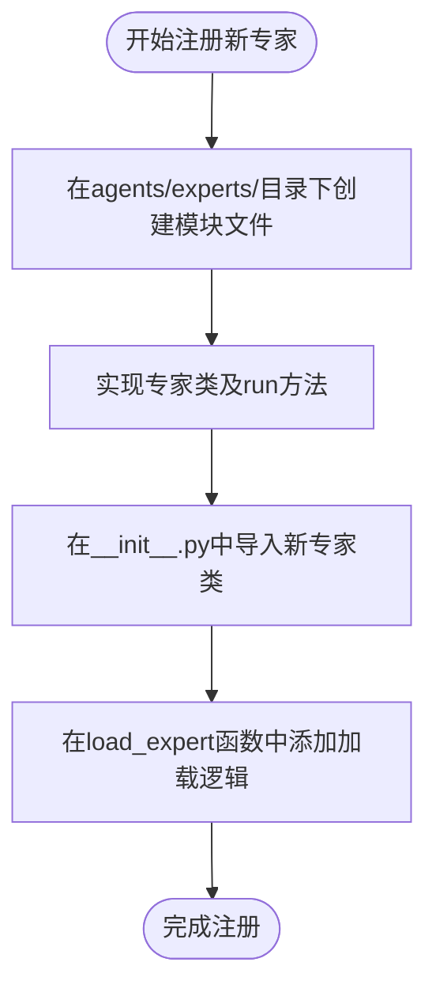
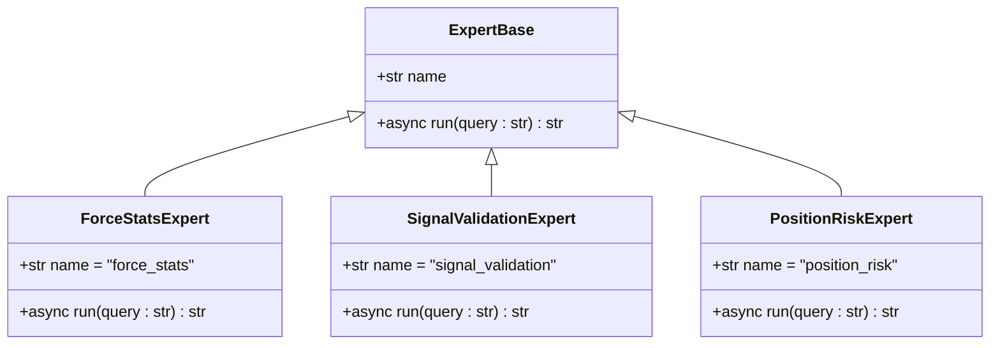
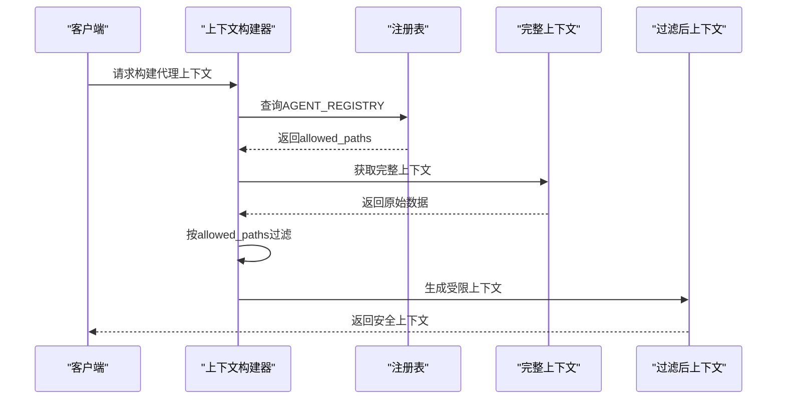
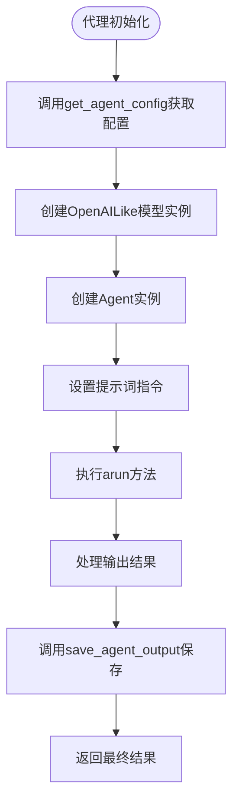

# 注册专家代理

<cite>
**本文档引用文件**  
- [agent_server/agents/experts/__init__.py](file://agent_server/agents/experts/__init__.py)
- [agent_server/agents/experts/analysis/__init__.py](file://agent_server/agents/experts/analysis/__init__.py)
- [agent_server/agents/experts/orchestration/__init__.py](file://agent_server/agents/experts/orchestration/__init__.py)
- [agent_server/agent_context/registry.py](file://agent_server/agent_context/registry.py)
- [agent_server/agent_context/contracts.py](file://agent_server/agent_context/contracts.py)
- [agent_server/agents/experts/analysis/force_stats.py](file://agent_server/agents/experts/analysis/force_stats.py)
- [agent_server/agents/experts/analysis/signal_validation.py](file://agent_server/agents/experts/analysis/signal_validation.py)
- [agent_server/agents/experts/analysis/position_risk.py](file://agent_server/agents/experts/analysis/position_risk.py)
- [agent_server/agent_context/builder.py](file://agent_server/agent_context/builder.py)
- [agent_server/agent_context/output_store.py](file://agent_server/agent_context/output_store.py)
- [agent_server/agent_workflow/signal_validation_workflow.py](file://agent_server/agent_workflow/signal_validation_workflow.py)
</cite>

## 目录
1. [引言](#引言)
2. [专家代理注册流程](#专家代理注册流程)
3. [核心组件分析](#核心组件分析)
4. [上下文契约与安全边界](#上下文契约与安全边界)
5. [代理初始化与依赖注入](#代理初始化与依赖注入)
6. [异常传播机制](#异常传播机制)
7. [单元测试验证方法](#单元测试验证方法)
8. [结论](#结论)

## 引言
本文档系统阐述如何在agent_server中注册新的分析专家代理。通过解析现有代码结构，说明如何在`agents/experts/`目录下创建专属模块，实现核心分析逻辑，并通过`__init__.py`中的`load_expert`接口暴露。重点解析`AGENT_REGISTRY`配置项的含义，包括agent角色、作用域、允许访问的数据路径及语义限制。以`force_stats`和`signal_validation`代理为例，展示上下文权限控制与安全边界设计。

## 专家代理注册流程

### 创建专家模块
开发者需在`agents/experts/`目录下的相应子目录（如`analysis`、`background`、`orchestration`）中创建新的Python模块文件（`.py`），并定义一个类来实现具体的分析逻辑。

### 实现核心分析逻辑
每个专家代理类必须包含一个名为`name`的类属性和一个异步的`run`方法。`run`方法接收一个字符串查询参数，返回处理后的结果字符串。

### 暴露代理接口
通过在对应目录的`__init__.py`文件中导入新创建的专家类，并在`load_expert`函数中添加相应的分支逻辑，使系统能够根据名称动态加载该专家代理。

**图示来源**
- [agent_server/agents/experts/__init__.py](file://agent_server/agents/experts/__init__.py)
- [agent_server/agents/experts/analysis/force_stats.py](file://agent_server/agents/experts/analysis/force_stats.py)

**本节来源**
- [agent_server/agents/experts/__init__.py](file://agent_server/agents/experts/__init__.py)
- [agent_server/agents/experts/analysis/force_stats.py](file://agent_server/agents/experts/analysis/force_stats.py)

## 核心组件分析

### 专家代理类结构
所有专家代理继承相同的基类模式，具有统一的接口规范。核心字段包括：
- `name`: 代理唯一标识符
- `run(query: str) -> str`: 主执行方法

### load_expert函数机制
`load_expert`函数作为工厂方法，根据传入的代理名称字符串，返回对应的专家代理实例。它通过一系列if语句判断来决定实例化哪个具体的专家类。

### 配置管理
通过`configs/source.py`中的`get_agent_config`函数获取各代理所需的模型配置信息，包括模型ID、基础URL和API密钥等。

**图示来源**
- [agent_server/agents/experts/analysis/force_stats.py](file://agent_server/agents/experts/analysis/force_stats.py)
- [agent_server/agents/experts/analysis/signal_validation.py](file://agent_server/agents/experts/analysis/signal_validation.py)
- [agent_server/agents/experts/analysis/position_risk.py](file://agent_server/agents/experts/analysis/position_risk.py)

**本节来源**
- [agent_server/agents/experts/analysis/force_stats.py](file://agent_server/agents/experts/analysis/force_stats.py)
- [agent_server/agents/experts/analysis/signal_validation.py](file://agent_server/agents/experts/analysis/signal_validation.py)
- [agent_server/agents/experts/analysis/position_risk.py](file://agent_server/agents/experts/analysis/position_risk.py)

## 上下文契约与安全边界

### AGENT_REGISTRY配置解析
`AGENT_REGISTRY`定义了每个专家代理的上下文契约，包含以下关键字段：

| 配置项 | 含义 | 示例值 |
|-------|------|--------|
| agent | 代理名称 | "force_stats" |
| role | 代理角色 | "liquidation_structure" |
| scope | 分析时间尺度边界 | ["micro", "short"] |
| uses_crowd_state | 是否允许使用人群状态数据 | true |
| allows_cross_timeframe_inference | 是否允许跨周期推理 | false |
| forbidden_semantics | 禁止的语义类型 | ["trend_forecast", "strategy_advice"] |
| allowed_paths | 允许访问的数据路径白名单 | ["market_state.micro_term.state", ...] |

### 上下文构建机制
`build_agent_context`函数根据代理名称从`AGENT_REGISTRY`中获取其允许的路径列表，并仅提取全上下文中符合白名单的字段，从而实现数据访问的安全隔离。

### 安全边界设计实例
以`signal_validation`代理为例，其配置明确禁止生成新的方向建议（`generate_new_direction`），且不允许跨周期外推，确保其只能在限定范围内进行信号有效性验证。

**图示来源**
- [agent_server/agent_context/registry.py](file://agent_server/agent_context/registry.py)
- [agent_server/agent_context/builder.py](file://agent_server/agent_context/builder.py)

**本节来源**
- [agent_server/agent_context/registry.py](file://agent_server/agent_context/registry.py)
- [agent_server/agent_context/builder.py](file://agent_server/agent_context/builder.py)

## 代理初始化与依赖注入

### 初始化流程
专家代理的初始化主要在`run`方法内部完成，通过调用`get_agent_config`获取配置，然后实例化相应的LLM模型和Agent对象。

### 依赖注入方式
系统采用显式依赖注入模式，在`run`方法中直接创建所需依赖（如模型、工具等），而非通过构造函数注入。这种方式简化了代理类的设计，但增加了运行时开销。

### 工作流集成
专家代理可被集成到复杂的工作流中，如`SignalValidationWorkflow`将`SignalValidationComponent`和`PositionRiskExecutionComponent`串联执行，实现多阶段分析。

**图示来源**
- [agent_server/agents/experts/analysis/force_stats.py](file://agent_server/agents/experts/analysis/force_stats.py)
- [agent_server/agent_workflow/signal_validation_workflow.py](file://agent_server/agent_workflow/signal_validation_workflow.py)

**本节来源**
- [agent_server/agents/experts/analysis/force_stats.py](file://agent_server/agents/experts/analysis/force_stats.py)
- [agent_server/agent_workflow/signal_validation_workflow.py](file://agent_server/agent_workflow/signal_validation_workflow.py)

## 异常传播机制

### 错误处理策略
系统采用宽容性错误处理策略，在关键操作周围使用try-catch块捕获异常，避免因单个组件失败导致整个流程中断。

### 日志与降级
当发生JSON解析错误或保存失败时，系统会记录原始内容并继续执行，保证服务的可用性。例如`_extract_json_from_text`函数尝试从文本中提取合法JSON片段作为降级方案。

### 输出封装保护
`wrap_agent_output`函数确保即使代理输出异常，也能生成结构化的元数据包裹，便于后续处理和调试。

**本节来源**
- [agent_server/agents/experts/analysis/force_stats.py](file://agent_server/agents/experts/analysis/force_stats.py)
- [agent_server/agent_context/output_store.py](file://agent_server/agent_context/output_store.py)

## 单元测试验证方法

### 测试覆盖范围
单元测试应覆盖以下方面：
- 代理能否正确初始化
- `run`方法能否正常执行并返回有效结果
- 上下文过滤是否符合`AGENT_REGISTRY`定义
- 输出是否被正确保存至Redis

### 测试数据准备
使用模拟的市场状态和人群状态数据作为输入，验证代理在不同场景下的行为一致性。

### 验证点设计
重点验证安全边界是否生效，例如检查`signal_validation`代理是否真的无法访问被禁止的语义类型或数据路径。

**本节来源**
- [tests/test_force_stats_sim_btc.py](file://tests/test_force_stats_sim_btc.py)
- [tests/test_signal_validation.py](file://tests/test_signal_validation.py)

## 结论
本文档详细说明了在agent_server中注册新专家代理的完整流程和技术细节。通过遵循统一的模块结构、实现标准接口、正确配置上下文契约，开发者可以安全地扩展系统功能。系统的上下文权限控制机制有效保障了数据访问的安全性，而清晰的依赖管理和异常处理策略则提高了整体稳定性。建议新开发者参照`force_stats`和`signal_validation`等现有实现进行开发，并充分测试以确保符合安全边界要求。