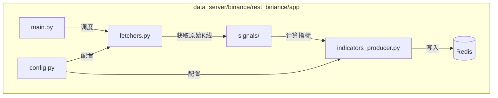
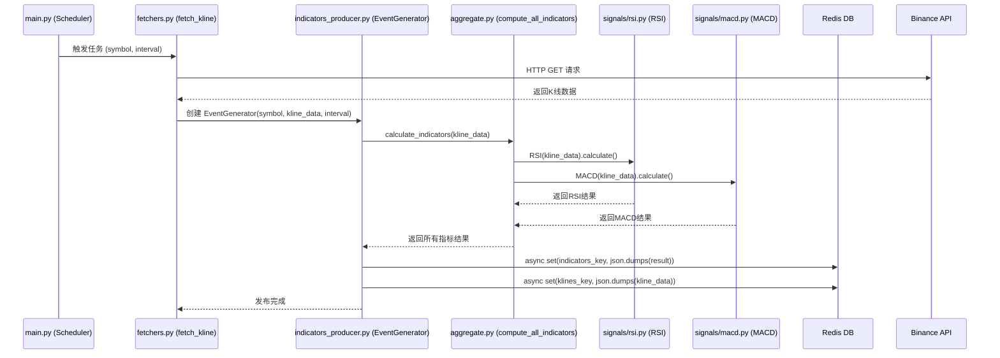
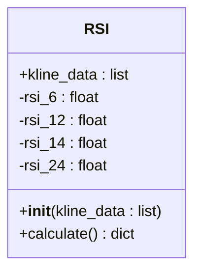
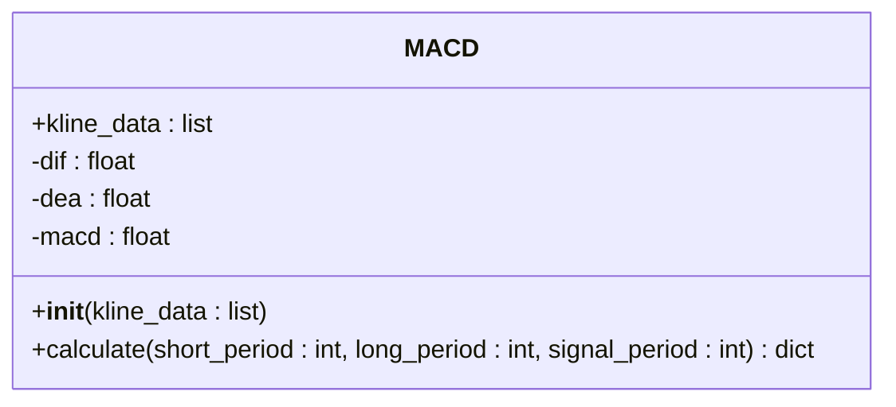
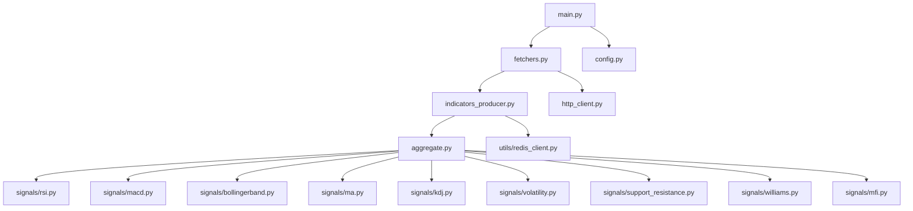

# 添加技术指标

<cite>
**本文档中引用的文件**  
- [rsi.py](file://data_server/binance/rest_binance/app/signals/rsi.py)
- [macd.py](file://data_server/binance/rest_binance/app/signals/macd.py)
- [aggregate.py](file://data_server/binance/rest_binance/app/signals/aggregate.py)
- [indicators_producer.py](file://data_server/binance/rest_binance/app/indicators_producer.py)
- [config.py](file://data_server/binance/rest_binance/app/config.py)
- [main.py](file://data_server/binance/rest_binance/app/main.py)
- [fetchers.py](file://data_server/binance/rest_binance/app/fetchers.py)
- [redis_stream.py](file://data_server/binance/rest_binance/app/utils/redis_stream.py)
</cite>

## 目录
1. [简介](#简介)
2. [项目结构](#项目结构)
3. [核心组件](#核心组件)
4. [架构概述](#架构概述)
5. [详细组件分析](#详细组件分析)
6. [依赖分析](#依赖分析)
7. [性能考虑](#性能考虑)
8. [故障排除指南](#故障排除指南)
9. [结论](#结论)

## 简介
本文档提供在 `data_server` 中添加新技术指标的完整开发指南。重点说明如何在 `data_server/binance/rest_binance/app/signals/` 目录下创建新的指标类，继承基础信号类，实现 `calculate` 方法，并确保输出符合 `IndicatorData` 标准结构。通过 RSI 和 MACD 的实现作为参考模板，详细解释如何通过 `IndicatorsProducer` 注册新指标并配置采集频率。同时涵盖配置文件修改、依赖库引入、异常处理机制及单元测试编写建议。最后演示如何验证新指标数据是否正确写入 Redis Stream 并通过 API 暴露，以及解决常见问题如计算性能瓶颈、浮点精度误差、跨周期数据对齐等。

## 项目结构
`data_server` 模块负责从 Binance API 获取市场数据并计算技术指标。其核心功能集中在 `rest_binance/app/` 目录下，其中 `signals/` 子目录包含了所有技术指标的实现类。每个指标类都是一个独立的 Python 文件，遵循统一的设计模式：接收 K 线数据，计算指标值，并返回标准化的字典结构。`indicators_producer.py` 负责协调所有指标的计算和结果的发布，而 `fetchers.py` 则负责从外部 API 获取原始 K 线数据。



**图源**
- [main.py](file://data_server/binance/rest_binance/app/main.py#L1-L99)
- [fetchers.py](file://data_server/binance/rest_binance/app/fetchers.py#L1-L226)
- [indicators_producer.py](file://data_server/binance/rest_binance/app/indicators_producer.py#L1-L42)

**本节来源**
- [main.py](file://data_server/binance/rest_binance/app/main.py#L1-L99)
- [fetchers.py](file://data_server/binance/rest_binance/app/fetchers.py#L1-L226)

## 核心组件
核心组件包括位于 `signals/` 目录下的各个技术指标类（如 `RSI`, `MACD`），它们是计算逻辑的载体。`IndicatorsProducer` 类是核心协调者，它调用 `compute_all_indicators` 函数来聚合所有指标的计算结果，并负责将结果发布到 Redis。`config.py` 提供了系统级的配置，如 Redis 连接信息和 API 速率限制。

**本节来源**
- [rsi.py](file://data_server/binance/rest_binance/app/signals/rsi.py#L1-L21)
- [macd.py](file://data_server/binance/rest_binance/app/signals/macd.py#L1-L24)
- [indicators_producer.py](file://data_server/binance/rest_binance/app/indicators_producer.py#L1-L42)
- [config.py](file://data_server/binance/rest_binance/app/config.py#L1-L26)

## 架构概述
系统采用生产者-消费者模式。`main.py` 中的调度器根据配置的频率（如每 20 秒一次）触发 `fetch_kline` 任务。该任务从 Binance API 获取指定交易对和时间周期的 K 线数据。数据获取后，立即传递给 `IndicatorsProducer`。`IndicatorsProducer` 调用 `aggregate.py` 中的 `compute_all_indicators` 函数，该函数会实例化 `signals/` 目录下的所有指标类，并调用它们的 `calculate` 方法进行计算。最终，所有计算结果被聚合为一个字典，并通过 `Redis` 客户端写入指定的键（key）中，供下游系统（如 `event_center`）消费。



**图源**
- [main.py](file://data_server/binance/rest_binance/app/main.py#L46-L57)
- [fetchers.py](file://data_server/binance/rest_binance/app/fetchers.py#L33-L50)
- [indicators_producer.py](file://data_server/binance/rest_binance/app/indicators_producer.py#L6-L34)
- [aggregate.py](file://data_server/binance/rest_binance/app/signals/aggregate.py#L12-L44)

## 详细组件分析

### 如何添加新的技术指标
要添加一个新的技术指标（例如，名为 `NewIndicator` 的指标），请遵循以下步骤：

1.  **创建新文件**：在 `data_server/binance/rest_binance/app/signals/` 目录下创建一个新的 Python 文件，例如 `new_indicator.py`。
2.  **实现指标类**：
    *   **继承与初始化**：定义一个类（如 `NewIndicator`），其 `__init__` 方法接收 `kline_data` 作为参数，并将其存储为实例变量。同时，初始化所有需要计算的指标字段。
    *   **实现 `calculate` 方法**：这是核心方法。在此方法中，从 `kline_data` 中提取收盘价等所需数据，使用 `ta` 库或其他数学方法进行计算。必须处理数据不足的情况（如 `len(closes) < 所需周期`），并抛出 `ValueError` 或返回默认值。计算完成后，返回一个符合 `IndicatorData` 标准结构的字典。
    *   **参考模板**：`rsi.py` 和 `macd.py` 是优秀的参考模板。`RSI` 展示了如何计算多个周期的同一指标，`MACD` 展示了如何处理计算参数和数据不足的异常。

#### RSI 实现分析


**图源**
- [rsi.py](file://data_server/binance/rest_binance/app/signals/rsi.py#L5-L20)

#### MACD 实现分析


**图源**
- [macd.py](file://data_server/binance/rest_binance/app/signals/macd.py#L5-L23)

**本节来源**
- [rsi.py](file://data_server/binance/rest_binance/app/signals/rsi.py#L1-L21)
- [macd.py](file://data_server/binance/rest_binance/app/signals/macd.py#L1-L24)

### 注册与配置
新指标的注册是自动的，通过 `aggregate.py` 文件实现。您需要在 `aggregate.py` 的顶部 `import` 新的指标类，然后在 `compute_all_indicators` 函数中实例化它并调用 `calculate` 方法，最后将结果存入 `out` 字典。

```python
# 在 aggregate.py 中添加
from .new_indicator import NewIndicator

def compute_all_indicators(kline_data):
    out = {}
    # ... 其他指标
    # New Indicator
    new_ind = NewIndicator(kline_data).calculate()
    out["new_indicator"] = new_ind # 键名将作为API中的字段名
    return out
```

采集频率由 `main.py` 中的 `FETCH_PLAN` 和 `config.py` 中的 `rate_limits_seconds` 共同决定。`FETCH_PLAN` 定义了哪些时间周期的数据需要被拉取，而 `rate_limits_seconds` 则规定了每个周期的拉取间隔（以秒为单位）。例如，`'1m': 20` 表示每 20 秒拉取一次 1 分钟的 K 线数据，从而触发一次指标计算。

**本节来源**
- [aggregate.py](file://data_server/binance/rest_binance/app/signals/aggregate.py#L1-L44)
- [config.py](file://data_server/binance/rest_binance/app/config.py#L9-L18)
- [main.py](file://data_server/binance/rest_binance/app/main.py#L46-L57)

### 数据写入与暴露
计算完成的指标数据由 `IndicatorsProducer` 类负责写入 Redis。`publish` 方法使用 `get_redis_client` 获取 Redis 连接，并通过 `set` 命令将指标数据（JSON 格式）存储在以 `indicators:binance:{symbol}:{interval}` 为键的字符串中。同时，原始 K 线数据也被存储。下游的 `api` 服务可以通过读取这些 Redis 键来获取数据，并通过 HTTP API 暴露给前端或其他服务。

**本节来源**
- [indicators_producer.py](file://data_server/binance/rest_binance/app/indicators_producer.py#L21-L34)

## 依赖分析
系统依赖关系清晰。`main.py` 依赖于 `fetchers.py` 和 `config.py` 来执行调度任务。`fetchers.py` 依赖于 `indicators_producer.py` 来发布计算结果，而 `indicators_producer.py` 又依赖于 `aggregate.py` 来计算所有指标。`aggregate.py` 是依赖的核心，它直接导入并使用 `signals/` 目录下的所有具体指标实现类。所有与 Redis 的交互都通过 `utils/` 目录下的 `redis_client.py` 和 `redis_stream.py` 进行。



**图源**
- [main.py](file://data_server/binance/rest_binance/app/main.py#L1-L99)
- [fetchers.py](file://data_server/binance/rest_binance/app/fetchers.py#L1-L226)
- [indicators_producer.py](file://data_server/binance/rest_binance/app/indicators_producer.py#L1-L42)
- [aggregate.py](file://data_server/binance/rest_binance/app/signals/aggregate.py#L1-L44)

**本节来源**
- [main.py](file://data_server/binance/rest_binance/app/main.py#L1-L99)
- [fetchers.py](file://data_server/binance/rest_binance/app/fetchers.py#L1-L226)
- [indicators_producer.py](file://data_server/binance/rest_binance/app/indicators_producer.py#L1-L42)
- [aggregate.py](file://data_server/binance/rest_binance/app/signals/aggregate.py#L1-L44)

## 性能考虑
*   **计算性能**：指标计算是同步进行的，如果某个指标计算过于复杂（如涉及大量循环或复杂模型），会阻塞整个 `publish` 流程。建议对复杂计算进行性能分析，考虑使用更高效的算法或库（如 `numba` 加速）。
*   **数据对齐**：`kline_data` 通常是一个包含多个 K 线的列表。确保在计算时使用正确的数据切片，特别是在处理不同时间周期（跨周期）的数据时，避免数据错位。
*   **浮点精度**：使用 `float()` 转换时需注意精度损失。对于金融计算，可考虑使用 `decimal` 模块，但需权衡性能开销。目前代码中使用 `float` 是常见做法，但在关键比较逻辑中应避免直接比较浮点数相等。
*   **异常处理**：`fetchers.py` 中的 `fetch_kline` 函数对 `IndicatorsProducer` 的调用使用了 `try-except`，这确保了即使指标计算失败，也不会中断数据拉取流程，保证了系统的健壮性。

## 故障排除指南
*   **新指标未生效**：检查 `aggregate.py` 是否正确导入了新指标类，并且在 `compute_all_indicators` 函数中进行了调用和赋值。
*   **Redis 中无数据**：检查 `indicators_producer.py` 的 `publish` 方法是否被成功调用。确认 Redis 连接配置（`config.py`）是否正确，以及目标 Redis 实例是否正常运行。
*   **API 无法获取数据**：确认 `api` 服务是否正确配置了从 Redis 读取 `indicators:binance:*` 键的逻辑。
*   **计算结果异常**：检查 `kline_data` 的数据结构是否符合预期（例如，`item[4]` 是否为收盘价）。在 `calculate` 方法中添加日志输出，检查中间计算结果。
*   **速率限制错误**：检查 `config.py` 中的 `rate_limits_seconds` 配置是否与 Binance API 的实际限制相符，避免因请求过频被封禁。

**本节来源**
- [indicators_producer.py](file://data_server/binance/rest_binance/app/indicators_producer.py#L27-L33)
- [config.py](file://data_server/binance/rest_binance/app/config.py#L9-L18)
- [fetchers.py](file://data_server/binance/rest_binance/app/fetchers.py#L48-L49)

## 结论
在 `data_server` 中添加新的技术指标是一个结构化且可预测的过程。开发者需要在 `signals/` 目录下创建符合规范的指标类，实现其计算逻辑，并在 `aggregate.py` 中注册。系统通过 `main.py` 的调度器定期拉取数据，触发指标计算，并将结果通过 `IndicatorsProducer` 写入 Redis。整个流程清晰，依赖明确，为扩展技术分析能力提供了坚实的基础。遵循本文档的指南，可以高效、可靠地集成新的分析指标。