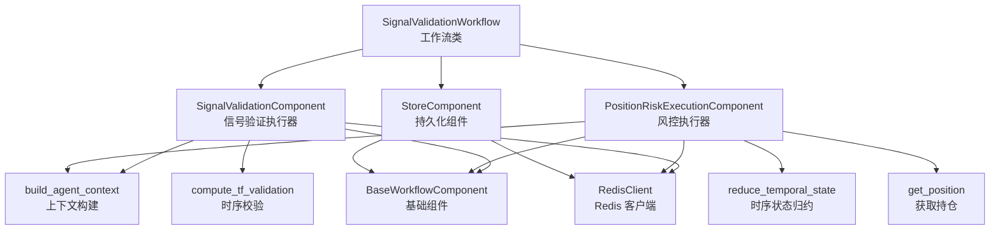
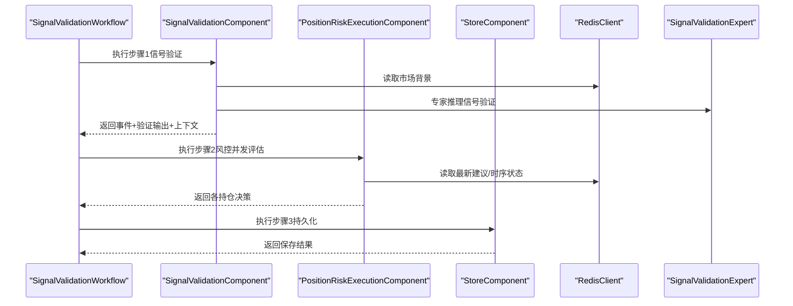
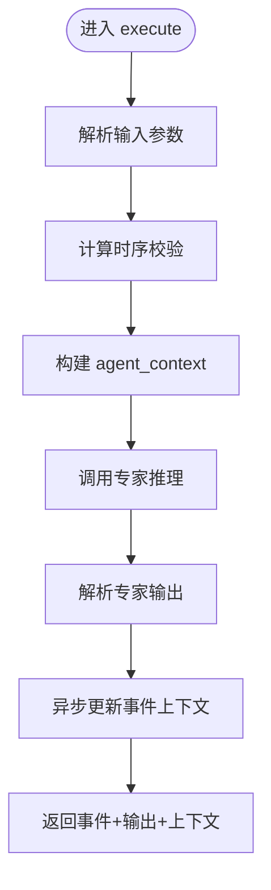
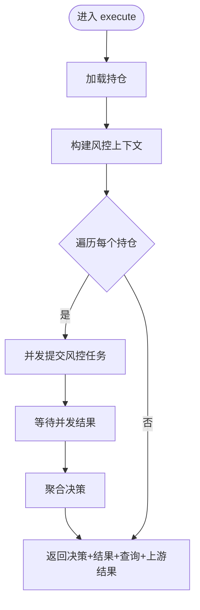
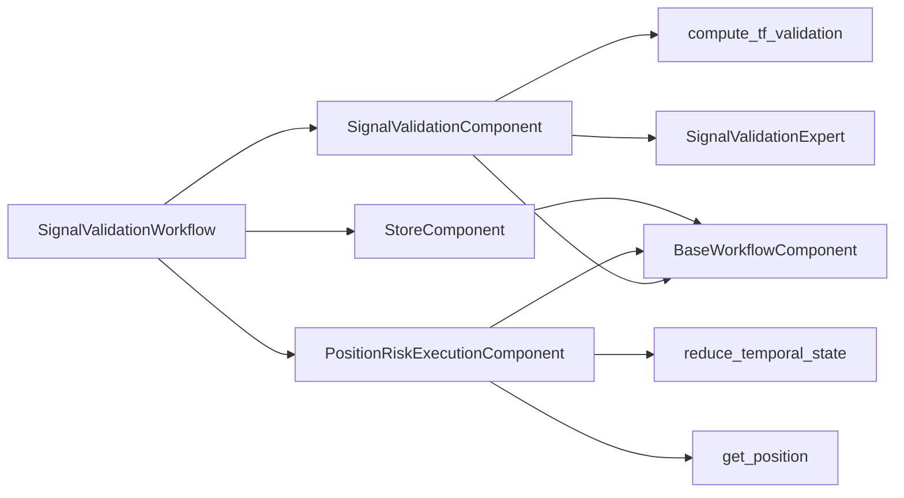

# 自定义工作流

<cite>
**本文引用的文件**
- [agent_server/agent_workflow/signal_validation_workflow.py](file://agent_server/agent_workflow/signal_validation_workflow.py)
- [agent_server/agent_workflow/components/base.py](file://agent_server/agent_workflow/components/base.py)
- [agent_server/agent_workflow/components/store.py](file://agent_server/agent_workflow/components/store.py)
- [agent_server/agent_workflow/components/executors/signal_validation_execution.py](file://agent_server/agent_workflow/components/executors/signal_validation_execution.py)
- [agent_server/agent_workflow/components/executors/position_risk_execution.py](file://agent_server/agent_workflow/components/executors/position_risk_execution.py)
- [agent_server/agent_context/builder.py](file://agent_server/agent_context/builder.py)
- [agent_server/utils/redis_client.py](file://agent_server/utils/redis_client.py)
- [agent_server/tools/tf_validation.py](file://agent_server/tools/tf_validation.py)
- [agent_server/reducers/temporal_state_reducer.py](file://agent_server/reducers/temporal_state_reducer.py)
- [agent_server/agents/experts/analysis/signal_validation.py](file://agent_server/agents/experts/analysis/signal_validation.py)
- [agent_server/utils/trade_event_recorder.py](file://agent_server/utils/trade_event_recorder.py)
- [agent_server/config.py](file://agent_server/config.py)
</cite>

## 目录
1. [简介](#简介)
2. [项目结构](#项目结构)
3. [核心组件](#核心组件)
4. [架构总览](#架构总览)
5. [详细组件分析](#详细组件分析)
6. [依赖关系分析](#依赖关系分析)
7. [性能考虑](#性能考虑)
8. [故障排查指南](#故障排查指南)
9. [结论](#结论)
10. [附录](#附录)

## 简介
本指南围绕 agent_workflow 框架，系统讲解如何设计与实现复杂任务执行流程。重点以 signal_validation_workflow 为例，解析其如何协调多个专家代理、管理上下文流转、控制执行顺序，并指导开发者实现新的执行器逻辑，包括前置条件检查、结果聚合与异常回滚、异步任务调度、Redis 状态持久化与执行日志追踪等关键技术点。同时提供性能优化建议，涵盖并发控制、缓存策略与资源隔离，帮助工作流稳定高效运行。

## 项目结构
agent_workflow 位于 agent_server/agent_workflow 下，采用“工作流类 + 组件化执行器 + 状态存储”的分层组织方式：
- 工作流类：定义步骤序列与组件装配
- 执行器组件：封装具体业务步骤（信号验证、风控评估）
- 基础组件：提供通用能力（上下文获取、JSON 解析、Redis 客户端）
- 上下文构建：按代理需求裁剪市场/人群状态
- 工具与专家：指标校验、时序状态归约、LLM 专家推理
- 存储组件：将最终决策轨迹持久化

图表来源
- [agent_server/agent_workflow/signal_validation_workflow.py](file://agent_server/agent_workflow/signal_validation_workflow.py#L1-L34)
- [agent_server/agent_workflow/components/executors/signal_validation_execution.py](file://agent_server/agent_workflow/components/executors/signal_validation_execution.py#L1-L71)
- [agent_server/agent_workflow/components/executors/position_risk_execution.py](file://agent_server/agent_workflow/components/executors/position_risk_execution.py#L1-L184)
- [agent_server/agent_workflow/components/store.py](file://agent_server/agent_workflow/components/store.py#L1-L52)
- [agent_server/agent_context/builder.py](file://agent_server/agent_context/builder.py#L1-L49)
- [agent_server/utils/redis_client.py](file://agent_server/utils/redis_client.py#L1-L53)
- [agent_server/tools/tf_validation.py](file://agent_server/tools/tf_validation.py#L1-L271)
- [agent_server/reducers/temporal_state_reducer.py](file://agent_server/reducers/temporal_state_reducer.py#L1-L147)

章节来源
- [agent_server/agent_workflow/signal_validation_workflow.py](file://agent_server/agent_workflow/signal_validation_workflow.py#L1-L34)

## 核心组件
- 工作流类：通过步骤数组串联执行器，形成确定性执行顺序
- 执行器组件：各自负责输入解析、上下文构建、并发执行与结果聚合
- 基础组件：统一提供 JSON 解析、安全序列化、Redis 访问与市场上下文获取
- 上下文构建：按代理允许路径裁剪 full_context，避免泄露敏感或冗余信息
- 存储组件：将每笔交易的完整决策轨迹落盘，便于审计与复盘

章节来源
- [agent_server/agent_workflow/signal_validation_workflow.py](file://agent_server/agent_workflow/signal_validation_workflow.py#L1-L34)
- [agent_server/agent_workflow/components/base.py](file://agent_server/agent_workflow/components/base.py#L1-L44)
- [agent_server/agent_context/builder.py](file://agent_server/agent_context/builder.py#L1-L49)
- [agent_server/agent_workflow/components/store.py](file://agent_server/agent_workflow/components/store.py#L1-L52)

## 架构总览
signal_validation_workflow 将三个步骤串联：
1) 信号验证：构造查询、调用专家、异步更新事件上下文
2) 持仓风控：并发评估每个持仓，聚合决策
3) 持久化：按 trade_id 生成完整轨迹并落库

图表来源
- [agent_server/agent_workflow/signal_validation_workflow.py](file://agent_server/agent_workflow/signal_validation_workflow.py#L1-L34)
- [agent_server/agent_workflow/components/executors/signal_validation_execution.py](file://agent_server/agent_workflow/components/executors/signal_validation_execution.py#L1-L71)
- [agent_server/agent_workflow/components/executors/position_risk_execution.py](file://agent_server/agent_workflow/components/executors/position_risk_execution.py#L1-L184)
- [agent_server/agent_workflow/components/store.py](file://agent_server/agent_workflow/components/store.py#L1-L52)
- [agent_server/utils/redis_client.py](file://agent_server/utils/redis_client.py#L1-L53)
- [agent_server/agents/experts/analysis/signal_validation.py](file://agent_server/agents/experts/analysis/signal_validation.py#L1-L136)

## 详细组件分析

### 工作流类：SignalValidationWorkflow
- 职责：声明 run_id，实例化三个组件，组装步骤序列
- 关键点：步骤顺序固定，前一步输出作为下一步输入；组件间通过上下文传递数据

章节来源
- [agent_server/agent_workflow/signal_validation_workflow.py](file://agent_server/agent_workflow/signal_validation_workflow.py#L1-L34)

### 基础组件：BaseWorkflowComponent
- JSON 解析与安全序列化：支持字符串/字面量/JSON 多格式输入，保证输出可序列化
- 市场上下文获取：从 Redis 读取 background:*:market_state，构建标准化 full_context

章节来源
- [agent_server/agent_workflow/components/base.py](file://agent_server/agent_workflow/components/base.py#L1-L44)
- [agent_server/utils/redis_client.py](file://agent_server/utils/redis_client.py#L1-L53)

### 执行器组件：SignalValidationComponent
- 输入：事件数据（symbol/exchange/direction/tf_hint 等）
- 处理：
  - 计算时序校验（多周期指标对齐）
  - 构造 agent_context（按代理允许路径裁剪）
  - 调用专家推理，解析输出
  - 异步更新事件的市场背景快照（不影响主流程）
- 输出：事件数据、专家输出、上下文

图表来源
- [agent_server/agent_workflow/components/executors/signal_validation_execution.py](file://agent_server/agent_workflow/components/executors/signal_validation_execution.py#L1-L71)
- [agent_server/tools/tf_validation.py](file://agent_server/tools/tf_validation.py#L1-L271)
- [agent_server/agent_context/builder.py](file://agent_server/agent_context/builder.py#L1-L49)
- [agent_server/agents/experts/analysis/signal_validation.py](file://agent_server/agents/experts/analysis/signal_validation.py#L1-L136)

章节来源
- [agent_server/agent_workflow/components/executors/signal_validation_execution.py](file://agent_server/agent_workflow/components/executors/signal_validation_execution.py#L1-L71)

### 执行器组件：PositionRiskExecutionComponent
- 输入：来自上一步的事件数据、信号验证输出、上下文
- 处理：
  - 获取持仓列表
  - 构建风控上下文（市场/人群/操作上下文/时序状态）
  - 并发提交每个持仓的风控任务（异步 gather）
  - 聚合决策（推荐动作）
- 输出：决策列表、风险结果、查询集合、上游结果

图表来源
- [agent_server/agent_workflow/components/executors/position_risk_execution.py](file://agent_server/agent_workflow/components/executors/position_risk_execution.py#L1-L184)
- [agent_server/reducers/temporal_state_reducer.py](file://agent_server/reducers/temporal_state_reducer.py#L1-L147)

章节来源
- [agent_server/agent_workflow/components/executors/position_risk_execution.py](file://agent_server/agent_workflow/components/executors/position_risk_execution.py#L1-L184)

### 存储组件：StoreComponent
- 输入：决策列表、风险结果、查询集合、上游步骤结果
- 处理：
  - 按 trade_id 逐条生成完整轨迹
  - 保存事件输入、信号验证、风控评估、最终决策
- 输出：保存成功的 trade_id 列表与完成状态

章节来源
- [agent_server/agent_workflow/components/store.py](file://agent_server/agent_workflow/components/store.py#L1-L52)

### 上下文构建：build_agent_context
- 功能：按代理允许路径裁剪 full_context，去除内部字段，注入代理元信息
- 作用：确保专家仅获得所需上下文，降低噪声与泄露风险

章节来源
- [agent_server/agent_context/builder.py](file://agent_server/agent_context/builder.py#L1-L49)

### Redis 客户端：RedisClient
- 功能：提供 set/get/xadd/xrevrange_latest 等常用异步操作
- 用途：工作流中读取市场背景、写入时序状态、读取最新建议等

章节来源
- [agent_server/utils/redis_client.py](file://agent_server/utils/redis_client.py#L1-L53)

### 时序状态归约：reduce_temporal_state
- 功能：基于 verdict 序列与持有时间，维护 invalid/conflict/valid streak，覆盖写入 Redis
- 用途：风控决策的时序语义化状态，支撑操作上下文与风控限额

章节来源
- [agent_server/reducers/temporal_state_reducer.py](file://agent_server/reducers/temporal_state_reducer.py#L1-L147)

### 时序校验：compute_tf_validation
- 功能：多周期指标对齐与一致性判断，输出验证结论
- 用途：为信号验证提供多时间框架的一致性校验

章节来源
- [agent_server/tools/tf_validation.py](file://agent_server/tools/tf_validation.py#L1-L271)

### 专家推理：SignalValidationExpert
- 功能：加载代理配置，构造 LLM 请求，解析并安全序列化输出，记录代理输出
- 用途：信号验证阶段的核心推理能力

章节来源
- [agent_server/agents/experts/analysis/signal_validation.py](file://agent_server/agents/experts/analysis/signal_validation.py#L1-L136)

## 依赖关系分析
- 工作流类依赖三个执行器组件与存储组件
- 执行器组件共同依赖基础组件（JSON 解析、Redis 访问、上下文构建）
- 信号验证执行器依赖时序校验与专家推理
- 风控执行器依赖时序状态归约、Redis 读取最新建议、获取持仓
- 存储组件依赖基础组件进行 JSON 序列化

图表来源
- [agent_server/agent_workflow/signal_validation_workflow.py](file://agent_server/agent_workflow/signal_validation_workflow.py#L1-L34)
- [agent_server/agent_workflow/components/executors/signal_validation_execution.py](file://agent_server/agent_workflow/components/executors/signal_validation_execution.py#L1-L71)
- [agent_server/agent_workflow/components/executors/position_risk_execution.py](file://agent_server/agent_workflow/components/executors/position_risk_execution.py#L1-L184)
- [agent_server/agent_workflow/components/store.py](file://agent_server/agent_workflow/components/store.py#L1-L52)
- [agent_server/tools/tf_validation.py](file://agent_server/tools/tf_validation.py#L1-L271)
- [agent_server/reducers/temporal_state_reducer.py](file://agent_server/reducers/temporal_state_reducer.py#L1-L147)

章节来源
- [agent_server/agent_workflow/signal_validation_workflow.py](file://agent_server/agent_workflow/signal_validation_workflow.py#L1-L34)

## 性能考虑
- 并发控制
  - 风控执行器对每个持仓并发提交任务，使用异步 gather 聚合结果，提升吞吐
  - 建议：限制最大并发度，避免 Redis/LLM 限流；对高延迟专家增加超时与重试
- 缓存策略
  - Redis 缓存市场背景与最新建议，减少重复读取
  - 建议：对热点键设置合理 TTL，避免内存膨胀
- 资源隔离
  - 专家推理与数据库写入分离，使用线程池与异步 I/O
  - 建议：为不同代理分配独立模型实例或队列，避免相互干扰
- 日志与可观测性
  - 在关键步骤打印运行标识，便于定位问题
  - 建议：引入结构化日志与链路追踪，标注 run_id 与 trade_id

[本节为通用性能建议，无需特定文件引用]

## 故障排查指南
- JSON 解析异常
  - 现象：专家输出非标准 JSON
  - 处理：基础组件提供多格式解析与安全序列化，必要时回退为原始文本包装
  - 参考：基础组件的解析与序列化方法
- Redis 访问失败
  - 现象：读取市场背景或最新建议为空
  - 处理：检查连接参数与键命名；确认后台服务是否推送最新状态
- 专家推理失败
  - 现象：LLM 返回内容不可解析
  - 处理：捕获异常并记录原始输出；检查代理配置与提示词
- 并发任务阻塞
  - 现象：风控评估耗时过长
  - 处理：调整并发度；为慢专家增加超时与熔断；拆分任务批次
- 持久化失败
  - 现象：轨迹未入库
  - 处理：检查数据库连接与事务；确认 trade_id 是否有效

章节来源
- [agent_server/agent_workflow/components/base.py](file://agent_server/agent_workflow/components/base.py#L1-L44)
- [agent_server/utils/redis_client.py](file://agent_server/utils/redis_client.py#L1-L53)
- [agent_server/agents/experts/analysis/signal_validation.py](file://agent_server/agents/experts/analysis/signal_validation.py#L1-L136)
- [agent_server/agent_workflow/components/executors/position_risk_execution.py](file://agent_server/agent_workflow/components/executors/position_risk_execution.py#L1-L184)
- [agent_server/agent_workflow/components/store.py](file://agent_server/agent_workflow/components/store.py#L1-L52)

## 结论
通过 signal_validation_workflow 的实践，可以看到 agent_workflow 框架以“工作流类 + 组件化执行器 + 状态存储”为核心，实现了清晰的职责划分与稳定的执行流程。开发者可据此快速扩展新的工作流：定义新的执行器组件，继承基础组件以复用通用能力，利用 Redis 实现状态持久化与上下文共享，结合异步并发与缓存策略提升性能，并通过完善的日志与异常处理保障稳定性。

[本节为总结性内容，无需特定文件引用]

## 附录

### 如何新增一个执行器组件
- 继承基础组件，复用 JSON 解析、Redis 访问与上下文获取
- 在工作流类中注册步骤，确保顺序正确
- 处理前置条件（如无持仓跳过）、并发任务与结果聚合
- 输出标准化上下文，便于下游组件消费

章节来源
- [agent_server/agent_workflow/components/base.py](file://agent_server/agent_workflow/components/base.py#L1-L44)
- [agent_server/agent_workflow/signal_validation_workflow.py](file://agent_server/agent_workflow/signal_validation_workflow.py#L1-L34)

### 关键配置参考
- Redis 连接参数：主机、端口、密码、数据库
- 速率限制与超时：用于控制外部请求节奏
- 代理配置：模型 ID、基础 URL、API Key

章节来源
- [agent_server/config.py](file://agent_server/config.py#L1-L61)
- [agent_server/utils/redis_client.py](file://agent_server/utils/redis_client.py#L1-L53)
- [agent_server/agents/experts/analysis/signal_validation.py](file://agent_server/agents/experts/analysis/signal_validation.py#L1-L136)