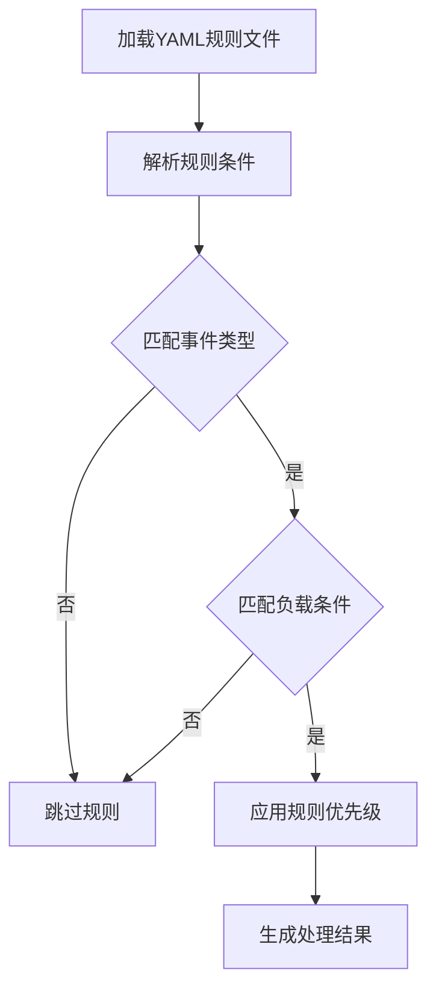

# 技术栈与依赖

<cite>
**本文档中引用的文件**  
- [requirements.txt](file://requirements.txt)
- [pyproject.toml](file://pyproject.toml)
- [agent_server/config.py](file://agent_server/config.py)
- [agent_server/utils/redis_client.py](file://agent_server/utils/redis_client.py)
- [agent_server/configs/source.py](file://agent_server/configs/source.py)
- [event_center/rules.yml](file://event_center/rules.yml)
- [event_center/indicators_event/config/strength_weights.yaml](file://event_center/indicators_event/config/strength_weights.yaml)
- [event_center/indicators_event/config/combo_discount.yaml](file://event_center/indicators_event/config/combo_discount.yaml)
- [event_center/indicators_event_plugins/meta_combo.py](file://event_center/indicators_event_plugins/meta_combo.py)
- [event_center/rules.py](file://event_center/rules.py)
- [api/main.py](file://api/main.py)
- [api/application/settings.py](file://api/application/settings.py)
- [data_server/binance/rest_binance/app/utils/redis_client.py](file://data_server/binance/rest_binance/app/utils/redis_client.py)
- [data_server/binance/ws_binance/utils/redis_client.py](file://data_server/binance/ws_binance/utils/redis_client.py)
- [event_center/config.py](file://event_center/config.py)
</cite>

## 目录
1. [技术栈概览](#技术栈概览)
2. [核心库与依赖](#核心库与依赖)
3. [外部依赖列表](#外部依赖列表)
4. [环境配置指南](#环境配置指南)
5. [配置文件使用说明](#配置文件使用说明)
6. [部署环境调整建议](#部署环境调整建议)

## 技术栈概览

UTaker项目采用现代化的Python异步技术栈，构建了一个高性能、可扩展的金融信号分析与决策系统。系统基于FastAPI构建RESTful接口，利用Asyncio实现高并发异步处理，通过Redis作为消息总线和状态存储，结合Tortoise ORM进行数据库操作，并集成agno库调用LLM进行语义分析。系统各组件通过消息流（如Redis Stream）进行解耦通信，形成了清晰的事件驱动架构。

项目主要由多个服务模块组成：`agent_server`负责智能体决策，`api`提供Web接口，`data_server/binance`处理数据采集，`event_center`负责事件处理与规则引擎。这些模块通过Redis进行数据交换，实现了松耦合的微服务架构。

**Section sources**
- [agent_server/config.py](file://agent_server/config.py#L1-L61)
- [api/main.py](file://api/main.py#L1-L14)
- [event_center/config.py](file://event_center/config.py#L1-L23)

## 核心库与依赖

### FastAPI
FastAPI用于构建高性能的RESTful API接口。项目中的`api`模块使用FastAPI作为Web框架，通过`create_app()`函数创建应用实例，并使用Uvicorn作为ASGI服务器运行。FastAPI的依赖注入系统和自动API文档生成功能简化了接口开发和测试。

### Redis
Redis在系统中扮演着消息总线和状态存储的双重角色。多个模块（`agent_server`、`data_server`、`event_center`）都实现了Redis客户端，用于读写数据和消息流。系统使用Redis Stream作为事件队列，实现组件间的异步通信。同时，Redis也用于存储最新的状态数据，提供快速访问。

### Asyncio
Asyncio是整个系统的基础，支持高并发异步处理。项目中的所有I/O操作（如HTTP请求、Redis操作、数据库访问）都采用异步方式实现。通过`async/await`语法，系统能够高效处理大量并发任务，特别是在数据采集和实时分析场景下表现出色。

### Pydantic
Pydantic用于数据模型验证和配置管理。虽然在代码中未直接看到Pydantic模型的定义，但其作为FastAPI的底层依赖，用于请求和响应的数据验证。同时，项目中的配置类（如`Settings`）采用了类似的配置管理模式。

### Tortoise ORM
Tortoise ORM用于数据库操作，提供异步的ORM功能。项目通过`TORTOISE_ORM`配置字典定义数据库连接和模型映射，使用`aerich`进行数据库迁移管理。ORM配置指向PostgreSQL数据库，通过asyncpg引擎进行连接。

### APScheduler
虽然在代码中未直接看到APScheduler的使用，但系统通过自定义的调度机制实现了定时任务。`utils/scheduler.py`模块提供了`run_interval`函数，用于周期性执行异步任务，实现了类似APScheduler的功能。

### agno
agno库用于集成LLM进行语义分析。在`agent_server/agents/experts/analysis/signal_validation.py`中，通过`agno.agent.Agent`和`agno.models.OpenAILike`创建LLM代理，调用大语言模型进行信号验证和决策分析。系统为不同智能体配置了不同的LLM模型和API端点。

**Section sources**
- [agent_server/agents/experts/analysis/signal_validation.py](file://agent_server/agents/experts/analysis/signal_validation.py#L1-L135)
- [api/application/settings.py](file://api/application/settings.py#L1-L34)
- [agent_server/utils/scheduler.py](file://agent_server/utils/scheduler.py#L1-L22)

## 外部依赖列表

以下是项目的主要外部依赖及其版本约束：

```text
fastapi==0.115.8
uvicorn==0.34.0
aioredis==2.0.1
redis==5.2.1
tortoise-orm==0.21.0
aerich==0.8.1
agno==2.2.10
APScheduler==3.11.0
pydantic==2.10.6
pydantic-settings==2.11.0
asyncpg==0.30.0
aiohttp==3.13.2
```

这些依赖在`requirements.txt`文件中明确定义，确保了开发和生产环境的一致性。项目还使用`pyproject.toml`文件进行额外的工具配置，如`aerich`的数据库迁移配置。

**Section sources**
- [requirements.txt](file://requirements.txt#L1-L107)
- [pyproject.toml](file://pyproject.toml#L1-L4)

## 环境配置指南

### 虚拟环境设置
建议使用Python虚拟环境来隔离项目依赖。创建虚拟环境的步骤如下：

```bash
python -m venv venv
source venv/bin/activate  # Linux/Mac
# 或
venv\Scripts\activate     # Windows
```

### 依赖安装
安装项目依赖的命令如下：

```bash
pip install -r requirements.txt
```

### Redis连接配置
Redis连接参数通过环境变量进行配置，主要配置项包括：

- `REDIS_HOST`: Redis服务器地址，默认为`127.0.0.1`
- `REDIS_PORT`: Redis端口，默认为`6379`
- `REDIS_PASSWORD`: Redis密码，可选
- `REDIS_DB`: Redis数据库编号，默认为`1`

这些配置在多个模块中被读取，如`agent_server/config.py`和`event_center/config.py`。

### API密钥配置
LLM相关的API密钥在`agent_server/configs/source.py`中硬编码配置，包括`llm_api_key`和`llm_base_url`。在生产环境中，建议将这些敏感信息移至环境变量或密钥管理服务中。

**Section sources**
- [agent_server/config.py](file://agent_server/config.py#L1-L61)
- [event_center/config.py](file://event_center/config.py#L1-L23)
- [agent_server/configs/source.py](file://agent_server/configs/source.py#L1-L68)

## 配置文件使用说明

### YAML配置
YAML文件在系统中用于规则和权重配置。`event_center/rules.yml`定义了事件优先级和匹配规则，采用清晰的层次结构：

```yaml
priorities:
  - name: low
    weight: 10
  - name: medium
    weight: 50
instant_rules:
  - id: l0_unrealized_20
    match:
      type: position_update
      payload:
        unrealized_pnl_pct: "<= -20"
    priority: critical
```

`event_center/indicators_event/config/`目录下的YAML文件用于配置指标权重和组合折扣，如`strength_weights.yaml`定义了不同强度级别的权重。

### JSON配置
JSON主要用于运行时数据的序列化和存储。系统通过`json.dumps()`和`json.loads()`在Redis中存储和读取结构化数据。例如，`RedisClient`类的`set_json`和`get`方法封装了JSON序列化操作，确保数据的一致性。

### 规则引擎配置
规则引擎使用YAML文件定义复杂的事件匹配逻辑。`event_center/rules.py`模块提供了`load_rules()`函数加载YAML规则，并通过`match_payload_condition()`函数实现条件匹配。规则支持数值比较操作符（<=, >=, <, >, ==），可用于动态评估事件优先级。



**Diagram sources**
- [event_center/rules.yml](file://event_center/rules.yml#L1-L88)
- [event_center/rules.py](file://event_center/rules.py#L1-L61)

**Section sources**
- [event_center/rules.yml](file://event_center/rules.yml#L1-L88)
- [event_center/rules.py](file://event_center/rules.py#L1-L61)
- [event_center/indicators_event/config/strength_weights.yaml](file://event_center/indicators_event/config/strength_weights.yaml#L1-L4)
- [event_center/indicators_event/config/combo_discount.yaml](file://event_center/indicators_event/config/combo_discount.yaml#L1-L15)

## 部署环境调整建议

### 依赖项调整
根据实际部署环境，建议对以下依赖项进行调整：

1. **Redis连接**: 在生产环境中，应配置Redis集群或哨兵模式，提高可用性。
2. **数据库**: 根据负载情况调整PostgreSQL连接池大小（`minsize`和`maxsize`）。
3. **LLM API**: 将API密钥从代码中移出，使用环境变量或密钥管理服务。
4. **日志级别**: 根据环境调整`log_level`，生产环境建议使用`WARNING`或`ERROR`。

### 配置优化
- **性能调优**: 根据硬件资源调整异步任务的并发数和连接池大小。
- **安全加固**: 为Redis和数据库配置SSL连接，启用身份验证。
- **监控集成**: 添加Prometheus等监控工具的集成，便于性能分析和故障排查。

### 环境变量管理
建议使用`.env`文件管理环境变量，避免敏感信息硬编码。可以使用`python-dotenv`库加载环境变量，提高配置的灵活性和安全性。

**Section sources**
- [agent_server/config.py](file://agent_server/config.py#L1-L61)
- [api/application/settings.py](file://api/application/settings.py#L1-L34)
- [event_center/config.py](file://event_center/config.py#L1-L23)