# REST数据采集

<cite>
**本文档引用的文件**  
- [fetchers.py](file://data_server/binance/rest_binance/app/fetchers.py)
- [ratelimiter.py](file://data_server/binance/rest_binance/app/ratelimiter.py)
- [scheduler.py](file://data_server/binance/rest_binance/app/scheduler.py)
- [manager.py](file://data_server/binance/rest_binance/app/manager.py)
- [http_client.py](file://data_server/binance/rest_binance/app/http_client.py)
- [config.py](file://data_server/binance/rest_binance/app/config.py)
</cite>

## 目录
1. [简介](#简介)
2. [项目结构](#项目结构)
3. [核心组件](#核心组件)
4. [架构概览](#架构概览)
5. [详细组件分析](#详细组件分析)
6. [依赖分析](#依赖分析)
7. [性能考虑](#性能考虑)
8. [故障排除指南](#故障排除指南)
9. [结论](#结论)

## 简介
本文档详细说明了基于Binance REST API的静态数据采集模块的实现机制。该系统通过封装HTTP请求、限流控制、定时调度和数据写入等组件，实现了对K线、订单簿、资金费率等金融数据的稳定批量获取。文档重点分析了`fetchers`、`ratelimiter`、`scheduler`、`manager`和`http_client`等核心模块的设计与协作方式，帮助开发者理解并定制数据采集行为。

## 项目结构
REST数据采集模块位于`data_server/binance/rest_binance/app/`目录下，采用模块化设计，各组件职责清晰，便于扩展和维护。

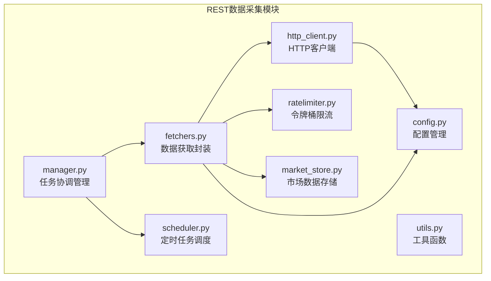

**图示来源**  
- [fetchers.py](file://data_server/binance/rest_binance/app/fetchers.py#L1-L226)
- [ratelimiter.py](file://data_server/binance/rest_binance/app/ratelimiter.py#L1-L33)
- [scheduler.py](file://data_server/binance/rest_binance/app/scheduler.py#L1-L24)
- [manager.py](file://data_server/binance/rest_binance/app/manager.py#L1-L52)
- [http_client.py](file://data_server/binance/rest_binance/app/http_client.py#L1-L61)

**本节来源**  
- [data_server/binance/rest_binance/app/](file://data_server/binance/rest_binance/app/)

## 核心组件
系统由五个核心组件构成：`fetchers`负责封装不同数据类型的API请求；`ratelimiter`实现令牌桶算法防止触发交易所限流；`scheduler`提供定时执行能力；`manager`协调多个数据源的任务生命周期；`http_client`提供健壮的网络通信支持。这些组件通过异步编程模型协同工作，确保高并发下的稳定性和可靠性。

**本节来源**  
- [fetchers.py](file://data_server/binance/rest_binance/app/fetchers.py#L1-L226)
- [ratelimiter.py](file://data_server/binance/rest_binance/app/ratelimiter.py#L1-L33)
- [scheduler.py](file://data_server/binance/rest_binance/app/scheduler.py#L1-L24)
- [manager.py](file://data_server/binance/rest_binance/app/manager.py#L1-L52)
- [http_client.py](file://data_server/binance/rest_binance/app/http_client.py#L1-L61)

## 架构概览
整个数据采集系统采用分层架构设计，从上至下分别为任务管理层、调度层、采集层、限流层和通信层。

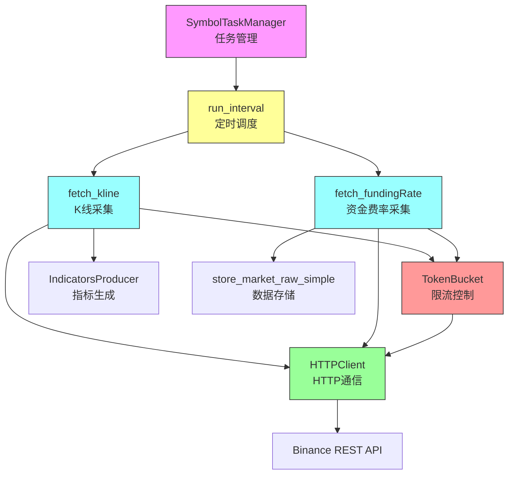

**图示来源**  
- [manager.py](file://data_server/binance/rest_binance/app/manager.py#L7-L52)
- [scheduler.py](file://data_server/binance/rest_binance/app/scheduler.py#L6-L24)
- [fetchers.py](file://data_server/binance/rest_binance/app/fetchers.py#L33-L170)
- [ratelimiter.py](file://data_server/binance/rest_binance/app/ratelimiter.py#L5-L33)
- [http_client.py](file://data_server/binance/rest_binance/app/http_client.py#L12-L61)

## 详细组件分析

### 数据采集器分析
`fetchers.py`模块封装了多种Binance API的数据获取函数，每种数据类型都有独立的异步采集函数。

#### 数据采集函数结构
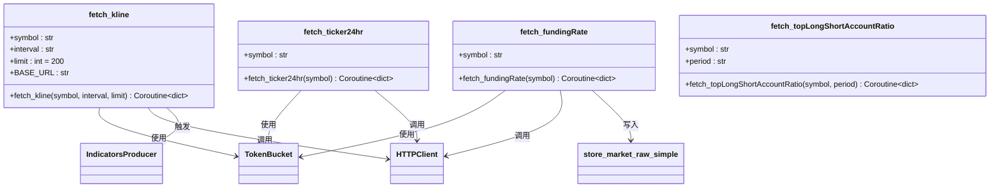

**图示来源**  
- [fetchers.py](file://data_server/binance/rest_binance/app/fetchers.py#L33-L170)

#### 采集任务执行流程
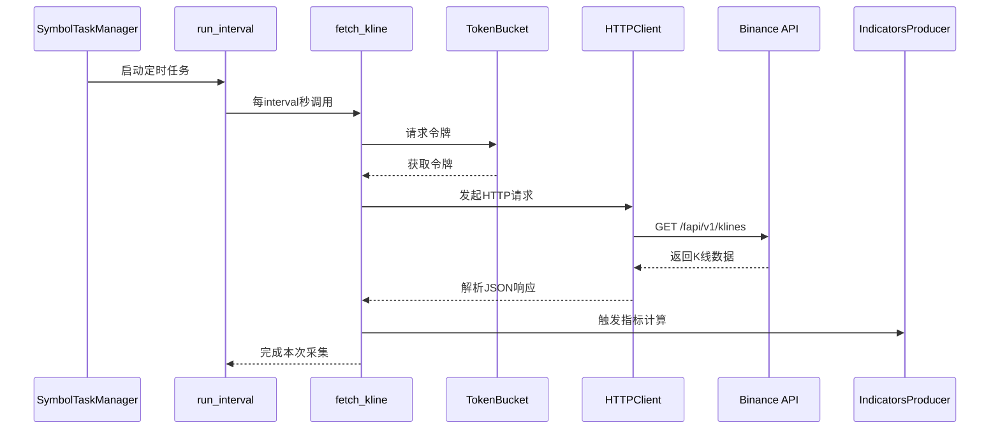

**图示来源**  
- [fetchers.py](file://data_server/binance/rest_binance/app/fetchers.py#L33-L48)
- [ratelimiter.py](file://data_server/binance/rest_binance/app/ratelimiter.py#L5-L33)
- [http_client.py](file://data_server/binance/rest_binance/app/http_client.py#L12-L61)
- [manager.py](file://data_server/binance/rest_binance/app/manager.py#L7-L52)

**本节来源**  
- [fetchers.py](file://data_server/binance/rest_binance/app/fetchers.py#L1-L226)

### 限流器分析
`ratelimiter.py`实现了基于令牌桶算法的限流机制，防止因请求过于频繁而被交易所封禁。

#### 令牌桶类结构
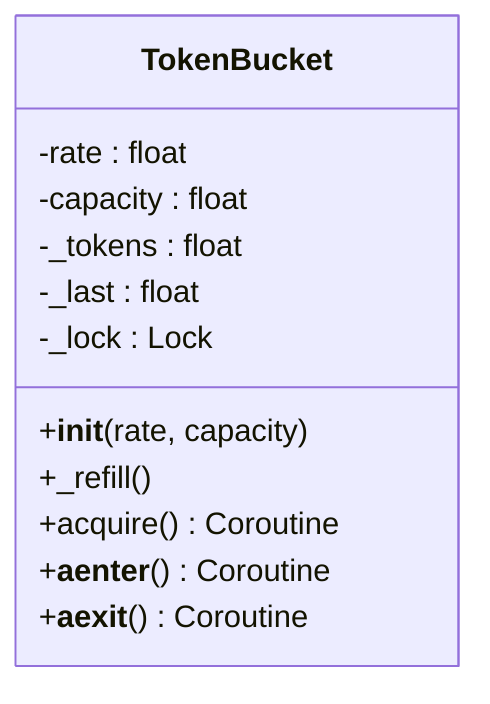

**图示来源**  
- [ratelimiter.py](file://data_server/binance/rest_binance/app/ratelimiter.py#L5-L33)

#### 限流执行流程
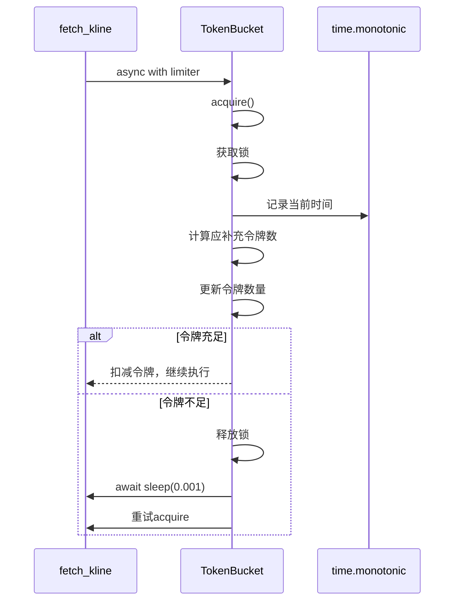

**图示来源**  
- [ratelimiter.py](file://data_server/binance/rest_binance/app/ratelimiter.py#L19-L26)

**本节来源**  
- [ratelimiter.py](file://data_server/binance/rest_binance/app/ratelimiter.py#L1-L33)

### 调度器分析
`scheduler.py`提供了基于时间间隔的异步任务调度功能。

#### 调度执行流程
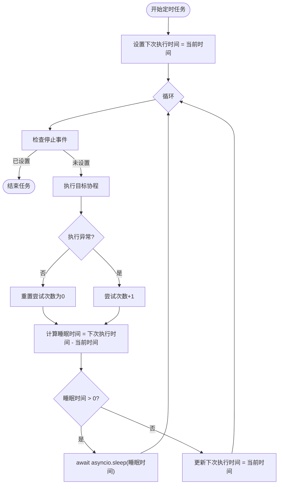

**图示来源**  
- [scheduler.py](file://data_server/binance/rest_binance/app/scheduler.py#L6-L24)

**本节来源**  
- [scheduler.py](file://data_server/binance/rest_binance/app/scheduler.py#L1-L24)

### 任务管理器分析
`manager.py`中的`SymbolTaskManager`类负责协调多个交易对的数据采集任务。

#### 任务管理器类结构
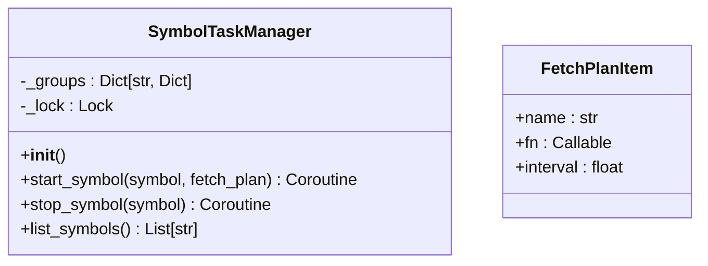

**图示来源**  
- [manager.py](file://data_server/binance/rest_binance/app/manager.py#L7-L52)

#### 任务启动流程
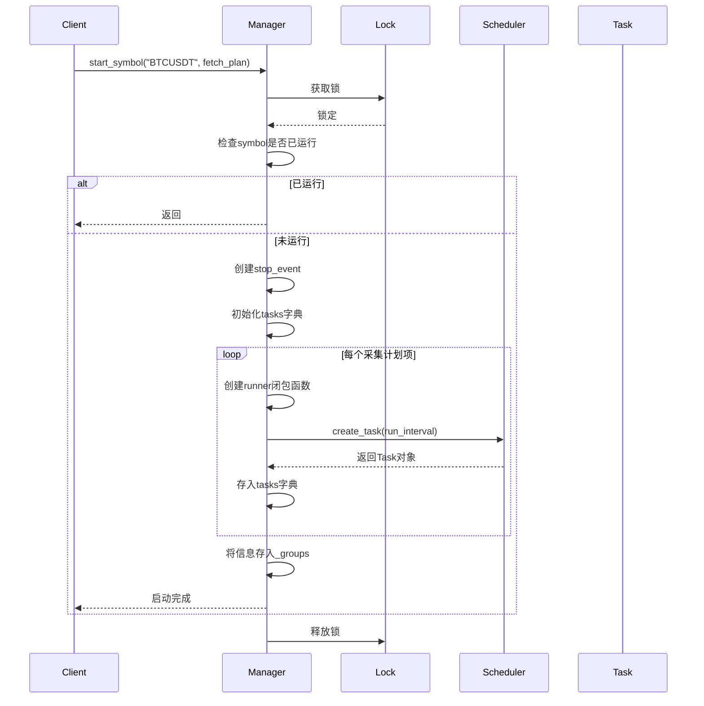

**图示来源**  
- [manager.py](file://data_server/binance/rest_binance/app/manager.py#L12-L38)

**本节来源**  
- [manager.py](file://data_server/binance/rest_binance/app/manager.py#L1-L52)

### HTTP客户端分析
`http_client.py`封装了健壮的HTTP通信能力，包含重试机制和连接管理。

#### HTTP客户端类结构
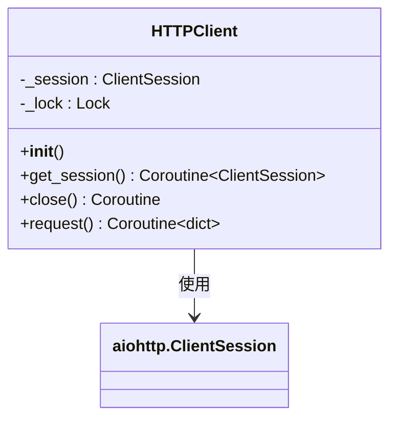

**图示来源**  
- [http_client.py](file://data_server/binance/rest_binance/app/http_client.py#L12-L61)

#### HTTP请求流程
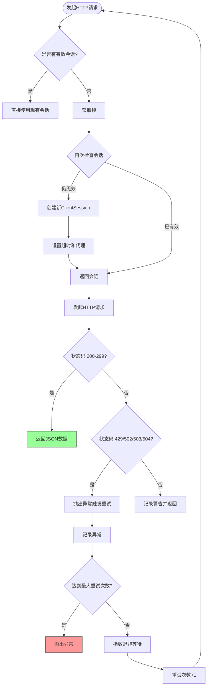

**图示来源**  
- [http_client.py](file://data_server/binance/rest_binance/app/http_client.py#L31-L57)

**本节来源**  
- [http_client.py](file://data_server/binance/rest_binance/app/http_client.py#L1-L61)

## 依赖分析
各组件之间存在明确的依赖关系，形成了清晰的调用链路。

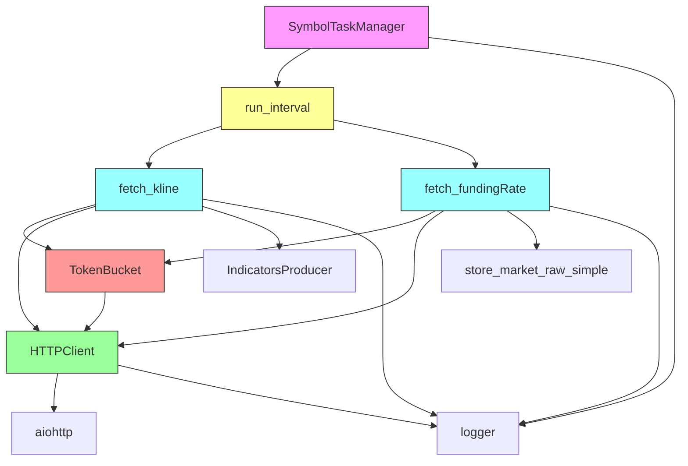

**图示来源**  
- [manager.py](file://data_server/binance/rest_binance/app/manager.py#L7-L52)
- [scheduler.py](file://data_server/binance/rest_binance/app/scheduler.py#L6-L24)
- [fetchers.py](file://data_server/binance/rest_binance/app/fetchers.py#L1-L226)
- [ratelimiter.py](file://data_server/binance/rest_binance/app/ratelimiter.py#L5-L33)
- [http_client.py](file://data_server/binance/rest_binance/app/http_client.py#L12-L61)

**本节来源**  
- [manager.py](file://data_server/binance/rest_binance/app/manager.py#L1-L52)
- [scheduler.py](file://data_server/binance/rest_binance/app/scheduler.py#L1-L24)
- [fetchers.py](file://data_server/binance/rest_binance/app/fetchers.py#L1-L226)
- [ratelimiter.py](file://data_server/binance/rest_binance/app/ratelimiter.py#L1-L33)
- [http_client.py](file://data_server/binance/rest_binance/app/http_client.py#L1-L61)

## 性能考虑
系统在设计时充分考虑了性能和稳定性：
- 使用异步IO模型处理高并发请求
- 连接池复用HTTP会话减少握手开销
- 令牌桶算法平滑请求流量
- 指数退避重试避免雪崩效应
- 细粒度锁控制保证线程安全
- 内存缓存限流器实例减少重复创建

## 故障排除指南
常见问题及解决方案：
- **频繁429错误**：检查`config.py`中的`rate_limits_seconds`配置，适当降低采集频率
- **连接超时**：调整`http_timeout_s`参数或检查网络代理设置
- **任务未启动**：确认`fetch_plan`中函数引用正确且interval设置合理
- **数据缺失**：检查`store_market_raw`和`IndicatorsProducer`的异常日志
- **内存泄漏**：监控`LIMITER_CACHE`大小，避免无限增长

**本节来源**  
- [fetchers.py](file://data_server/binance/rest_binance/app/fetchers.py#L48-L49)
- [http_client.py](file://data_server/binance/rest_binance/app/http_client.py#L53-L54)
- [manager.py](file://data_server/binance/rest_binance/app/manager.py#L30-L31)

## 结论
REST数据采集模块通过精心设计的组件化架构，实现了对Binance交易所多种静态数据的高效、稳定采集。系统采用异步编程模型，结合令牌桶限流、定时调度、任务管理和健壮的HTTP通信，有效避免了API限制问题。各组件职责清晰，易于扩展和维护，为上层分析系统提供了可靠的数据基础。