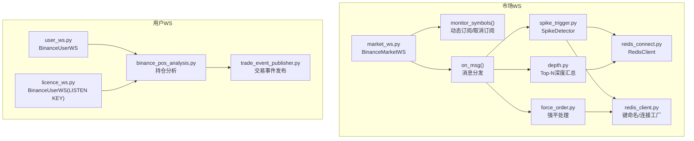
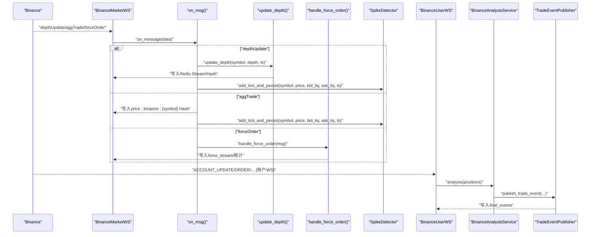
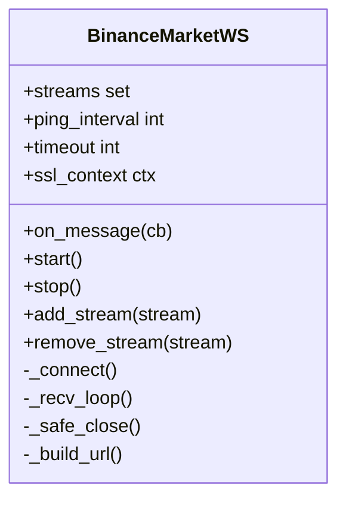
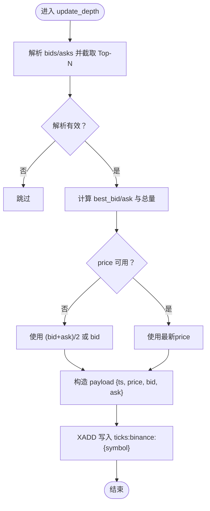
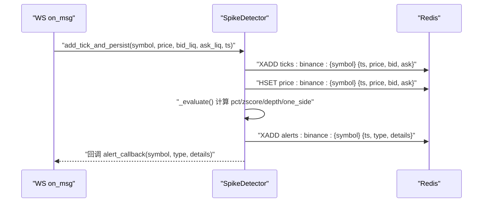
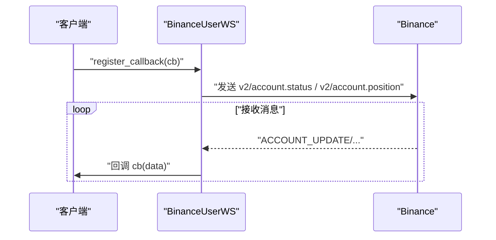
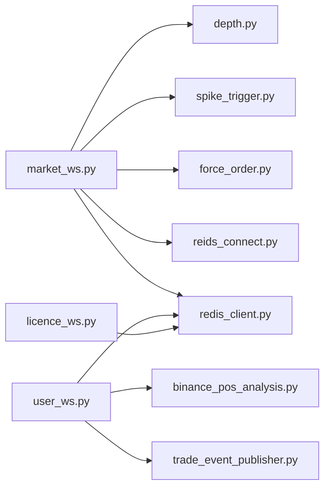

# WebSocket实时订阅

<cite>
**本文引用的文件**
- [market_ws.py](file://data_server/binance/ws_binance/market_ws.py)
- [user_ws.py](file://data_server/binance/ws_binance/user_ws.py)
- [spike_trigger.py](file://data_server/binance/ws_binance/utils/spike_trigger.py)
- [depth.py](file://data_server/binance/ws_binance/utils/depth.py)
- [reids_connect.py](file://data_server/binance/ws_binance/utils/reids_connect.py)
- [redis_client.py](file://data_server/binance/ws_binance/utils/redis_client.py)
- [force_order.py](file://data_server/binance/ws_binance/utils/force_order.py)
- [binance_pos_analysis.py](file://data_server/binance/ws_binance/utils/binance_pos_analysis.py)
- [trade_event_publisher.py](file://data_server/binance/ws_binance/utils/trade_event_publisher.py)
- [licence_ws.py](file://data_server/binance/ws_binance/licence_ws.py)
</cite>

## 目录
1. [简介](#简介)
2. [项目结构](#项目结构)
3. [核心组件](#核心组件)
4. [架构总览](#架构总览)
5. [组件详解](#组件详解)
6. [依赖关系分析](#依赖关系分析)
7. [性能与稳定性](#性能与稳定性)
8. [故障排查指南](#故障排查指南)
9. [结论](#结论)
10. [附录](#附录)

## 简介
本文件面向开发者，系统化说明通过Binance WebSocket API实现的实时订阅模块，覆盖市场深度、成交事件与用户持仓变化的实时监听与处理。重点包括：
- market_ws与user_ws的连接建立、心跳维持与异常重连机制
- 如何通过depth.py处理增量订单簿更新
- 利用spike_trigger检测价格突变事件，并将关键事件发布至Redis Stream
- reids_connect的连接管理策略与消息序列化格式
- 配置与部署建议，帮助扩展监听交易对、优化消息处理性能并保障长连接稳定性

## 项目结构
实时订阅模块位于data_server/binance/ws_binance目录下，核心文件如下：
- market_ws.py：市场行情WebSocket客户端，负责深度、成交、强平事件的接收与转发
- user_ws.py：用户信息WebSocket客户端，负责账户余额、持仓等用户事件
- utils/spike_trigger.py：价格与流动性异常检测器，写入Redis Stream并回调
- utils/depth.py：增量深度更新与Top-N汇总写入Redis Stream
- utils/reids_connect.py：Redis同步客户端封装（JSON/HASH/XADD等）
- utils/redis_client.py：Redis连接工厂与键命名工具
- utils/force_order.py：强平事件解析与统计
- utils/binance_pos_analysis.py：用户持仓变化分析与事件发布
- utils/trade_event_publisher.py：交易执行事件发布到Redis Stream
- licence_ws.py：另一个用户WS实现（listenKey方式）

图表来源
- [market_ws.py](file://data_server/binance/ws_binance/market_ws.py#L1-L379)
- [user_ws.py](file://data_server/binance/ws_binance/user_ws.py#L1-L163)
- [spike_trigger.py](file://data_server/binance/ws_binance/utils/spike_trigger.py#L1-L436)
- [depth.py](file://data_server/binance/ws_binance/utils/depth.py#L1-L111)
- [reids_connect.py](file://data_server/binance/ws_binance/utils/reids_connect.py#L1-L95)
- [redis_client.py](file://data_server/binance/ws_binance/utils/redis_client.py#L1-L116)
- [force_order.py](file://data_server/binance/ws_binance/utils/force_order.py#L1-L129)
- [binance_pos_analysis.py](file://data_server/binance/ws_binance/utils/binance_pos_analysis.py#L1-L193)
- [trade_event_publisher.py](file://data_server/binance/ws_binance/utils/trade_event_publisher.py#L1-L114)
- [licence_ws.py](file://data_server/binance/ws_binance/licence_ws.py#L1-L163)

章节来源
- [market_ws.py](file://data_server/binance/ws_binance/market_ws.py#L1-L379)
- [user_ws.py](file://data_server/binance/ws_binance/user_ws.py#L1-L163)
- [spike_trigger.py](file://data_server/binance/ws_binance/utils/spike_trigger.py#L1-L436)
- [depth.py](file://data_server/binance/ws_binance/utils/depth.py#L1-L111)
- [reids_connect.py](file://data_server/binance/ws_binance/utils/reids_connect.py#L1-L95)
- [redis_client.py](file://data_server/binance/ws_binance/utils/redis_client.py#L1-L116)
- [force_order.py](file://data_server/binance/ws_binance/utils/force_order.py#L1-L129)
- [binance_pos_analysis.py](file://data_server/binance/ws_binance/utils/binance_pos_analysis.py#L1-L193)
- [trade_event_publisher.py](file://data_server/binance/ws_binance/utils/trade_event_publisher.py#L1-L114)
- [licence_ws.py](file://data_server/binance/ws_binance/licence_ws.py#L1-L163)

## 核心组件
- 市场WS客户端：BinanceMarketWS，支持动态订阅/取消订阅、心跳与异常重连
- 用户WS客户端：BinanceUserWS（两类实现），负责账户状态与持仓事件
- 深度处理：update_depth将Top-N深度写入Redis Stream
- 异常检测：SpikeDetector在收到tick后写入Stream并触发回调
- 强平处理：handle_force_order解析强平事件并统计
- Redis连接：RedisClient提供同步连接与常用操作封装
- 持仓分析：BinanceAnalysisService对比前后持仓差异并触发交易事件发布
- 交易事件发布：TradeEventPublisher将开仓/平仓/加减仓事件写入final_events

章节来源
- [market_ws.py](file://data_server/binance/ws_binance/market_ws.py#L120-L250)
- [user_ws.py](file://data_server/binance/ws_binance/user_ws.py#L17-L126)
- [spike_trigger.py](file://data_server/binance/ws_binance/utils/spike_trigger.py#L83-L170)
- [depth.py](file://data_server/binance/ws_binance/utils/depth.py#L13-L103)
- [reids_connect.py](file://data_server/binance/ws_binance/utils/reids_connect.py#L5-L95)
- [binance_pos_analysis.py](file://data_server/binance/ws_binance/utils/binance_pos_analysis.py#L9-L171)
- [trade_event_publisher.py](file://data_server/binance/ws_binance/utils/trade_event_publisher.py#L1-L114)

## 架构总览
整体流程：Binance WebSocket推送消息 → market_ws解析 → 深度/成交/强平分别处理 → 写入Redis Stream/Hash → SpikeDetector检测并发布告警 → 用户WS接收账户/持仓事件 → 持仓分析与交易事件发布。

图表来源
- [market_ws.py](file://data_server/binance/ws_binance/market_ws.py#L290-L379)
- [depth.py](file://data_server/binance/ws_binance/utils/depth.py#L13-L103)
- [spike_trigger.py](file://data_server/binance/ws_binance/utils/spike_trigger.py#L189-L244)
- [force_order.py](file://data_server/binance/ws_binance/utils/force_order.py#L15-L81)
- [user_ws.py](file://data_server/binance/ws_binance/user_ws.py#L128-L153)
- [binance_pos_analysis.py](file://data_server/binance/ws_binance/utils/binance_pos_analysis.py#L129-L171)
- [trade_event_publisher.py](file://data_server/binance/ws_binance/utils/trade_event_publisher.py#L20-L82)

## 组件详解

### 市场WS：BinanceMarketWS
- 连接建立：根据订阅列表构建URL，支持单流或多流拼接；启用ping_interval与ping_timeout；SSL上下文默认禁用校验（生产环境建议使用默认SSL）
- 心跳与断线重连：recv_loop中捕获异常并等待短暂间隔后重连；动态订阅/取消订阅通过_lock保护，设置_need_reconnect并主动断开当前连接以触发重建
- 动态订阅：add_stream/remove_stream原子更新streams并触发重连
- 消息分发：on_msg根据事件类型分别处理深度、成交、强平；深度与成交同时喂给SpikeDetector进行异常检测

图表来源
- [market_ws.py](file://data_server/binance/ws_binance/market_ws.py#L120-L250)

章节来源
- [market_ws.py](file://data_server/binance/ws_binance/market_ws.py#L120-L250)

### 深度处理：update_depth
- 输入：symbol、depth_data（bids/asks）、可选时间戳
- 处理：截取Top-N（默认10），安全解析价格与数量，计算最佳价与总挂单量
- 输出：将汇总写入Redis Stream（ticks:binance:{symbol}），字段包含ts、price、bid、ask；同时写入最新价格Hash（price:binance:{symbol}）

图表来源
- [depth.py](file://data_server/binance/ws_binance/utils/depth.py#L13-L103)

章节来源
- [depth.py](file://data_server/binance/ws_binance/utils/depth.py#L13-L103)

### SpikeDetector：价格与流动性异常检测
- 初始化参数：窗口长度、tick估计、百分比阈值、z-score阈值、深度比率阈值、去抖、冷却、确认tick数、最小深度流动性、聚合窗口
- 核心流程：add_tick_and_persist将tick写入Redis Stream与最新Hash，随后异步评估并触发告警；支持多事件聚合（liquidity_collapse）与去抖/冷却
- 回调：可通过register_alert_callback注册回调，将告警写入alerts:binance:{symbol} Stream或进一步处理

图表来源
- [spike_trigger.py](file://data_server/binance/ws_binance/utils/spike_trigger.py#L189-L374)

章节来源
- [spike_trigger.py](file://data_server/binance/ws_binance/utils/spike_trigger.py#L83-L170)
- [spike_trigger.py](file://data_server/binance/ws_binance/utils/spike_trigger.py#L189-L374)

### 强平事件：handle_force_order
- 解析单笔强平订单，写入force_stream:binance:{symbol} Stream（保留少量记录）
- 统计SELL/BUY次数与数量，写入force_stats:binance:{symbol}与force_stats_stream:binance:{symbol}，并设置过期时间

章节来源
- [force_order.py](file://data_server/binance/ws_binance/utils/force_order.py#L15-L81)

### Redis连接与序列化：reids_connect与redis_client
- reids_connect.RedisClient：提供set/get、set_json/get_json、set_hash/get_hash、按前缀删除等方法；set_hash默认检查键类型并删除冲突键
- redis_client：连接工厂（异步/同步）、键命名工具（ticks、latest_price、alerts、force_*等）

章节来源
- [reids_connect.py](file://data_server/binance/ws_binance/utils/reids_connect.py#L5-L95)
- [redis_client.py](file://data_server/binance/ws_binance/utils/redis_client.py#L1-L116)

### 用户WS：BinanceUserWS（两类实现）
- user_ws.py：使用HMAC-SHA256签名，发送账户状态与持仓请求，心跳通过底层WS实现；异常捕获与重连
- licence_ws.py：通过REST获取listenKey，定时续期，连接wss://{ws_base}/{listenKey}，自动重连

图表来源
- [user_ws.py](file://data_server/binance/ws_binance/user_ws.py#L49-L126)

章节来源
- [user_ws.py](file://data_server/binance/ws_binance/user_ws.py#L17-L126)
- [licence_ws.py](file://data_server/binance/ws_binance/licence_ws.py#L12-L132)

### 持仓分析与交易事件发布：BinanceAnalysisService与TradeEventPublisher
- BinanceAnalysisService：清洗数据、计算pnl_ratio、应用trade_id、对比前后持仓差异，触发新增/移除/变化事件，并写入positions:binance与symbol:binance集合
- TradeEventPublisher：将交易执行事件（开仓/平仓/加减仓）标准化后写入final_events Stream，供下游统一消费

章节来源
- [binance_pos_analysis.py](file://data_server/binance/ws_binance/utils/binance_pos_analysis.py#L9-L171)
- [trade_event_publisher.py](file://data_server/binance/ws_binance/utils/trade_event_publisher.py#L1-L114)

## 依赖关系分析
- market_ws依赖：
  - utils/depth.py：增量深度处理
  - utils/spike_trigger.py：异常检测
  - utils/force_order.py：强平事件
  - utils/reids_connect.py与utils/redis_client.py：Redis连接与键命名
- user_ws依赖：
  - utils/binance_pos_analysis.py：持仓分析
  - utils/trade_event_publisher.py：交易事件发布
  - utils/redis_client.py：异步Redis连接

图表来源
- [market_ws.py](file://data_server/binance/ws_binance/market_ws.py#L1-L120)
- [user_ws.py](file://data_server/binance/ws_binance/user_ws.py#L1-L40)
- [depth.py](file://data_server/binance/ws_binance/utils/depth.py#L1-L20)
- [spike_trigger.py](file://data_server/binance/ws_binance/utils/spike_trigger.py#L1-L40)
- [force_order.py](file://data_server/binance/ws_binance/utils/force_order.py#L1-L20)
- [reids_connect.py](file://data_server/binance/ws_binance/utils/reids_connect.py#L1-L20)
- [redis_client.py](file://data_server/binance/ws_binance/utils/redis_client.py#L1-L40)
- [binance_pos_analysis.py](file://data_server/binance/ws_binance/utils/binance_pos_analysis.py#L1-L20)
- [trade_event_publisher.py](file://data_server/binance/ws_binance/utils/trade_event_publisher.py#L1-L20)
- [licence_ws.py](file://data_server/binance/ws_binance/licence_ws.py#L1-L20)

## 性能与稳定性
- 心跳与断线重连
  - market_ws：recv_loop中捕获异常并sleep后重连；动态订阅/取消订阅通过_lock与_need_reconnect强制断开当前连接以重建
  - user_ws：底层WS自动ping；异常捕获与指数退避重连
- Redis写入
  - 使用XADD写入Stream并设置maxlen，避免无限增长；HSET写入最新值以便快速查询
  - RedisClient.set_hash默认检查键类型，避免WRONGTYPE错误
- 异常检测
  - SpikeDetector采用滑动窗口与去抖/冷却策略，支持事件聚合，降低误报
- 深度处理
  - Top-N汇总与严格数值校验，避免无效数据污染
- 建议
  - 生产环境启用默认SSL校验
  - 对高频tick进行必要的降采样或批处理，避免下游消费压力过大
  - 使用连接池与最大连接数限制，防止Redis连接过多

[本节为通用建议，无需列出章节来源]

## 故障排查指南
- WebSocket连接失败
  - 检查BASE_URL与SSL配置；确认网络可达与防火墙放行
  - 查看日志中“Disconnected”与“Applying new subscriptions…”提示
- Redis写入错误
  - 关注HSET/XADD错误日志，确认键类型与maxlen设置
  - 使用RedisClient.delete_by_prefix清理冲突键
- 异常检测未触发
  - 检查SpikeDetector参数（窗口、阈值、确认tick、最小深度流动性）
  - 确认on_msg正确调用add_tick_and_persist
- 强平事件未统计
  - 确认force_stream与force_stats键是否存在，检查maxlen与过期设置
- 用户WS未收到事件
  - 确认API Key/Secret正确，listenKey是否成功获取与续期
  - 检查回调注册与异常捕获

章节来源
- [market_ws.py](file://data_server/binance/ws_binance/market_ws.py#L181-L215)
- [user_ws.py](file://data_server/binance/ws_binance/user_ws.py#L89-L126)
- [spike_trigger.py](file://data_server/binance/ws_binance/utils/spike_trigger.py#L211-L244)
- [reids_connect.py](file://data_server/binance/ws_binance/utils/reids_connect.py#L33-L64)
- [force_order.py](file://data_server/binance/ws_binance/utils/force_order.py#L15-L81)

## 结论
本模块通过Binance WebSocket实现了对市场深度、成交与强平事件的实时订阅，并结合SpikeDetector进行异常检测，最终将关键事件写入Redis Stream供下游消费。用户WS负责账户与持仓事件的实时推送与分析。整体设计具备良好的动态订阅能力、异常重连与Redis写入容错，适合在生产环境中扩展更多交易对与优化消息处理性能。

[本节为总结，无需列出章节来源]

## 附录

### 配置与部署建议
- 环境变量
  - REDIS_HOST、REDIS_PORT、REDIS_DB、REDIS_PASSWORD：用于redis_client构建连接URL
- 运行方式
  - market_ws：直接运行入口脚本，内部启动BinanceMarketWS与SpikeDetector，并轮询Redis集合决定订阅哪些交易对
  - user_ws：提供API Key/Secret后启动，注册回调处理账户与持仓事件
- 扩展监听交易对
  - 在Redis集合“symbol:binance”中添加/移除交易对，market_ws将自动增删订阅
  - 可通过monitor_symbols轮询逻辑动态调整订阅
- 优化消息处理
  - 对高频tick进行降采样或批处理，避免Stream无限增长
  - 使用maxlen与approximate参数控制Redis内存占用
- 保障长连接稳定性
  - 生产环境启用默认SSL校验
  - 为用户WS设置合适的重连延迟与listenKey续期周期
  - 对异常进行集中日志记录与告警

章节来源
- [redis_client.py](file://data_server/binance/ws_binance/utils/redis_client.py#L1-L16)
- [market_ws.py](file://data_server/binance/ws_binance/market_ws.py#L251-L288)
- [user_ws.py](file://data_server/binance/ws_binance/user_ws.py#L17-L47)
- [licence_ws.py](file://data_server/binance/ws_binance/licence_ws.py#L12-L45)