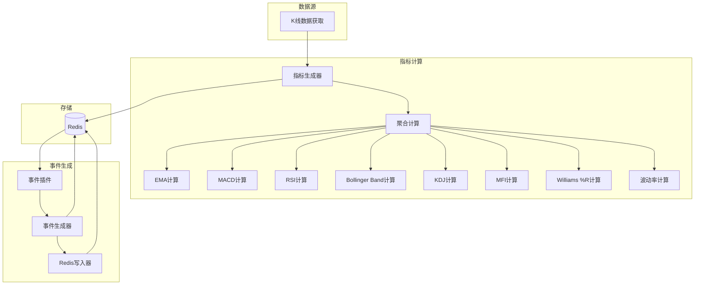
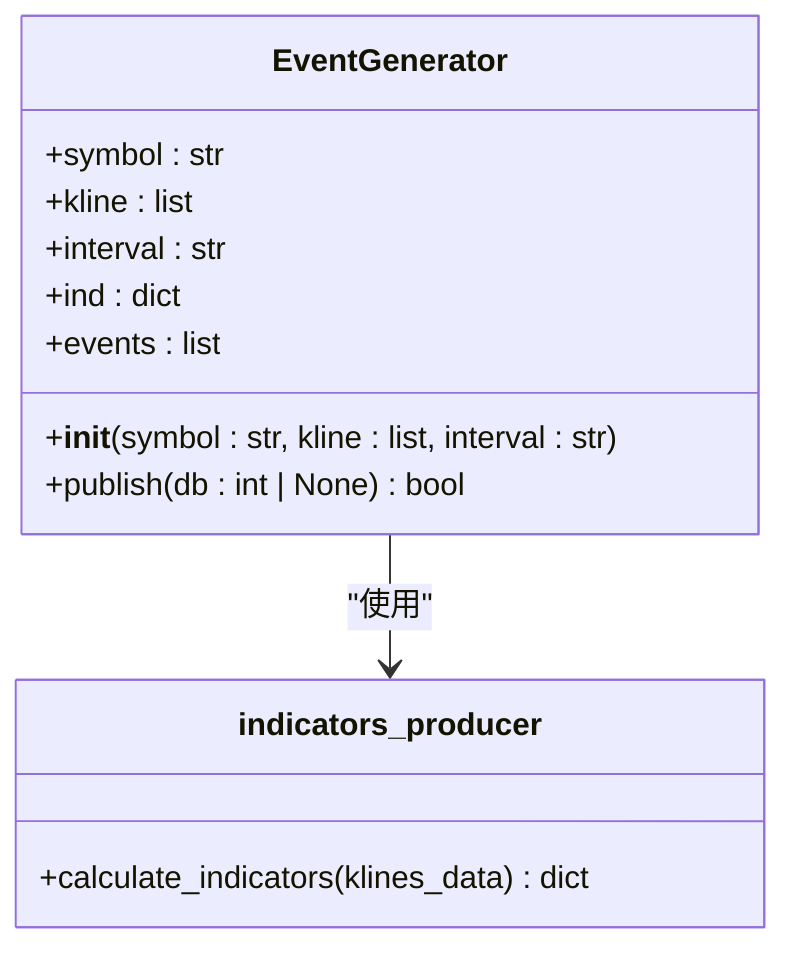
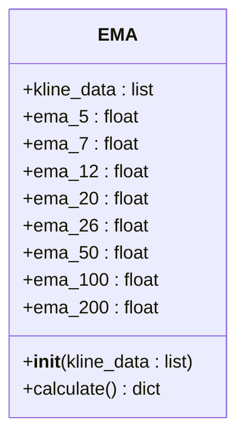
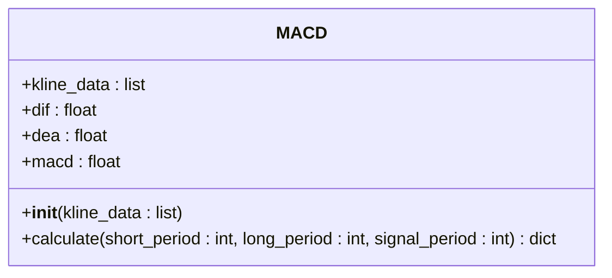
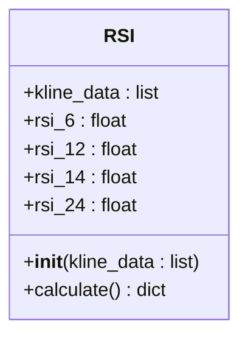
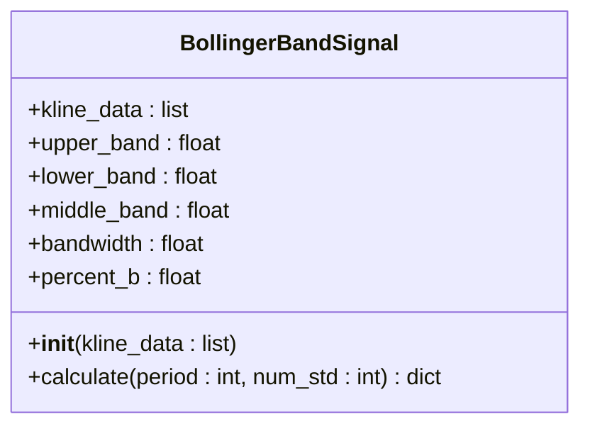
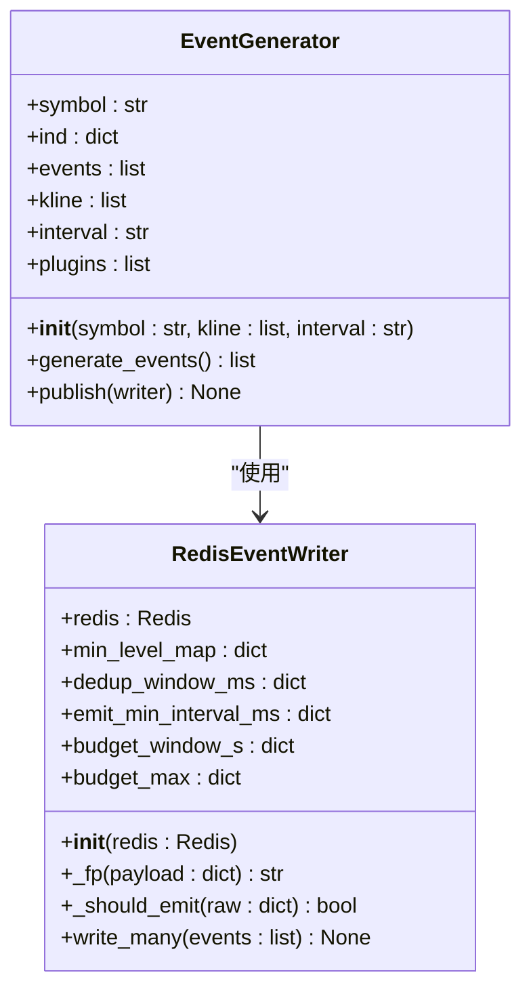
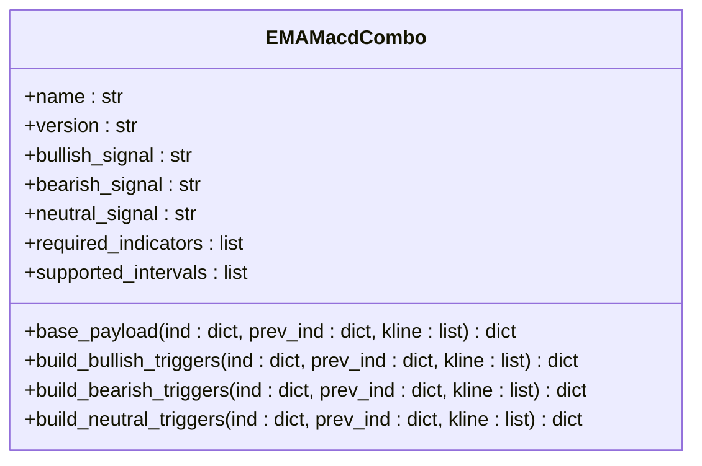
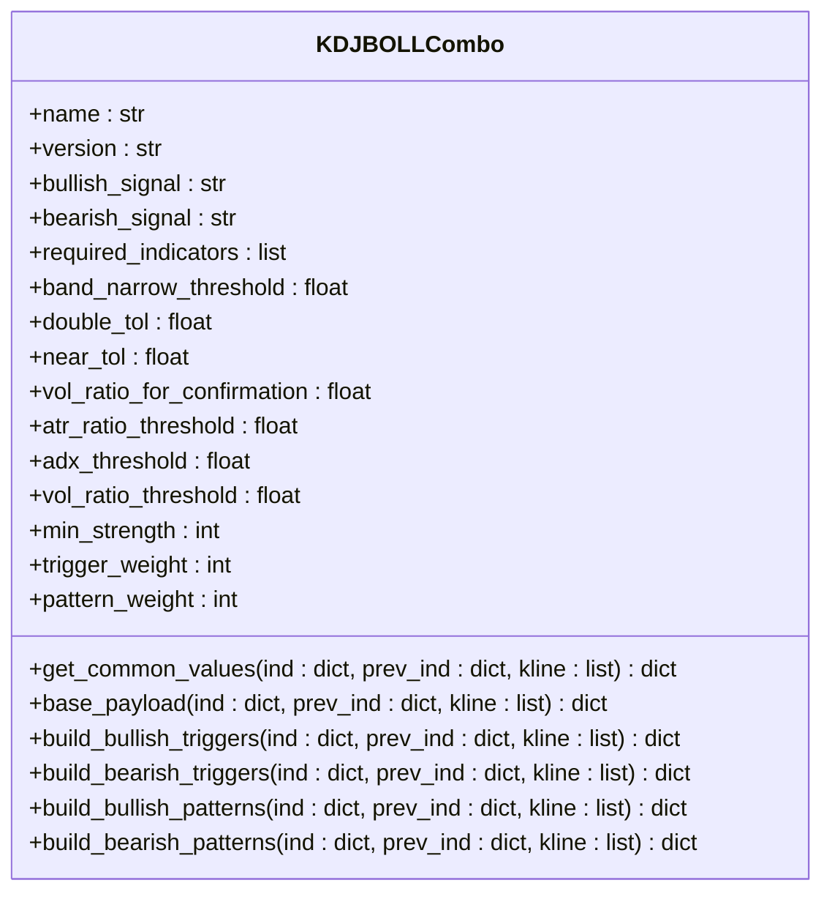
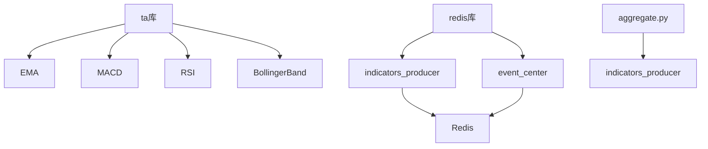

# 技术指标实现

<cite>
**本文档引用的文件**  
- [indicators_producer.py](file://data_server/binance/rest_binance/app/indicators_producer.py)
- [aggregate.py](file://data_server/binance/rest_binance/app/signals/aggregate.py)
- [ema.py](file://data_server/binance/rest_binance/app/signals/ema.py)
- [macd.py](file://data_server/binance/rest_binance/app/signals/macd.py)
- [rsi.py](file://data_server/binance/rest_binance/app/signals/rsi.py)
- [bollingerband.py](file://data_server/binance/rest_binance/app/signals/bollingerband.py)
- [kdj.py](file://data_server/binance/rest_binance/app/signals/kdj.py)
- [mfi.py](file://data_server/binance/rest_binance/app/signals/mfi.py)
- [williams.py](file://data_server/binance/rest_binance/app/signals/williams.py)
- [volatility.py](file://data_server/binance/rest_binance/app/signals/volatility.py)
- [indicators_event_generator.py](file://event_center/indicators_event_generator.py)
- [ema_macd_combo.py](file://event_center/indicators_event_plugins/ema_macd_combo.py)
- [boll_kdj_combo.py](file://event_center/indicators_event_plugins/boll_kdj_combo.py)
- [indicator_loader.py](file://event_center/indicators_event/engine/indicator_loader.py)
</cite>

## 目录
1. [简介](#简介)
2. [项目结构](#项目结构)
3. [核心组件](#核心组件)
4. [架构概述](#架构概述)
5. [详细组件分析](#详细组件分析)
6. [依赖分析](#依赖分析)
7. [性能考虑](#性能考虑)
8. [故障排除指南](#故障排除指南)
9. [结论](#结论)

## 简介
本文档详细描述了技术指标实现模块的设计与实现，聚焦于各类技术分析指标（如EMA、MACD、RSI、布林带、KDJ、MFI、威廉指标等）在`indicators_producer`中的计算逻辑与集成方式。文档说明了每个信号模块的算法原理、参数配置与输出格式，描述了`indicators_producer`如何调度这些模块对原始K线数据进行批处理，并将计算结果标准化后写入Redis供下游服务消费。同时提供了代码示例展示如何添加新的技术指标，包括信号定义、阈值判断与事件生成流程，帮助开发者扩展系统分析能力。

## 项目结构
系统的技术指标模块主要分布在`data_server/binance/rest_binance/app/signals/`目录下，由`indicators_producer.py`统一调度。计算结果通过Redis存储，供`event_center`模块消费生成事件。整体结构清晰，职责分离，便于维护和扩展。

**图示来源**
- [indicators_producer.py](file://data_server/binance/rest_binance/app/indicators_producer.py)
- [aggregate.py](file://data_server/binance/rest_binance/app/signals/aggregate.py)

**节来源**
- [indicators_producer.py](file://data_server/binance/rest_binance/app/indicators_producer.py)
- [aggregate.py](file://data_server/binance/rest_binance/app/signals/aggregate.py)

## 核心组件
核心组件包括`indicators_producer`、`EventGenerator`和各类技术指标计算类。`indicators_producer`负责调度所有指标计算，并将结果写入Redis。`EventGenerator`从Redis读取指标数据，生成事件。各类技术指标计算类（如`EMA`、`MACD`等）封装了具体的计算逻辑。

**节来源**
- [indicators_producer.py](file://data_server/binance/rest_binance/app/indicators_producer.py)
- [ema.py](file://data_server/binance/rest_binance/app/signals/ema.py)
- [macd.py](file://data_server/binance/rest_binance/app/signals/macd.py)

## 架构概述
系统采用生产者-消费者模式。`indicators_producer`作为生产者，从K线数据源获取数据，计算各类技术指标，并将结果写入Redis。`event_center`模块作为消费者，从Redis读取指标数据，通过插件机制生成事件。事件生成器支持多种插件，每种插件可以定义不同的信号组合和阈值判断逻辑。

**图示来源**
- [indicators_producer.py](file://data_server/binance/rest_binance/app/indicators_producer.py)
- [indicators_event_generator.py](file://event_center/indicators_event_generator.py)

## 详细组件分析

### 指标生产者分析
`indicators_producer`模块是整个技术指标计算的核心。它通过`EventGenerator`类接收K线数据，调用`calculate_indicators`函数计算所有指标，并将结果写入Redis。同时，它还会计算上一时刻的指标，用于后续的事件生成。

**图示来源**
- [indicators_producer.py](file://data_server/binance/rest_binance/app/indicators_producer.py)

**节来源**
- [indicators_producer.py](file://data_server/binance/rest_binance/app/indicators_producer.py)

### 技术指标计算分析
各类技术指标计算类（如`EMA`、`MACD`等）均继承自`ta`库，封装了具体的计算逻辑。这些类通过`aggregate.py`中的`compute_all_indicators`函数统一调用，确保了计算的一致性和可维护性。

#### EMA计算

**图示来源**
- [ema.py](file://data_server/binance/rest_binance/app/signals/ema.py)

#### MACD计算

**图示来源**
- [macd.py](file://data_server/binance/rest_binance/app/signals/macd.py)

#### RSI计算

**图示来源**
- [rsi.py](file://data_server/binance/rest_binance/app/signals/rsi.py)

#### 布林带计算

**图示来源**
- [bollingerband.py](file://data_server/binance/rest_binance/app/signals/bollingerband.py)

**节来源**
- [ema.py](file://data_server/binance/rest_binance/app/signals/ema.py)
- [macd.py](file://data_server/binance/rest_binance/app/signals/macd.py)
- [rsi.py](file://data_server/binance/rest_binance/app/signals/rsi.py)
- [bollingerband.py](file://data_server/binance/rest_binance/app/signals/bollingerband.py)
- [kdj.py](file://data_server/binance/rest_binance/app/signals/kdj.py)
- [mfi.py](file://data_server/binance/rest_binance/app/signals/mfi.py)
- [williams.py](file://data_server/binance/rest_binance/app/signals/williams.py)
- [volatility.py](file://data_server/binance/rest_binance/app/signals/volatility.py)

### 事件生成器分析
`indicators_event_generator`模块负责从Redis读取指标数据，生成事件。它通过`EventGenerator`类实现，支持多种插件，每种插件可以定义不同的信号组合和阈值判断逻辑。

**图示来源**
- [indicators_event_generator.py](file://event_center/indicators_event_generator.py)

**节来源**
- [indicators_event_generator.py](file://event_center/indicators_event_generator.py)

### 事件插件分析
事件插件（如`ema_macd_combo`、`boll_kdj_combo`）定义了具体的信号组合和阈值判断逻辑。这些插件通过`get_plugins`函数加载，支持动态扩展。

#### EMA+MACD组合插件

**图示来源**
- [ema_macd_combo.py](file://event_center/indicators_event_plugins/ema_macd_combo.py)

#### 布林带+KDJ组合插件

**图示来源**
- [boll_kdj_combo.py](file://event_center/indicators_event_plugins/boll_kdj_combo.py)

**节来源**
- [ema_macd_combo.py](file://event_center/indicators_event_plugins/ema_macd_combo.py)
- [boll_kdj_combo.py](file://event_center/indicators_event_plugins/boll_kdj_combo.py)

## 依赖分析
系统依赖于`ta`库进行技术指标计算，依赖于`redis`库进行数据存储和事件发布。`indicators_producer`依赖于`aggregate.py`中的`compute_all_indicators`函数，`event_center`依赖于`indicators_producer`生成的指标数据。

**图示来源**
- [indicators_producer.py](file://data_server/binance/rest_binance/app/indicators_producer.py)
- [indicators_event_generator.py](file://event_center/indicators_event_generator.py)

**节来源**
- [indicators_producer.py](file://data_server/binance/rest_binance/app/indicators_producer.py)
- [indicators_event_generator.py](file://event_center/indicators_event_generator.py)

## 性能考虑
系统在计算技术指标时，采用了批处理的方式，减少了I/O操作。同时，通过Redis的持久化机制，确保了数据的可靠性和一致性。事件生成器通过插件机制，支持动态扩展，提高了系统的灵活性和可维护性。

## 故障排除指南
- **指标计算失败**：检查K线数据是否足够，确保数据格式正确。
- **事件生成失败**：检查Redis连接是否正常，确保事件插件配置正确。
- **性能问题**：优化K线数据获取频率，减少不必要的计算。

**节来源**
- [indicators_producer.py](file://data_server/binance/rest_binance/app/indicators_producer.py)
- [indicators_event_generator.py](file://event_center/indicators_event_generator.py)

## 结论
本文档详细描述了技术指标实现模块的设计与实现，为开发者提供了清晰的指导。通过合理的架构设计和模块化实现，系统具备了良好的可扩展性和可维护性，能够满足复杂的交易分析需求。