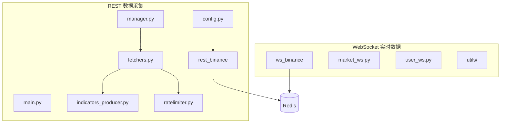
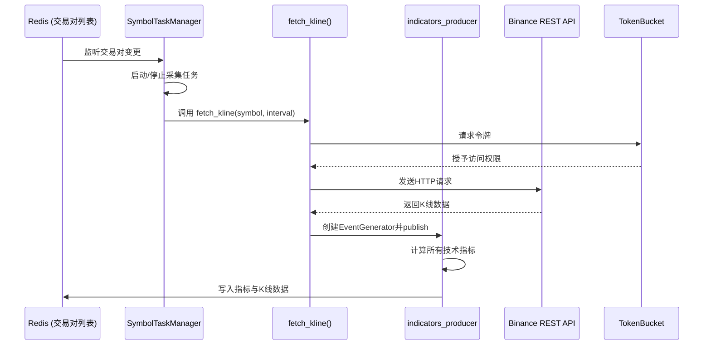
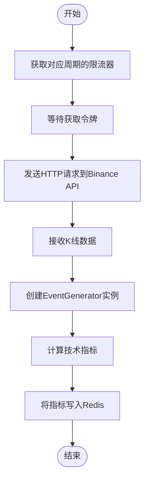
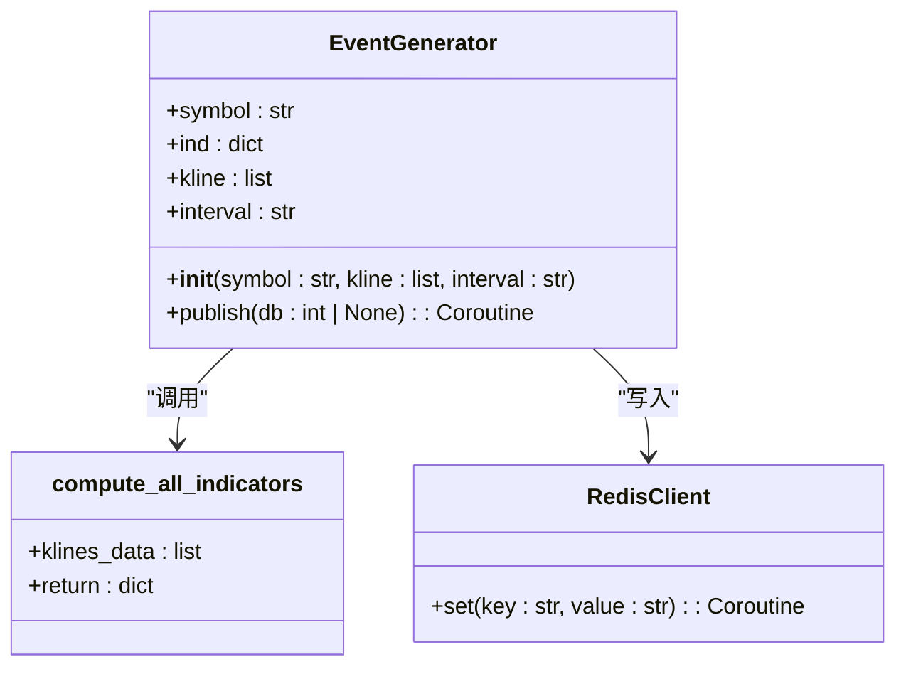
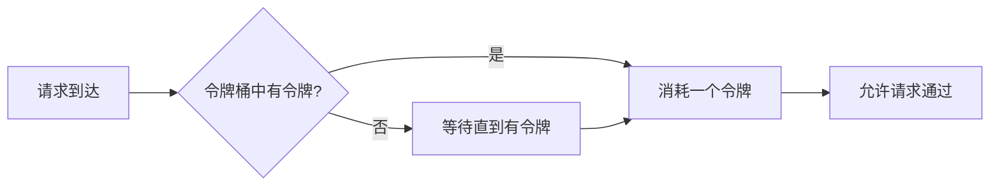
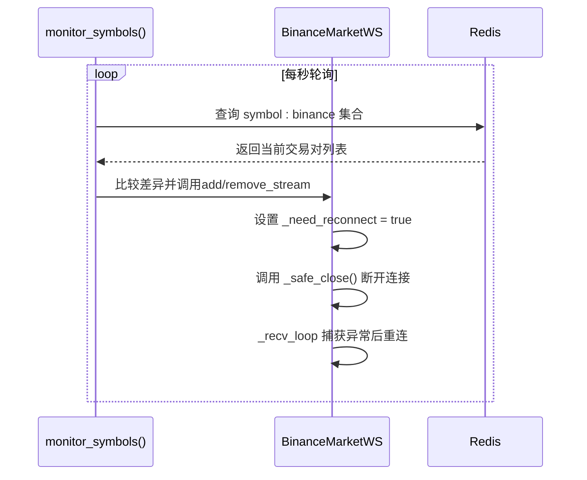
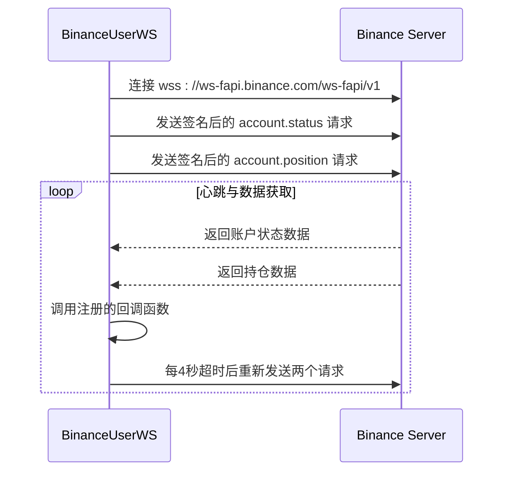
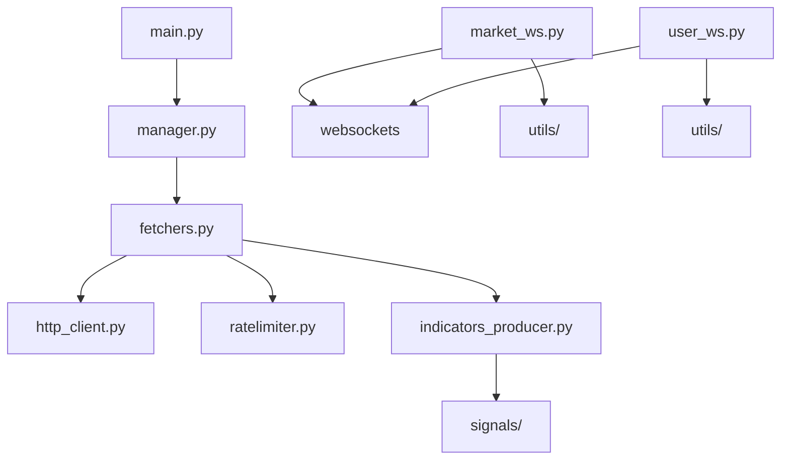

# 数据采集服务

<cite>
**本文档中引用的文件**  
- [main.py](file://data_server/binance/rest_binance/app/main.py)
- [manager.py](file://data_server/binance/rest_binance/app/manager.py)
- [supervisor.py](file://data_server/binance/rest_binance/app/supervisor.py)
- [fetchers.py](file://data_server/binance/rest_binance/app/fetchers.py)
- [ratelimiter.py](file://data_server/binance/rest_binance/app/ratelimiter.py)
- [indicators_producer.py](file://data_server/binance/rest_binance/app/indicators_producer.py)
- [market_ws.py](file://data_server/binance/ws_binance/market_ws.py)
- [user_ws.py](file://data_server/binance/ws_binance/user_ws.py)
- [config.py](file://data_server/binance/rest_binance/app/config.py)
</cite>

## 目录
1. [简介](#简介)
2. [项目结构](#项目结构)
3. [核心组件](#核心组件)
4. [架构概述](#架构概述)
5. [详细组件分析](#详细组件分析)
6. [依赖分析](#依赖分析)
7. [性能考虑](#性能考虑)
8. [故障排除指南](#故障排除指南)
9. [结论](#结论)

## 简介
本文档详细说明了数据采集服务的设计与实现，重点聚焦于Binance交易所的数据接入机制。系统通过REST API与WebSocket两种方式获取市场数据：REST用于批量获取K线与各类市场指标，WebSocket用于实时订阅市场深度、成交事件及用户持仓变化。文档将深入解析`indicators_producer`如何调用技术指标模块（如RSI、MACD、布林带等）进行计算并将结果写入Redis，阐述`fetchers`模块的数据拉取逻辑与`ratelimiter`的限流策略，并提供`market_ws`与`user_ws`的连接管理、消息解析与异常重连机制。最后，提供配置示例指导用户如何添加新的交易对或调整采集频率。

## 项目结构
数据采集服务主要分为两个子系统：`rest_binance`用于通过HTTP REST API进行周期性数据拉取，`ws_binance`用于通过WebSocket建立长连接以接收实时数据流。

**图示来源**
- [main.py](file://data_server/binance/rest_binance/app/main.py#L1-L99)
- [manager.py](file://data_server/binance/rest_binance/app/manager.py#L1-L52)
- [fetchers.py](file://data_server/binance/rest_binance/app/fetchers.py#L1-L226)
- [market_ws.py](file://data_server/binance/ws_binance/market_ws.py#L1-L379)
- [user_ws.py](file://data_server/binance/ws_binance/user_ws.py#L1-L163)

**本节来源**
- [data_server/binance/](file://data_server/binance/)

## 核心组件
系统的核心功能由以下几个模块构成：
- **REST API 数据拉取**：通过`fetchers.py`中的异步函数从Binance API获取K线、资金费率、大户持仓比等数据。
- **指标计算与写入**：`indicators_producer.py`负责调用`signals`目录下的各类技术指标算法，计算结果并写入Redis。
- **限流控制**：`ratelimiter.py`实现了令牌桶算法，确保API调用不超出Binance的速率限制。
- **WebSocket 实时订阅**：`market_ws.py`和`user_ws.py`分别处理市场行情和用户账户的实时数据流。
- **任务调度与管理**：`manager.py`中的`SymbolTaskManager`负责动态管理交易对的采集任务生命周期。

**本节来源**
- [fetchers.py](file://data_server/binance/rest_binance/app/fetchers.py#L1-L226)
- [indicators_producer.py](file://data_server/binance/rest_binance/app/indicators_producer.py#L1-L42)
- [ratelimiter.py](file://data_server/binance/rest_binance/app/ratelimiter.py#L1-L33)
- [market_ws.py](file://data_server/binance/ws_binance/market_ws.py#L1-L379)
- [user_ws.py](file://data_server/binance/ws_binance/user_ws.py#L1-L163)

## 架构概述
整个数据采集服务采用事件驱动与任务调度相结合的架构。REST部分基于`SymbolTaskManager`动态监听Redis中的交易对集合，为每个交易对启动定时采集任务。每个任务通过`ratelimiter`控制频率，调用相应的`fetcher`函数获取数据。对于K线数据，会进一步触发`indicators_producer`进行技术指标计算。WebSocket部分则通过独立的长连接进程，实时接收市场深度、成交和用户持仓更新，并将处理后的数据写入Redis。

**图示来源**
- [main.py](file://data_server/binance/rest_binance/app/main.py#L60-L90)
- [manager.py](file://data_server/binance/rest_binance/app/manager.py#L12-L37)
- [fetchers.py](file://data_server/binance/rest_binance/app/fetchers.py#L33-L47)
- [indicators_producer.py](file://data_server/binance/rest_binance/app/indicators_producer.py#L21-L26)

## 详细组件分析

### REST 数据采集与指标生成

#### 数据拉取逻辑
`fetchers.py`模块定义了多个异步函数，用于从Binance的不同端点获取数据。`fetch_kline`函数负责获取指定交易对、时间周期和数量的K线数据。该函数通过`http_client`发送GET请求，并在获取数据后，立即调用`indicators_producer`进行后续处理。

**图示来源**
- [fetchers.py](file://data_server/binance/rest_binance/app/fetchers.py#L33-L47)

#### 指标计算与写入
`indicators_producer.py`中的`EventGenerator`类是指标计算的核心。它接收原始K线数据，调用`signals.aggregate.compute_all_indicators`函数计算所有预定义的技术指标（包括RSI、MACD、布林带等），然后将结果以JSON格式写入Redis。写入的键名遵循`indicators:binance:{symbol}:{interval}`的命名规范。

**图示来源**
- [indicators_producer.py](file://data_server/binance/rest_binance/app/indicators_producer.py#L13-L26)
- [signals/aggregate.py](file://data_server/binance/rest_binance/app/signals/aggregate.py)

#### 限流策略
`ratelimiter.py`实现了标准的令牌桶（Token Bucket）算法。`TokenBucket`类通过`rate`（每秒产生令牌数）和`capacity`（桶的容量）来控制访问频率。在`fetchers.py`中，为不同的API端点和时间周期创建了独立的限流器实例，确保请求频率严格遵守Binance的API限制。

**图示来源**
- [ratelimiter.py](file://data_server/binance/rest_binance/app/ratelimiter.py#L5-L33)
- [fetchers.py](file://data_server/binance/rest_binance/app/fetchers.py#L18-L27)

**本节来源**
- [fetchers.py](file://data_server/binance/rest_binance/app/fetchers.py#L1-L226)
- [indicators_producer.py](file://data_server/binance/rest_binance/app/indicators_producer.py#L1-L42)
- [ratelimiter.py](file://data_server/binance/rest_binance/app/ratelimiter.py#L1-L33)

### WebSocket 实时数据处理

#### 市场数据连接管理
`market_ws.py`中的`BinanceMarketWS`类负责管理与Binance市场数据WebSocket的连接。它支持动态添加和移除数据流（如`@depth10@100ms`、`@aggTrade`），当订阅列表发生变化时，会通过`_need_reconnect`标志和`_safe_close`强制断开现有连接，从而触发重连以应用新的订阅。

**图示来源**
- [market_ws.py](file://data_server/binance/ws_binance/market_ws.py#L251-L287)
- [market_ws.py](file://data_server/binance/ws_binance/market_ws.py#L234-L248)

#### 用户数据连接与认证
`user_ws.py`中的`BinanceUserWS`类用于连接用户的私有数据流。它使用用户的`api_key`和`api_secret`，通过HMAC-SHA256算法对请求参数进行签名，确保请求的安全性。连接建立后，会定期发送`v2/account.status`和`v2/account.position`请求以获取账户状态和持仓信息。

**图示来源**
- [user_ws.py](file://data_server/binance/ws_binance/user_ws.py#L79-L108)
- [user_ws.py](file://data_server/binance/ws_binance/user_ws.py#L128-L153)

#### 消息解析与异常重连
`market_ws.py`和`user_ws.py`都实现了健壮的异常处理和自动重连机制。`market_ws`的`_recv_loop`在一个无限循环中运行，任何网络异常或连接中断都会被捕获，记录警告日志，并在短暂延迟后尝试重新连接。`user_ws`的`run`方法同样在循环中调用`_connect`，确保在连接失败后能够自动重试。

**本节来源**
- [market_ws.py](file://data_server/binance/ws_binance/market_ws.py#L181-L215)
- [user_ws.py](file://data_server/binance/ws_binance/user_ws.py#L111-L117)

## 依赖分析
系统的主要依赖关系如下：
- `main.py` 依赖于 `manager.py` 和 `fetchers.py` 来启动和管理采集任务。
- `fetchers.py` 依赖于 `http_client.py` 进行网络请求，依赖于 `ratelimiter.py` 进行限流，依赖于 `indicators_producer.py` 进行指标计算。
- `indicators_producer.py` 依赖于 `signals/` 目录下的所有指标计算模块。
- `market_ws.py` 和 `user_ws.py` 依赖于 `websockets` 库和各自的 `utils` 模块进行数据处理和Redis交互。

**图示来源**
- [main.py](file://data_server/binance/rest_binance/app/main.py#L6-L17)
- [fetchers.py](file://data_server/binance/rest_binance/app/fetchers.py#L4-L16)
- [market_ws.py](file://data_server/binance/ws_binance/market_ws.py#L1-L12)
- [user_ws.py](file://data_server/binance/ws_binance/user_ws.py#L1-L13)

**本节来源**
- [data_server/binance/rest_binance/app/](file://data_server/binance/rest_binance/app/)
- [data_server/binance/ws_binance/](file://data_server/binance/ws_binance/)

## 性能考虑
- **异步非阻塞**：整个系统基于`asyncio`构建，所有I/O操作（网络请求、Redis读写）都是异步的，能够高效处理大量并发任务。
- **限流精确**：`TokenBucket`实现确保了API请求的平滑发送，避免了突发流量导致的429错误。
- **连接复用**：`http_client`和`redis_client`通常会使用连接池，减少了频繁建立和断开连接的开销。
- **内存管理**：`market_ws.py`中使用了`_price_cache`和`_depth_liq_cache`等本地缓存，减少了对Redis的频繁读取。

## 故障排除指南
- **REST API 调用失败**：检查`ratelimiter`配置是否过于激进，或Binance API返回的错误码。确保`config.py`中的`rate_limits_seconds`设置合理。
- **WebSocket 连接频繁断开**：检查网络稳定性，或Binance服务器端是否有问题。查看日志中是否有`[WS] Disconnected`记录。
- **Redis 写入失败**：确认Redis服务是否正常运行，连接参数（host, port, password）是否正确。
- **指标未更新**：检查`symbol:binance` Redis集合中是否包含目标交易对，以及`FETCH_PLAN`中是否配置了相应的时间周期。

**本节来源**
- [fetchers.py](file://data_server/binance/rest_binance/app/fetchers.py#L48-L49)
- [market_ws.py](file://data_server/binance/ws_binance/market_ws.py#L204-L205)
- [user_ws.py](file://data_server/binance/ws_binance/user_ws.py#L103-L108)

## 结论
该数据采集服务设计精良，通过REST和WebSocket两种互补的方式，实现了对Binance交易所数据的全面、实时采集。系统模块化程度高，职责清晰，通过`SymbolTaskManager`实现了动态任务管理，通过`TokenBucket`确保了合规的API调用。`indicators_producer`将原始K线数据转化为有价值的技术指标，为上层分析提供了坚实的数据基础。整体架构稳定可靠，具备良好的可扩展性和维护性。