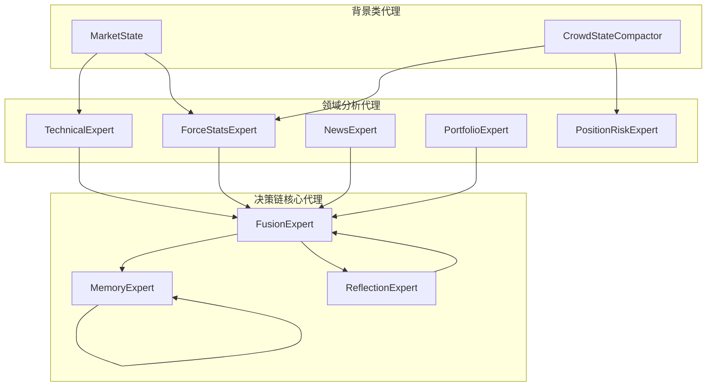
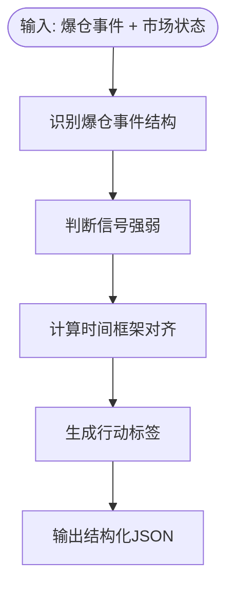

# 专家代理架构

<cite>
**本文档引用的文件**
- [__init__.py](file://agent_server/agents/experts/__init__.py)
- [instructions.py](file://agent_server/agents/instructions.py)
- [technical.py](file://agent_server/agents/experts/analysis/technical.py)
- [force_stats.py](file://agent_server/agents/experts/analysis/force_stats.py)
- [news.py](file://agent_server/agents/experts/analysis/news.py)
- [portfolio.py](file://agent_server/agents/experts/analysis/portfolio.py)
- [position_risk.py](file://agent_server/agents/experts/analysis/position_risk.py)
- [fusion.py](file://agent_server/agents/experts/orchestration/fusion.py)
- [memory.py](file://agent_server/agents/experts/orchestration/memory.py)
- [reflection.py](file://agent_server/agents/experts/orchestration/reflection.py)
- [json_utils.py](file://agent_server/agents/experts/utils/json_utils.py)
- [market_state.py](file://agent_server/agents/experts/background/market_state.py)
- [crowd_state_compactor.py](file://agent_server/agents/experts/background/crowd_state_compactor.py)
- [kline.py](file://agent_server/configs/prompts/kline.py)
- [force_stats.py](file://agent_server/configs/prompts/force_stats.py)
- [position_risk.py](file://agent_server/configs/prompts/position_risk.py)
</cite>

## 目录
1. [引言](#引言)
2. [专家代理系统架构概览](#专家代理系统架构概览)
3. [领域分析代理](#领域分析代理)
   - [技术面分析代理（technical）](#技术面分析代理technical)
   - [资金流分析代理（force_stats）](#资金流分析代理force_stats)
   - [新闻分析代理（news）](#新闻分析代理news)
   - [投资组合分析代理（portfolio）](#投资组合分析代理portfolio)
   - [位置风险代理（position_risk）](#位置风险代理position_risk)
4. [背景类代理](#背景类代理)
   - [市场状态聚合（market_state）](#市场状态聚合market_state)
   - [人群情绪压缩（crowd_state_compactor）](#人群情绪压缩crowd_state_compactor)
5. [决策链核心代理](#决策链核心代理)
   - [融合代理（fusion）](#融合代理fusion)
   - [记忆代理（memory）](#记忆代理memory)
   - [反思代理（reflection）](#反思代理reflection)
6. [LLM调用与提示词设计](#llm调用与提示词设计)
7. [专家代理工厂与注册机制](#专家代理工厂与注册机制)
8. [结论](#结论)

## 引言
本文档深入解析专家代理系统的架构设计，阐述`agents/experts`目录下各模块的职责划分与协同机制。系统通过多个领域特定的专家代理，基于市场事件执行精细化分析，并通过背景类代理维护全局市场状态，最终由融合、记忆与反思类代理构成决策链，实现智能、稳健的交易决策支持。

## 专家代理系统架构概览
专家代理系统采用模块化设计，将不同领域的分析能力解耦为独立的专家代理。这些代理可分为三大类：领域分析代理负责特定维度的市场分析；背景类代理维护全局市场状态与人群情绪；决策链核心代理则负责整合信息、形成决策并管理上下文。所有代理通过统一的接口（`run`方法）和数据格式（JSON）进行交互，确保系统的可扩展性与稳定性。

**图源**
- [__init__.py](file://agent_server/agents/experts/__init__.py)
- [market_state.py](file://agent_server/agents/experts/background/market_state.py)
- [crowd_state_compactor.py](file://agent_server/agents/experts/background/crowd_state_compactor.py)

## 领域分析代理
领域分析代理是系统的核心分析单元，每个代理专注于一个特定的市场分析维度。它们接收结构化的市场事件作为输入，利用大语言模型（LLM）进行深度分析，并输出标准化的JSON结果。

### 技术面分析代理（technical）
技术面分析代理（`technical`）负责分析技术指标和趋势背景。它通过`instructions.py`中的`build_instruction`函数构建提示词，明确指示LLM分析技术指标和趋势上下文。该代理使用`web_json`和`calc_rsi`等工具获取外部数据，确保分析的全面性。其输出遵循严格的JSON Schema，包含摘要、细节、置信度等字段，便于下游系统解析。

**节源**
- [technical.py](file://agent_server/agents/experts/analysis/technical.py)
- [instructions.py](file://agent_server/agents/instructions.py)

### 资金流分析代理（force_stats）
资金流分析代理（`force_stats`）是爆仓统计与强制平仓行为的专家。它接收爆仓事件数据和市场状态背景作为输入，严格遵循预定义的规则进行分析。其核心任务是识别爆仓事件的结构特征（如单边主导、双向交替）、判断其微结构意义（如顺势加速、逆势扫损），并结合市场状态背景评估其影响。该代理的提示词（`configs/prompts/force_stats.py`）定义了详细的信号强弱计算规则、时间框架对齐规则和行动标签约束，确保输出的客观性和一致性。

**图源**
- [force_stats.py](file://agent_server/agents/experts/analysis/force_stats.py)
- [force_stats.py](file://agent_server/configs/prompts/force_stats.py)

**节源**
- [force_stats.py](file://agent_server/agents/experts/analysis/force_stats.py)

### 新闻分析代理（news）
新闻分析代理（`news`）负责总结与市场相关的新闻背景。其职责是将海量的新闻信息提炼为简洁、客观的摘要，为其他代理提供宏观和事件驱动的上下文。该代理同样使用`build_instruction`函数构建提示词，并调用`web_json`等工具获取新闻数据。其输出聚焦于关键事件、市场情绪和潜在影响，避免主观臆测。

**节源**
- [news.py](file://agent_server/agents/experts/analysis/news.py)

### 投资组合分析代理（portfolio）
投资组合分析代理（`portfolio`）负责提出仓位调整和投资组合操作建议。它基于当前的市场分析和持仓情况，评估最优的资产配置策略。该代理的提示词明确要求LLM提出具体的仓位调整建议，如加仓、减仓或调仓，其输出为后续的执行系统提供直接的决策依据。

**节源**
- [portfolio.py](file://agent_server/agents/experts/analysis/portfolio.py)

### 位置风险代理（position_risk）
位置风险代理（`position_risk`）是持仓风险控制与仓位管理的执行代理。其核心职责是确保当前持仓的风险暴露处于可控范围内，并在必要时采取防御或退出动作。该代理接收持仓快照、信号确认结果、时间状态、市场结构、人群状态等多种输入，根据预设的决策逻辑进行综合评估。其提示词（`configs/prompts/position_risk.py`）定义了严格的决策优先级规则，如硬性边界优先、连续性风险规则、人群拥挤与轧空风险处理等，确保风控决策的严谨性和可执行性。

**节源**
- [position_risk.py](file://agent_server/agents/experts/analysis/position_risk.py)
- [position_risk.py](file://agent_server/configs/prompts/position_risk.py)

## 背景类代理
背景类代理负责维护和提供全局的市场状态信息，为所有分析代理提供统一、稳定的分析基础。

### 市场状态聚合（market_state）
市场状态代理（`market_state`）负责聚合多周期K线数据，生成统一的“市场背景地图”。它将不同时间框架（微周期、短周期、中周期、长周期）的K线分析结果进行聚合，形成结构化的市场状态。该模块定义了`INTERVAL_GROUPS`来划分时间框架，并通过`aggregate_structural_group`等函数计算各周期的趋势方向、结构、动量和风险。特别地，`detect_long_term_veto`函数实现了长周期一票否决规则，当长周期趋势与短周期发生根本性冲突时，可直接否决短周期的信号，确保决策的宏观一致性。

**节源**
- [market_state.py](file://agent_server/agents/experts/background/market_state.py)

### 人群情绪压缩（crowd_state_compactor）
人群情绪压缩代理（`crowd_state_compactor`）负责将复杂的全量人群结构分析结果压缩为一个低噪音的`crowd_state`对象。该对象包含`bias`（偏向）、`crowding_level`（拥挤程度）、`fragility`（脆弱性）、`funding_pressure`（资金压力）等关键指标，专用于风险、置信度和否决规则的调整。通过此压缩，系统避免了在每次分析中传递庞大的原始数据，提高了效率和稳定性。

**节源**
- [crowd_state_compactor.py](file://agent_server/agents/experts/background/crowd_state_compactor.py)

## 决策链核心代理
决策链核心代理位于系统架构的上层，负责整合各专家代理的输出，形成最终决策，并管理决策的上下文和记忆。

### 融合代理（fusion）
融合代理（`fusion`）负责将多个专家代理的输出进行加权融合。它接收各代理的名称、输出、基础权重、反思分数和自动评分，通过加权平均算法计算出最终的融合权重。其`run`方法实现了核心的融合逻辑：`combined[n] = bw * (0.5 * rs + 0.5 * ascore)`，其中`bw`为基础权重，`rs`为反思分数，`ascore`为自动评分。最终输出包含融合后的文本和各代理的权重，为执行系统提供明确的决策依据。

**节源**
- [fusion.py](file://agent_server/agents/experts/orchestration/fusion.py)

### 记忆代理（memory）
记忆代理（`memory`）负责管理交易决策的记忆和上下文。它利用`MemoryCoordinator`和`MemoryStore`组件，将融合结果、各代理输出、反思信息、权重和事件载荷持久化存储。通过`update`和`get_model_context`方法，系统能够追踪特定交易ID的完整决策历史，实现基于历史的上下文感知和连续性分析。

**节源**
- [memory.py](file://agent_server/agents/experts/orchestration/memory.py)

### 反思代理（reflection）
反思代理（`reflection`）负责对各专家代理的输出进行初步评估和反思。其`run`方法目前基于输出文本的长度来计算一个简单的反思分数（`scores[n] = min(1.0, max(0.0, len(t) / 1000.0))`），并生成简要的洞察笔记。该分数作为`fusion`代理的输入之一，用于调整各代理的权重，体现了系统对信息质量和深度的考量。

**节源**
- [reflection.py](file://agent_server/agents/experts/orchestration/reflection.py)

## LLM调用与提示词设计
系统的LLM调用设计高度标准化。`instructions.py`文件中的`build_instruction`函数是核心，它通过`_load_prompt`函数从`configs/prompts`目录加载特定代理的提示词模板，并附加统一的JSON输出Schema。该Schema强制要求所有代理的输出必须是结构化的JSON对象，包含`agent`、`task`、`content`、`confidence`、`rationale`等标准字段，确保了输出的可解析性和一致性。各代理的提示词（如`kline.py`、`force_stats.py`）都经过精心设计，明确了代理的角色、职责、输入字段、分析规则和输出格式，最大限度地减少了LLM的幻觉和不一致性。

**节源**
- [instructions.py](file://agent_server/agents/instructions.py)
- [kline.py](file://agent_server/configs/prompts/kline.py)

## 专家代理工厂与注册机制
系统通过`__init__.py`文件中的`load_expert`工厂方法实现专家代理的动态加载和注册。该函数根据传入的代理名称（如`"news"`、`"technical"`）返回对应的专家代理实例。这种设计模式实现了代理的解耦，使得新增代理只需在`load_expert`函数中添加一个新的`if`分支即可，无需修改其他代码。虽然文档中未显式定义`AGENT_REGISTRY`，但`load_expert`函数本身扮演了注册表的角色，是系统扩展新类型专家代理的关键入口。

**节源**
- [__init__.py](file://agent_server/agents/experts/__init__.py)

## 结论
专家代理系统通过清晰的职责划分和模块化设计，构建了一个强大、灵活且稳健的智能分析框架。领域分析代理、背景类代理和决策链核心代理各司其职，协同工作。标准化的LLM调用和提示词设计确保了输出的可靠性和一致性。工厂方法和潜在的注册机制为系统的持续扩展提供了便利。该架构为实现复杂、多维度的市场分析和智能决策奠定了坚实的基础。