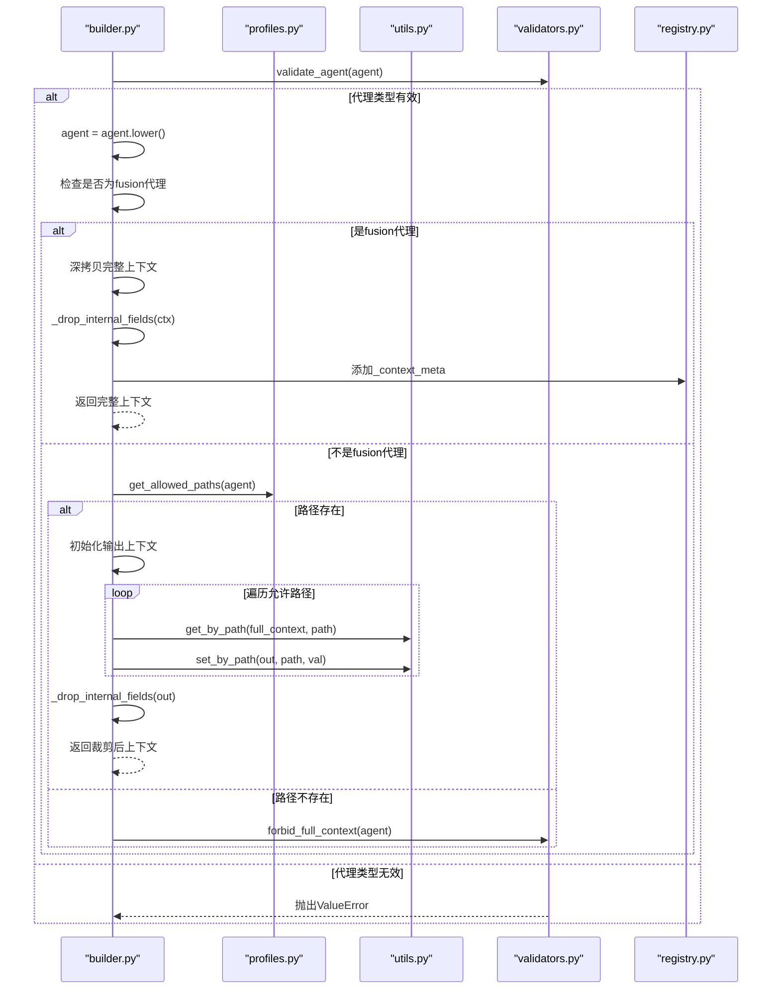
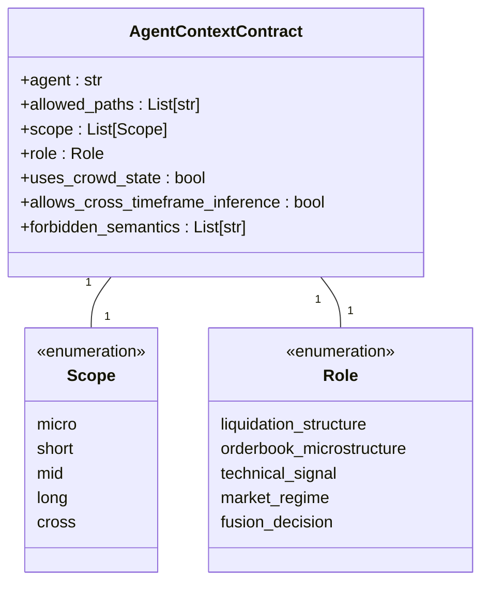
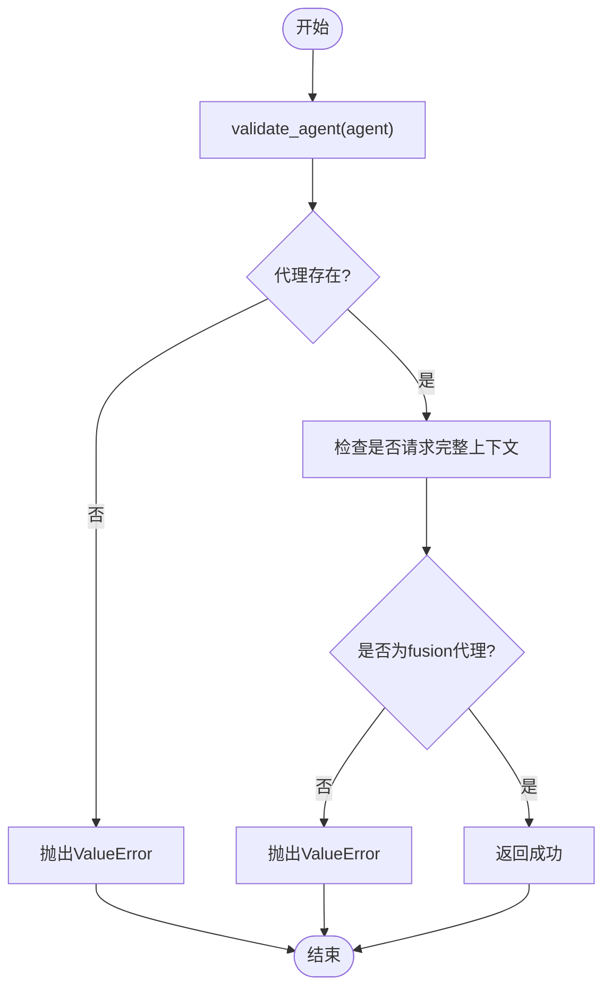
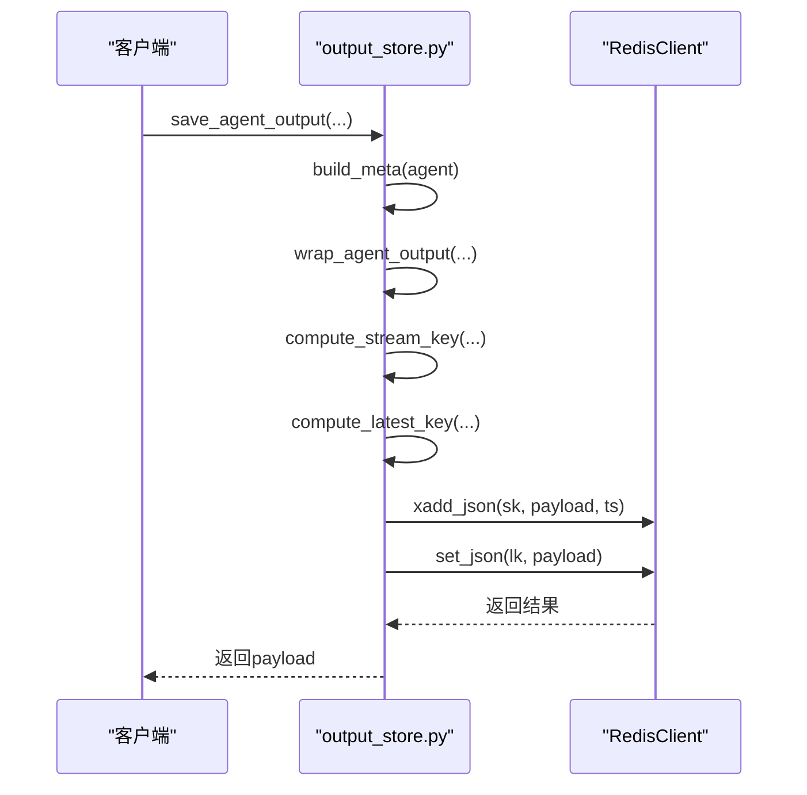
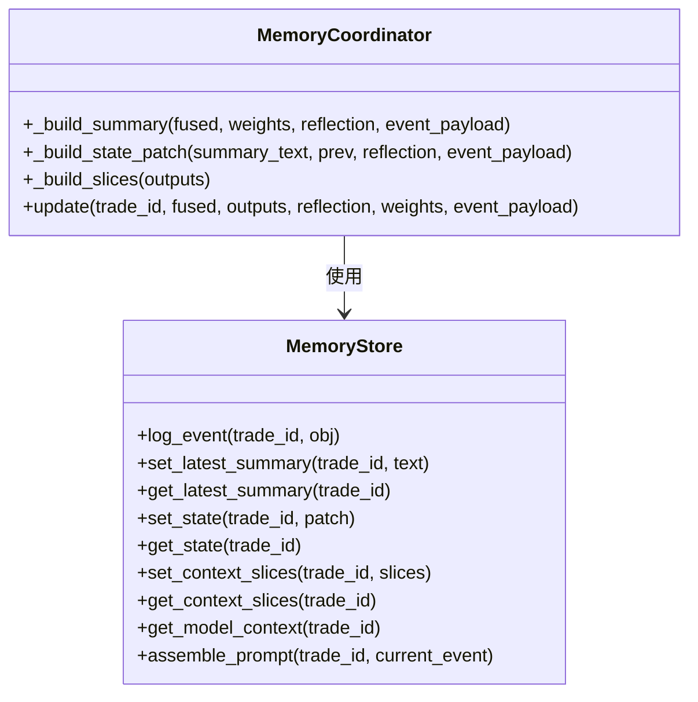
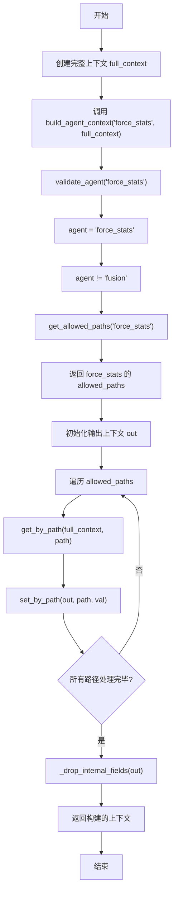

# 代理上下文管理

<cite>
**本文档引用文件**   
- [builder.py](file://agent_server/agent_context/builder.py)
- [profiles.py](file://agent_server/agent_context/profiles.py)
- [output_store.py](file://agent_server/agent_context/output_store.py)
- [validators.py](file://agent_server/agent_context/validators.py)
- [contracts.py](file://agent_server/agent_context/contracts.py)
- [registry.py](file://agent_server/agent_context/registry.py)
- [utils.py](file://agent_server/agent_context/utils.py)
- [context.py](file://agent_server/memory/context.py)
- [store.py](file://agent_server/memory/store.py)
- [schema.py](file://agent_server/memory/schema.py)
- [redis_client.py](file://agent_server/utils/redis_client.py)
- [market_state_view.py](file://agent_server/utils/market_state_view.py)
- [test_agent_context_builder.py](file://tests/test_agent_context_builder.py)
- [test_agent_output_store.py](file://tests/test_agent_output_store.py)
</cite>

## 目录
1. [引言](#引言)
2. [代理上下文构建机制](#代理上下文构建机制)
3. [数据契约与校验规则](#数据契约与校验规则)
4. [上下文持久化存储](#上下文持久化存储)
5. [注册表与配置管理](#注册表与配置管理)
6. [辅助工具与内存管理](#辅助工具与内存管理)
7. [上下文构建流程示例](#上下文构建流程示例)
8. [常见问题与排查方法](#常见问题与排查方法)
9. [结论](#结论)

## 引言
本文档全面阐述代理上下文（Agent Context）的构建与管理机制。系统通过`builder.py`根据运行时环境动态组装执行上下文，整合市场状态、事件数据与历史记忆。`output_store.py`实现分析结果的持久化存储至Redis，支持异步写入与幂等性保障。`validators.py`确保代理输出符合`contracts.py`定义的统一数据契约。`registry.py`在上下文构建过程中提供元信息注册服务，`utils.py`提供路径操作等辅助函数。

**Section sources**
- [builder.py](file://agent_server/agent_context/builder.py#L1-L49)
- [output_store.py](file://agent_server/agent_context/output_store.py#L1-L73)

## 代理上下文构建机制

代理上下文构建的核心是`build_agent_context`函数，它根据代理类型从完整上下文中提取所需字段。该过程遵循严格的访问控制策略，确保每个代理只能访问其授权范围内的数据。



**Diagram sources**
- [builder.py](file://agent_server/agent_context/builder.py#L18-L49)
- [profiles.py](file://agent_server/agent_context/profiles.py#L7-L13)
- [validators.py](file://agent_server/agent_context/validators.py#L6-L16)
- [utils.py](file://agent_server/agent_context/utils.py#L6-L23)

**Section sources**
- [builder.py](file://agent_server/agent_context/builder.py#L18-L49)
- [profiles.py](file://agent_server/agent_context/profiles.py#L7-L13)

## 数据契约与校验规则

### 数据契约定义
`contracts.py`定义了代理上下文的核心规范，使用`TypedDict`和字面量类型确保类型安全。



**Diagram sources**
- [contracts.py](file://agent_server/agent_context/contracts.py#L6-L36)

### 输出校验规则
`validators.py`实现了对代理输出格式的校验，防止越权访问。



**Diagram sources**
- [validators.py](file://agent_server/agent_context/validators.py#L6-L16)

**Section sources**
- [contracts.py](file://agent_server/agent_context/contracts.py#L6-L36)
- [validators.py](file://agent_server/agent_context/validators.py#L6-L16)

## 上下文持久化存储

`output_store.py`模块负责将代理分析结果持久化存储到Redis中，支持异步写入和幂等性保障。



存储策略包括：
- **流式存储**：使用Redis Stream按时间序列存储历史记录
- **最新值存储**：使用Redis Key-Value存储最新状态
- **幂等性保障**：通过时间戳和唯一键确保数据一致性

**Diagram sources**
- [output_store.py](file://agent_server/agent_context/output_store.py#L51-L60)
- [redis_client.py](file://agent_server/utils/redis_client.py#L24-L37)

**Section sources**
- [output_store.py](file://agent_server/agent_context/output_store.py#L29-L60)

## 注册表与配置管理

`registry.py`是代理上下文系统的核心配置中心，定义了所有代理的元信息和访问策略。

```python
AGENT_REGISTRY: dict[str, AgentContextContract] = {
    "force_stats": {
        "agent": "force_stats",
        "role": "liquidation_structure",
        "scope": ["micro", "short"],
        "uses_crowd_state": True,
        "allows_cross_timeframe_inference": False,
        "forbidden_semantics": [
            "trend_forecast",
            "strategy_advice",
            "mid_term_confirmation",
        ],
        "allowed_paths": [
            "market_state.micro_term.state",
            "market_state.short_term.direction",
            "market_state.short_term.risk",
            "market_state.short_term.confidence",
            "market_state.mid_term.direction",
            "market_state.long_term.veto",
            "crowd_state.bias",
            "crowd_state.crowding_level",
            "crowd_state.fragility",
            "crowd_state.consistency",
            "crowd_state.funding_pressure",
        ],
    },
    # ... 其他代理配置
}
```

每个代理配置包含：
- **角色（role）**：定义代理的分析职责
- **作用域（scope）**：定义时间尺度边界
- **允许路径（allowed_paths）**：字段白名单
- **群体状态使用（uses_crowd_state）**：是否可访问群体心理数据

**Section sources**
- [registry.py](file://agent_server/agent_context/registry.py#L6-L123)

## 辅助工具与内存管理

### 路径操作工具
`utils.py`提供通用的路径操作函数，支持嵌套字典的get/set操作。

```mermaid
classDiagram
class Utils {
+get_by_path(obj : Dict, path : str) : Any
+set_by_path(out : Dict, path : str, value : Any) : None
}
Utils : : : 工具函数
```

### 内存管理
`memory/`目录下的组件负责管理代理的长期记忆和状态。



**Diagram sources**
- [utils.py](file://agent_server/agent_context/utils.py#L6-L23)
- [store.py](file://agent_server/memory/store.py#L12-L180)

**Section sources**
- [utils.py](file://agent_server/agent_context/utils.py#L6-L23)
- [store.py](file://agent_server/memory/store.py#L12-L180)
- [context.py](file://agent_server/memory/context.py#L7-L27)

## 上下文构建流程示例

以下是一个完整的上下文构建流程示例：



该流程确保了：
1. 代理身份验证
2. 访问权限控制
3. 敏感字段过滤
4. 数据完整性保障

**Section sources**
- [test_agent_context_builder.py](file://tests/test_agent_context_builder.py#L13-L100)

## 常见问题与排查方法

### 常见上下文构建失败原因

| 问题类型 | 原因分析 | 排查方法 |
|---------|--------|--------|
| 未知代理 | 代理名称未在`AGENT_REGISTRY`中注册 | 检查`registry.py`中的注册表配置 |
| 权限不足 | 代理请求了不允许的字段路径 | 检查`allowed_paths`配置 |
| 完整上下文请求失败 | 非fusion代理请求完整上下文 | 确认代理类型是否为fusion |
| 字段缺失 | 路径格式错误或字段不存在 | 验证路径格式和数据源完整性 |
| 类型错误 | 数据类型不符合契约定义 | 检查`contracts.py`中的类型定义 |

### 排查步骤
1. **验证代理名称**：确保代理名称正确且已注册
2. **检查配置文件**：确认`registry.py`中的配置正确
3. **验证输入数据**：确保完整上下文包含所需字段
4. **调试路径解析**：使用`get_by_path`测试路径可达性
5. **查看日志信息**：检查异常堆栈和错误消息

**Section sources**
- [test_agent_context_builder.py](file://tests/test_agent_context_builder.py#L96-L99)
- [validators.py](file://agent_server/agent_context/validators.py#L6-L16)

## 结论
代理上下文管理系统通过模块化设计实现了安全、高效的上下文构建与管理。核心机制包括：
- 基于注册表的代理元信息管理
- 基于白名单的字段访问控制
- 敏感数据过滤与清理
- Redis持久化存储与幂等性保障
- 完整的校验与错误处理机制

该系统确保了不同代理在各自权限范围内安全地访问所需数据，同时通过统一的数据契约保证了系统的一致性和可维护性。