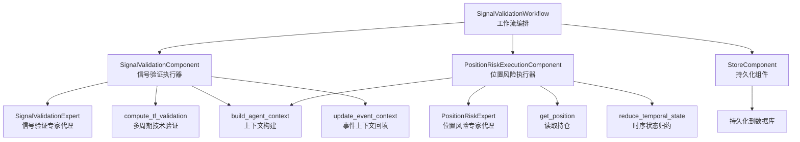
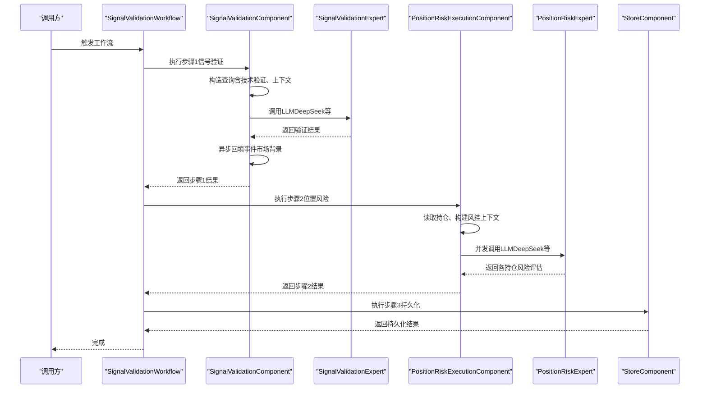
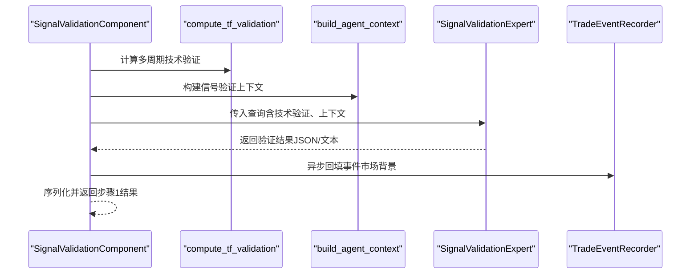
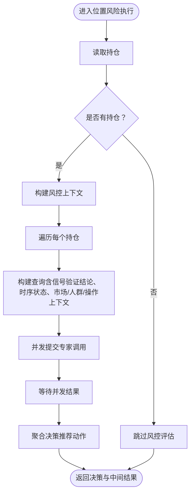
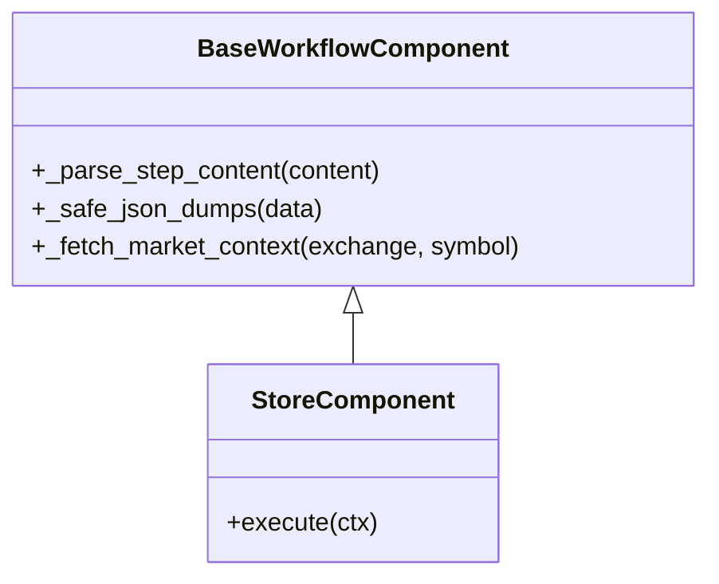
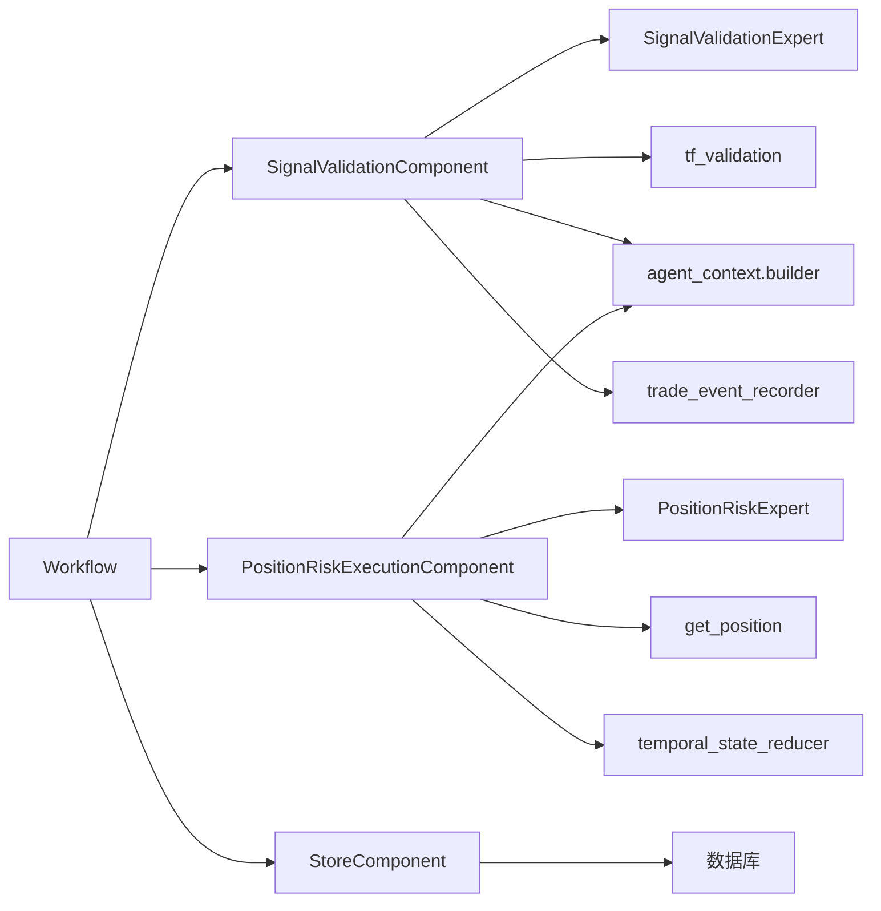

# 工作流与执行机制

<cite>
**本文引用的文件**
- [signal_validation_workflow.py](file://agent_server/agent_workflow/signal_validation_workflow.py)
- [signal_validation_execution.py](file://agent_server/agent_workflow/components/executors/signal_validation_execution.py)
- [position_risk_execution.py](file://agent_server/agent_workflow/components/executors/position_risk_execution.py)
- [base.py](file://agent_server/agent_workflow/components/base.py)
- [store.py](file://agent_server/agent_workflow/components/store.py)
- [signal_validation.py](file://agent_server/agents/experts/analysis/signal_validation.py)
- [position_risk.py](file://agent_server/agents/experts/analysis/position_risk.py)
- [tf_validation.py](file://agent_server/tools/tf_validation.py)
- [get_position.py](file://agent_server/tools/get_position.py)
- [builder.py](file://agent_server/agent_context/builder.py)
- [temporal_state_reducer.py](file://agent_server/reducers/temporal_state_reducer.py)
- [trade_event_recorder.py](file://agent_server/utils/trade_event_recorder.py)
</cite>

## 目录
1. [引言](#引言)
2. [项目结构](#项目结构)
3. [核心组件](#核心组件)
4. [架构总览](#架构总览)
5. [详细组件分析](#详细组件分析)
6. [依赖关系分析](#依赖关系分析)
7. [性能考量](#性能考量)
8. [故障排查指南](#故障排查指南)
9. [结论](#结论)
10. [附录](#附录)

## 引言
本文件围绕信号验证工作流（signal_validation_workflow）的执行机制展开，系统性解析其如何协调多个专家代理对交易信号进行多维度验证，涵盖技术面、资金流与位置风险的综合评估。重点说明：
- 信号验证执行器如何调用 LLM 进行语义级信号验证，并处理来自 DeepSeek 等模型的响应；
- 位置风险执行器如何评估当前持仓风险并反馈至决策链；
- 执行组件基类与状态存储机制；
- 工作流调用时序图与错误处理策略；
- 如何扩展新的执行步骤。

## 项目结构
信号验证工作流位于 agent_server/agent_workflow 目录，采用分层组织：
- 工作流编排：signal_validation_workflow.py
- 执行器：executors 下的 signal_validation_execution.py、position_risk_execution.py
- 基类与持久化：base.py、store.py
- 专家代理：agents/experts/analysis 下的 signal_validation.py、position_risk.py
- 工具与上下文：tools/tf_validation.py、tools/get_position.py、agent_context/builder.py、reducers/temporal_state_reducer.py、utils/trade_event_recorder.py

图表来源
- [signal_validation_workflow.py](file://agent_server/agent_workflow/signal_validation_workflow.py#L1-L34)
- [signal_validation_execution.py](file://agent_server/agent_workflow/components/executors/signal_validation_execution.py#L1-L71)
- [position_risk_execution.py](file://agent_server/agent_workflow/components/executors/position_risk_execution.py#L1-L184)
- [base.py](file://agent_server/agent_workflow/components/base.py#L1-L44)
- [store.py](file://agent_server/agent_workflow/components/store.py#L1-L52)
- [signal_validation.py](file://agent_server/agents/experts/analysis/signal_validation.py#L1-L136)
- [position_risk.py](file://agent_server/agents/experts/analysis/position_risk.py#L1-L229)
- [tf_validation.py](file://agent_server/tools/tf_validation.py#L1-L271)
- [get_position.py](file://agent_server/tools/get_position.py#L1-L44)
- [builder.py](file://agent_server/agent_context/builder.py#L1-L49)
- [temporal_state_reducer.py](file://agent_server/reducers/temporal_state_reducer.py#L1-L147)
- [trade_event_recorder.py](file://agent_server/utils/trade_event_recorder.py#L1-L451)

章节来源
- [signal_validation_workflow.py](file://agent_server/agent_workflow/signal_validation_workflow.py#L1-L34)

## 核心组件
- 工作流编排：SignalValidationWorkflow 将三个步骤串联：信号验证、位置风险评估、持久化。
- 执行器：
  - SignalValidationComponent：准备上下文、构造查询、调用专家代理、异步回填事件上下文。
  - PositionRiskExecutionComponent：读取持仓、构建风控上下文、并发调用专家代理、聚合决策。
  - StoreComponent：按 trade_id 拆分并持久化完整决策轨迹。
- 基类与工具：
  - BaseWorkflowComponent：统一解析输入、序列化输出、从 Redis 读取市场背景。
  - tf_validation：多周期技术一致性与反转风险评估。
  - get_position：从 Redis 读取当前持仓。
  - temporal_state_reducer：基于信号验证结论的时序状态归约。
  - trade_event_recorder：异步回填事件市场背景快照。

章节来源
- [signal_validation_workflow.py](file://agent_server/agent_workflow/signal_validation_workflow.py#L1-L34)
- [signal_validation_execution.py](file://agent_server/agent_workflow/components/executors/signal_validation_execution.py#L1-L71)
- [position_risk_execution.py](file://agent_server/agent_workflow/components/executors/position_risk_execution.py#L1-L184)
- [store.py](file://agent_server/agent_workflow/components/store.py#L1-L52)
- [base.py](file://agent_server/agent_workflow/components/base.py#L1-L44)
- [tf_validation.py](file://agent_server/tools/tf_validation.py#L1-L271)
- [get_position.py](file://agent_server/tools/get_position.py#L1-L44)
- [temporal_state_reducer.py](file://agent_server/reducers/temporal_state_reducer.py#L1-L147)
- [trade_event_recorder.py](file://agent_server/utils/trade_event_recorder.py#L1-L451)

## 架构总览
工作流以“步骤”为单位串行执行，每个步骤以字符串形式传递中间结果，通过 BaseWorkflowComponent 的解析与序列化保障兼容性。信号验证阶段引入多周期技术一致性校验与市场背景上下文；位置风险阶段结合历史信号验证结论与时序状态，对每个持仓并发评估并聚合决策；最后按 trade_id 持久化完整轨迹。

图表来源
- [signal_validation_workflow.py](file://agent_server/agent_workflow/signal_validation_workflow.py#L1-L34)
- [signal_validation_execution.py](file://agent_server/agent_workflow/components/executors/signal_validation_execution.py#L1-L71)
- [position_risk_execution.py](file://agent_server/agent_workflow/components/executors/position_risk_execution.py#L1-L184)
- [signal_validation.py](file://agent_server/agents/experts/analysis/signal_validation.py#L1-L136)
- [position_risk.py](file://agent_server/agents/experts/analysis/position_risk.py#L1-L229)
- [store.py](file://agent_server/agent_workflow/components/store.py#L1-L52)

## 详细组件分析

### 信号验证执行器（SignalValidationComponent）
职责与流程
- 输入：事件数据（symbol、exchange、direction、tf_hint、event_id 等）。
- 技术验证：调用 compute_tf_validation，对指定周期（如 15m/30m/1h）进行趋势、动量、结构与关键位冲突的多维一致性评估。
- 上下文构建：从 Redis 读取 market_state，使用 build_agent_context 生成面向信号验证的精简上下文。
- 专家调用：构造查询对象，调用 SignalValidationExpert.run，内部使用 OpenAI-like 模型（默认 DeepSeek）进行语义级验证。
- 输出：将事件数据、验证结果、完整上下文打包返回，同时异步回填事件的市场背景快照。

关键点
- LLM 调用：通过 get_agent_config 获取模型参数，构造 Agent 并执行 arun，支持从文本中提取 JSON。
- 错误处理：若模型返回非 JSON，尝试从文本中提取 JSON；若仍失败，包装为 {"raw": ...}。
- 异步回填：使用 TradeEventRecorder.update_event_context 异步更新事件的 market_context，避免阻塞主流程。

图表来源
- [signal_validation_execution.py](file://agent_server/agent_workflow/components/executors/signal_validation_execution.py#L1-L71)
- [tf_validation.py](file://agent_server/tools/tf_validation.py#L1-L271)
- [builder.py](file://agent_server/agent_context/builder.py#L1-L49)
- [signal_validation.py](file://agent_server/agents/experts/analysis/signal_validation.py#L1-L136)
- [trade_event_recorder.py](file://agent_server/utils/trade_event_recorder.py#L1-L451)

章节来源
- [signal_validation_execution.py](file://agent_server/agent_workflow/components/executors/signal_validation_execution.py#L1-L71)
- [signal_validation.py](file://agent_server/agents/experts/analysis/signal_validation.py#L1-L136)
- [tf_validation.py](file://agent_server/tools/tf_validation.py#L1-L271)
- [builder.py](file://agent_server/agent_context/builder.py#L1-L49)
- [trade_event_recorder.py](file://agent_server/utils/trade_event_recorder.py#L1-L451)

### 位置风险执行器（PositionRiskExecutionComponent）
职责与流程
- 输入：继承自上一步的事件数据、验证结果与上下文。
- 持仓读取：通过 get_position 获取当前 symbol 的所有活跃持仓。
- 上下文构建：优先使用上游传入的 full_context，否则自行拉取 Redis 市场背景；使用 build_agent_context 生成面向位置风险的上下文。
- 风控评估：
  - 对每个持仓并发构建查询（包含信号验证结论、时序状态、市场与人群上下文、操作上下文）。
  - 并发调用 PositionRiskExpert.run，收集各持仓的风险评估结果。
- 决策聚合：将每个持仓的推荐动作（recommended_action）汇总为决策列表，返回包含 queries、risk_results、decisions 与上一步结果的结构。

并发与聚合
- 使用 asyncio.gather 并发等待所有专家调用完成，提升吞吐。
- 通过 zip 保持 queries、results、decisions 的一一对应，确保后续持久化正确性。

图表来源
- [position_risk_execution.py](file://agent_server/agent_workflow/components/executors/position_risk_execution.py#L1-L184)
- [get_position.py](file://agent_server/tools/get_position.py#L1-L44)
- [builder.py](file://agent_server/agent_context/builder.py#L1-L49)
- [temporal_state_reducer.py](file://agent_server/reducers/temporal_state_reducer.py#L1-L147)
- [position_risk.py](file://agent_server/agents/experts/analysis/position_risk.py#L1-L229)

章节来源
- [position_risk_execution.py](file://agent_server/agent_workflow/components/executors/position_risk_execution.py#L1-L184)
- [get_position.py](file://agent_server/tools/get_position.py#L1-L44)
- [builder.py](file://agent_server/agent_context/builder.py#L1-L49)
- [temporal_state_reducer.py](file://agent_server/reducers/temporal_state_reducer.py#L1-L147)
- [position_risk.py](file://agent_server/agents/experts/analysis/position_risk.py#L1-L229)

### 执行组件基类与状态存储
- BaseWorkflowComponent：
  - _parse_step_content：兼容 dict、str、可字面量解析的字符串，确保下游步骤可稳定接收上一步输出。
  - _safe_json_dumps：统一序列化，避免编码问题。
  - _fetch_market_context：从 Redis 读取 background:*:market_state，构造标准化 full_context。
- StoreComponent：
  - 按 trade_id 拆分持久化，确保每笔交易都有独立的完整决策历史。
  - 保存事件输入、信号验证输出、风险评估查询与结果、最终决策。

图表来源
- [base.py](file://agent_server/agent_workflow/components/base.py#L1-L44)
- [store.py](file://agent_server/agent_workflow/components/store.py#L1-L52)

章节来源
- [base.py](file://agent_server/agent_workflow/components/base.py#L1-L44)
- [store.py](file://agent_server/agent_workflow/components/store.py#L1-L52)

### 专家代理与多模型支持
- SignalValidationExpert / PositionRiskExpert：
  - 通过 get_agent_config 获取模型 id、base_url、api_key，默认使用 DeepSeek 模型。
  - 使用 OpenAI-like 接口封装，统一调用流程。
  - 对模型返回内容进行健壮性处理：优先 JSON，其次尝试从文本提取 JSON，最后兜底为 {"raw": ...}。
  - 将专家输出持久化到系统存储，便于审计与复盘。

章节来源
- [signal_validation.py](file://agent_server/agents/experts/analysis/signal_validation.py#L1-L136)
- [position_risk.py](file://agent_server/agents/experts/analysis/position_risk.py#L1-L229)

## 依赖关系分析
- 工作流与执行器：Workflow 串联三个执行器，执行器之间通过字符串中间态传递数据。
- 执行器与专家代理：执行器负责数据准备与并发调度，专家代理负责模型调用与结果解析。
- 工具与上下文：tf_validation、get_position、builder、temporal_state_reducer、trade_event_recorder 提供数据与状态支撑。
- 错误处理：执行器与专家代理均具备 JSON 解析失败的兜底策略；持久化组件对缺失字段进行跳过处理。

图表来源
- [signal_validation_workflow.py](file://agent_server/agent_workflow/signal_validation_workflow.py#L1-L34)
- [signal_validation_execution.py](file://agent_server/agent_workflow/components/executors/signal_validation_execution.py#L1-L71)
- [position_risk_execution.py](file://agent_server/agent_workflow/components/executors/position_risk_execution.py#L1-L184)
- [signal_validation.py](file://agent_server/agents/experts/analysis/signal_validation.py#L1-L136)
- [position_risk.py](file://agent_server/agents/experts/analysis/position_risk.py#L1-L229)
- [tf_validation.py](file://agent_server/tools/tf_validation.py#L1-L271)
- [get_position.py](file://agent_server/tools/get_position.py#L1-L44)
- [builder.py](file://agent_server/agent_context/builder.py#L1-L49)
- [temporal_state_reducer.py](file://agent_server/reducers/temporal_state_reducer.py#L1-L147)
- [trade_event_recorder.py](file://agent_server/utils/trade_event_recorder.py#L1-L451)
- [store.py](file://agent_server/agent_workflow/components/store.py#L1-L52)

章节来源
- [signal_validation_workflow.py](file://agent_server/agent_workflow/signal_validation_workflow.py#L1-L34)
- [signal_validation_execution.py](file://agent_server/agent_workflow/components/executors/signal_validation_execution.py#L1-L71)
- [position_risk_execution.py](file://agent_server/agent_workflow/components/executors/position_risk_execution.py#L1-L184)
- [store.py](file://agent_server/agent_workflow/components/store.py#L1-L52)

## 性能考量
- 并发优化：位置风险执行器对每个持仓并发调用专家代理，显著降低端到端延迟。
- 异步回填：信号验证阶段异步回填事件市场背景，避免阻塞主流程。
- 缓存与上下文：通过 Redis 快速读取 market_state，减少重复计算。
- I/O 与序列化：统一使用 _safe_json_dumps，避免编码与格式问题导致的重试。

[本节为通用指导，无需列出具体文件来源]

## 故障排查指南
常见问题与处理
- LLM 返回非 JSON：
  - 专家代理内置 JSON 提取与兜底策略，若仍失败，检查提示词与模型输出稳定性。
- Redis 读取异常：
  - market_state 缺失时，执行器会回退到本地构造空上下文，不影响流程继续。
- 持仓为空：
  - 位置风险执行器检测到无持仓时跳过评估，属于预期行为。
- 持久化失败：
  - StoreComponent 对缺失字段进行跳过处理；数据库连接异常需检查连接参数与网络。

章节来源
- [signal_validation.py](file://agent_server/agents/experts/analysis/signal_validation.py#L1-L136)
- [position_risk.py](file://agent_server/agents/experts/analysis/position_risk.py#L1-L229)
- [base.py](file://agent_server/agent_workflow/components/base.py#L1-L44)
- [position_risk_execution.py](file://agent_server/agent_workflow/components/executors/position_risk_execution.py#L1-L184)
- [store.py](file://agent_server/agent_workflow/components/store.py#L1-L52)

## 结论
该工作流通过“信号验证 + 位置风险 + 持久化”的三步法，实现了对交易信号的技术面、资金流与位置风险的综合评估。执行器以异步与并发为核心优化手段，专家代理以稳健的 JSON 解析与兜底策略保障鲁棒性。通过 Redis 上下文与时序状态归约，工作流在复杂市场环境下仍能保持高吞吐与可追溯性。

[本节为总结性内容，无需列出具体文件来源]

## 附录

### 如何扩展新的执行步骤
- 新增执行器：
  - 继承 BaseWorkflowComponent，实现 execute(ctx)，遵循输入/输出为字符串的约定。
  - 在 Workflow 中添加步骤，确保顺序满足依赖关系。
- 新增专家代理：
  - 实现 run(query) 并在内部调用模型接口，返回 JSON 字符串。
  - 在执行器中注入专家实例并调用。
- 新增工具与上下文：
  - 在 tools 或 reducers 中新增功能模块，供执行器调用。
  - 使用 build_agent_context 生成面向新步骤的上下文视图。

章节来源
- [base.py](file://agent_server/agent_workflow/components/base.py#L1-L44)
- [signal_validation_workflow.py](file://agent_server/agent_workflow/signal_validation_workflow.py#L1-L34)