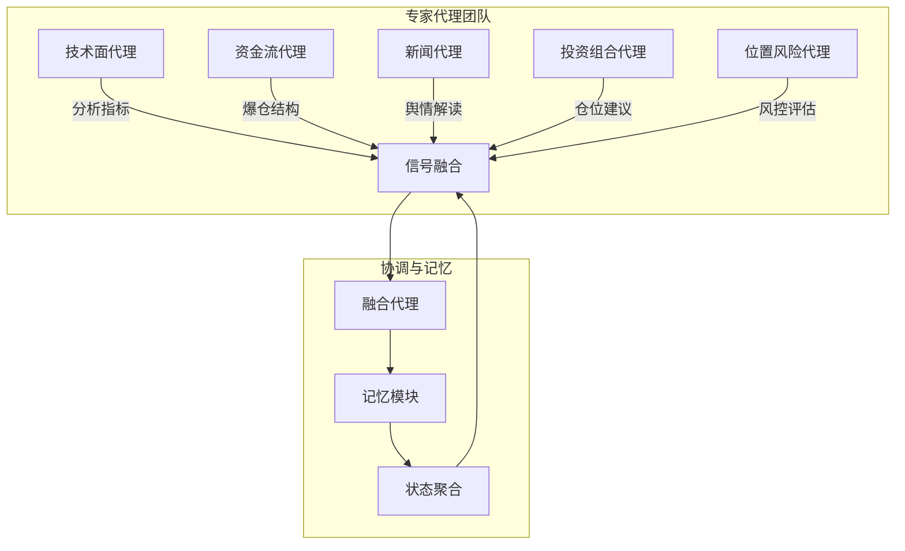
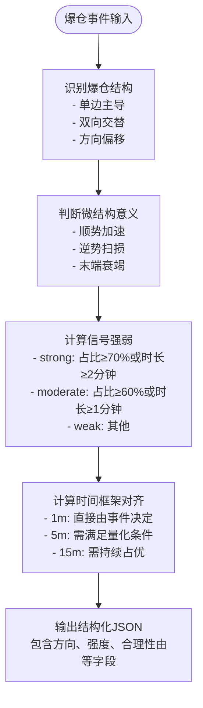
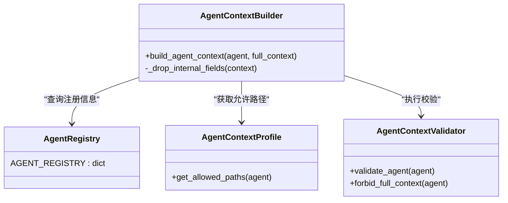
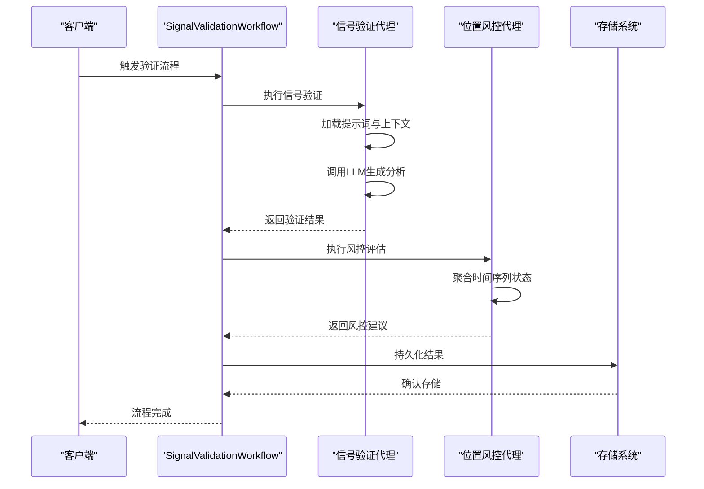
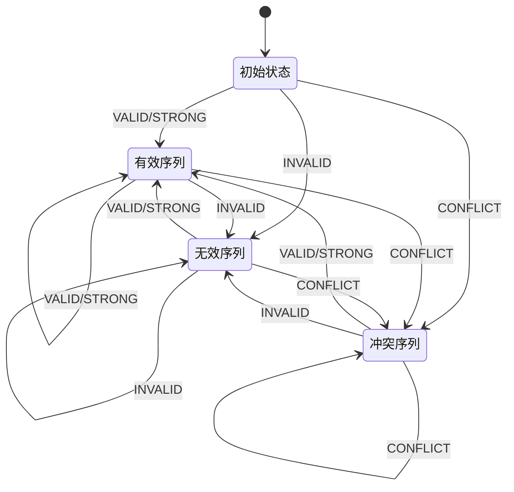

# 智能代理系统

<cite>
**本文档引用文件**  
- [instructions.py](file://agent_server/agents/instructions.py)
- [registry.py](file://agent_server/agent_context/registry.py)
- [signal_validation_workflow.py](file://agent_server/agent_workflow/signal_validation_workflow.py)
- [temporal_state_reducer.py](file://agent_server/reducers/temporal_state_reducer.py)
- [context.py](file://agent_server/memory/context.py)
- [force_stats.py](file://agent_server/agents/experts/analysis/force_stats.py)
- [news.py](file://agent_server/agents/experts/analysis/news.py)
- [portfolio.py](file://agent_server/agents/experts/analysis/portfolio.py)
- [position_risk.py](file://agent_server/agents/experts/analysis/position_risk.py)
- [technical.py](file://agent_server/agents/experts/analysis/technical.py)
- [memory.py](file://agent_server/agents/experts/orchestration/memory.py)
- [builder.py](file://agent_server/agent_context/builder.py)
- [profiles.py](file://agent_server/agent_context/profiles.py)
- [output_store.py](file://agent_server/agent_context/output_store.py)
- [validators.py](file://agent_server/agent_context/validators.py)
- [force_stats_prompt.py](file://agent_server/configs/prompts/force_stats.py)
</cite>

## 目录
1. [引言](#引言)
2. [专家代理团队架构](#专家代理团队架构)
3. [核心分析模块功能](#核心分析模块功能)
4. [执行上下文构建机制](#执行上下文构建机制)
5. [交易信号语义验证流程](#交易信号语义验证流程)
6. [长期市场状态维护](#长期市场状态维护)
7. [专家代理注册机制](#专家代理注册机制)

## 引言
本文档深入解析智能代理系统的架构设计与协同工作机制，重点阐述专家代理团队如何基于市场事件执行多维度分析。系统通过模块化设计，将技术面、资金流、新闻、投资组合与位置风险等分析任务分配给专业化代理，实现高内聚、低耦合的智能决策体系。各代理在统一的上下文框架下运行，通过LLM驱动的语义验证与状态聚合机制，确保输出的准确性与一致性。

## 专家代理团队架构
智能代理系统采用专家团队（Expert Agents）协同架构，每个代理专注于特定领域的市场分析。系统通过`agent_server/agents/experts/`目录下的模块实现功能划分，包括`analysis`（分析型代理）、`background`（背景数据处理）、`orchestration`（协调与记忆）等子模块。代理间通过标准化的JSON格式通信，确保信息传递的结构化与可解析性。

**图示来源**  
- [agent_server/agents/experts/analysis/](file://agent_server/agents/experts/analysis/)
- [agent_server/agents/experts/orchestration/](file://agent_server/agents/experts/orchestration/)

## 核心分析模块功能
`agents/experts/analysis`目录下的各代理模块基于市场事件执行特定领域分析，每个代理具有明确的职责边界与输入输出规范。

### 技术面分析代理
技术面代理（`technical.py`）负责分析技术指标与趋势背景，调用LLM对K线形态、动量指标等进行语义化解读。代理通过`build_instruction`函数加载提示词模板，结合实时市场数据生成结构化分析结果。

**本节来源**  
- [technical.py](file://agent_server/agents/experts/analysis/technical.py)

### 资金流分析代理（ForceStats）
资金流代理（`force_stats.py`）专注于爆仓统计数据的结构化解读。代理接收爆仓事件数据（BUY/SELL订单量、时间戳等）与市场状态背景，输出爆仓事件的方向、强度与市场意义。其核心逻辑包括：
- **爆仓结构识别**：判断单边主导、双向交替或方向偏移
- **微结构意义判断**：识别顺势加速、逆势扫损或末端衰竭
- **信号强弱计算**：基于订单占比与持续时间量化信号强度
- **时间框架对齐**：输出1m、5m、15m不同周期的方向一致性

代理严格遵循预设规则，避免价格预测或未来推断，仅提供客观、低噪音的背景解读。

**图示来源**  
- [force_stats.py](file://agent_server/agents/experts/analysis/force_stats.py)
- [force_stats_prompt.py](file://agent_server/configs/prompts/force_stats.py)

**本节来源**  
- [force_stats.py](file://agent_server/agents/experts/analysis/force_stats.py)

### 新闻分析代理
新闻代理（`news.py`）负责解读市场相关新闻与舆情。代理通过`web_json`工具获取新闻数据，结合`calc_rsi`等辅助指标，生成市场情绪摘要。其输出为自然语言文本，供其他代理参考。

**本节来源**  
- [news.py](file://agent_server/agents/experts/analysis/news.py)

### 投资组合分析代理
投资组合代理（`portfolio.py`）基于市场信号与持仓情况，提出仓位调整建议。代理综合技术面、资金流与新闻分析结果，输出加仓、减仓或持仓建议，支持动态风险管理。

**本节来源**  
- [portfolio.py](file://agent_server/agents/experts/analysis/portfolio.py)

### 位置风险分析代理
位置风险代理（`position_risk.py`）评估当前持仓的风险状况。代理接收信号验证结果、仓位快照与时间状态，输出风控建议。其核心流程包括：
- 构建代理上下文
- 提取市场与人群状态
- 组装操作上下文
- 调用LLM生成风控决策

代理与`temporal_state_reducer`协同工作，维护持仓的时间序列状态。

**本节来源**  
- [position_risk.py](file://agent_server/agents/experts/analysis/position_risk.py)

## 执行上下文构建机制
`agent_context`模块负责构建代理执行所需的上下文环境，确保每个代理只能访问其授权范围内的数据。

### 上下文构建流程
`builder.py`中的`build_agent_context`函数是上下文构建的核心。流程如下：
1. 验证代理名称是否注册
2. 若为`fusion`代理，返回完整上下文
3. 否则，根据代理的`allowed_paths`白名单过滤字段
4. 移除内部字段（如`_raw_trends`）
5. 返回过滤后的上下文

### 配置文件与验证
- `profiles.py`：通过`get_allowed_paths`函数查询代理的允许路径
- `validators.py`：提供`validate_agent`和`forbid_full_context`函数，防止越权访问
- `registry.py`：定义`AGENT_REGISTRY`，存储各代理的元信息（角色、作用域、是否使用人群状态等）

**图示来源**  
- [builder.py](file://agent_server/agent_context/builder.py)
- [profiles.py](file://agent_server/agent_context/profiles.py)
- [validators.py](file://agent_server/agent_context/validators.py)
- [registry.py](file://agent_server/agent_context/registry.py)

**本节来源**  
- [builder.py](file://agent_server/agent_context/builder.py)
- [profiles.py](file://agent_server/agent_context/profiles.py)
- [validators.py](file://agent_server/agent_context/validators.py)

### 输出存储与验证
`output_store.py`模块提供代理输出的封装与持久化功能：
- `wrap_agent_output`：将原始输出包装为包含元信息的结构
- `save_agent_output`：将结果存入Redis流与最新值键
- `read_latest`：读取最新分析结果

输出结构包含`_context_meta`（代理元信息）与`agent_output`（原始输出）两部分，确保可追溯性。

**本节来源**  
- [output_store.py](file://agent_server/agent_context/output_store.py)

## 交易信号语义验证流程
`signal_validation_workflow.py`定义了交易信号的验证工作流，确保信号的准确性与一致性。

### 工作流组件
工作流由三个核心组件构成：
1. **信号验证组件**：调用`signal_validation`代理执行语义验证
2. **位置风控组件**：并发评估持仓风险
3. **持久化组件**：将结果存入存储系统

### 提示词设计
`instructions.py`中的`build_instruction`函数生成代理的指令模板：
- `_load_prompt`：从配置文件加载代理专属提示词
- `schema`：定义标准化的JSON输出格式，包含`agent`、`task`、`content`、`confidence`、`rationale`等字段
- 禁止使用Markdown、代码围栏或额外文本

**图示来源**  
- [signal_validation_workflow.py](file://agent_server/agent_workflow/signal_validation_workflow.py)
- [instructions.py](file://agent_server/agents/instructions.py)

**本节来源**  
- [signal_validation_workflow.py](file://agent_server/agent_workflow/signal_validation_workflow.py)
- [instructions.py](file://agent_server/agents/instructions.py)

## 长期市场状态维护
系统通过`memory`模块与`temporal_state_reducer`维护长期市场状态。

### 记忆模块
`memory.py`中的`MemoryExpert`负责协调记忆操作：
- 接收融合结果、输出、反思与权重
- 调用`MemoryCoordinator`更新上下文
- 支持模型上下文的读取与写入

### 时间序列状态聚合
`temporal_state_reducer.py`实现确定性的状态压缩：
- **状态机设计**：维护`invalid_streak`、`conflict_streak`、`valid_streak`三个计数器
- **输入**：交易对、仓位方向、验证结果（INVALID/CONFLICT/VALID/STRONG）、入场时间戳
- **输出**：包含连续状态、持仓时长与最后更新时间的完整状态对象
- **存储**：使用Redis持久化状态，键名为`risk:temporal_state:{exchange}:{trade_id}:{symbol}:{position_side}`

状态机确保风控决策基于历史序列而非孤立事件，提升系统稳定性。

**图示来源**  
- [temporal_state_reducer.py](file://agent_server/reducers/temporal_state_reducer.py)
- [memory.py](file://agent_server/agents/experts/orchestration/memory.py)

**本节来源**  
- [temporal_state_reducer.py](file://agent_server/reducers/temporal_state_reducer.py)
- [memory.py](file://agent_server/agents/experts/orchestration/memory.py)

## 专家代理注册机制
`AGENT_REGISTRY`是系统的核心注册表，定义了所有专家代理的元信息与访问策略。

### 注册表结构
每个代理条目包含以下字段：
- `agent`：代理名称
- `role`：代理角色（如`liquidation_structure`、`technical_signal`）
- `scope`：作用域（micro、short、mid、long、cross）
- `uses_crowd_state`：是否使用人群状态
- `allows_cross_timeframe_inference`：是否允许跨周期推断
- `forbidden_semantics`：禁止的语义类型
- `allowed_paths`：允许访问的字段路径白名单

### 扩展新代理
开发者可通过以下步骤扩展新代理：
1. 在`agents/experts/analysis/`下创建新模块
2. 实现`run`方法，调用LLM执行特定分析
3. 在`configs/prompts/`下定义提示词模板
4. 在`registry.py`的`AGENT_REGISTRY`中添加注册条目
5. 确保`allowed_paths`正确配置，防止越权访问

系统通过严格的注册与验证机制，确保新代理的集成安全可控。

**本节来源**  
- [registry.py](file://agent_server/agent_context/registry.py)