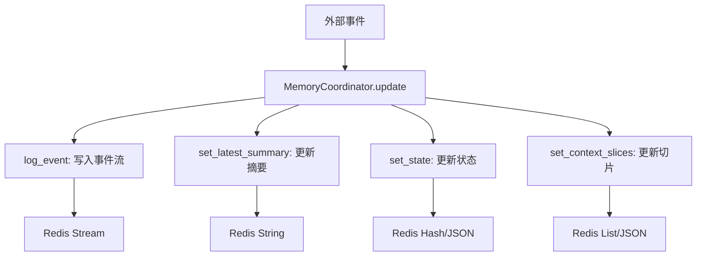
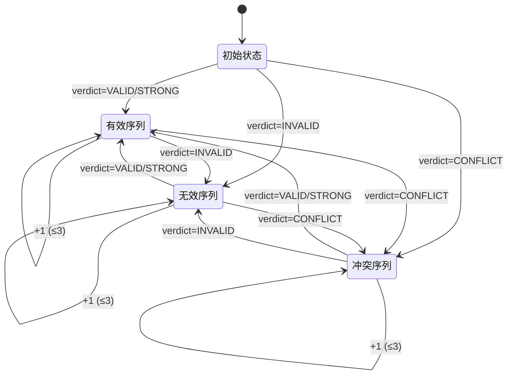

# 记忆与状态维护

<cite>
**本文档引用的文件**   
- [schema.py](file://agent_server/memory/schema.py)
- [store.py](file://agent_server/memory/store.py)
- [context.py](file://agent_server/memory/context.py)
- [temporal_state_reducer.py](file://agent_server/reducers/temporal_state_reducer.py)
- [redis_client.py](file://agent_server/utils/redis_client.py)
- [config.py](file://agent_server/config.py)
</cite>

## 目录
1. [引言](#引言)
2. [记忆数据模型设计](#记忆数据模型设计)
3. [基于Redis的高效状态存储](#基于redis的高效状态存储)
4. [记忆访问接口封装](#记忆访问接口封装)
5. [时间序列状态降维聚合](#时间序列状态降维聚合)
6. [数据生命周期与性能优化](#数据生命周期与性能优化)
7. [典型查询模式示例](#典型查询模式示例)
8. [结论](#结论)

## 引言
本系统旨在实现对长期市场状态的结构化记忆与动态状态管理，支持高频事件压缩、趋势识别与风险评估。记忆模块通过Redis实现低延迟读写，结合`schema.py`定义的状态模型、`store.py`的持久化逻辑、`context.py`的安全访问接口以及`temporal_state_reducer.py`的时间序列聚合能力，构建了一个完整的状态维护体系。

## 记忆数据模型设计

记忆模块的核心数据模型在`schema.py`中定义，采用枚举约束与结构化字段相结合的方式，确保状态语义的一致性与可解释性。

### 状态枚举定义
系统预定义了多个状态类别及其合法取值，用于标准化市场状态表达：

- **趋势状态（trend_state）**：包括 "bullish"（看涨）、"bearish"（看跌）、"neutral"（中性）、"weak_bullish"（弱看涨）、"weak_bearish"（弱看跌）等
- **风险状态（risk_state）**：包括 "normal"（正常）、"elevated"（升高）、"high"（高）、"extreme"（极端）
- **驱动状态（driver_state）**：如 "momentum_recovery"（动量恢复）、"liquidity_recovery"（流动性恢复）等
- **市场标签（market_label）**：如 "vol_compression"（波动压缩）、"trend_acceleration"（趋势加速）

这些枚举通过`validate_state`函数进行校验，确保所有写入状态均符合预设语义。

### 核心字段结构
记忆状态对象包含以下关键字段：
- `trend_state`: 当前趋势判断
- `risk_state`: 风险等级
- `driver_state`: 主要驱动因素
- `market_label`: 市场形态标签
- `confidence`: 信心得分
- `confidence_change`: 信心变化量
- `position_thesis`: 仓位逻辑摘要
- `invalid_conditions`: 无效条件列表
- `version`: 状态版本号
- `updated_at`: 最后更新时间戳

该模型支持动态演化，允许通过补丁（patch）方式更新部分字段，避免全量覆盖。

**Section sources**
- [schema.py](file://agent_server/memory/schema.py#L4-L19)

## 基于Redis的高效状态存储

`store.py`实现了基于Redis的异步存储层，利用Redis的多种数据结构实现高效的状态读写与事件记录。

### 存储结构设计
每个交易上下文（trade_id）对应一组Redis键，采用命名空间隔离：

- `memory:{trade_id}:state`：存储当前状态（JSON格式）
- `memory:{trade_id}:latest_summary`：存储最新摘要文本
- `memory:{trade_id}:context_slices`：存储上下文切片（最近5条）
- `memory:{trade_id}:events`：作为流（Stream）存储事件历史

### 核心操作接口
`MemoryStore`类提供以下异步方法：
- `set_state` / `get_state`：状态读写，自动维护版本与时间戳
- `set_latest_summary` / `get_latest_summary`：摘要管理
- `set_context_slices` / `get_context_slices`：上下文切片管理
- `log_event`：将事件追加至Stream，支持时间戳标记
- `get_model_context`：聚合完整上下文供模型使用
- `assemble_prompt`：生成LLM输入提示文本

### 协调更新机制
`MemoryCoordinator`类负责协调多个输入源（融合结果、专家输出、反思评分等），按确定性逻辑更新记忆状态：
1. 生成摘要文本（`_build_summary`）
2. 构建状态补丁（`_build_state_patch`），结合新旧状态与事件信号
3. 生成上下文切片（`_build_slices`），按得分排序保留前5条
4. 原子化更新所有组件

此设计实现了状态演化的可追溯性与一致性。



**Diagram sources**
- [store.py](file://agent_server/memory/store.py#L12-L180)

**Section sources**
- [store.py](file://agent_server/memory/store.py#L8-L180)

## 记忆访问接口封装

`context.py`提供了安全、统一的记忆访问接口，供专家代理调用，避免直接操作底层存储。

### 接口函数
- `get_agent_context(trade_id, current_event, role, role_specific)`  
  获取结构化上下文对象，包含：
  - 最新摘要
  - 当前状态
  - 上下文切片
  - 当前事件
  - 代理专属信息

- `assemble_text_prompt(trade_id, current_event, role, role_specific)`  
  生成格式化的文本提示，用于LLM输入，各部分以明确分隔符隔开。

### 安全设计
- 所有访问均通过`MemoryStore`实例进行，不暴露Redis客户端
- 输入参数进行基本校验，防止注入攻击
- 输出结构标准化，避免敏感字段泄露
- 支持角色特定数据注入（`role_specific`），实现权限隔离

该封装层确保了记忆系统的可维护性与安全性。

**Section sources**
- [context.py](file://agent_server/memory/context.py#L7-L27)

## 时间序列状态降维聚合

`temporal_state_reducer.py`实现了对高频验证信号的时间序列降维，将原始事件流压缩为具有语义意义的趋势指标。

### 核心功能
该模块通过“状态机+计数器”模型，将`verdict`序列（如VALID/INVALID/CONFLICT）压缩为：
- `valid_streak`：连续有效信号计数（上限3）
- `invalid_streak`：连续无效信号计数（上限3）
- `conflict_streak`：连续冲突信号计数（上限3）
- `holding_duration_min`：持仓时长（分钟）
- `last_update_ts`：最后更新时间戳

### 实现机制
- 使用Redis JSON存储状态对象，键名为`risk:temporal_state:{exchange}:{trade_id}:{symbol}:{position_side}`
- 每次调用`reduce_temporal_state`时：
  1. 读取当前状态
  2. 根据`verdict`更新对应计数器，重置其他计数器
  3. 计算持仓时长
  4. 覆盖写回Redis

此设计实现了O(1)复杂度的状态更新，适合高频场景。



**Diagram sources**
- [temporal_state_reducer.py](file://agent_server/reducers/temporal_state_reducer.py#L38-L126)

**Section sources**
- [temporal_state_reducer.py](file://agent_server/reducers/temporal_state_reducer.py#L1-L126)

## 数据生命周期与性能优化

### 数据生命周期管理
- **状态数据**：长期保留，随交易生命周期存在
- **事件流（Stream）**：可配置TTL或最大长度，实现滚动窗口
- **上下文切片**：仅保留最新5条，自动覆盖
- **临时聚合状态**：由`temporal_state_reducer`管理，与持仓绑定

### 性能优化建议
1. **连接复用**：使用`RedisClient`单例或连接池，避免频繁创建
2. **批量操作**：在可能的情况下合并读写请求
3. **合理分片**：通过`trade_id`自然分片，避免热点key
4. **压缩存储**：对大文本字段考虑启用Redis压缩模块
5. **索引策略**：对频繁查询的字段（如`risk_state`）可在应用层建立二级索引

### Redis配置
系统通过`config.py`配置Redis连接参数：
- 默认主机：`127.0.0.1`
- 端口：`6379`
- 数据库：`1`
- 支持密码认证
- 可通过环境变量覆盖

**Section sources**
- [config.py](file://agent_server/config.py#L5-L9)
- [redis_client.py](file://agent_server/utils/redis_client.py#L9-L17)

## 典型查询模式示例

### 查询当前交易状态
```python
store = MemoryStore()
state = await store.get_state("trade_123")
```

### 获取完整模型上下文
```python
ctx = await get_agent_context("trade_123", event, "technical", {})
```

### 生成文本提示
```python
prompt = await assemble_text_prompt("trade_123", event, "risk", {"threshold": 0.8})
```

### 更新记忆状态
```python
mc = MemoryCoordinator()
await mc.update(
    trade_id="trade_123",
    fused=fused_output,
    outputs=expert_outputs,
    reflection=reflection_result,
    weights=final_weights,
    event_payload=current_event
)
```

### 聚合时间序列信号
```python
state = await reduce_temporal_state(
    exchange="binance",
    trade_id="acc_1",
    symbol="BTCUSDT",
    position_side="LONG",
    verdict="VALID",
    entry_ts=1700000000000
)
```

这些模式覆盖了记忆系统的主要使用场景。

**Section sources**
- [store.py](file://agent_server/memory/store.py#L40-L66)
- [context.py](file://agent_server/memory/context.py#L7-L27)
- [temporal_state_reducer.py](file://agent_server/reducers/temporal_state_reducer.py#L38-L126)

## 结论
记忆与状态维护模块通过结构化数据模型、高效的Redis存储、安全的访问接口和智能的时间序列聚合，实现了对市场状态的系统化管理。该设计支持高并发、低延迟的读写操作，同时保证了状态演化的可追溯性与语义一致性，为专家代理的决策提供了可靠的状态基础。