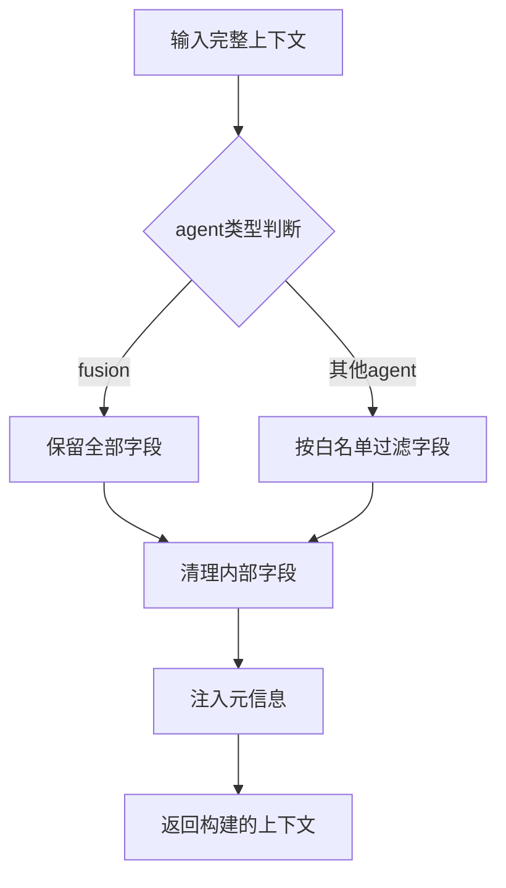
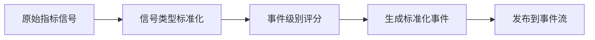
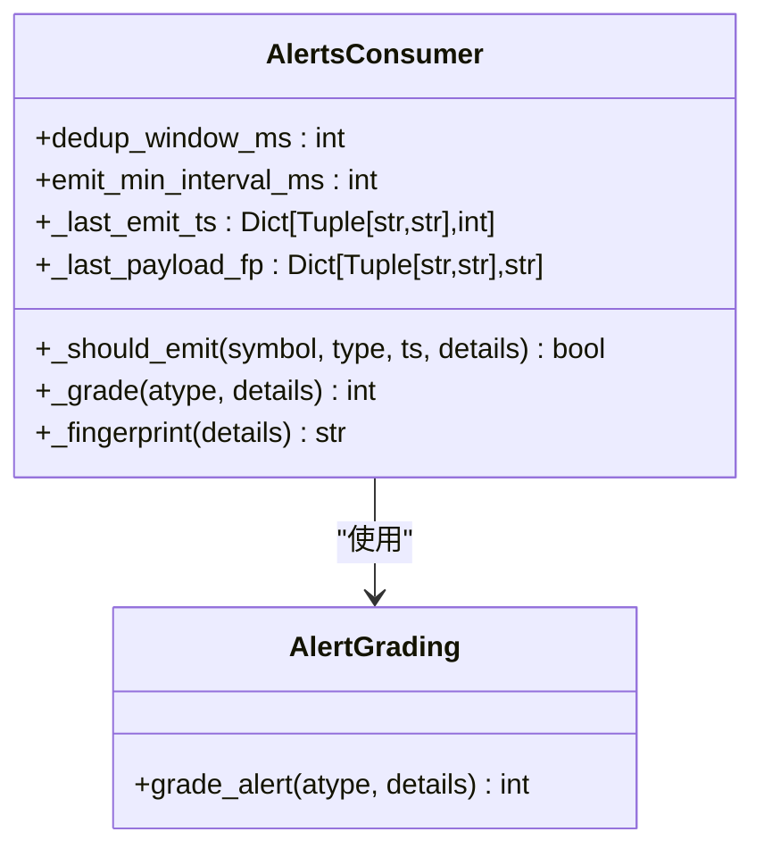
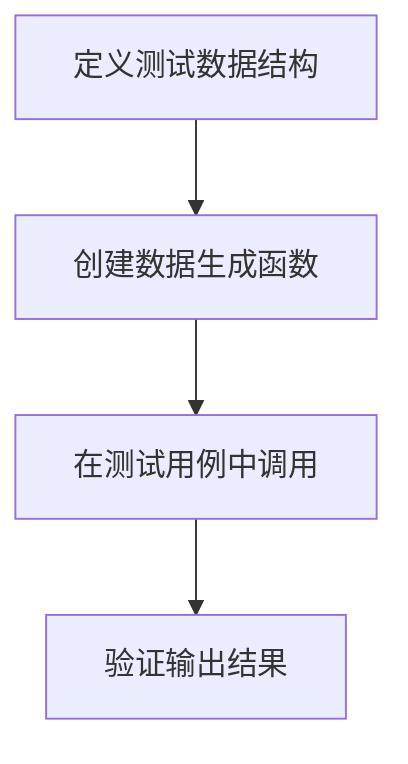

# 测试策略

<cite>
**本文档引用的文件**
- [test_agent_context_builder.py](file://tests/test_agent_context_builder.py)
- [test_indicators_event_generator_mapping.py](file://tests/test_indicators_event_generator_mapping.py)
- [test_alerts_consumer_grading.py](file://tests/test_alerts_consumer_grading.py)
- [test_alerts_consumer_dedup.py](file://tests/test_alerts_consumer_dedup.py)
- [test_composite_combo_base_compat.py](file://tests/test_composite_combo_base_compat.py)
- [test_force_stats_cumulative_gate.py](file://tests/test_force_stats_cumulative_gate.py)
- [test_market_state_aggregator.py](file://tests/test_market_state_aggregator.py)
- [builder.py](file://agent_server/agent_context/builder.py)
- [indicators_event_generator.py](file://event_center/indicators_event_generator.py)
- [alerts_consumer.py](file://event_center/alerts_consumer.py)
</cite>

## 目录
1. [简介](#简介)
2. [测试组织结构](#测试组织结构)
3. [核心测试模块分析](#核心测试模块分析)
4. [测试依赖与工具](#测试依赖与工具)
5. [测试数据构造方法](#测试数据构造方法)
6. [新测试用例编写规范](#新测试用例编写规范)
7. [CI/CD集成与覆盖率要求](#cicd集成与覆盖率要求)
8. [结论](#结论)

## 简介
UTaker项目的测试策略旨在确保系统核心功能的稳定性和可靠性。本测试策略文档详细说明了单元测试与集成测试的实践方法，重点关注agent_context上下文构建、indicators_event_generator事件映射和alerts_consumer分级评分三大核心模块。通过系统化的测试覆盖，确保新增功能不会破坏现有逻辑，同时为代码质量提供保障。

## 测试组织结构
UTaker项目的测试用例按照功能模块进行组织，位于`tests/`目录下。测试文件命名遵循`test_<模块名>.py`的规范，清晰地反映了被测组件。主要测试类别包括：
- **agent_context相关测试**：验证上下文构建逻辑，确保不同agent获取正确的上下文数据
- **indicators_event_generator测试**：确保技术指标事件的正确映射和生成
- **alerts_consumer测试**：验证事件分级、去重和评分功能
- **市场状态聚合测试**：验证多时间框架市场状态的聚合逻辑
- **力道统计测试**：验证交易力道事件的处理逻辑

**Section sources**
- [test_agent_context_builder.py](file://tests/test_agent_context_builder.py)
- [test_indicators_event_generator_mapping.py](file://tests/test_indicators_event_generator_mapping.py)
- [test_alerts_consumer_grading.py](file://tests/test_alerts_consumer_grading.py)

## 核心测试模块分析

### agent_context上下文构建测试
agent_context模块的测试主要验证`build_agent_context`函数的正确性，确保不同agent能够获取符合其需求的上下文数据。测试用例验证了上下文字段的白名单过滤、内部字段清理和元信息注入等功能。



**Diagram sources**
- [builder.py](file://agent_server/agent_context/builder.py)
- [test_agent_context_builder.py](file://tests/test_agent_context_builder.py)

**Section sources**
- [builder.py](file://agent_server/agent_context/builder.py#L18-L49)
- [test_agent_context_builder.py](file://tests/test_agent_context_builder.py#L49-L100)

### indicators_event_generator事件映射测试
indicators_event_generator模块的测试确保技术指标事件能够正确映射到标准化的事件类型。测试验证了不同信号类型（如combo_bullish）到事件类型的转换逻辑，以及事件级别的评分机制。



**Diagram sources**
- [indicators_event_generator.py](file://event_center/indicators_event_generator.py)
- [test_indicators_event_generator_mapping.py](file://tests/test_indicators_event_generator_mapping.py)

**Section sources**
- [indicators_event_generator.py](file://event_center/indicators_event_generator.py#L51-L153)
- [test_indicators_event_generator_mapping.py](file://tests/test_indicators_event_generator_mapping.py#L6-L30)

### alerts_consumer分级评分测试
alerts_consumer模块的测试验证了事件的分级评分功能，确保不同类型的警报能够根据其严重程度获得正确的评分。测试覆盖了价格变动、Z-score、深度坍塌等多种警报类型的评分逻辑。



**Diagram sources**
- [alerts_consumer.py](file://event_center/alerts_consumer.py)
- [test_alerts_consumer_grading.py](file://tests/test_alerts_consumer_grading.py)

**Section sources**
- [alerts_consumer.py](file://event_center/alerts_consumer.py#L26-L80)
- [test_alerts_consumer_grading.py](file://tests/test_alerts_consumer_grading.py#L7-L34)

## 测试依赖与工具
UTaker项目采用多种测试工具和框架来支持测试工作：

- **pytest**：用于编写和运行测试用例，支持参数化测试和fixture
- **unittest**：用于编写单元测试，特别是针对特定功能的测试
- **unittest.mock**：用于模拟外部依赖，如Redis交互
- **Redis**：作为测试中的外部依赖，需要进行适当的模拟

测试框架的选择基于项目需求，pytest提供了更丰富的功能和更好的可读性，而unittest则用于特定场景的测试。

**Section sources**
- [test_agent_context_builder.py](file://tests/test_agent_context_builder.py#L3)
- [test_indicators_event_generator_mapping.py](file://tests/test_indicators_event_generator_mapping.py#L1)
- [test_alerts_consumer_grading.py](file://tests/test_alerts_consumer_grading.py#L1)

## 测试数据构造方法
测试数据的构造是确保测试有效性的关键。UTaker项目采用了多种数据构造方法：

- **固定测试数据**：为特定测试场景创建固定的输入数据
- **参数化测试**：使用pytest的parametrize功能测试多种输入组合
- **模拟数据生成**：创建工具函数生成符合要求的测试数据

例如，在agent_context测试中，通过`make_full_context()`函数创建完整的上下文数据，然后验证不同agent的上下文构建结果。



**Diagram sources**
- [test_agent_context_builder.py](file://tests/test_agent_context_builder.py)
- [test_composite_combo_base_compat.py](file://tests/test_composite_combo_base_compat.py)

**Section sources**
- [test_agent_context_builder.py](file://tests/test_agent_context_builder.py#L13-L46)
- [test_composite_combo_base_compat.py](file://tests/test_composite_combo_base_compat.py#L6-L56)

## 新测试用例编写规范
为确保测试的一致性和有效性，编写新测试用例时应遵循以下规范：

### 模拟Redis交互
由于系统大量依赖Redis进行数据存储和消息传递，测试中需要模拟Redis交互：

```python
# 使用mock.patch模拟Redis客户端
@mock.patch('redis.Redis')
def test_redis_interaction(mock_redis):
    # 配置模拟的Redis行为
    mock_redis.return_value.get.return_value = '{"key": "value"}'
    # 执行被测代码
    result = some_function_that_uses_redis()
    # 断言结果
    assert result is not None
```

### 断言事件输出
测试事件输出时，应关注关键字段的正确性：

```python
# 验证事件类型和级别
assert any(
    e["event_type"].startswith("tech.combo.") and e["event_type"].endswith(".1m")
    for e in events
)
# 验证事件级别
assert any(int(e["event_level"]) >= 3 for e in events)
```

### 测试异步流程
对于异步流程的测试，需要使用适当的异步测试框架：

```python
# 使用asyncio测试异步函数
async def test_async_function():
    result = await async_function()
    assert result is not None
```

**Section sources**
- [test_alerts_consumer_dedup.py](file://tests/test_alerts_consumer_dedup.py#L11-L20)
- [test_indicators_event_generator_mapping.py](file://tests/test_indicators_event_generator_mapping.py#L27-L30)
- [test_force_stats_cumulative_gate.py](file://tests/test_force_stats_cumulative_gate.py#L16-L34)

## CI/CD集成与覆盖率要求
测试策略与CI/CD流程紧密集成，确保代码质量：

- **自动化测试执行**：每次代码提交都会触发自动化测试
- **代码覆盖率要求**：核心模块的代码覆盖率要求达到80%以上
- **测试失败阻断**：关键测试失败将阻断代码合并
- **定期测试报告**：生成测试报告供团队审查

通过CI/CD集成，确保新增功能不会破坏现有逻辑，同时保持代码质量的持续改进。

**Section sources**
- [test_market_state_aggregator.py](file://tests/test_market_state_aggregator.py#L28-L99)

## 结论
UTaker项目的测试策略通过系统化的单元测试和集成测试，确保了核心功能的稳定性和可靠性。通过清晰的测试组织结构、完善的测试工具支持和严格的CI/CD集成，为项目的持续发展提供了坚实的质量保障。未来应继续完善测试覆盖，特别是边界条件和异常场景的测试，进一步提升系统的健壮性。