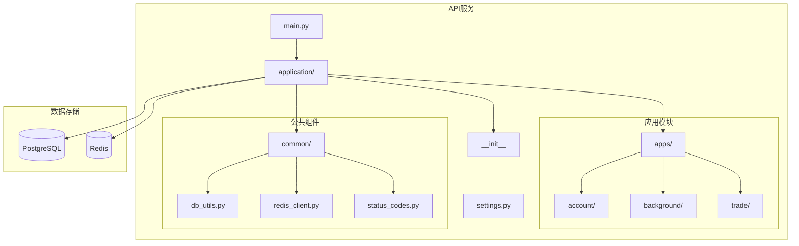
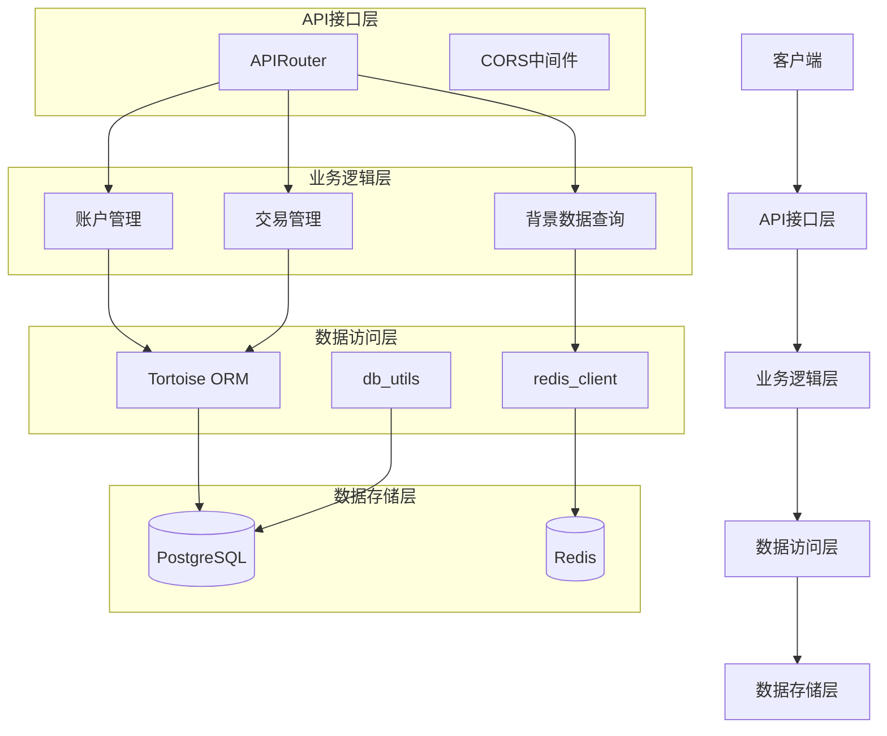
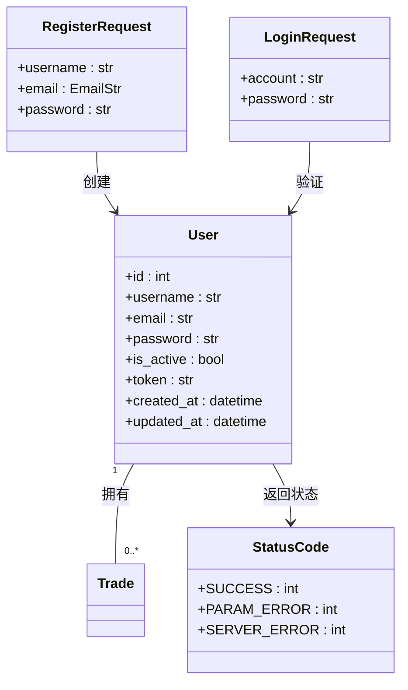
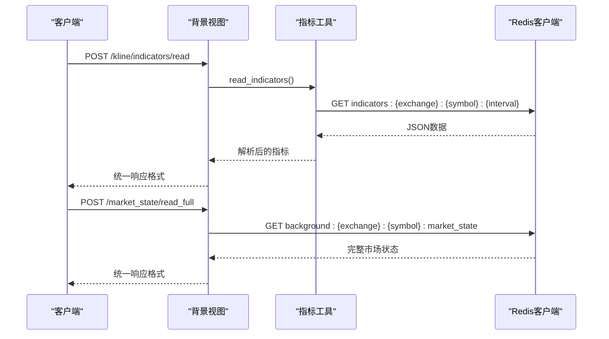
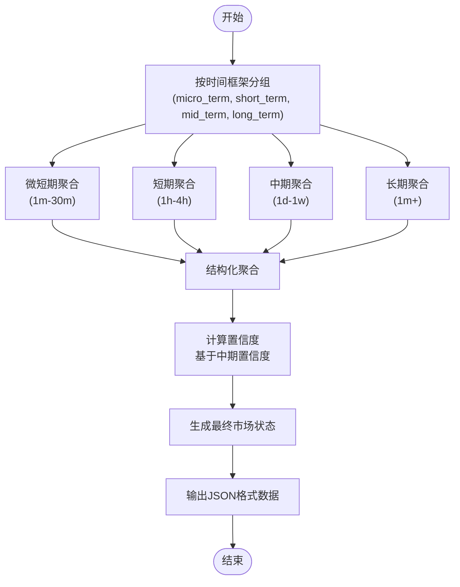
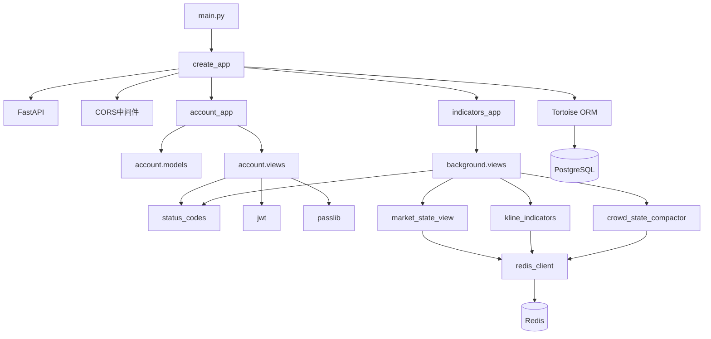

# API服务接口

<cite>
**本文档引用文件**  
- [main.py](file://api/main.py)
- [application/\_\_init\_\_.py](file://api/application/__init__.py)
- [application/settings.py](file://api/application/settings.py)
- [application/apps/account/views.py](file://api/application/apps/account/views.py)
- [application/apps/account/models.py](file://api/application/apps/account/models.py)
- [application/apps/background/views.py](file://api/application/apps/background/views.py)
- [application/apps/background/market_state_view.py](file://api/application/apps/background/market_state_view.py)
- [application/apps/background/kline_indicators.py](file://api/application/apps/background/kline_indicators.py)
- [application/apps/background/crowd_state_compactor.py](file://api/application/apps/background/crowd_state_compactor.py)
- [application/common/status_codes.py](file://api/application/common/status_codes.py)
- [application/common/db_utils.py](file://api/application/common/db_utils.py)
- [application/common/redis_client.py](file://api/application/common/redis_client.py)
</cite>

## 目录
1. [简介](#简介)
2. [项目结构](#项目结构)
3. [核心组件](#核心组件)
4. [架构概述](#架构概述)
5. [详细组件分析](#详细组件分析)
6. [依赖分析](#依赖分析)
7. [性能考虑](#性能考虑)
8. [故障排除指南](#故障排除指南)
9. [结论](#结论)

## 简介
UTaker API服务是一个基于FastAPI框架构建的RESTful接口系统，为交易分析和背景数据查询提供支持。该服务包含账户管理、市场背景数据查询和交易相关功能三大核心模块。系统采用应用工厂模式创建FastAPI实例，并通过模块化路由注册机制组织API端点。后端集成PostgreSQL数据库用于持久化存储用户和交易数据，同时使用Redis作为缓存层来提高市场数据查询性能。API实现了JWT认证机制，确保接口访问的安全性。

## 项目结构
UTaker项目采用分层架构设计，主要分为agent_server、api、data_server、event_center等核心模块。其中api模块负责提供对外RESTful接口服务，包含application主应用包和独立的main.py入口文件。application包内部分为account（账户管理）、background（背景数据查询）和trade（交易相关）三个应用模块，每个模块包含models（数据模型）和views（视图接口）子模块。系统通过工厂模式创建应用实例，并注册各模块的路由。

**图源**  
- [main.py](file://api/main.py)
- [application/\_\_init\_\_.py](file://api/application/__init__.py)
- [application/settings.py](file://api/application/settings.py)

## 核心组件
UTaker API服务的核心组件包括应用工厂、路由注册机制、认证系统、数据库集成和缓存系统。应用工厂模式通过create_app函数创建和配置FastAPI实例，实现应用的可配置化和可测试性。路由系统采用模块化设计，将不同功能的API端点分组注册。认证机制基于JWT实现用户身份验证，支持注册和登录功能。数据库使用Tortoise ORM作为PostgreSQL的异步ORM层，同时提供原生psycopg2连接用于复杂查询。缓存系统基于Redis异步客户端，用于存储和快速检索市场背景数据。

**节源**  
- [main.py](file://api/main.py)
- [application/\_\_init\_\_.py](file://api/application/__init__.py)
- [application/common/db_utils.py](file://api/application/common/db_utils.py)
- [application/common/redis_client.py](file://api/application/common/redis_client.py)

## 架构概述
UTaker API服务采用典型的分层架构，从上到下分为接口层、业务逻辑层、数据访问层和数据存储层。接口层由FastAPI框架提供，处理HTTP请求和响应。业务逻辑层包含各个应用模块的视图函数，实现具体的业务功能。数据访问层封装了对数据库和缓存的访问操作。数据存储层由PostgreSQL关系型数据库和Redis内存数据库组成，分别用于持久化存储和高速缓存。

**图源**  
- [application/\_\_init\_\_.py](file://api/application/__init__.py)
- [application/settings.py](file://api/application/settings.py)
- [application/common/db_utils.py](file://api/application/common/db_utils.py)
- [application/common/redis_client.py](file://api/application/common/redis_client.py)

## 详细组件分析

### 账户管理模块分析
账户管理模块提供用户注册和登录功能，使用JWT进行身份认证。系统支持密码哈希存储，并具备从明文密码到bcrypt哈希的自动迁移能力。用户数据通过Tortoise ORM映射到PostgreSQL数据库的user表中。

**图源**  
- [application/apps/account/models.py](file://api/application/apps/account/models.py)
- [application/apps/account/views.py](file://api/application/apps/account/views.py)
- [application/common/status_codes.py](file://api/application/common/status_codes.py)

### 背景数据查询模块分析
背景数据查询模块提供市场状态、K线指标和人群状态等背景数据的查询接口。系统从Redis缓存中读取预计算的市场数据，支持单周期、多周期和全量市场状态的查询。数据聚合逻辑在agent_server中完成，并定期更新到Redis。

**图源**  
- [application/apps/background/views.py](file://api/application/apps/background/views.py)
- [application/apps/background/kline_indicators.py](file://api/application/apps/background/kline_indicators.py)
- [application/apps/background/market_state_view.py](file://api/application/apps/background/market_state_view.py)
- [application/common/redis_client.py](file://api/application/common/redis_client.py)

### 数据聚合逻辑分析
市场状态数据的聚合逻辑通过多时间框架分析实现，将不同周期的K线背景数据聚合为统一的市场状态视图。系统按时间框架分组（微短期、短期、中期、长期），计算各组的市场状态和置信度，最终形成综合的市场判断。

**图源**  
- [agent_server/agents/experts/background/market_state.py](file://agent_server/agents/experts/background/market_state.py)
- [api/application/apps/background/market_state_view.py](file://api/application/apps/background/market_state_view.py)

## 依赖分析
UTaker API服务的依赖关系清晰分层，上层组件依赖下层服务，避免循环依赖。应用核心依赖FastAPI框架，数据库操作依赖Tortoise ORM和psycopg2，缓存依赖redis-py。各应用模块通过清晰的接口与公共组件交互，确保模块间的松耦合。

**图源**  
- [api/main.py](file://api/main.py)
- [application/\_\_init\_\_.py](file://api/application/__init__.py)
- [application/settings.py](file://api/application/settings.py)
- [application/common/redis_client.py](file://api/application/common/redis_client.py)

**节源**  
- [api/main.py](file://api/main.py)
- [application/\_\_init\_\_.py](file://api/application/__init__.py)
- [application/settings.py](file://api/application/settings.py)
- [application/common/redis_client.py](file://api/application/common/redis_client.py)

## 性能考虑
UTaker API服务在性能方面进行了多项优化。首先，高频访问的市场背景数据存储在Redis内存数据库中，实现毫秒级响应。其次，系统采用异步编程模型，充分利用async/await特性处理I/O密集型操作。数据库访问使用连接池管理，避免频繁创建和销毁连接的开销。对于批量数据操作，提供了批量执行接口以减少网络往返次数。此外，API响应采用统一的JSON格式，减少序列化开销。

## 故障排除指南
当遇到API服务问题时，可按以下步骤进行排查：首先检查服务进程是否正常运行，确认端口监听状态；其次验证环境变量配置是否正确，特别是数据库和Redis连接参数；然后检查日志文件中的错误信息，定位具体异常；对于数据库相关问题，验证表结构是否正确迁移；对于缓存问题，确认Redis服务是否可达且数据存在。常见的错误状态码包括：1001（参数错误）、1003（服务器内部错误）、1005（数据库操作错误）等。

**节源**  
- [application/common/status_codes.py](file://api/application/common/status_codes.py)
- [application/common/db_utils.py](file://api/application/common/db_utils.py)
- [application/common/redis_client.py](file://api/application/common/redis_client.py)

## 结论
UTaker API服务通过清晰的模块化设计和分层架构，提供了一套完整的交易分析接口。系统采用现代Python技术栈，结合FastAPI、Tortoise ORM和Redis，实现了高性能、可扩展的API服务。应用工厂模式和模块化路由注册机制使得代码结构清晰，易于维护和扩展。JWT认证机制保障了接口安全，而Redis缓存大幅提升了数据查询性能。整体设计充分考虑了实际交易场景的需求，为上层应用提供了可靠的数据支持。