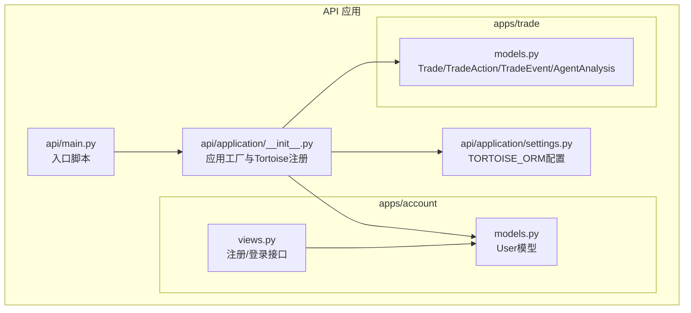
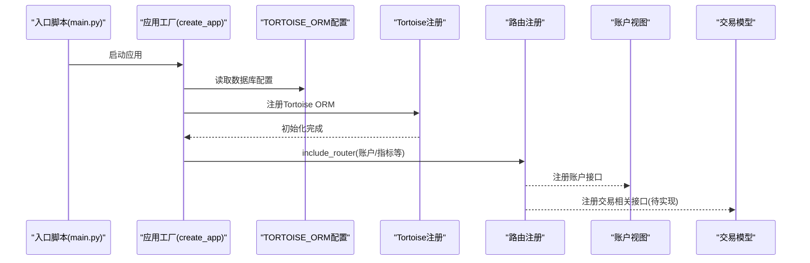
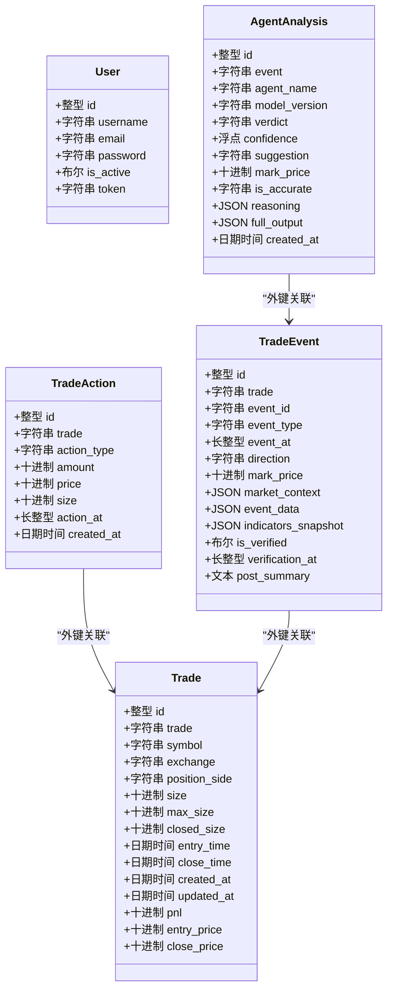
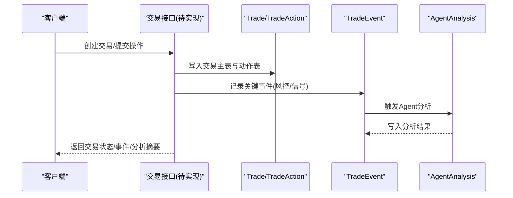
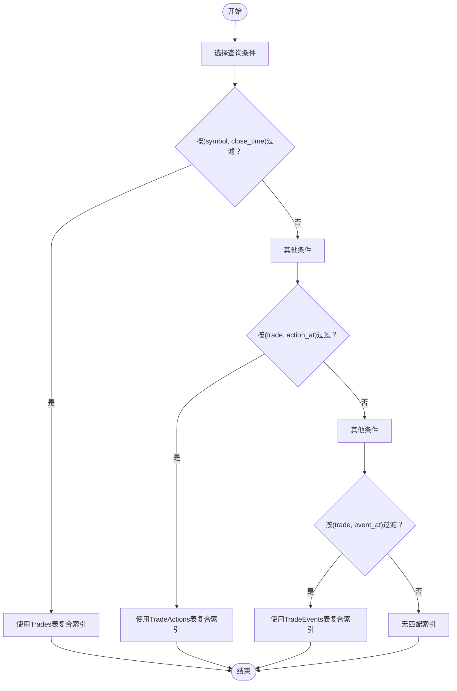
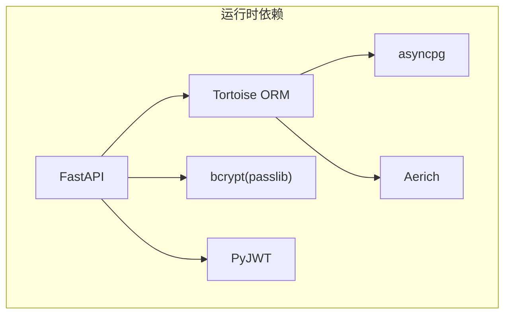

# 交易接口

<cite>
**本文引用的文件**
- [api/application/apps/trade/models.py](file://api/application/apps/trade/models.py)
- [api/application/apps/account/models.py](file://api/application/apps/account/models.py)
- [api/application/apps/account/views.py](file://api/application/apps/account/views.py)
- [api/application/settings.py](file://api/application/settings.py)
- [api/application/__init__.py](file://api/application/__init__.py)
- [api/main.py](file://api/main.py)
- [requirements.txt](file://requirements.txt)
</cite>

## 目录
1. [简介](#简介)
2. [项目结构](#项目结构)
3. [核心组件](#核心组件)
4. [架构总览](#架构总览)
5. [详细组件分析](#详细组件分析)
6. [依赖分析](#依赖分析)
7. [性能考虑](#性能考虑)
8. [故障排查指南](#故障排查指南)
9. [结论](#结论)
10. [附录](#附录)

## 简介
本文件面向UTaker交易相关数据模型的参考文档，聚焦于尚未实现具体API端点时的模型设计与未来扩展指引。重点覆盖以下方面：
- 交易实体结构：交易主表、交易动作、交易事件、Agent分析等核心模型字段与关系。
- 与账户系统的集成：用户模型与交易实体的关联方式与权限控制思路。
- Tortoise ORM异步特性：数据库连接、迁移工具、时区与索引策略。
- 扩展开发指南：如何基于现有架构添加交易功能，包括模型扩展、索引优化、事件驱动与Agent分析流程。

## 项目结构
围绕交易与账户的数据模型位于API应用层的apps子目录中，数据库ORM通过Tortoise在应用启动时注册，统一管理连接与迁移。

图表来源
- [api/application/__init__.py](file://api/application/__init__.py#L1-L40)
- [api/application/settings.py](file://api/application/settings.py#L1-L34)
- [api/application/apps/account/models.py](file://api/application/apps/account/models.py#L1-L18)
- [api/application/apps/account/views.py](file://api/application/apps/account/views.py#L1-L129)
- [api/application/apps/trade/models.py](file://api/application/apps/trade/models.py#L1-L141)
- [api/main.py](file://api/main.py#L1-L14)

章节来源
- [api/application/__init__.py](file://api/application/__init__.py#L1-L40)
- [api/application/settings.py](file://api/application/settings.py#L1-L34)
- [api/application/apps/account/models.py](file://api/application/apps/account/models.py#L1-L18)
- [api/application/apps/account/views.py](file://api/application/apps/account/views.py#L1-L129)
- [api/application/apps/trade/models.py](file://api/application/apps/trade/models.py#L1-L141)
- [api/main.py](file://api/main.py#L1-L14)

## 核心组件
本节概述交易与账户的核心数据模型及职责边界，帮助开发者快速理解未来API扩展所需的数据结构。

- 交易主表（Trade）
  - 记录一次完整交易生命周期的关键信息：交易标识、交易对、交易所、方向、持仓量、时间戳、资金与快照等。
  - 关键字段：交易ID、symbol、exchange、position_side、size、max_size、closed_size、entry_time、close_time、created_at、updated_at、pnl、entry_price、close_price。
  - 索引：按(symbol, close_time)建立复合索引，便于查询历史交易与统计。

- 交易动作表（TradeAction）
  - 记录开仓、平仓、加仓、减仓等具体操作，包含操作类型、数量、价格、时间戳与变动后的总持仓量。
  - 外键：关联Trade的trade字段，形成“交易-动作”一对多关系。
  - 索引：按(trade, action_at)建立复合索引，支持按交易与时间顺序检索。

- 交易事件表（TradeEvent）
  - 记录持仓期间的关键事件，如风控检查、信号更新等，包含事件ID、类型、方向、价格快照、市场背景与事件原始数据、技术指标快照、验证与总结等。
  - 外键：关联Trade的trade字段，形成“交易-事件”一对多关系。
  - 索引：按(trade, event_at)建立复合索引，支持事件序列化与回放。

- Agent分析表（AgentAnalysis）
  - 记录各Agent对事件的分析结果，包含结论、置信度、建议、标记价格、准确性标注、推理过程与完整输出等。
  - 外键：关联TradeEvent，形成“事件-分析”一对多关系。
  - 用途：为后续交易决策提供可追溯的分析证据链。

- 用户模型（User）
  - 提供用户身份、认证与安全基础能力：用户名、邮箱、密码、激活状态、令牌等。
  - 与交易的关联：可通过业务层在交易记录中增加用户标识字段，实现“用户-交易”的关联。

章节来源
- [api/application/apps/trade/models.py](file://api/application/apps/trade/models.py#L1-L141)
- [api/application/apps/account/models.py](file://api/application/apps/account/models.py#L1-L18)

## 架构总览
下图展示应用启动时的数据库初始化与路由注册流程，以及交易与账户模型在系统中的位置。

图表来源
- [api/main.py](file://api/main.py#L1-L14)
- [api/application/__init__.py](file://api/application/__init__.py#L1-L40)
- [api/application/settings.py](file://api/application/settings.py#L1-L34)

章节来源
- [api/main.py](file://api/main.py#L1-L14)
- [api/application/__init__.py](file://api/application/__init__.py#L1-L40)
- [api/application/settings.py](file://api/application/settings.py#L1-L34)

## 详细组件分析

### 类关系与数据模型
交易与账户模型之间目前通过业务层进行关联，尚未在模型层面直接声明外键。下图给出当前模型的类关系概览。

图表来源
- [api/application/apps/trade/models.py](file://api/application/apps/trade/models.py#L1-L141)
- [api/application/apps/account/models.py](file://api/application/apps/account/models.py#L1-L18)

章节来源
- [api/application/apps/trade/models.py](file://api/application/apps/trade/models.py#L1-L141)
- [api/application/apps/account/models.py](file://api/application/apps/account/models.py#L1-L18)

### 交易生命周期与事件流
下图展示从交易创建到事件记录与Agent分析的典型流程，体现异步事件驱动与分析闭环。

图表来源
- [api/application/apps/trade/models.py](file://api/application/apps/trade/models.py#L1-L141)

章节来源
- [api/application/apps/trade/models.py](file://api/application/apps/trade/models.py#L1-L141)

### 索引与查询优化流程
针对高频查询场景（按symbol+close_time查询交易、按trade+时间查询动作/事件），模型已定义复合索引。下图给出索引选择与查询路径的示意流程。

图表来源
- [api/application/apps/trade/models.py](file://api/application/apps/trade/models.py#L1-L141)

章节来源
- [api/application/apps/trade/models.py](file://api/application/apps/trade/models.py#L1-L141)

### 与账户系统的集成方式
- 当前模型未在交易模型中直接声明用户外键，建议在业务层通过用户标识字段与账户服务交互，实现“用户-交易”关联。
- 登录/注册接口位于账户视图模块，采用JWT令牌与bcrypt密码哈希，为交易鉴权与审计提供基础。
- 开发建议：在交易模型中新增用户标识字段，并在API层校验令牌与用户权限，确保交易数据隔离与合规。

章节来源
- [api/application/apps/account/views.py](file://api/application/apps/account/views.py#L1-L129)
- [api/application/apps/account/models.py](file://api/application/apps/account/models.py#L1-L18)

## 依赖分析
- Tortoise ORM与PostgreSQL
  - 使用asyncpg引擎与异步连接池，支持高并发写入与查询。
  - 通过Aerich进行迁移管理，模型变更由应用自动识别并生成迁移脚本。
- FastAPI与CORS
  - 应用工厂中注册CORS中间件，便于前端跨域访问。
- 依赖清单
  - 关键依赖：fastapi、tortoise-orm、asyncpg、aerich、passlib、PyJWT等。

图表来源
- [requirements.txt](file://requirements.txt#L1-L107)
- [api/application/settings.py](file://api/application/settings.py#L1-L34)
- [api/application/__init__.py](file://api/application/__init__.py#L1-L40)

章节来源
- [requirements.txt](file://requirements.txt#L1-L107)
- [api/application/settings.py](file://api/application/settings.py#L1-L34)
- [api/application/__init__.py](file://api/application/__init__.py#L1-L40)

## 性能考虑
- 异步写入与批量操作
  - 利用Tortoise ORM的异步特性，结合数据库连接池参数（minsize/maxsize）提升吞吐。
- 索引策略
  - 已为交易、动作、事件表建立复合索引，建议在高频查询字段上保持一致的索引设计。
- 时间字段与时区
  - 设置use_tz与timezone，确保时间序列数据的一致性与可追溯性。
- 数据类型与精度
  - 使用Decimal类型保证资金与数量的精确计算，避免浮点误差。
- 事件驱动与分析链路
  - 将事件与Agent分析解耦，通过异步任务队列或事件总线推进分析，降低请求延迟。

## 故障排查指南
- 数据库连接失败
  - 检查环境变量DB_HOST/DB_PORT/DB_USER/DB_PASSWORD/DB_DATABASE是否正确。
  - 确认asyncpg与PostgreSQL服务连通性。
- 迁移问题
  - 使用Aerich命令生成/应用迁移脚本，确保模型变更与迁移同步。
- CORS与鉴权
  - 确认CORS中间件配置允许前端来源；登录后检查JWT令牌有效性与过期时间。
- 字段冲突与唯一性
  - 交易IDtrade需唯一，避免重复写入；邮箱email在User模型中唯一，注册/登录时注意去重。

章节来源
- [api/application/settings.py](file://api/application/settings.py#L1-L34)
- [api/application/__init__.py](file://api/application/__init__.py#L1-L40)
- [api/application/apps/account/views.py](file://api/application/apps/account/views.py#L1-L129)

## 结论
交易数据模型已具备清晰的领域划分与良好的扩展性：交易主表、动作表、事件表与Agent分析表共同构成交易全生命周期的数据骨架。配合Tortoise ORM的异步能力与Aerich迁移工具，开发者可以高效地实现交易API端点，并在不破坏现有结构的前提下持续演进。建议优先完善账户与交易的关联、补充必要的鉴权与审计字段，并在事件驱动与分析链路上引入异步处理机制，以支撑高并发与复杂策略场景。

## 附录
- 开发步骤建议
  - 在交易模型中新增用户标识字段，完善“用户-交易”关联。
  - 实现交易创建、下单、平仓、查询等API端点，遵循异步写入与事务一致性。
  - 建立事件订阅与Agent分析流水线，支持风控与信号更新的自动化处理。
  - 使用Aerich管理模型与索引变更，定期审查索引命中率与查询计划。
- 参考文件路径
  - 交易模型：[api/application/apps/trade/models.py](file://api/application/apps/trade/models.py#L1-L141)
  - 账户模型与接口：[api/application/apps/account/models.py](file://api/application/apps/account/models.py#L1-L18)，[api/application/apps/account/views.py](file://api/application/apps/account/views.py#L1-L129)
  - 应用与ORM配置：[api/application/__init__.py](file://api/application/__init__.py#L1-L40)，[api/application/settings.py](file://api/application/settings.py#L1-L34)
  - 入口脚本：[api/main.py](file://api/main.py#L1-L14)
  - 依赖清单：[requirements.txt](file://requirements.txt#L1-L107)