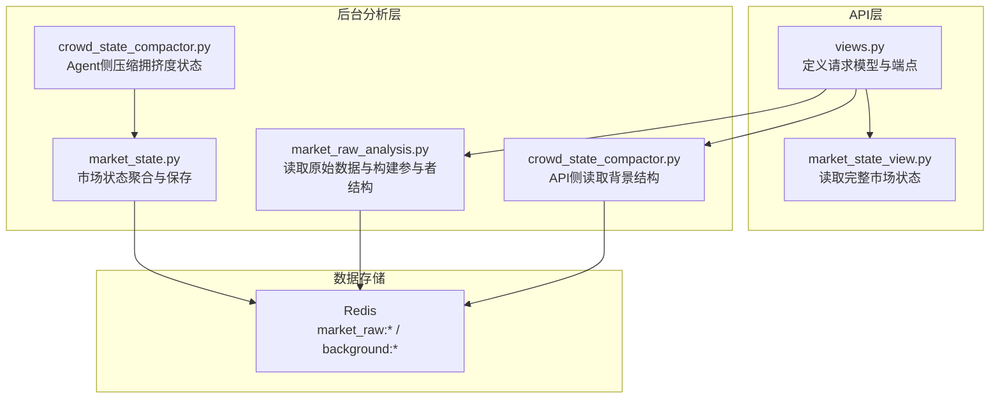
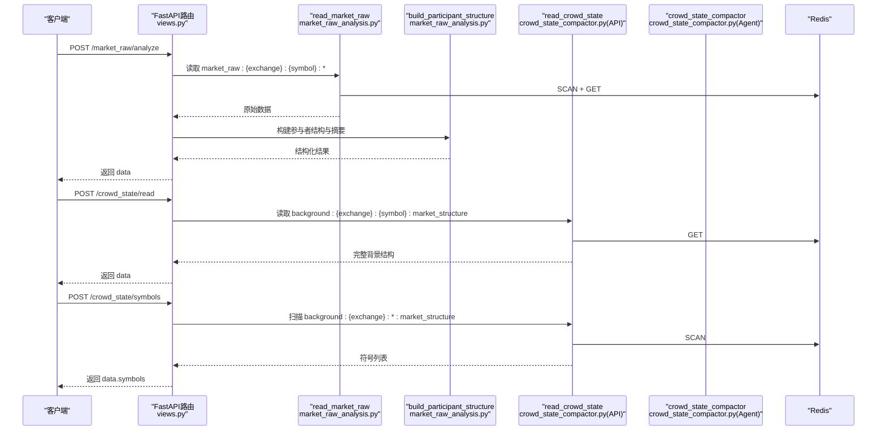
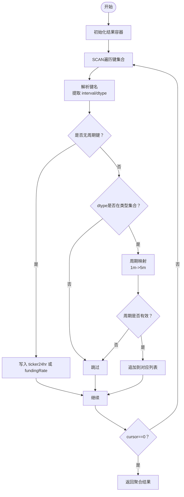
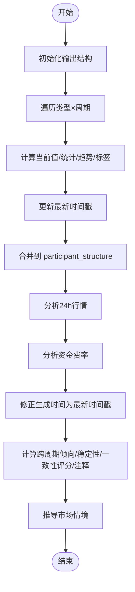
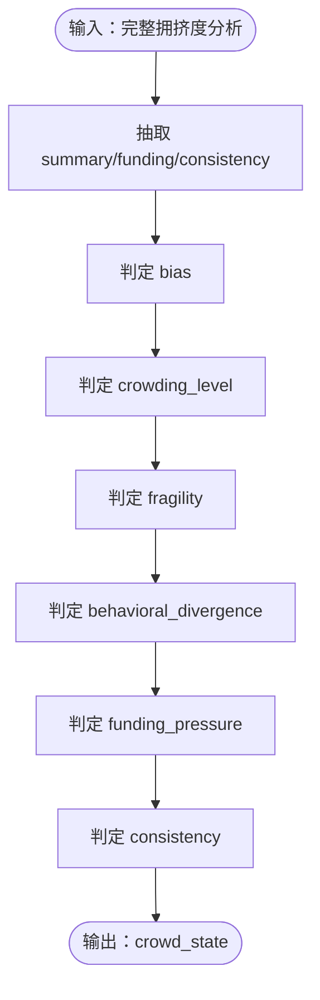
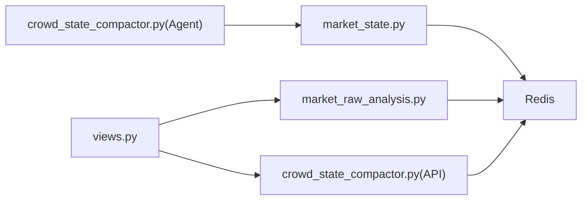

# 参与者结构接口

<cite>
**本文引用的文件**
- [views.py](file://api/application/apps/background/views.py)
- [market_raw_analysis.py](file://api/application/apps/background/market_raw_analysis.py)
- [crowd_state_compactor.py](file://api/application/apps/background/crowd_state_compactor.py)
- [crowd_state_compactor.py](file://agent_server/agents/experts/background/crowd_state_compactor.py)
- [market_state_view.py](file://api/application/apps/background/market_state_view.py)
- [market_state.py](file://agent_server/agents/experts/background/market_state.py)
- [test_market_state_aggregator.py](file://tests/test_market_state_aggregator.py)
</cite>

## 目录
1. [简介](#简介)
2. [项目结构](#项目结构)
3. [核心组件](#核心组件)
4. [架构总览](#架构总览)
5. [详细组件分析](#详细组件分析)
6. [依赖关系分析](#依赖关系分析)
7. [性能考量](#性能考量)
8. [故障排查指南](#故障排查指南)
9. [结论](#结论)
10. [附录](#附录)

## 简介
本文件面向UTaker系统中的“参与者结构与拥挤度状态”接口，围绕以下三个端点进行系统化说明：
- /market_raw/analyze：接收 MarketRawRequest，读取Redis中按周期组织的多空比与资金费率等原始数据，构建结构化的参与者画像与摘要。
- /crowd_state/read：接收 CrowdStateRequest，从Redis读取背景市场结构（market_structure），并返回完整结构数据。
- /crowd_state/symbols：接收 CrowdStateScanRequest，扫描指定交易所下存在背景结构数据的符号列表。

同时，文档详细解释：
- MarketRawRequest 与 CrowdStateRequest 的请求模型用法；
- read_market_raw 如何通过Redis SCAN操作聚合 market_raw:{exchange}:{symbol}:* 模式下的多空比、资金费率等原始数据；
- build_participant_structure 如何将原始数据转化为结构化的参与者画像，包括多空倾向、稳定性评分与跨周期一致性分析；
- read_crowd_state 的读取逻辑；
- crowd_state_compactor.py 中数据聚合的JSON示例与字段含义；
- 错误处理建议与数据新鲜度保证的最佳实践。

## 项目结构
该功能由API层路由与后台分析模块共同组成，主要涉及FastAPI路由、Redis读取与数据聚合两个层面：
- API路由层：定义请求模型与端点，负责参数校验、调用后台分析函数并返回统一格式响应。
- 后台分析层：封装Redis读取、数据清洗与统计分析，输出结构化结果供上层使用。

图表来源
- [views.py](file://api/application/apps/background/views.py#L1-L159)
- [market_raw_analysis.py](file://api/application/apps/background/market_raw_analysis.py#L1-L377)
- [crowd_state_compactor.py](file://api/application/apps/background/crowd_state_compactor.py#L1-L59)
- [crowd_state_compactor.py](file://agent_server/agents/experts/background/crowd_state_compactor.py#L1-L95)
- [market_state_view.py](file://api/application/apps/background/market_state_view.py#L1-L40)
- [market_state.py](file://agent_server/agents/experts/background/market_state.py#L98-L239)

章节来源
- [views.py](file://api/application/apps/background/views.py#L1-L159)
- [market_raw_analysis.py](file://api/application/apps/background/market_raw_analysis.py#L1-L377)
- [crowd_state_compactor.py](file://api/application/apps/background/crowd_state_compactor.py#L1-L59)
- [crowd_state_compactor.py](file://agent_server/agents/experts/background/crowd_state_compactor.py#L1-L95)
- [market_state_view.py](file://api/application/apps/background/market_state_view.py#L1-L40)
- [market_state.py](file://agent_server/agents/experts/background/market_state.py#L98-L239)

## 核心组件
- 请求模型
  - MarketRawRequest：包含 exchange 与 symbol，用于 /market_raw/analyze。
  - CrowdStateRequest：包含 exchange 与 symbol，用于 /crowd_state/read。
  - CrowdStateScanRequest：包含 exchange，用于 /crowd_state/symbols。
- 关键函数
  - read_market_raw：通过Redis SCAN聚合 market_raw:{exchange}:{symbol}:* 下的多空比与资金费率等原始数据。
  - build_participant_structure：将原始数据转换为结构化参与者画像与摘要。
  - read_crowd_state：读取 background:{exchange}:{symbol}:market_structure 的背景结构数据。
  - crowd_state_compactor：将完整拥挤度分析压缩为低噪声的 crowd_state，用于风险/置信度/否决调整。

章节来源
- [views.py](file://api/application/apps/background/views.py#L18-L155)
- [market_raw_analysis.py](file://api/application/apps/background/market_raw_analysis.py#L42-L94)
- [market_raw_analysis.py](file://api/application/apps/background/market_raw_analysis.py#L274-L349)
- [crowd_state_compactor.py](file://api/application/apps/background/crowd_state_compactor.py#L21-L59)
- [crowd_state_compactor.py](file://agent_server/agents/experts/background/crowd_state_compactor.py#L4-L67)

## 架构总览
下图展示了三个端点的调用链路与数据流：

图表来源
- [views.py](file://api/application/apps/background/views.py#L23-L155)
- [market_raw_analysis.py](file://api/application/apps/background/market_raw_analysis.py#L42-L94)
- [market_raw_analysis.py](file://api/application/apps/background/market_raw_analysis.py#L274-L349)
- [crowd_state_compactor.py](file://api/application/apps/background/crowd_state_compactor.py#L21-L59)
- [crowd_state_compactor.py](file://agent_server/agents/experts/background/crowd_state_compactor.py#L4-L67)

## 详细组件分析

### /market_raw/analyze 接口与请求模型
- 请求模型：MarketRawRequest
  - 字段：exchange、symbol
  - 作用：限定数据源与标的，驱动 read_market_raw 与 build_participant_structure 的执行。
- 端点行为：
  - 调用 read_market_raw(exchange, symbol, client=redis_client)，聚合Redis中 market_raw:{exchange}:{symbol}:* 的原始数据。
  - 调用 build_participant_structure(raw, symbol) 生成结构化参与者画像与摘要。
  - 统一返回结构：code、msg、data（data为参与者画像与摘要）。
- 错误处理：
  - 异常时返回服务器错误码与错误信息，避免服务崩溃。

章节来源
- [views.py](file://api/application/apps/background/views.py#L18-L44)
- [market_raw_analysis.py](file://api/application/apps/background/market_raw_analysis.py#L42-L94)
- [market_raw_analysis.py](file://api/application/apps/background/market_raw_analysis.py#L274-L349)

### read_market_raw：Redis SCAN聚合原始数据
- 功能概述
  - 使用 SCAN 遍历匹配 market_raw:{exchange}:{symbol}:* 的键集合，按类型与周期归并到统一结构。
- 数据结构映射
  - 类型集合：globalLongShortAccountRatio、takerLongShortRatio、topLongShortPositionRatio、topLongShortAccountRatio。
  - 周期集合：5m、15m、30m、1h、2h、4h、1d；其中1m被映射为5m以对齐周期。
  - 特殊键：ticker24hr（无周期）、fundingRate（无周期，支持单条或数组）。
- 处理流程
  - 初始化结果容器，循环SCAN，解析键名提取 interval 与 dtype，读取JSON值，按规则归并。
  - 对于无周期键（ticker24hr、fundingRate）直接写入对应字段。
  - 对于多空比类键，按周期映射后写入列表。
- 性能与健壮性
  - SCAN分批拉取，count=1000，避免一次性阻塞。
  - 对异常JSON与非法键名进行跳过，保证鲁棒性。

图表来源
- [market_raw_analysis.py](file://api/application/apps/background/market_raw_analysis.py#L42-L94)

章节来源
- [market_raw_analysis.py](file://api/application/apps/background/market_raw_analysis.py#L42-L94)

### build_participant_structure：构建参与者画像与摘要
- 输入：read_market_raw 返回的原始数据与 symbol。
- 输出：包含 symbol、生成时间、ticker、funding_rate、participant_structure、summary 的结构化对象。
- 核心步骤
  - 遍历每种类型与周期，调用 _analyze_period 计算当前值、统计量、趋势与标签（多空倾向、强度、稳定性）。
  - 聚合最新时间戳，优先使用资金费率的时间字段，若无则回退到生成时间。
  - 计算跨周期多空倾向（long/short/neutral）、平均波动、一致性评分与注释。
  - 综合价格趋势与资金费率偏置，推导市场情境（强涨/强跌/多头/空头/中性）。
- 关键指标
  - 多空倾向：基于最近周期的 ls_ratio 与阈值判定。
  - 稳定性：基于序列标准差阈值划分稳定/中等/波动。
  - 一致性：跨周期倾向计数与平均波动，形成一致性评分与注释。

图表来源
- [market_raw_analysis.py](file://api/application/apps/background/market_raw_analysis.py#L274-L349)

章节来源
- [market_raw_analysis.py](file://api/application/apps/background/market_raw_analysis.py#L151-L211)
- [market_raw_analysis.py](file://api/application/apps/background/market_raw_analysis.py#L213-L273)
- [market_raw_analysis.py](file://api/application/apps/background/market_raw_analysis.py#L274-L349)

### /crowd_state/read 与 /crowd_state/symbols 接口
- /crowd_state/read
  - 请求模型：CrowdStateRequest（exchange、symbol）
  - 行为：调用 read_crowd_state(exchange, symbol, redis_client) 读取 background:{exchange}:{symbol}:market_structure 的JSON内容并返回。
- /crowd_state/symbols
  - 请求模型：CrowdStateScanRequest（exchange）
  - 行为：调用 scan_crowd_symbols(exchange, redis_client) 通过SCAN扫描 background:{exchange}:*:market_structure，去重后返回符号列表。
- 错误处理：异常时返回服务器错误码与错误信息。

章节来源
- [views.py](file://api/application/apps/background/views.py#L103-L155)
- [crowd_state_compactor.py](file://api/application/apps/background/crowd_state_compactor.py#L21-L59)

### crowd_state_compactor：拥挤度状态压缩
- 输入：完整拥挤度分析（来自 /crowd_state/read 的 data）。
- 输出：低噪声 crowd_state，包含以下字段：
  - bias：总体偏向（long/short/neutral）
  - crowding_level：拥挤程度（low/medium/high）
  - fragility：脆弱性（low/medium/high）
  - behavioral_divergence：是否存在行为分歧（布尔）
  - funding_pressure：资金压力（none/potential_squeeze/active_squeeze）
  - consistency：时间框架一致性（aligned/conflicted/mixed）
- 压缩逻辑要点
  - 基于 summary.overall_bias 与 risk 判定 bias。
  - 基于 summary.overall_strength 与 structural_risks 判定拥挤程度。
  - 基于 summary.overall_stability 判定脆弱性。
  - 基于 consistency.conflicts 判定行为分歧。
  - 基于 funding_analysis 判定资金压力。
  - 基于 sentiment_alignment 与行为分歧判定一致性。

图表来源
- [crowd_state_compactor.py](file://agent_server/agents/experts/background/crowd_state_compactor.py#L4-L67)

章节来源
- [crowd_state_compactor.py](file://agent_server/agents/experts/background/crowd_state_compactor.py#L4-L67)

### market_state 聚合与保存
- 调用链
  - 先读取多周期背景数据（如 kline/background/read_multi），合并为 items。
  - 若周期齐全，则调用 /crowd_state/read 获取完整拥挤度分析，经 crowd_state_compactor 压缩为 crowd_state。
  - 调用 market_state_aggregator 进行多时间框架聚合，得到短/中/长周期市场状态。
  - 将聚合结果保存至 background:{exchange}:{symbol}:market_state。
- 测试验证
  - 测试覆盖微周期触发、结构性权重与冲突、长周期否决规则，以及拥挤度对风险与置信度的影响。

章节来源
- [market_state.py](file://agent_server/agents/experts/background/market_state.py#L98-L177)
- [market_state.py](file://agent_server/agents/experts/background/market_state.py#L179-L192)
- [market_state.py](file://agent_server/agents/experts/background/market_state.py#L193-L239)
- [test_market_state_aggregator.py](file://tests/test_market_state_aggregator.py#L71-L99)

## 依赖关系分析
- 组件耦合
  - views.py 依赖 market_raw_analysis.py 与 crowd_state_compactor.py 的读取函数。
  - market_state.py 依赖 crowd_state_compactor 的压缩函数与Redis客户端。
  - crowd_state_compactor.py（Agent侧）依赖 market_state_aggregator 的输出结构。
- 外部依赖
  - Redis：作为统一数据存储，键空间包含 market_raw:* 与 background:*。
  - FastAPI：提供端点与请求模型校验。
- 循环依赖
  - 当前模块间无明显循环依赖；views.py 仅做薄包装，不反向依赖业务逻辑。

图表来源
- [views.py](file://api/application/apps/background/views.py#L1-L159)
- [market_raw_analysis.py](file://api/application/apps/background/market_raw_analysis.py#L1-L377)
- [crowd_state_compactor.py](file://api/application/apps/background/crowd_state_compactor.py#L1-L59)
- [crowd_state_compactor.py](file://agent_server/agents/experts/background/crowd_state_compactor.py#L1-L95)
- [market_state.py](file://agent_server/agents/experts/background/market_state.py#L98-L239)

章节来源
- [views.py](file://api/application/apps/background/views.py#L1-L159)
- [market_raw_analysis.py](file://api/application/apps/background/market_raw_analysis.py#L1-L377)
- [crowd_state_compactor.py](file://api/application/apps/background/crowd_state_compactor.py#L1-L59)
- [crowd_state_compactor.py](file://agent_server/agents/experts/background/crowd_state_compactor.py#L1-L95)
- [market_state.py](file://agent_server/agents/experts/background/market_state.py#L98-L239)

## 性能考量
- Redis SCAN
  - 使用 count=1000 分批拉取，避免阻塞；cursor==0时退出，确保全量覆盖。
- 数据聚合
  - _analyze_period 仅对最近若干条序列计算统计量，避免全量扫描。
  - build_participant_structure 采用线性遍历，复杂度 O(T×P×N)，T为类型数、P为周期数、N为序列长度。
- I/O优化
  - 读取JSON失败或键名异常时快速跳过，减少异常开销。
- 建议
  - 在高频调用场景下，可考虑对热点 symbol 增加本地缓存与TTL控制，结合生成时间戳进行新鲜度校验。

[本节为通用性能讨论，无需特定文件引用]

## 故障排查指南
- /market_raw/analyze 返回服务器错误
  - 检查Redis连接与键空间是否存在 market_raw:{exchange}:{symbol}:*。
  - 确认 read_market_raw 的SCAN与GET是否成功，关注异常JSON与键名解析。
- /crowd_state/read 返回空数据
  - 检查 background:{exchange}:{symbol}:market_structure 是否存在，确认键拼写与权限。
- /crowd_state/symbols 返回空列表
  - 检查SCAN模式是否正确，确认 exchange 参数与键空间一致。
- 数据新鲜度问题
  - 使用 generated_at 或 fundingTime 作为时间戳基准，若缺失则回退到生成时间。
  - 对于高频更新场景，建议在上层增加缓存与TTL策略，并在接口层返回时间戳以便客户端判断。

章节来源
- [views.py](file://api/application/apps/background/views.py#L23-L155)
- [market_raw_analysis.py](file://api/application/apps/background/market_raw_analysis.py#L42-L94)
- [crowd_state_compactor.py](file://api/application/apps/background/crowd_state_compactor.py#L21-L59)

## 结论
本文系统梳理了UTaker中“参与者结构与拥挤度状态”相关接口与实现，明确了：
- MarketRawRequest/CrowdStateRequest 的用法与端点职责；
- read_market_raw 的Redis SCAN聚合策略与数据映射；
- build_participant_structure 的画像构建与摘要生成；
- read_crowd_state 的读取逻辑与 crowd_state_compactor 的压缩规则；
- 与 market_state 聚合流程的衔接与测试验证。

通过上述机制，系统能够高效地从原始多空比与资金费率数据中提炼出跨周期一致性与稳定性信号，并结合背景结构与拥挤度状态对市场状态进行综合评估。

[本节为总结性内容，无需特定文件引用]

## 附录

### JSON示例：crowd_state_compactor 压缩输出
- 示例字段
  - bias：long/short/neutral
  - crowding_level：low/medium/high
  - fragility：low/medium/high
  - behavioral_divergence：true/false
  - funding_pressure：none/potential_squeeze/active_squeeze
  - consistency：aligned/conflicted/mixed

章节来源
- [crowd_state_compactor.py](file://agent_server/agents/experts/background/crowd_state_compactor.py#L4-L67)

### API端点定义与请求模型
- /market_raw/analyze
  - 方法：POST
  - 请求体：MarketRawRequest（exchange、symbol）
  - 返回：code、msg、data（参与者结构与摘要）
- /crowd_state/read
  - 方法：POST
  - 请求体：CrowdStateRequest（exchange、symbol）
  - 返回：code、msg、data（market_structure）
- /crowd_state/symbols
  - 方法：POST
  - 请求体：CrowdStateScanRequest（exchange）
  - 返回：code、msg、data.symbols（符号列表）

章节来源
- [views.py](file://api/application/apps/background/views.py#L23-L155)