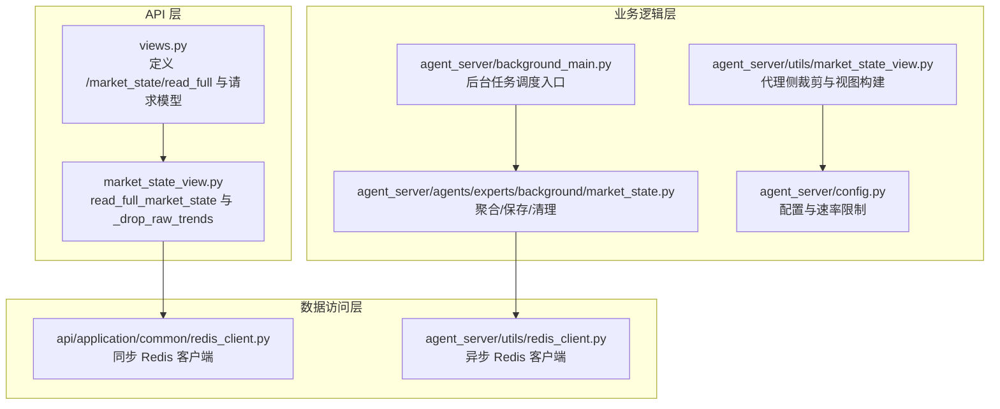
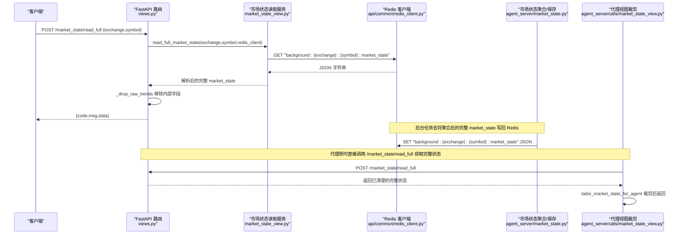
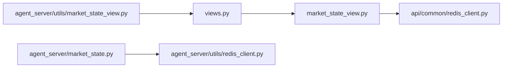
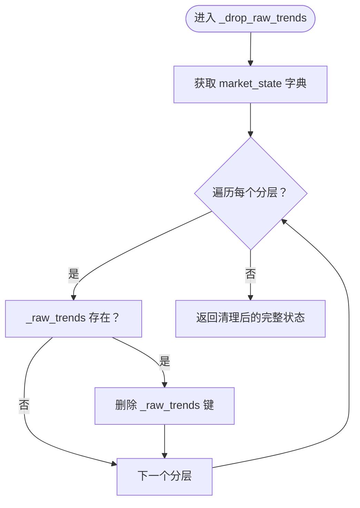

# 市场状态接口

<cite>
**本文引用的文件**
- [views.py](file://api/application/apps/background/views.py)
- [market_state_view.py](file://api/application/apps/background/market_state_view.py)
- [market_state.py](file://agent_server/agents/experts/background/market_state.py)
- [redis_client.py](file://api/application/common/redis_client.py)
- [redis_client.py](file://agent_server/utils/redis_client.py)
- [market_state_view.py](file://agent_server/utils/market_state_view.py)
- [background_main.py](file://agent_server/background_main.py)
- [config.py](file://agent_server/config.py)
- [test_market_state_context_config.py](file://tests/test_market_state_context_config.py)
</cite>

## 目录
1. [简介](#简介)
2. [项目结构](#项目结构)
3. [核心组件](#核心组件)
4. [架构总览](#架构总览)
5. [详细组件分析](#详细组件分析)
6. [依赖分析](#依赖分析)
7. [性能考虑](#性能考虑)
8. [故障排查指南](#故障排查指南)
9. [结论](#结论)
10. [附录](#附录)

## 简介
本文件围绕 UTaker 项目中的“完整市场状态读取”接口进行系统化文档化，重点覆盖以下内容：
- 接口端点：/market_state/read_full
- 请求模型：MarketStateReadFullRequest
- 数据来源：Redis 键 background:{exchange}:{symbol}:market_state
- 数据处理：read_full_market_state 函数与 _drop_raw_trends 敏感字段清理
- 完整市场状态 JSON 结构示例：短期、中期、长期趋势、风险等级、信心指数、人群背景等
- 与 agent_server 的集成：智能代理如何基于完整状态构建分析上下文
- 生产环境缓存策略建议：降低 Redis 压力

## 项目结构
该功能涉及三层协作：
- API 层：FastAPI 路由定义与请求模型校验
- 数据访问层：Redis 读取封装
- 业务逻辑层：市场状态聚合与保存，以及代理侧的视图裁剪

图表来源
- [views.py](file://api/application/apps/background/views.py#L46-L76)
- [market_state_view.py](file://api/application/apps/background/market_state_view.py#L1-L40)
- [redis_client.py](file://api/application/common/redis_client.py#L1-L33)
- [redis_client.py](file://agent_server/utils/redis_client.py#L1-L53)
- [market_state.py](file://agent_server/agents/experts/background/market_state.py#L179-L184)
- [market_state_view.py](file://agent_server/utils/market_state_view.py#L1-L118)
- [background_main.py](file://agent_server/background_main.py#L1-L84)
- [config.py](file://agent_server/config.py#L1-L61)

章节来源
- [views.py](file://api/application/apps/background/views.py#L46-L76)
- [market_state_view.py](file://api/application/apps/background/market_state_view.py#L1-L40)
- [redis_client.py](file://api/application/common/redis_client.py#L1-L33)
- [redis_client.py](file://agent_server/utils/redis_client.py#L1-L53)
- [market_state.py](file://agent_server/agents/experts/background/market_state.py#L179-L184)
- [market_state_view.py](file://agent_server/utils/market_state_view.py#L1-L118)
- [background_main.py](file://agent_server/background_main.py#L1-L84)
- [config.py](file://agent_server/config.py#L1-L61)

## 核心组件
- 接口端点与请求模型
  - 端点：POST /market_state/read_full
  - 请求模型：MarketStateReadFullRequest，包含 exchange 与 symbol 两个字段
  - 处理流程：调用 read_full_market_state 获取完整市场状态，返回 code/msg/data，其中 data 为已清理敏感字段的完整 market_state
- 数据读取
  - read_full_market_state 通过 Redis 客户端按键 background:{exchange}:{symbol}:market_state 读取 JSON 字符串并解析为字典
  - 默认使用 api 层的 redis_client；也可传入自定义客户端
- 敏感字段清理
  - _drop_raw_trends 在返回前移除内部使用的 _raw_trends 字段，避免泄露给外部
- 业务聚合与保存
  - market_state_aggregator 将多周期背景数据聚合为短期/中期/长期等分层，并计算风险、方向、动量、冲突、信心等指标
  - save_market_state 将聚合后的完整 market_state 写回 Redis 键 background:{exchange}:{symbol}:market_state
- 代理侧裁剪
  - tailor_market_state_for_agent 支持按代理配置裁剪字段，或直接返回完整状态（同时清理 _raw_trends）

章节来源
- [views.py](file://api/application/apps/background/views.py#L46-L76)
- [market_state_view.py](file://api/application/apps/background/market_state_view.py#L1-L40)
- [market_state.py](file://agent_server/agents/experts/background/market_state.py#L98-L176)
- [market_state_view.py](file://agent_server/utils/market_state_view.py#L1-L118)

## 架构总览
下面的时序图展示了从 API 调用到 Redis 读取再到返回的完整链路，以及代理侧如何消费完整状态。

图表来源
- [views.py](file://api/application/apps/background/views.py#L46-L76)
- [market_state_view.py](file://api/application/apps/background/market_state_view.py#L1-L40)
- [redis_client.py](file://api/application/common/redis_client.py#L1-L33)
- [market_state.py](file://agent_server/agents/experts/background/market_state.py#L179-L184)
- [market_state_view.py](file://agent_server/utils/market_state_view.py#L1-L118)

## 详细组件分析

### 接口与请求模型
- 端点定义与请求模型
  - 端点：POST /market_state/read_full
  - 请求体：MarketStateReadFullRequest，包含 exchange 与 symbol
  - 响应：统一返回 code/msg/data，data 为完整 market_state（已移除 _raw_trends）
- 错误处理
  - 捕获异常并返回服务器错误码与消息

章节来源
- [views.py](file://api/application/apps/background/views.py#L46-L76)

### 数据读取与 Redis 键规范
- read_full_market_state
  - 组合键名：background:{exchange}:{symbol}:market_state
  - 读取方式：异步 GET 并解析 JSON
  - 返回：字典或空字典
- Redis 客户端
  - api 层使用同步 Redis 客户端（用于某些后台任务）
  - 业务聚合保存使用异步 Redis 客户端（agent_server/utils/redis_client.py）

章节来源
- [market_state_view.py](file://api/application/apps/background/market_state_view.py#L1-L40)
- [redis_client.py](file://api/application/common/redis_client.py#L1-L33)
- [redis_client.py](file://agent_server/utils/redis_client.py#L1-L53)

### 敏感字段清理 _drop_raw_trends
- 作用：在返回给外部之前，移除 market_state 下各分层中的 _raw_trends 字段，防止内部聚合细节泄露
- 实现要点：遍历 market_state 的每个分层，若存在 _raw_trends 键则删除
- 位置：
  - API 层：market_state_view.py
  - 代理侧兜底：agent_server/utils/market_state_view.py

章节来源
- [market_state_view.py](file://api/application/apps/background/market_state_view.py#L1-L40)
- [market_state_view.py](file://agent_server/utils/market_state_view.py#L1-L42)

### 市场状态聚合与写回
- 聚合逻辑
  - 将多周期背景数据按微/短/中/长四层分组，计算方向、结构、动量、风险、冲突、信心等
  - 长期分层支持“一票否决”规则，结合 _raw_trends 与风险/动量/结构等综合判定
  - 聚合完成后清理 _raw_trends，确保对外输出不含内部字段
- 写回 Redis
  - 保存键：background:{exchange}:{symbol}:market_state
  - 保存方式：异步 JSON 序列化写入

章节来源
- [market_state.py](file://agent_server/agents/experts/background/market_state.py#L78-L176)
- [market_state.py](file://agent_server/agents/experts/background/market_state.py#L179-L184)

### 代理侧集成与上下文构建
- 直接消费完整状态
  - 代理可通过 /market_state/read_full 获取完整 market_state
  - tailor_market_state_for_agent 支持按代理配置裁剪字段，或返回完整状态（同时清理 _raw_trends）
- 配置化裁剪
  - 通过 set_context_profile 为特定代理设置路径集合
  - PROFILES 提供预设配置（如 force_stats、kline_expert、market_structure、full）
- 测试验证
  - 测试用例验证裁剪后不包含风险字段与 _raw_trends

章节来源
- [market_state_view.py](file://agent_server/utils/market_state_view.py#L45-L118)
- [test_market_state_context_config.py](file://tests/test_market_state_context_config.py#L1-L26)

### 完整市场状态 JSON 结构示例
以下为一个典型结构的字段说明（非代码片段，仅示意）：
- 根字段
  - symbol：交易对标识
  - ts：时间戳
  - market_state：分层市场状态对象
  - crowd_state：可选的人群背景（偏多/偏空、脆弱性、拥挤度、一致性、资金压力等）
- 分层字段
  - micro_term（微观周期）
    - state：状态（如盘整/突破等，可能带关键位邻近标记）
    - role：角色（如 trigger_only）
    - confidence：信心值
  - short_term（短期）
    - direction：方向（多/空/中性）
    - structure：结构（震荡/上升/下降/盘整等）
    - momentum：动量（增强/减弱/耗尽/中性）
    - risk：风险等级（低/中/高）
    - confidence：信心值
    - conflict：冲突检测（如趋势分歧/动量分歧）
    - _raw_trends：内部字段（对外返回时会被清理）
  - mid_term（中期）
    - direction/structure/momentum/risk/confidence/conflict
  - long_term（长期）
    - direction/structure/momentum/risk/confidence/conflict
    - veto：是否被“一票否决”
- 注意
  - 所有内部字段（如 _raw_trends）在对外返回前会被清理
  - crowd_state 为可选补充信息，可能影响短期/长期的风险与信心

章节来源
- [market_state.py](file://agent_server/agents/experts/background/market_state.py#L78-L176)
- [market_state_view.py](file://agent_server/utils/market_state_view.py#L1-L118)

## 依赖分析
- 组件耦合
  - API 层依赖数据访问层（Redis 客户端）
  - 业务层负责聚合与写回，不直接暴露内部字段
  - 代理侧通过统一接口消费完整状态，并按需裁剪
- 外部依赖
  - Redis：键命名规范明确，读写分离清晰
  - FastAPI：路由与请求模型定义简洁
- 循环依赖
  - 未发现循环依赖迹象

图表来源
- [views.py](file://api/application/apps/background/views.py#L46-L76)
- [market_state_view.py](file://api/application/apps/background/market_state_view.py#L1-L40)
- [redis_client.py](file://api/application/common/redis_client.py#L1-L33)
- [redis_client.py](file://agent_server/utils/redis_client.py#L1-L53)
- [market_state.py](file://agent_server/agents/experts/background/market_state.py#L179-L184)
- [market_state_view.py](file://agent_server/utils/market_state_view.py#L1-L118)

章节来源
- [views.py](file://api/application/apps/background/views.py#L46-L76)
- [market_state_view.py](file://api/application/apps/background/market_state_view.py#L1-L40)
- [redis_client.py](file://api/application/common/redis_client.py#L1-L33)
- [redis_client.py](file://agent_server/utils/redis_client.py#L1-L53)
- [market_state.py](file://agent_server/agents/experts/background/market_state.py#L179-L184)
- [market_state_view.py](file://agent_server/utils/market_state_view.py#L1-L118)

## 性能考虑
- Redis 压力与缓存策略建议（生产环境）
  - 读放大控制：代理侧优先使用 /market_state/read_full 获取完整状态，再在本地按需裁剪，减少重复读取
  - 缓存命中率：对高频 symbol/exchange 组合建立本地缓存（如 LRU），设置合理过期时间（例如 10–30 秒）
  - 并发与限流：结合 agent_server/config.py 中的 rate_limits_seconds，控制请求频率，避免瞬时高峰
  - 连接池优化：确保 Redis 连接池大小与并发量匹配，避免阻塞
  - 数据体积：保持 market_state 结构稳定，避免冗余字段；必要时启用压缩（如 Gzip）传输
  - 异步优先：后台聚合与写回使用异步 Redis 客户端，降低阻塞风险
- 读取路径优化
  - API 层默认使用同步 Redis 客户端；若出现阻塞，可在代理侧直接调用 /market_state/read_full 并缓存结果
  - 对于高频查询，可在代理侧增加内存缓存层，减少对 API 的依赖

章节来源
- [config.py](file://agent_server/config.py#L1-L61)
- [redis_client.py](file://agent_server/utils/redis_client.py#L1-L53)
- [market_state_view.py](file://agent_server/utils/market_state_view.py#L1-L118)

## 故障排查指南
- 常见问题
  - Redis 无法连接：检查 REDIS_HOST/PORT/PASSWORD/DB 环境变量与连接池配置
  - 键不存在：确认后台任务是否已执行并写回 background:{exchange}:{symbol}:market_state
  - 返回为空：确认 Redis 中对应键是否存在且为有效 JSON
  - 字段泄露：确认 _drop_raw_trends 是否生效（API 层与代理侧均应清理）
- 排查步骤
  - 使用 agent_server/utils/market_state_view.py 的测试入口直接调用 /market_state/read_full，观察返回结构
  - 校验 market_state_aggregator 是否正确生成并清理 _raw_trends
  - 检查代理侧 tailor_market_state_for_agent 的裁剪路径是否符合预期
- 单元测试参考
  - 测试裁剪与敏感字段清理：tests/test_market_state_context_config.py

章节来源
- [market_state_view.py](file://agent_server/utils/market_state_view.py#L90-L118)
- [market_state.py](file://agent_server/agents/experts/background/market_state.py#L149-L176)
- [test_market_state_context_config.py](file://tests/test_market_state_context_config.py#L1-L26)

## 结论
- /market_state/read_full 提供了“完整市场状态”的只读接口，适合需要精细裁剪与上下文构建的智能代理使用
- read_full_market_state 严格遵循 Redis 键命名规范，返回 JSON 字典
- _drop_raw_trends 在 API 层与代理侧双重保障，确保内部字段不外泄
- 代理侧 tailor_market_state_for_agent 支持按需裁剪，兼顾灵活性与安全性
- 建议在生产环境中采用本地缓存与合理的速率限制，以降低 Redis 压力并提升整体吞吐

## 附录

### 关键流程图：_drop_raw_trends 清理逻辑

图表来源
- [market_state_view.py](file://api/application/apps/background/market_state_view.py#L1-L40)
- [market_state_view.py](file://agent_server/utils/market_state_view.py#L1-L42)