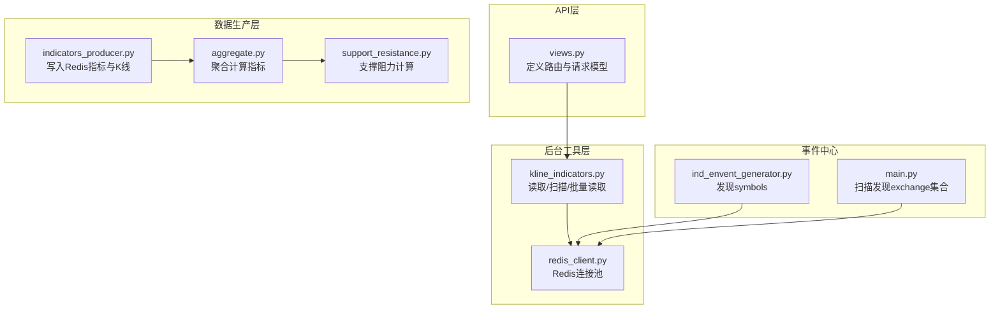
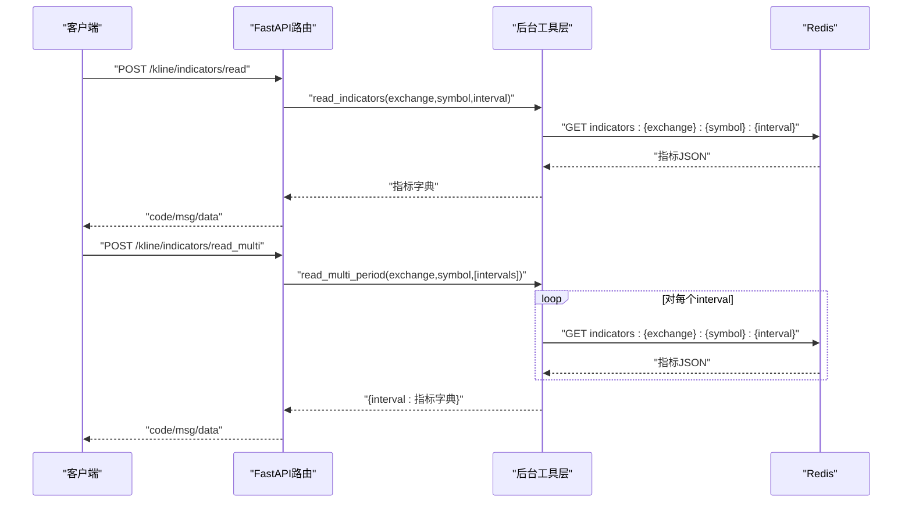
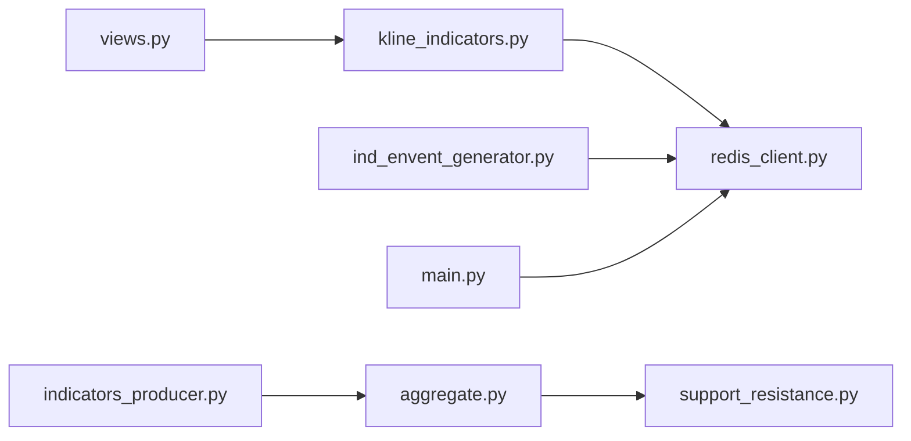

# 技术指标接口

<cite>
**本文引用的文件**
- [views.py](file://api/application/apps/background/views.py)
- [kline_indicators.py](file://api/application/apps/background/kline_indicators.py)
- [redis_client.py](file://api/application/common/redis_client.py)
- [indicators_producer.py](file://data_server/binance/rest_binance/app/indicators_producer.py)
- [aggregate.py](file://data_server/binance/rest_binance/app/signals/aggregate.py)
- [support_resistance.py](file://data_server/binance/rest_binance/app/signals/support_resistance.py)
- [ind_envent_generator.py](file://event_center/ind_envent_generator.py)
- [main.py](file://event_center/main.py)
</cite>

## 目录
1. [简介](#简介)
2. [项目结构](#项目结构)
3. [核心组件](#核心组件)
4. [架构总览](#架构总览)
5. [详细组件分析](#详细组件分析)
6. [依赖关系分析](#依赖关系分析)
7. [性能考量](#性能考量)
8. [故障排查指南](#故障排查指南)
9. [结论](#结论)

## 简介
本文件面向UTaker背景数据API中“技术指标”相关端点，系统性梳理以下RESTful接口：
- GET /kline/indicators/read：按单周期读取技术指标
- GET /kline/indicators/read_multi：按多周期批量读取技术指标
- GET /kline/indicators/symbols：按交易所与周期扫描可用交易对

同时，文档详解请求模型KlineIndicatorsRequest与KlineIndicatorsMultiPeriodRequest的字段语义与使用方式；解释read_indicators函数如何从Redis中提取indicators:{exchange}:{symbol}:{interval}键对应的技术指标数据；给出单周期与多周期查询的JSON响应示例；并说明scan_symbols接口在发现可用交易对时的扫描逻辑。最后提供性能建议，包括优先使用批量读取以降低高频单请求带来的网络与Redis压力，并结合kline_indicators.py中的read_multi_period实现高效数据获取。

## 项目结构
围绕技术指标接口的关键文件分布如下：
- API层：定义路由、请求模型与业务处理入口
- 后台工具层：封装Redis读取、扫描与批量读取逻辑
- 数据生产层：负责计算并写入Redis的技术指标与K线数据
- 事件中心：辅助发现可用交易对与周期

图表来源
- [views.py](file://api/application/apps/background/views.py#L73-L213)
- [kline_indicators.py](file://api/application/apps/background/kline_indicators.py#L17-L97)
- [redis_client.py](file://api/application/common/redis_client.py#L1-L33)
- [indicators_producer.py](file://data_server/binance/rest_binance/app/indicators_producer.py#L1-L41)
- [aggregate.py](file://data_server/binance/rest_binance/app/signals/aggregate.py#L1-L44)
- [support_resistance.py](file://data_server/binance/rest_binance/app/signals/support_resistance.py#L45-L69)
- [ind_envent_generator.py](file://event_center/ind_envent_generator.py#L1-L57)
- [main.py](file://event_center/main.py#L20-L55)

章节来源
- [views.py](file://api/application/apps/background/views.py#L73-L213)
- [kline_indicators.py](file://api/application/apps/background/kline_indicators.py#L17-L97)
- [redis_client.py](file://api/application/common/redis_client.py#L1-L33)
- [indicators_producer.py](file://data_server/binance/rest_binance/app/indicators_producer.py#L1-L41)
- [aggregate.py](file://data_server/binance/rest_binance/app/signals/aggregate.py#L1-L44)
- [support_resistance.py](file://data_server/binance/rest_binance/app/signals/support_resistance.py#L45-L69)
- [ind_envent_generator.py](file://event_center/ind_envent_generator.py#L1-L57)
- [main.py](file://event_center/main.py#L20-L55)

## 核心组件
- 请求模型
  - KlineIndicatorsRequest：用于单周期读取，字段exchange、symbol、interval分别表示交易所、交易对、周期。
  - KlineIndicatorsMultiPeriodRequest：用于多周期批量读取，字段exchange、symbol、intervals分别表示交易所、交易对、周期数组。
- 业务函数
  - read_indicators：按exchange、symbol、interval从Redis读取indicators:{exchange}:{symbol}:{interval}键对应的指标字典。
  - read_multi_period：对多个interval循环调用read_indicators，返回{interval: 指标字典}映射。
  - scan_symbols：基于Redis SCAN命令按模式indicators:{exchange}:*:{interval}扫描，去重后返回可用symbol列表。
- Redis键命名规范
  - 指标键：indicators:{exchange}:{symbol}:{interval}
  - 上一根指标键：indicators:prev:{exchange}:{symbol}:{interval}
  - K线键：klines:{exchange}:{symbol}:{interval}

章节来源
- [views.py](file://api/application/apps/background/views.py#L73-L105)
- [views.py](file://api/application/apps/background/views.py#L157-L213)
- [kline_indicators.py](file://api/application/apps/background/kline_indicators.py#L17-L97)

## 架构总览
技术指标接口的调用链路如下：
- 客户端向API发起请求
- FastAPI路由解析请求模型并调用后台工具层函数
- 后台工具层通过Redis连接池访问Redis
- 数据生产层在上游定时或实时计算并写入Redis

图表来源
- [views.py](file://api/application/apps/background/views.py#L73-L105)
- [views.py](file://api/application/apps/background/views.py#L185-L213)
- [kline_indicators.py](file://api/application/apps/background/kline_indicators.py#L45-L97)
- [redis_client.py](file://api/application/common/redis_client.py#L1-L33)

## 详细组件分析

### 接口：/kline/indicators/read
- 功能：按单周期读取技术指标，返回指标字典。
- 请求模型：KlineIndicatorsRequest
  - exchange：交易所名称
  - symbol：交易对符号
  - interval：周期（如1m/5m/1h等）
- 实现要点：
  - 调用read_indicators(exchange, symbol, interval, redis_client)
  - read_indicators通过Redis键indicators:{exchange}:{symbol}:{interval}读取指标JSON并反序列化
- 响应结构（示例）
  - 成功：{
      "code": 200,
      "msg": "成功",
      "data": {
        "ema": { ... },
        "ma": { ... },
        "macd": { ... },
        "rsi": { ... },
        "boll": { ... },
        "kdj": { ... },
        "volatility": { ... },
        "support_resistance": { ... },
        "williams_r": { ... },
        "mfi": { ... }
      }
    }
- 错误处理：捕获异常并返回统一状态码与错误消息

章节来源
- [views.py](file://api/application/apps/background/views.py#L73-L105)
- [kline_indicators.py](file://api/application/apps/background/kline_indicators.py#L45-L55)

### 接口：/kline/indicators/read_multi
- 功能：按多周期批量读取技术指标，返回{interval: 指标字典}映射。
- 请求模型：KlineIndicatorsMultiPeriodRequest
  - exchange：交易所名称
  - symbol：交易对符号
  - intervals：周期数组（如["1m","5m","1h"]）
- 实现要点：
  - 调用read_multi_period(exchange, symbol, intervals, redis_client)
  - read_multi_period对每个interval调用read_indicators并聚合结果
- 响应结构（示例）
  - 成功：{
      "code": 200,
      "msg": "成功",
      "data": {
        "1m": { "ema": { ... }, "rsi": { ... } },
        "5m": { "ema": { ... }, "rsi": { ... } },
        "1h": { "ema": { ... }, "rsi": { ... } }
      }
    }
- 错误处理：捕获异常并返回统一状态码与错误消息

章节来源
- [views.py](file://api/application/apps/background/views.py#L185-L213)
- [kline_indicators.py](file://api/application/apps/background/kline_indicators.py#L81-L91)

### 接口：/kline/indicators/symbols
- 功能：扫描指定交易所与周期下存在指标数据的交易对列表。
- 请求模型：KlineIndicatorsScanRequest
  - exchange：交易所名称
  - interval：周期
- 实现要点：
  - 调用scan_symbols(exchange, interval, redis_client)
  - scan_symbols使用Redis SCAN命令按模式indicators:{exchange}:*:{interval}扫描，拆分键名提取symbol并去重
- 响应结构（示例）
  - 成功：{
      "code": 200,
      "msg": "成功",
      "data": { "symbols": ["BTCUSDT","ETHUSDT","BNBUSDT"] }
    }
- 错误处理：捕获异常并返回统一状态码与错误消息

章节来源
- [views.py](file://api/application/apps/background/views.py#L157-L183)
- [kline_indicators.py](file://api/application/apps/background/kline_indicators.py#L57-L78)

### 请求模型字段说明
- KlineIndicatorsRequest
  - exchange：交易所名称（如binance）
  - symbol：交易对符号（如BTCUSDT）
  - interval：周期（如1m/5m/15m/1h等）
- KlineIndicatorsMultiPeriodRequest
  - exchange：交易所名称
  - symbol：交易对符号
  - intervals：周期数组（至少包含一个周期）

章节来源
- [views.py](file://api/application/apps/background/views.py#L73-L105)
- [views.py](file://api/application/apps/background/views.py#L185-L213)

### Redis键与数据结构
- 键命名规范
  - 指标键：indicators:{exchange}:{symbol}:{interval}
  - 上一根指标键：indicators:prev:{exchange}:{symbol}:{interval}
  - K线键：klines:{exchange}:{symbol}:{interval}
- 数据内容
  - 指标键存储指标字典（如ema、ma、macd、rsi、boll、kdj、volatility、support_resistance、williams_r、mfi等）
  - K线键存储K线数组（每根K线通常包含时间、开盘、最高、最低、收盘、成交量等字段）
- 生产流程
  - 数据生产层计算指标（见signals/aggregate.py），写入Redis键indicators:{exchange}:{symbol}:{interval}
  - 同时写入klines:{exchange}:{symbol}:{interval}
  - 若可获得上一根K线，还会写入indicators:prev:{exchange}:{symbol}:{interval}

章节来源
- [kline_indicators.py](file://api/application/apps/background/kline_indicators.py#L17-L43)
- [indicators_producer.py](file://data_server/binance/rest_binance/app/indicators_producer.py#L13-L34)
- [aggregate.py](file://data_server/binance/rest_binance/app/signals/aggregate.py#L1-L44)
- [support_resistance.py](file://data_server/binance/rest_binance/app/signals/support_resistance.py#L45-L69)

### scan_symbols扫描逻辑
- 步骤
  - 使用Redis SCAN命令，匹配模式indicators:{exchange}:*:{interval}
  - 遍历返回的键列表，按":"分割并校验键结构长度为4
  - 提取第3段作为symbol，使用集合去重
  - 循环直到游标回到0
- 复杂度
  - 时间复杂度近似O(N)，N为匹配键数量
  - 通过count=1000控制每次SCAN返回数量，减少阻塞风险

章节来源
- [kline_indicators.py](file://api/application/apps/background/kline_indicators.py#L57-L78)

### read_indicators读取流程
- 步骤
  - 组装Redis键indicators:{exchange}:{symbol}:{interval}
  - 通过异步Redis客户端执行GET
  - 将返回的JSON字符串反序列化为字典
  - 若键不存在则返回空字典
- 注意
  - 该函数仅返回指标字典，不包含prev_indicators与klines

章节来源
- [kline_indicators.py](file://api/application/apps/background/kline_indicators.py#L45-L55)

### read_multi_period批量读取流程
- 步骤
  - 遍历intervals列表
  - 对每个interval调用read_indicators并聚合结果
  - 返回{interval: 指标字典}映射
- 性能建议
  - 优先使用read_multi_period替代多次单周期请求，减少网络与Redis往返

章节来源
- [kline_indicators.py](file://api/application/apps/background/kline_indicators.py#L81-L91)

## 依赖关系分析
- API层依赖后台工具层提供的读取与扫描函数
- 后台工具层依赖Redis连接池
- 数据生产层负责将计算后的指标写入Redis
- 事件中心提供辅助的symbols发现能力

图表来源
- [views.py](file://api/application/apps/background/views.py#L1-L20)
- [kline_indicators.py](file://api/application/apps/background/kline_indicators.py#L1-L20)
- [redis_client.py](file://api/application/common/redis_client.py#L1-L33)
- [indicators_producer.py](file://data_server/binance/rest_binance/app/indicators_producer.py#L1-L20)
- [aggregate.py](file://data_server/binance/rest_binance/app/signals/aggregate.py#L1-L20)
- [support_resistance.py](file://data_server/binance/rest_binance/app/signals/support_resistance.py#L45-L69)
- [ind_envent_generator.py](file://event_center/ind_envent_generator.py#L1-L20)
- [main.py](file://event_center/main.py#L20-L35)

章节来源
- [views.py](file://api/application/apps/background/views.py#L1-L20)
- [kline_indicators.py](file://api/application/apps/background/kline_indicators.py#L1-L20)
- [redis_client.py](file://api/application/common/redis_client.py#L1-L33)
- [indicators_producer.py](file://data_server/binance/rest_binance/app/indicators_producer.py#L1-L20)
- [aggregate.py](file://data_server/binance/rest_binance/app/signals/aggregate.py#L1-L20)
- [support_resistance.py](file://data_server/binance/rest_binance/app/signals/support_resistance.py#L45-L69)
- [ind_envent_generator.py](file://event_center/ind_envent_generator.py#L1-L20)
- [main.py](file://event_center/main.py#L20-L35)

## 性能考量
- 优先使用批量读取
  - 单周期读取适合一次性获取某周期指标；多周期读取应使用read_multi_period，避免高频单请求导致的网络与Redis压力。
- Redis SCAN优化
  - scan_symbols使用count=1000分批扫描，降低阻塞风险；若需要更细粒度控制，可在上游调用处调整count。
- 连接池与并发
  - redis_client采用连接池，建议在高并发场景下复用同一连接池实例，避免频繁创建连接。
- 数据结构选择
  - 指标键存储为JSON字典，读取后直接反序列化；建议在上游生产层保持指标字典结构稳定，便于下游快速消费。
- 事件中心辅助发现
  - 事件中心提供symbols发现逻辑，可作为scan_symbols的补充参考，但本接口仍以Redis键扫描为主。

[本节为通用性能建议，无需特定文件引用]

## 故障排查指南
- 常见问题
  - Redis连接失败：检查REDIS_HOST、REDIS_PORT、REDIS_DB、REDIS_PASSWORD等环境变量是否正确配置。
  - 键不存在：当indicators:{exchange}:{symbol}:{interval}不存在时，read_indicators返回空字典；确认上游是否已写入该键。
  - 扫描无结果：确认exchange与interval是否与上游写入一致；检查Redis中是否存在匹配键。
- 排查步骤
  - 在API层捕获异常并返回统一状态码与错误消息，便于前端定位问题。
  - 使用Redis命令行验证键是否存在与内容结构。
  - 检查数据生产层是否正常运行并写入Redis。

章节来源
- [views.py](file://api/application/apps/background/views.py#L80-L101)
- [views.py](file://api/application/apps/background/views.py#L191-L213)
- [views.py](file://api/application/apps/background/views.py#L162-L182)
- [redis_client.py](file://api/application/common/redis_client.py#L1-L33)

## 结论
本文档系统梳理了UTaker背景数据API中技术指标相关端点的请求模型、实现细节与数据结构。通过明确Redis键命名规范、read_indicators与read_multi_period的读取策略，以及scan_symbols的扫描逻辑，用户可以高效地按单周期或多周期获取技术指标数据。建议在实际应用中优先使用批量读取以提升性能，并结合Redis连接池与合理的SCAN策略，确保系统的稳定性与吞吐能力。