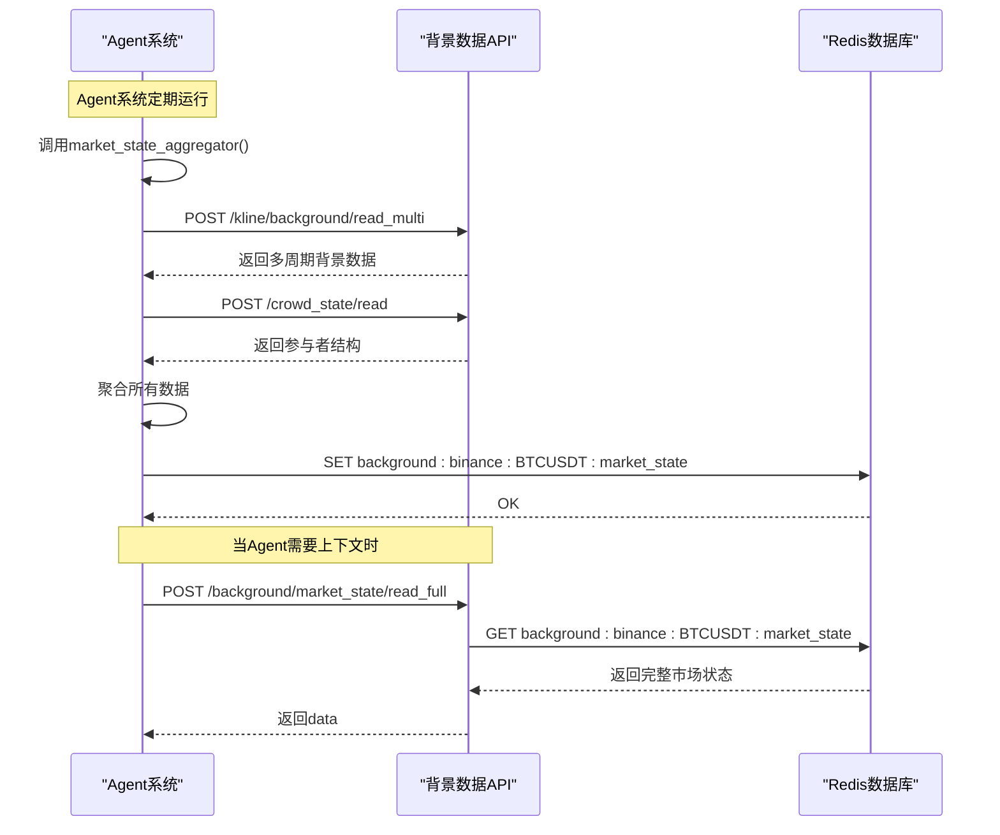

# 背景数据接口

<cite>
**本文档引用的文件**
- [views.py](file://api/application/apps/background/views.py)
- [market_raw_analysis.py](file://api/application/apps/background/market_raw_analysis.py)
- [market_state_view.py](file://api/application/apps/background/market_state_view.py)
- [kline_indicators.py](file://api/application/apps/background/kline_indicators.py)
- [background_kline.py](file://api/application/apps/background/background_kline.py)
- [crowd_state_compactor.py](file://api/application/apps/background/crowd_state_compactor.py)
- [redis_client.py](file://api/application/common/redis_client.py)
- [market_state.py](file://agent_server/agents/experts/background/market_state.py)
</cite>

## 目录
1. [简介](#简介)
2. [核心端点](#核心端点)
3. [请求模型](#请求模型)
4. [数据聚合与后端处理](#数据聚合与后端处理)
5. [返回数据结构示例](#返回数据结构示例)
6. [与Agent系统上下文的集成](#与agent系统上下文的集成)
7. [性能优化建议](#性能优化建议)

## 简介
本文档详细说明了UTaker系统中以`/background`为前缀的RESTful背景数据API。这些接口为Agent系统提供关键的市场背景信息，包括原始市场数据分析、完整市场状态、技术指标和参与者结构。后端通过`redis_client`从Redis中聚合由`data_server`和`event_center`生成的多源数据，为上层应用提供统一的数据视图。

## 核心端点
背景数据API提供了多个RESTful端点，用于获取不同维度的市场背景信息。

### 市场原始数据分析
- **端点**: `POST /background/market_raw/analyze`
- **功能**: 分析市场原始数据并构建参与者结构与摘要。
- **请求模型**: `MarketRawRequest`
- **参数**:
  - `exchange`: 交易所名称
  - `symbol`: 币种符号
- **返回**: 包含参与者画像、24小时行情和资金费率分析结果的结构化数据。

### 完整市场状态读取
- **端点**: `POST /background/market_state/read_full`
- **功能**: 读取完整的市场状态（不做裁剪，便于在Agent侧自行裁剪）。
- **请求模型**: `MarketStateReadFullRequest`
- **参数**:
  - `exchange`: 交易所名称
  - `symbol`: 币种符号
- **返回**: 完整的`market_state`数据（移除了内部`_raw_trends`字段）。

### 多周期技术指标查询
- **端点**: `POST /background/kline/indicators/read_multi`
- **功能**: 批量读取多周期的技术指标。
- **请求模型**: `KlineIndicatorsMultiPeriodRequest`
- **参数**:
  - `exchange`: 交易所名称
  - `symbol`: 币种符号
  - `intervals`: 周期列表（如 ["1m","5m","1h"]）
- **返回**: 一个以周期为键，技术指标字典为值的映射。

### 背景K线数据获取
- **端点**: `POST /background/kline/background/read`
- **功能**: 读取指定交易所/币种/周期的背景K线指标（仅返回背景数据）。
- **请求模型**: `BackgroundKlineRequest`
- **参数**:
  - `exchange`: 交易所名称
  - `symbol`: 币种符号
  - `interval`: 周期（如 1m/5m/1h）
- **返回**: 背景指标字典。

### 参与者结构和拥挤度状态读取
- **端点**: `POST /background/crowd_state/read`
- **功能**: 读取指定交易所/币种的参与者结构和拥挤度背景。
- **请求模型**: `CrowdStateRequest`
- **参数**:
  - `exchange`: 交易所名称
  - `symbol`: 币种符号
- **返回**: `market_structure`的字典。

**Section sources**
- [views.py](file://api/application/apps/background/views.py#L1-L273)

## 请求模型
每个API端点都定义了其特定的请求模型，用于验证和解析传入的JSON数据。

### KlineIndicatorsRequest
该模型用于请求单个周期的技术指标。

```python
class KlineIndicatorsRequest(BaseModel):
    exchange: str
    symbol: str
    interval: str
```

**Section sources**
- [views.py](file://api/application/apps/background/views.py#L73-L77)

### CrowdStateRequest
该模型用于请求参与者结构和拥挤度状态。

```python
class CrowdStateRequest(BaseModel):
    exchange: str
    symbol: str
```

**Section sources**
- [views.py](file://api/application/apps/background/views.py#L103-L106)

### KlineIndicatorsMultiPeriodRequest
该模型用于批量请求多个周期的技术指标。

```python
class KlineIndicatorsMultiPeriodRequest(BaseModel):
    exchange: str
    symbol: str
    intervals: list[str]
```

**Section sources**
- [views.py](file://api/application/apps/background/views.py#L185-L189)

## 数据聚合与后端处理
背景数据API的核心在于从Redis中高效地聚合和处理多源数据。

### Redis数据源
后端通过`redis_client`与Redis交互。`data_server`和`event_center`服务负责将原始数据写入Redis，而API服务则负责读取和聚合这些数据。

- `data_server/binance`: 将从交易所获取的原始市场数据（如多空比、K线）存储到Redis的`market_raw:*`键下。
- `event_center`: 将计算出的技术指标和事件存储到Redis的`indicators:*`和`background:*`键下。

### 数据读取流程
以`/background/market_raw/analyze`为例，其处理流程如下：
1. 接收`MarketRawRequest`请求。
2. 调用`read_market_raw`函数，使用`SCAN`命令匹配`market_raw:{exchange}:{symbol}:*`模式的键，获取所有相关的原始数据。
3. 调用`build_participant_structure`函数，对原始数据进行分析和聚合，生成结构化的参与者画像。
4. 返回最终结果。

```mermaid
flowchart TD
Client["客户端"] --> |POST /background/market_raw/analyze\n{exchange, symbol}| API["API服务\nviews.py"]
API --> |调用| ReadRaw["read_market_raw\nmarket_raw_analysis.py"]
ReadRaw --> |SCAN\nmarket_raw:*| Redis["Redis数据库"]
Redis --> |返回原始数据| ReadRaw
ReadRaw --> |返回| API
API --> |调用| BuildStruct["build_participant_structure\nmarket_raw_analysis.py"]
BuildStruct --> |分析并聚合| API
API --> |返回\n{code, msg, data}| Client
```

**Diagram sources**
- [views.py](file://api/application/apps/background/views.py#L24-L44)
- [market_raw_analysis.py](file://api/application/apps/background/market_raw_analysis.py#L42-L94)
- [market_raw_analysis.py](file://api/application/apps/background/market_raw_analysis.py#L274-L349)

## 返回数据结构示例
以下是各接口返回数据的JSON示例。

### `/background/market_raw/analyze` 返回示例
```json
{
  "code": 200,
  "msg": "Success",
  "data": {
    "symbol": "BTCUSDT",
    "generated_at": 1700000000000,
    "ticker": {
      "price": 35000.0,
      "price_change_pct_24h": 0.02,
      "high_24h": 36000.0,
      "low_24h": 34000.0,
      "quote_volume_24h": 100000000,
      "volatility_24h": "medium",
      "trend_24h": "up"
    },
    "funding_rate": {
      "current": 0.001,
      "mean": 0.0008,
      "delta": 0.0001,
      "volatility": 0.0002,
      "trend": "up",
      "stability": "medium",
      "bias": "bullish"
    },
    "participant_structure": {
      "takerLongShortRatio": {
        "5m": {
          "current": { "long_pct": 0.55, "short_pct": 0.45, "ls_ratio": 1.22 },
          "stats": { "mean_ls_ratio": 1.18, "delta_ls_ratio": 0.04, "vol_ls_ratio": 0.05 },
          "trend": { "ls_trend": "up", "long_trend": "up", "short_trend": "down" },
          "labels": { "bias": "long", "strength": "medium", "stability": "medium" }
        }
      }
    },
    "summary": {
      "cross_period_bias": "long",
      "cross_period_stability": "medium",
      "funding_bias": "bullish",
      "funding_stability": "medium",
      "price_trend_24h": "up",
      "market_context": "bullish_sentiment",
      "alignment_score": 0.6,
      "notes": "跨周期加权判断为 long，一致性评分 0.6，结构稳定性 medium。"
    }
  }
}
```

### `/background/market_state/read_full` 返回示例
```json
{
  "code": 200,
  "msg": "Success",
  "data": {
    "symbol": "BTCUSDT",
    "ts": 1700000000000,
    "market_state": {
      "micro_term": {
        "state": "range_near_R1",
        "role": "trigger_only",
        "confidence": 0.3
      },
      "short_term": {
        "direction": "bullish",
        "structure": "range",
        "momentum": "neutral",
        "risk": "normal",
        "conflict": null,
        "confidence": 0.7
      },
      "mid_term": {
        "direction": "bullish",
        "structure": "trend",
        "momentum": "strengthening",
        "risk": "normal",
        "conflict": null,
        "confidence": 1.0
      },
      "long_term": {
        "direction": "bullish",
        "structure": "trend",
        "momentum": "strengthening",
        "risk": "normal",
        "conflict": null,
        "confidence": 1.2,
        "veto": false
      }
    },
    "crowd_state": {
      "fragility": "medium",
      "crowding_level": "medium",
      "bias": "long",
      "consistency": "aligned"
    }
  }
}
```

**Section sources**
- [market_raw_analysis.py](file://api/application/apps/background/market_raw_analysis.py#L274-L349)
- [market_state.py](file://agent_server/agents/experts/background/market_state.py#L126-L176)

## 与Agent系统上下文的集成
`read_full_market_state`接口与Agent系统的上下文构建紧密集成。

### 集成流程
1. Agent系统中的`market_state_aggregator`函数负责聚合不同周期的背景K线数据和参与者结构数据。
2. 该函数将聚合后的数据通过`save_market_state`函数存储到Redis中，键名为`background:{exchange}:{symbol}:market_state`。
3. 当Agent需要获取完整的市场状态时，它会调用`/background/market_state/read_full`接口，该接口直接从Redis中读取`background:{exchange}:{symbol}:market_state`键的值并返回。

### 关键函数
- `market_state_aggregator` (位于 `agent_server/agents/experts/background/market_state.py`): 核心聚合函数，根据预定义的规则（如`detect_long_term_veto`）将多个周期的背景数据融合成一个综合的市场状态。
- `save_market_state`: 将聚合后的市场状态保存到Redis。



**Diagram sources**
- [market_state_view.py](file://api/application/apps/background/market_state_view.py#L25-L33)
- [market_state.py](file://agent_server/agents/experts/background/market_state.py#L179-L184)
- [market_state.py](file://agent_server/agents/experts/background/market_state.py#L113-L176)

## 性能优化建议
为了提高API的性能和效率，建议采用以下优化策略。

### 批量查询替代多次单请求
对于需要获取多个周期数据的场景，应优先使用批量查询接口，而不是发起多次单周期请求。

- **推荐**: 使用 `POST /background/kline/indicators/read_multi` 或 `POST /background/kline/background/read_multi` 一次性获取所有需要的周期数据。
- **避免**: 对每个周期都调用一次 `POST /background/kline/indicators/read`。

批量查询可以显著减少网络往返次数和Redis的`SCAN`操作次数，从而降低延迟和服务器负载。

**Section sources**
- [kline_indicators.py](file://api/application/apps/background/kline_indicators.py#L81-L91)
- [background_kline.py](file://api/application/apps/background/background_kline.py#L44-L54)