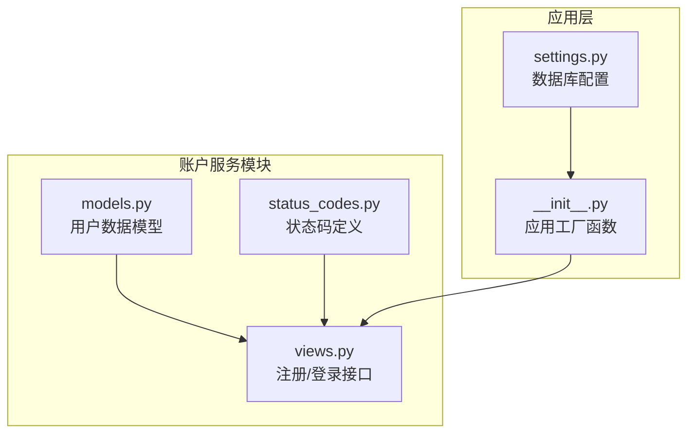
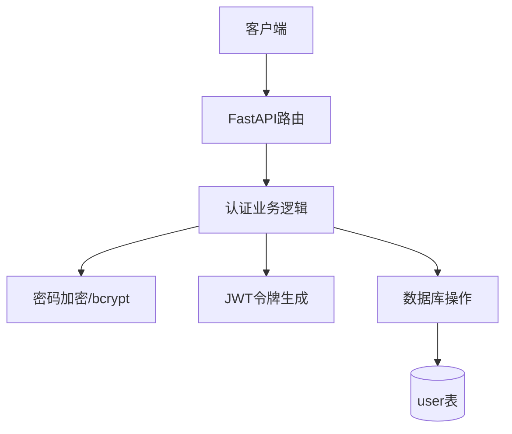
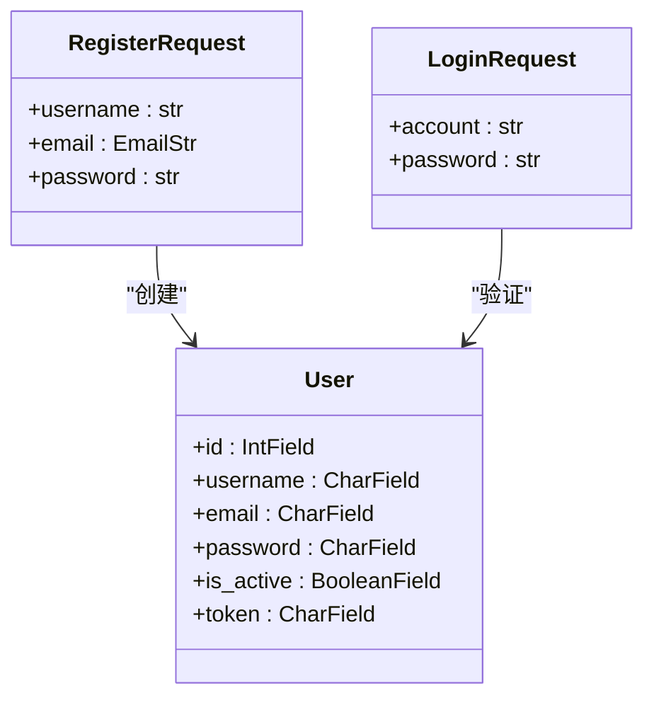
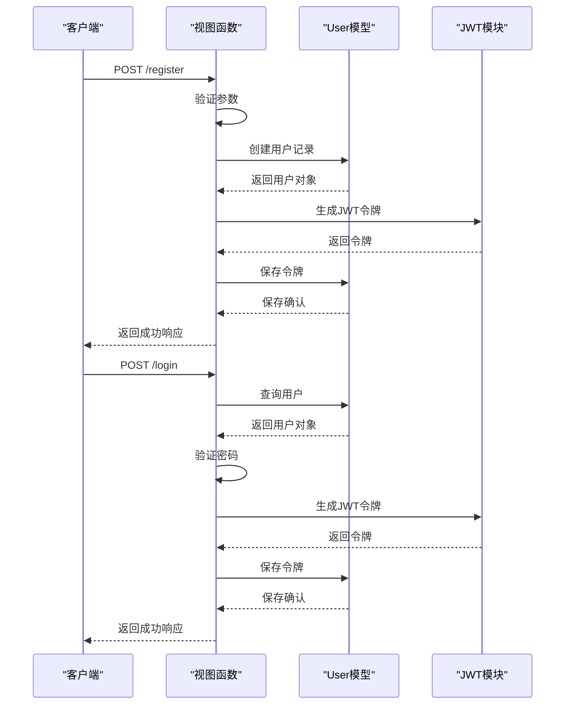
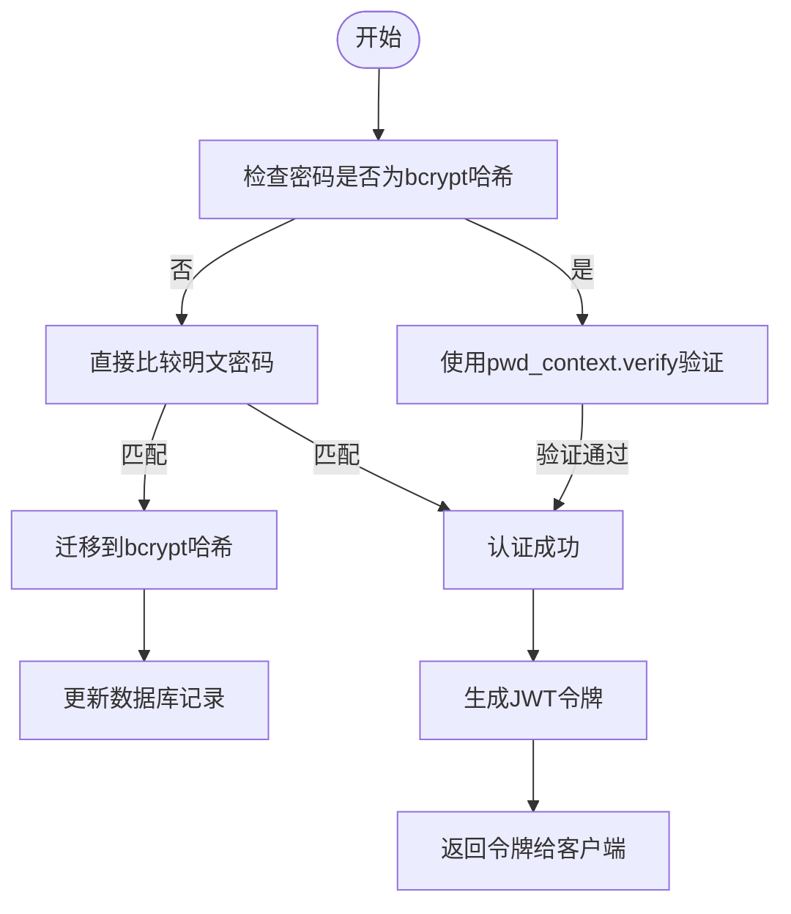
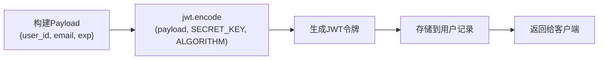
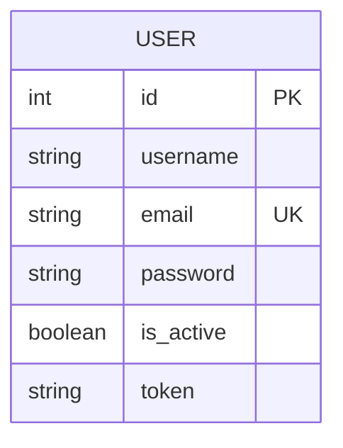
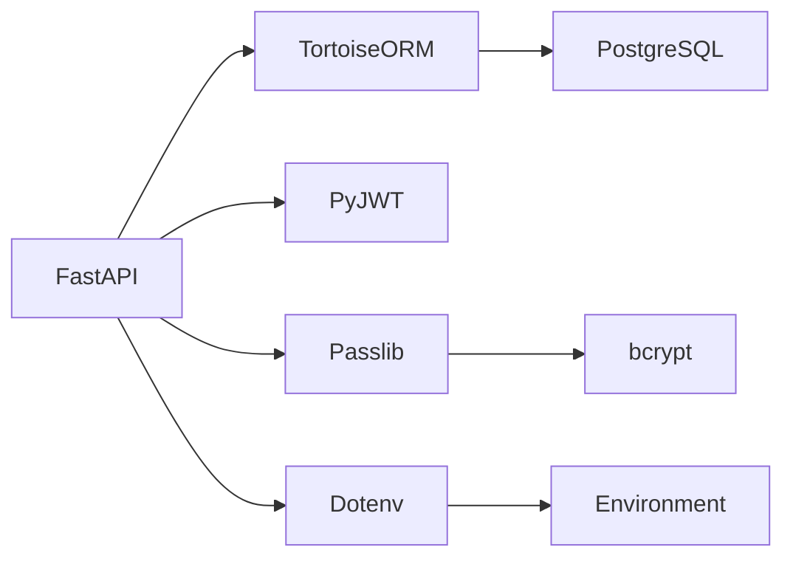

# 账户接口

<cite>
**本文档引用的文件**   
- [models.py](file://api/application/apps/account/models.py)
- [views.py](file://api/application/apps/account/views.py)
- [status_codes.py](file://api/application/common/status_codes.py)
- [settings.py](file://api/application/settings.py)
- [__init__.py](file://api/application/__init__.py)
</cite>

## 目录
1. [简介](#简介)
2. [项目结构](#项目结构)
3. [核心组件](#核心组件)
4. [架构概述](#架构概述)
5. [详细组件分析](#详细组件分析)
6. [依赖分析](#依赖分析)
7. [性能考虑](#性能考虑)
8. [故障排除指南](#故障排除指南)
9. [结论](#结论)

## 简介
本文档详细说明了UTaker账户服务的API实现，重点介绍基于FastAPI的用户注册（/register）与登录（/login）接口。文档涵盖请求模型定义、JWT令牌生成机制、密码加密策略（bcrypt）、数据库模型设计以及错误处理逻辑。同时解释了如何通过环境变量配置关键安全参数，并提供实际调用示例。

## 项目结构
UTaker账户服务位于`api/application/apps/account/`目录下，采用模块化设计，分离了数据模型与业务逻辑。该服务基于FastAPI框架构建，使用Tortoise ORM进行数据库操作，通过JWT实现认证，并集成bcrypt进行密码安全存储。

**图示来源**
- [models.py](file://api/application/apps/account/models.py)
- [views.py](file://api/application/apps/account/views.py)
- [status_codes.py](file://api/application/common/status_codes.py)
- [__init__.py](file://api/application/__init__.py)
- [settings.py](file://api/application/settings.py)

**本节来源**
- [models.py](file://api/application/apps/account/models.py)
- [views.py](file://api/application/apps/account/views.py)

## 核心组件
账户服务的核心组件包括用户注册、用户登录两大功能接口，以及支撑这些功能的数据模型和安全机制。系统实现了完整的用户生命周期管理，从账户创建到身份验证，并包含密码安全升级机制。

**本节来源**
- [views.py](file://api/application/apps/account/views.py#L43-L126)
- [models.py](file://api/application/apps/account/models.py#L4-L17)

## 架构概述
账户服务采用典型的分层架构，包含路由层、业务逻辑层和数据访问层。FastAPI负责请求路由和参数验证，业务逻辑在视图函数中实现，数据持久化通过Tortoise ORM完成。安全方面采用JWT进行会话管理，bcrypt进行密码哈希。

**图示来源**
- [views.py](file://api/application/apps/account/views.py)
- [models.py](file://api/application/apps/account/models.py)

## 详细组件分析

### 注册与登录接口分析
账户服务提供了两个核心API端点：用户注册（POST /register）和用户登录（POST /login）。这两个接口共同构成了系统的身份认证基础。

#### 请求模型定义
系统定义了两个Pydantic模型来规范API输入：

**图示来源**
- [views.py](file://api/application/apps/account/views.py#L32-L41)
- [models.py](file://api/application/apps/account/models.py#L4-L17)

**本节来源**
- [views.py](file://api/application/apps/account/views.py#L32-L41)
- [models.py](file://api/application/apps/account/models.py#L4-L17)

#### 接口功能说明
- **注册接口 (/register)**：接收用户名、邮箱和密码，验证输入合法性后创建用户账户
- **登录接口 (/login)**：接收账户标识（邮箱）和密码，验证凭证后返回JWT令牌

**图示来源**
- [views.py](file://api/application/apps/account/views.py#L43-L126)

**本节来源**
- [views.py](file://api/application/apps/account/views.py#L43-L126)

### 安全机制分析
账户服务实现了多层次的安全保障机制，包括密码加密、令牌认证和兼容性迁移策略。

#### 密码加密与迁移
系统采用bcrypt算法对用户密码进行哈希存储，并实现了从明文密码到哈希密码的自动迁移机制。

**图示来源**
- [views.py](file://api/application/apps/account/views.py#L23-L29)
- [views.py](file://api/application/apps/account/views.py#L104-L115)

**本节来源**
- [views.py](file://api/application/apps/account/views.py#L19-L29)
- [views.py](file://api/application/apps/account/views.py#L104-L115)

#### JWT令牌生成
系统使用PyJWT库生成JSON Web Token，实现无状态的身份认证。

**图示来源**
- [views.py](file://api/application/apps/account/views.py#L80-L85)
- [views.py](file://api/application/apps/account/views.py#L117-L121)

**本节来源**
- [views.py](file://api/application/apps/account/views.py#L80-L85)
- [views.py](file://api/application/apps/account/views.py#L117-L121)

### 数据模型分析
用户数据模型定义了账户系统的核心数据结构和存储规范。

**图示来源**
- [models.py](file://api/application/apps/account/models.py#L4-L17)

**本节来源**
- [models.py](file://api/application/apps/account/models.py#L4-L17)

## 依赖分析
账户服务依赖于多个外部库和内部模块，形成了清晰的依赖关系网络。

**图示来源**
- [views.py](file://api/application/apps/account/views.py)
- [requirements.txt](file://requirements.txt)

**本节来源**
- [views.py](file://api/application/apps/account/views.py)
- [requirements.txt](file://requirements.txt)

## 性能考虑
账户服务在设计时考虑了基本的性能因素，JWT令牌设置了较长的有效期（9999天），减少了频繁重新登录的需求。数据库查询使用了Tortoise ORM的异步特性，能够有效处理并发请求。密码哈希使用bcrypt，默认配置提供了良好的安全性和性能平衡。

## 故障排除指南
当账户服务出现问题时，可参考以下常见错误及其解决方案：

**本节来源**
- [views.py](file://api/application/apps/account/views.py#L50-L66)
- [status_codes.py](file://api/application/common/status_codes.py)

### 常见错误代码
| 状态码 | 错误信息 | 可能原因 | 解决方案 |
|--------|---------|---------|---------|
| 1001 | 参数错误 | 输入参数不符合要求 | 检查用户名、邮箱、密码格式 |
| 1001 | 邮箱已存在 | 注册时邮箱已被使用 | 使用其他邮箱或尝试登录 |
| 1001 | 用户名已存在 | 注册时用户名已被占用 | 使用其他用户名 |
| 1001 | 密码长度不能小于6位 | 密码太短 | 使用至少6位的密码 |
| 1001 | 用户不存在 | 登录时邮箱未注册 | 先注册账户或检查邮箱输入 |
| 1001 | 密码错误 | 密码不匹配 | 检查密码或重置密码 |
| 1001 | 用户被禁用 | 账户已被禁用 | 联系管理员启用账户 |

### 配置相关问题
- **JWT_SECRET未配置**：确保环境变量`JWT_SECRET`已正确设置
- **数据库连接失败**：检查`DB_HOST`、`DB_PORT`、`DB_USER`、`DB_PASSWORD`等环境变量
- **密码策略问题**：系统要求密码至少6位，且用户名只能包含字母、数字和下划线

## 结论
UTaker账户服务提供了一套完整的用户认证解决方案，基于现代Python技术栈构建，具有良好的安全性和可维护性。系统实现了用户注册、登录、JWT认证等核心功能，并特别考虑了密码安全和向后兼容性。通过环境变量配置，系统具有良好的部署灵活性。建议在生产环境中进一步强化安全措施，如添加密码强度检查、实现令牌刷新机制等。