# 事件中心

<cite>
**本文档引用文件**  
- [l0_processor.py](file://event_center/pipeline/l0_processor.py)
- [l1_aggregator.py](file://event_center/pipeline/l1_aggregator.py)
- [final_grader.py](file://event_center/pipeline/final_grader.py)
- [event_engine.py](file://event_center/indicators_event/engine/event_engine.py)
- [single_signal.py](file://event_center/indicators_event/plugins/single_signal.py)
- [ema_macd_combo.py](file://event_center/indicators_event/plugins/ema_macd_combo.py)
- [score_mapper.py](file://event_center/indicators_event/scoring/score_mapper.py)
- [plugin_loader.py](file://event_center/indicators_event/engine/plugin_loader.py)
- [indicator_loader.py](file://event_center/indicators_event/engine/indicator_loader.py)
- [config.py](file://event_center/config.py)
- [rules.yml](file://event_center/rules.yml)
- [event.py](file://event_center/indicators_event/models/event.py)
- [indicator_class_map.yaml](file://event_center/indicators_event/config/indicator_class_map.yaml)
- [tf_weights.yaml](file://event_center/indicators_event/config/tf_weights.yaml)
- [strength_weights.yaml](file://event_center/indicators_event/config/strength_weights.yaml)
</cite>

## 目录
1. [项目结构](#项目结构)
2. [三级流水线处理架构](#三级流水线处理架构)
3. [L0Processor：原始信号消费与基础事件生成](#l0processor原始信号消费与基础事件生成)
4. [L1Aggregator：多源事件聚合与去重](#l1aggregator多源事件聚合与去重)
5. [FinalGrader：基于规则的最终决策生成](#finalgrader基于规则的最终决策生成)
6. [事件引擎插件化设计](#事件引擎插件化设计)
7. [事件评分与优先级分级](#事件评分与优先级分级)
8. [异步并发模型与容错机制](#异步并发模型与容错机制)

## 项目结构

UTaker事件中心采用模块化分层设计，核心组件位于`event_center`目录下，通过Redis Stream实现事件驱动的异步处理。系统主要分为三级流水线处理模块、事件引擎、插件系统和配置管理。

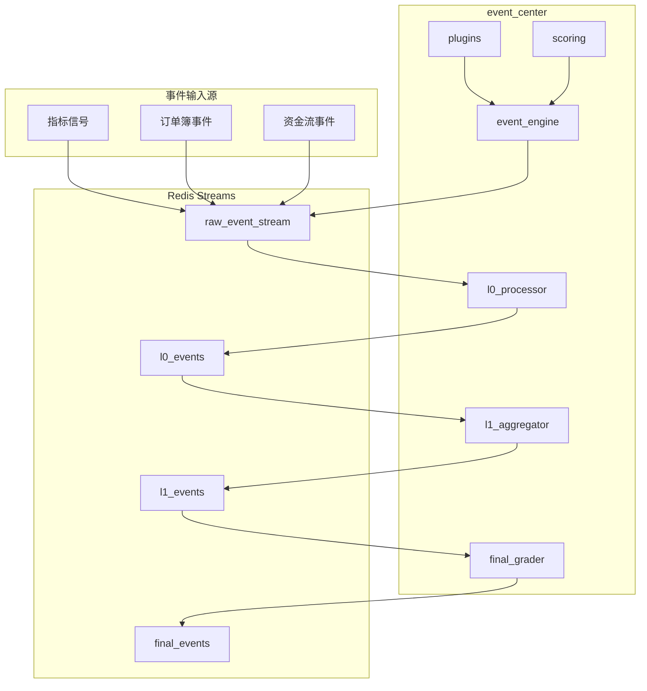

**图示来源**  
- [l0_processor.py](file://event_center/pipeline/l0_processor.py)
- [l1_aggregator.py](file://event_center/pipeline/l1_aggregator.py)
- [final_grader.py](file://event_center/pipeline/final_grader.py)
- [event_engine.py](file://event_center/indicators_event/engine/event_engine.py)

**本节来源**  
- [event_center](file://event_center)

## 三级流水线处理架构

UTaker事件中心采用L0→L1→Final三级流水线架构，实现从原始信号到最终决策的渐进式处理。该架构通过Redis Stream作为消息总线，确保事件处理的顺序性和可靠性。

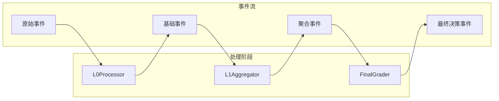

**图示来源**  
- [l0_processor.py](file://event_center/pipeline/l0_processor.py#L266-L304)
- [l1_aggregator.py](file://event_center/pipeline/l1_aggregator.py#L383-L414)
- [final_grader.py](file://event_center/pipeline/final_grader.py#L96-L304)

**本节来源**  
- [l0_processor.py](file://event_center/pipeline/l0_processor.py)
- [l1_aggregator.py](file://event_center/pipeline/l1_aggregator.py)
- [final_grader.py](file://event_center/pipeline/final_grader.py)

## L0Processor：原始信号消费与基础事件生成

L0Processor是三级流水线的第一级，负责消费原始指标信号并生成基础事件。它通过Redis消费组从`raw_event_stream`读取事件，进行信号确认和优先级评估。

L0Processor的核心功能包括：
- **窗口管理**：维护每个(symbol, plugin, tf)组合的时间窗口，用于存储最近的信号
- **信号确认**：根据一致性比率和最小强度阈值判断信号的有效性
- **优先级映射**：根据信号强度和方向性确定事件优先级

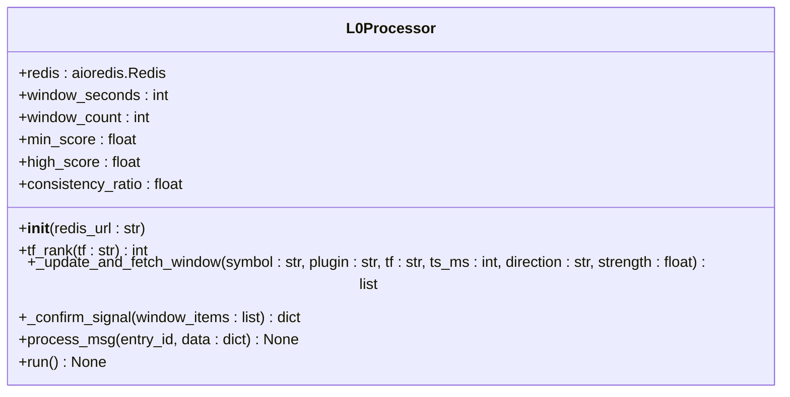

**图示来源**  
- [l0_processor.py](file://event_center/pipeline/l0_processor.py#L9-L304)

**本节来源**  
- [l0_processor.py](file://event_center/pipeline/l0_processor.py#L1-L305)

## L1Aggregator：多源事件聚合与去重

L1Aggregator是三级流水线的第二级，负责对来自L0Processor的多源事件进行时间窗口聚合与去重。它将不同来源的信号按时间框架分桶，计算综合市场状态。

L1Aggregator的核心功能包括：
- **分类推断**：根据插件名称推断指标类别（趋势、动量、波动率等）
- **时间框架分桶**：将信号按时间框架分为短期、中期、长期三个桶
- **结构聚合**：计算各桶的综合得分和方向，判断整体市场状态

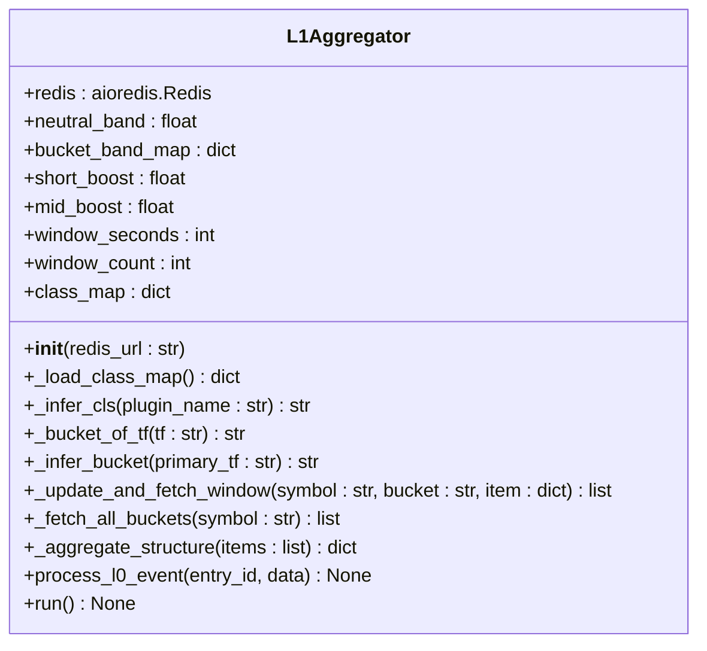

**图示来源**  
- [l1_aggregator.py](file://event_center/pipeline/l1_aggregator.py#L11-L414)

**本节来源**  
- [l1_aggregator.py](file://event_center/pipeline/l1_aggregator.py#L1-L415)

## FinalGrader：基于规则的最终决策生成

FinalGrader是三级流水线的最后一级，负责基于评分规则和权重配置生成最终决策事件。它实现了优先级门控、状态去抖和结构化上下文打包。

FinalGrader的核心功能包括：
- **优先级门控**：根据预设的最低优先级过滤事件
- **状态去抖**：使用Redis Lua脚本实现状态变化的时间窗口去抖
- **置信度推断**：根据综合得分和市场状态推断事件置信度

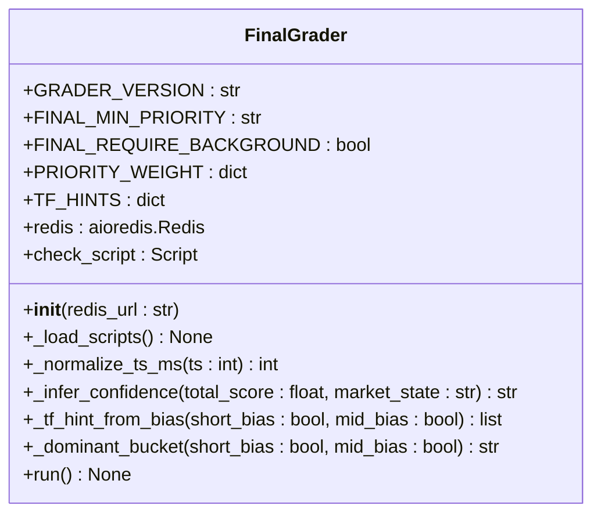

**图示来源**  
- [final_grader.py](file://event_center/pipeline/final_grader.py#L9-L304)

**本节来源**  
- [final_grader.py](file://event_center/pipeline/final_grader.py#L1-L305)

## 事件引擎插件化设计

事件引擎（event_engine.py）采用插件化设计，支持单信号插件和组合信号插件的动态加载与执行。这种设计实现了信号生成逻辑的可扩展性和可维护性。

### 插件加载机制

插件系统通过`plugin_loader.py`实现动态加载，自动发现并实例化`indicators_event/plugins/`目录下的所有插件。

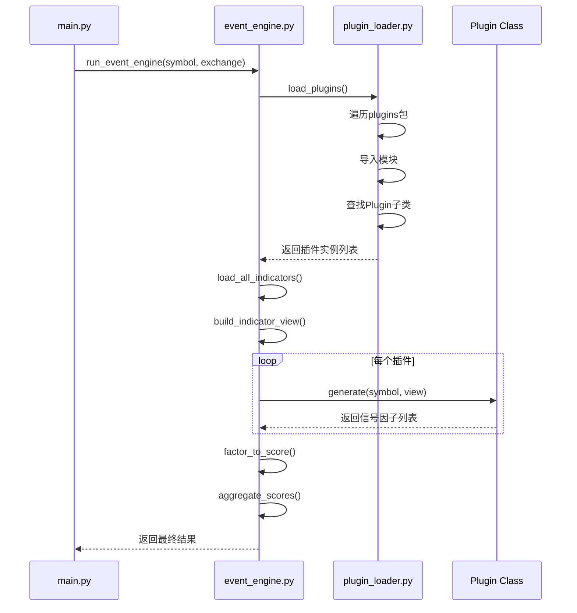

**图示来源**  
- [event_engine.py](file://event_center/indicators_event/engine/event_engine.py#L19-L72)
- [plugin_loader.py](file://event_center/indicators_event/engine/plugin_loader.py#L7-L28)

**本节来源**  
- [event_engine.py](file://event_center/indicators_event/engine/event_engine.py#L1-L73)
- [plugin_loader.py](file://event_center/indicators_event/engine/plugin_loader.py#L1-L29)

### 单信号插件

单信号插件（single_signal.py）处理单一技术指标信号，如RSI、MACD、布林带等。每个指标有独立的触发条件和强度评估。

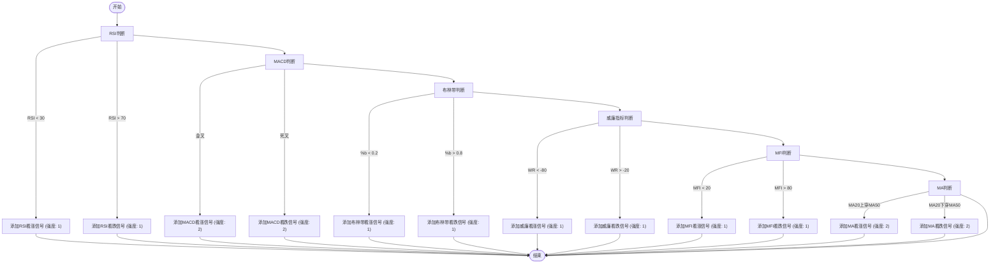

**图示来源**  
- [single_signal.py](file://event_center/indicators_event/plugins/single_signal.py#L12-L85)

**本节来源**  
- [single_signal.py](file://event_center/indicators_event/plugins/single_signal.py#L1-L477)

### 组合信号插件

组合信号插件（如ema_macd_combo.py）处理多个指标的组合信号，通过复合条件触发更可靠的交易信号。

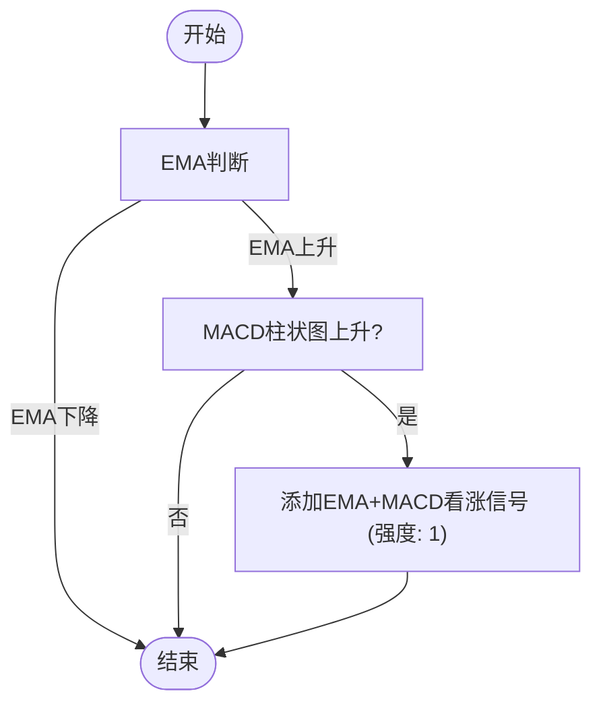

**图示来源**  
- [ema_macd_combo.py](file://event_center/indicators_event/plugins/ema_macd_combo.py#L12-L31)

**本节来源**  
- [ema_macd_combo.py](file://event_center/indicators_event/plugins/ema_macd_combo.py#L1-L72)

## 事件评分与优先级分级

事件评分系统通过`score_mapper.py`实现，将原始信号因子转换为加权得分，并根据综合得分进行优先级分级。

### 评分映射逻辑

评分映射考虑时间框架权重和强度权重，计算最终的加权得分。

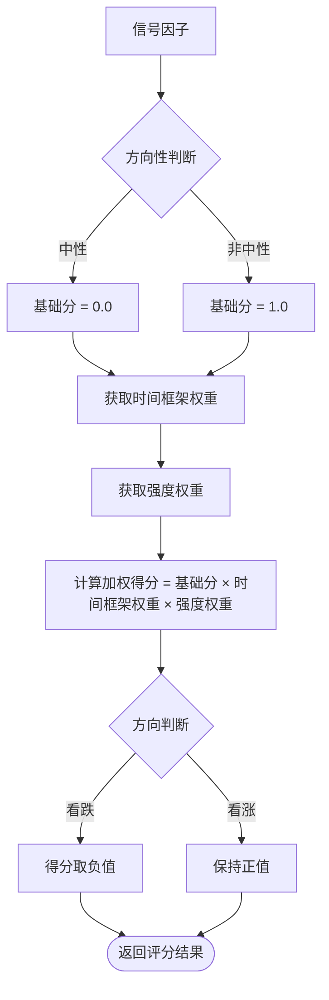

**图示来源**  
- [score_mapper.py](file://event_center/indicators_event/scoring/score_mapper.py#L35-L57)

**本节来源**  
- [score_mapper.py](file://event_center/indicators_event/scoring/score_mapper.py#L1-L58)
- [tf_weights.yaml](file://event_center/indicators_event/config/tf_weights.yaml)
- [strength_weights.yaml](file://event_center/indicators_event/config/strength_weights.yaml)

### 优先级分级规则

`rules.yml`文件定义了事件优先级的分级规则，包括即时规则和聚合规则。

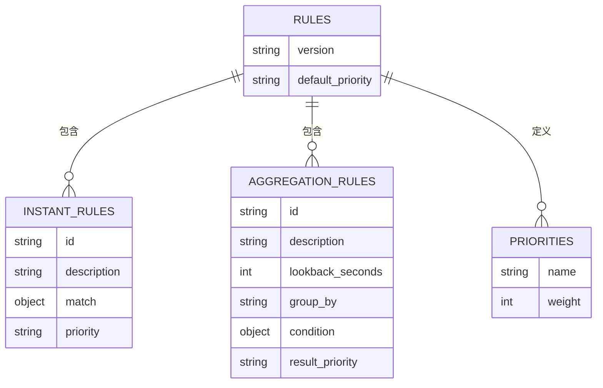

**图示来源**  
- [rules.yml](file://event_center/rules.yml#L1-L88)

**本节来源**  
- [rules.yml](file://event_center/rules.yml#L1-L88)
- [event.py](file://event_center/indicators_event/models/event.py#L1-L9)

## 异步并发模型与容错机制

事件中心采用异步并发模型，通过Redis消费组实现高可用和容错恢复。

### 异步处理流程

主程序`main.py`启动所有组件的异步任务，包括L0、L1、Final处理器以及各种事件消费者。

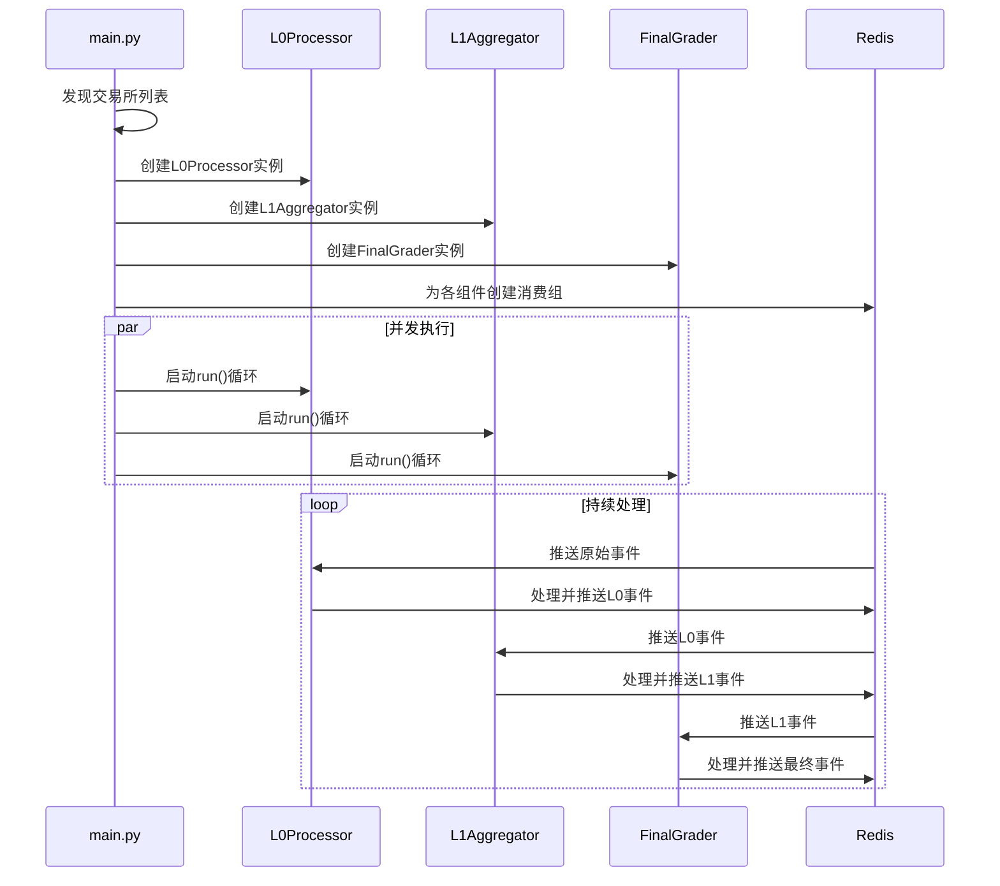

**图示来源**  
- [main.py](file://event_center/main.py#L13-L105)

**本节来源**  
- [main.py](file://event_center/main.py#L1-L106)
- [config.py](file://event_center/config.py#L5-L22)