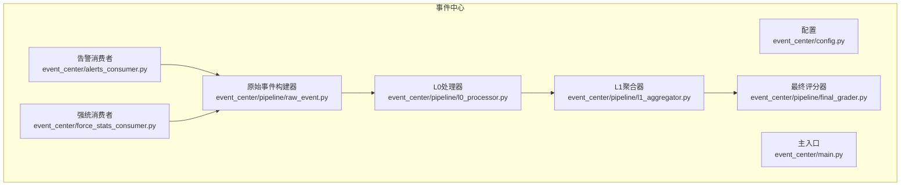
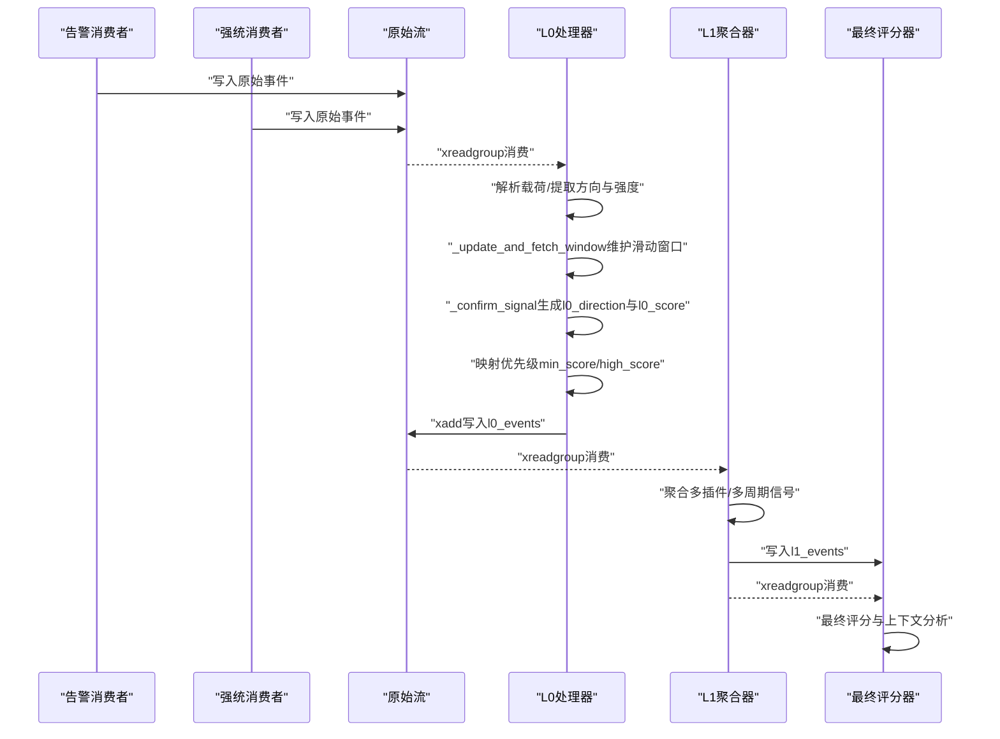
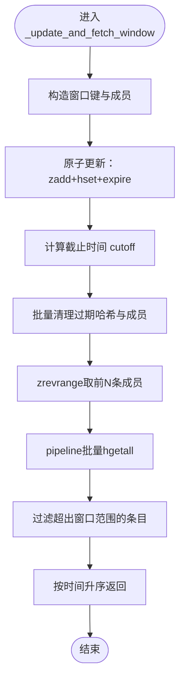
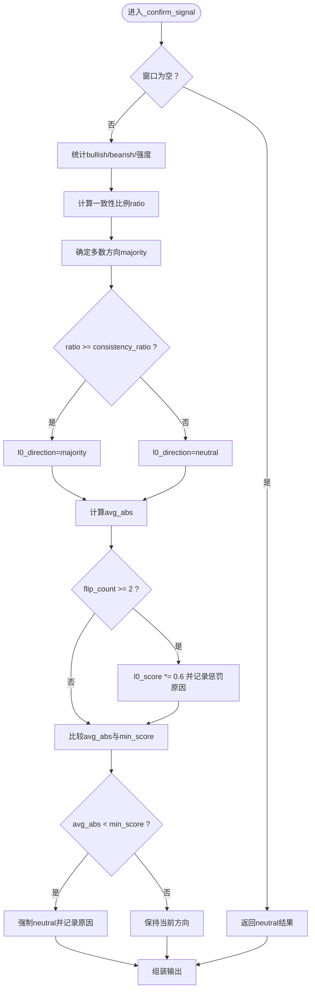
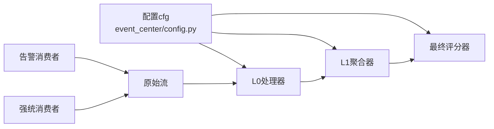

# L0处理器

<cite>
**本文引用的文件**
- [event_center/pipeline/l0_processor.py](file://event_center/pipeline/l0_processor.py)
- [event_center/config.py](file://event_center/config.py)
- [event_center/main.py](file://event_center/main.py)
- [event_center/alerts_consumer.py](file://event_center/alerts_consumer.py)
- [event_center/force_stats_consumer.py](file://event_center/force_stats_consumer.py)
- [event_center/pipeline/l1_aggregator.py](file://event_center/pipeline/l1_aggregator.py)
- [event_center/pipeline/final_grader.py](file://event_center/pipeline/final_grader.py)
- [event_center/pipeline/raw_event.py](file://event_center/pipeline/raw_event.py)
</cite>

## 目录
1. [引言](#引言)
2. [项目结构](#项目结构)
3. [核心组件](#核心组件)
4. [架构总览](#架构总览)
5. [详细组件分析](#详细组件分析)
6. [依赖关系分析](#依赖关系分析)
7. [性能考量](#性能考量)
8. [故障排查指南](#故障排查指南)
9. [结论](#结论)

## 引言
本文件系统性解析UTaker事件处理流水线中的L0处理器（L0Processor）。它负责从原始事件流（raw_event_stream）消费事件，基于时间窗口与强度阈值进行初步过滤与信号确认，输出L0级别的事件到下游流（l0_events）。本文重点阐述以下内容：
- 如何从raw_stream消费原始事件并解析载荷
- 时间窗口（window_seconds）、窗口计数（window_count）、最小强度阈值（min_score）、方向一致性阈值（consistency_ratio）对信号确认的影响机制
- _update_and_fetch_window如何维护滑动窗口状态
- _confirm_signal如何基于方向一致性比率与平均强度生成l0_direction与l0_score
- 与Redis Stream的交互模式（xgroup_create、xreadgroup、xack、xadd）
- 高分信号（high_score）如何提升事件优先级

## 项目结构
L0处理器位于事件中心的流水线模块中，与配置、主入口、上游消费者、下游聚合器共同构成完整的事件处理链路。

图表来源
- [event_center/main.py](file://event_center/main.py#L13-L99)
- [event_center/alerts_consumer.py](file://event_center/alerts_consumer.py#L114-L159)
- [event_center/force_stats_consumer.py](file://event_center/force_stats_consumer.py#L96-L109)
- [event_center/pipeline/l0_processor.py](file://event_center/pipeline/l0_processor.py#L266-L305)
- [event_center/pipeline/l1_aggregator.py](file://event_center/pipeline/l1_aggregator.py#L317-L342)
- [event_center/pipeline/final_grader.py](file://event_center/pipeline/final_grader.py#L96-L122)
- [event_center/pipeline/raw_event.py](file://event_center/pipeline/raw_event.py#L19-L55)

章节来源
- [event_center/main.py](file://event_center/main.py#L13-L99)

## 核心组件
- L0Processor：负责从raw_stream读取事件，更新滑动窗口，确认信号，写入l0_events流，并根据强度与方向设置优先级。
- 配置（cfg）：提供Redis连接串与各事件流名称（raw_stream、l0_stream、l1_stream、final_stream）。
- 上游消费者：AlertsConsumer与ForceStatsConsumer将检测到的市场信号转换为原始事件并写入raw_stream。
- 下游组件：L1Aggregator与FinalGrader分别对L0事件进行聚合与最终评分。

章节来源
- [event_center/pipeline/l0_processor.py](file://event_center/pipeline/l0_processor.py#L9-L18)
- [event_center/config.py](file://event_center/config.py#L1-L23)
- [event_center/alerts_consumer.py](file://event_center/alerts_consumer.py#L114-L159)
- [event_center/force_stats_consumer.py](file://event_center/force_stats_consumer.py#L96-L109)

## 架构总览
L0处理器在事件处理流水线中的位置如下：

图表来源
- [event_center/alerts_consumer.py](file://event_center/alerts_consumer.py#L114-L159)
- [event_center/force_stats_consumer.py](file://event_center/force_stats_consumer.py#L96-L109)
- [event_center/pipeline/l0_processor.py](file://event_center/pipeline/l0_processor.py#L266-L305)
- [event_center/pipeline/l1_aggregator.py](file://event_center/pipeline/l1_aggregator.py#L317-L342)
- [event_center/pipeline/final_grader.py](file://event_center/pipeline/final_grader.py#L96-L122)

## 详细组件分析

### L0Processor类与关键参数
- 关键参数与默认值
  - window_seconds：窗口时长（秒），决定滑动窗口的有效时间范围
  - window_count：窗口内保留的最大条目数，影响确认时取用的样本数量
  - min_score：最小强度阈值，低于此阈值的信号会被视为非方向性或降权
  - high_score：高分阈值，用于提升事件优先级
  - consistency_ratio：方向一致性阈值，要求多数方向一致的比例达到该阈值才认定为有效方向
- 优先级映射逻辑
  - 当l0_direction为neutral时，依据violated_min_ratio、l0_score与min_score、high_score映射为low/medium/high
  - 当l0_direction为bullish/bearish时，依据l0_score与min_score、high_score映射为low/medium/high

章节来源
- [event_center/pipeline/l0_processor.py](file://event_center/pipeline/l0_processor.py#L13-L17)
- [event_center/pipeline/l0_processor.py](file://event_center/pipeline/l0_processor.py#L219-L237)

### 从raw_stream消费原始事件
- 创建消费组与消费者
  - 使用xgroup_create创建消费组（如l0_group），并设置mkstream=True以确保流存在
- 读取与确认
  - 使用xreadgroup以“>”游标批量拉取未消费消息，逐条解析字段（支持data字段或直接字段）
  - 调用process_msg处理事件后，使用xack确认已处理的消息
- 事件载荷解析
  - 支持字符串形式的payload，尝试JSON反序列化
  - 提取summary中的direction与signal_strength，作为原始方向与强度
  - 对特定来源（如force_stats_consumer）根据事件类型或细节字段推导方向

章节来源
- [event_center/pipeline/l0_processor.py](file://event_center/pipeline/l0_processor.py#L266-L305)
- [event_center/pipeline/l0_processor.py](file://event_center/pipeline/l0_processor.py#L153-L218)

### _update_and_fetch_window：滑动窗口状态维护
- 窗口键命名规则：l0:win:{symbol}:{plugin}:{tf}
- 成员与哈希
  - 成员：{ts_ms}:{随机后缀}，保证同一毫秒内的唯一性
  - 哈希字段：ts、dir、score
- 原子更新与过期
  - 使用pipeline原子地zadd成员与hset哈希，并设置哈希项过期时间
- 清理策略
  - 计算截止时间cutoff=ts_ms - window_seconds*1000
  - 批量删除过期哈希项，再zremrangebyscore清理过期成员
- 获取窗口数据
  - 从有序集合zrevrange取最近window_count条记录
  - 使用pipeline批量hgetall获取哈希，解码并过滤掉超出窗口范围的数据
  - 按时间升序返回窗口数据

图表来源
- [event_center/pipeline/l0_processor.py](file://event_center/pipeline/l0_processor.py#L23-L100)

章节来源
- [event_center/pipeline/l0_processor.py](file://event_center/pipeline/l0_processor.py#L23-L100)

### _confirm_signal：信号确认与评分
- 输入：窗口条目列表（包含ts/dir/score）
- 计算步骤
  - 方向统计：统计bullish与bearish数量，计算多数方向majority与一致性比例ratio
  - 平均强度：对所有条目的绝对强度求平均avg_abs
  - 方向判定：若ratio >= consistency_ratio，则采用majority方向，否则neutral
  - 强度调整：若flip_count（相邻方向切换次数）>=2，则降低强度权重
  - 门控：若avg_abs < min_score，则强制neutral
- 输出：l0_direction、l0_score、consistency_ratio、avg_abs_score、flip_count、neutral_reasons、violated_min_ratio、violated_min_score、directional、signal_type

图表来源
- [event_center/pipeline/l0_processor.py](file://event_center/pipeline/l0_processor.py#L102-L151)

章节来源
- [event_center/pipeline/l0_processor.py](file://event_center/pipeline/l0_processor.py#L102-L151)

### 与Redis Stream的交互模式
- 创建消费组
  - 在raw_stream上创建消费组（如l0_group），并设置mkstream=True
- 拉取与确认
  - 使用xreadgroup以“>”游标批量拉取，count控制每次拉取数量，block设置阻塞等待时间
  - 处理完成后使用xack确认消息
- 写入L0流
  - 将处理后的事件以xadd写入l0_events流
- 与其他组件的一致性
  - L1与FinalGrader同样使用xgroup_create与xreadgroup/xack/xadd的标准模式

章节来源
- [event_center/pipeline/l0_processor.py](file://event_center/pipeline/l0_processor.py#L266-L305)
- [event_center/pipeline/l1_aggregator.py](file://event_center/pipeline/l1_aggregator.py#L68-L120)
- [event_center/pipeline/final_grader.py](file://event_center/pipeline/final_grader.py#L96-L122)

### 高分信号（high_score）对优先级的影响
- 优先级映射规则
  - 当l0_direction为neutral时：
    - 若violated_min_ratio成立，优先级设为low
    - 若l0_score >= high_score，优先级设为medium
    - 若violated_min_score成立，优先级设为low
    - 若l0_score >= min_score，优先级设为medium
    - 否则优先级设为low
  - 当l0_direction为bullish/bearish时：
    - 若l0_score >= high_score，优先级设为high
    - 若l0_score >= min_score，优先级设为medium
    - 否则优先级设为low
- 该机制确保高分信号在中性或方向性场景下都能获得更高的可见性与处理优先级

章节来源
- [event_center/pipeline/l0_processor.py](file://event_center/pipeline/l0_processor.py#L219-L237)

### 参数对信号确认的影响机制
- window_seconds
  - 决定滑动窗口的有效时间范围，影响窗口内条目的数量与新鲜度
- window_count
  - 决定确认时取用的样本数量上限，影响统计稳定性
- min_score
  - 作为强度门控阈值，低于该阈值的信号会被视为非方向性或降权
- consistency_ratio
  - 作为方向一致性阈值，要求多数方向一致的比例达到该阈值才认定为有效方向
- high_score
  - 作为优先级提升阈值，使高分信号在下游获得更高优先级

章节来源
- [event_center/pipeline/l0_processor.py](file://event_center/pipeline/l0_processor.py#L13-L17)
- [event_center/pipeline/l0_processor.py](file://event_center/pipeline/l0_processor.py#L102-L151)
- [event_center/pipeline/l0_processor.py](file://event_center/pipeline/l0_processor.py#L219-L237)

### 与上游消费者的协作
- AlertsConsumer与ForceStatsConsumer将检测到的信号转换为原始事件（raw_event），填充summary中的direction与signal_strength，并写入raw_stream
- L0Processor在process_msg中解析这些字段，作为信号确认的基础输入

章节来源
- [event_center/alerts_consumer.py](file://event_center/alerts_consumer.py#L114-L159)
- [event_center/force_stats_consumer.py](file://event_center/force_stats_consumer.py#L96-L109)
- [event_center/pipeline/l0_processor.py](file://event_center/pipeline/l0_processor.py#L153-L218)

## 依赖关系分析
- L0Processor依赖配置cfg提供的流名与Redis连接串
- 主入口main中并行启动L0、L1、FinalGrader与多个消费者，形成流水线
- L1与FinalGrader复用相同的Redis Stream消费模式，体现一致的事件处理范式

图表来源
- [event_center/config.py](file://event_center/config.py#L1-L23)
- [event_center/main.py](file://event_center/main.py#L13-L99)
- [event_center/pipeline/l0_processor.py](file://event_center/pipeline/l0_processor.py#L266-L305)
- [event_center/pipeline/l1_aggregator.py](file://event_center/pipeline/l1_aggregator.py#L317-L342)
- [event_center/pipeline/final_grader.py](file://event_center/pipeline/final_grader.py#L96-L122)

章节来源
- [event_center/main.py](file://event_center/main.py#L13-L99)
- [event_center/config.py](file://event_center/config.py#L1-L23)

## 性能考量
- 管道化（pipeline）优化
  - 原子更新：zadd+hset+expire使用事务管道，减少往返开销
  - 批量清理：批量删除过期哈希与zremrangebyscore，降低网络与CPU开销
  - 批量获取：批量hgetall获取哈希，减少多次RTT
- 时间窗口与清理策略
  - 通过cutoff精确剔除过期条目，避免窗口无限增长
- 有序集合与哈希组合
  - 利用zset维护时间序，利用hash存储元信息，兼顾查询与空间效率
- 优先级映射
  - 通过阈值门控快速分流，减少下游无效处理

[本节为通用性能建议，无需列出具体文件来源]

## 故障排查指南
- Redis连接与权限
  - 确认环境变量REDIS_HOST/REDIS_PORT/REDIS_DB/REDIS_PASSWORD正确，cfg.redis_url可正常连接
- 流与消费组
  - 确认raw_stream与l0_stream存在；首次运行时由xgroup_create自动创建
  - 检查xreadgroup是否能成功拉取消息，xack是否能确认
- 事件载荷
  - 确保上游消费者正确生成raw_event，payload为JSON或可解析字符串
  - 检查summary.direction与signal_strength字段是否存在
- 窗口与确认
  - 若确认结果始终为neutral，检查min_score、consistency_ratio、window_seconds与window_count是否合理
  - 观察flip_count是否过高导致强度惩罚
- 日志与调试
  - L0Processor在处理与确认后会打印事件ID、优先级与确认结果，便于定位问题

章节来源
- [event_center/config.py](file://event_center/config.py#L1-L23)
- [event_center/pipeline/l0_processor.py](file://event_center/pipeline/l0_processor.py#L266-L305)
- [event_center/pipeline/l0_processor.py](file://event_center/pipeline/l0_processor.py#L153-L218)

## 结论
L0处理器在UTaker事件处理流水线中承担“初步过滤与信号确认”的关键角色。它通过滑动窗口与多参数门控，将原始事件转化为具备方向性与强度的L0信号，并以Redis Stream为载体高效传递至下游。其设计强调：
- 基于时间窗口的稳定性与一致性
- 基于强度与方向一致性的双重门控
- 通过高分阈值提升关键信号的优先级
- 与上游消费者、下游聚合器一致的Redis Stream消费模式

这些特性共同保障了事件处理流水线的实时性、可扩展性与可维护性。