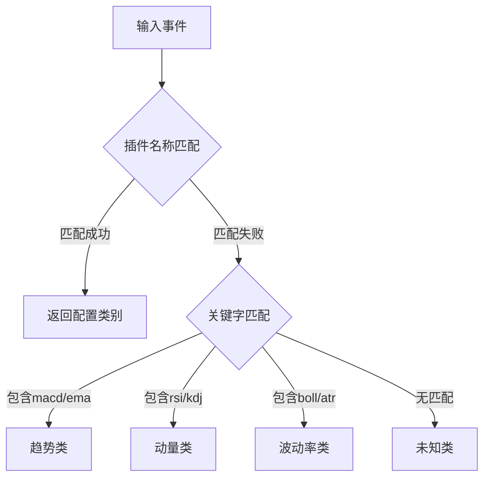
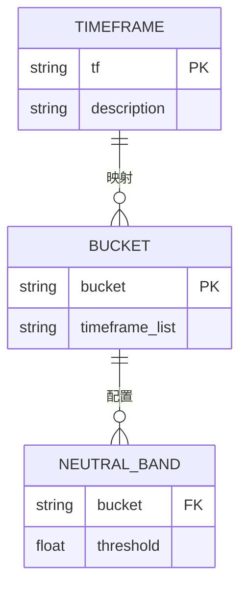
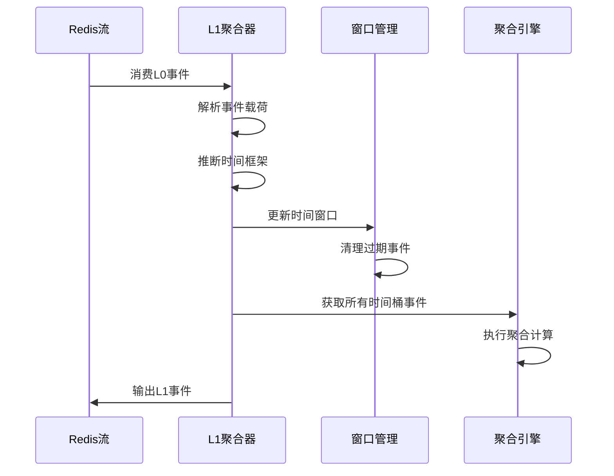
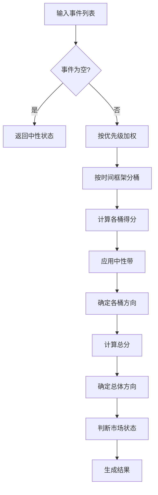

# L1聚合器

<cite>
**本文档中引用的文件**   
- [l1_aggregator.py](file://event_center/pipeline/l1_aggregator.py)
- [indicator_class_map.yaml](file://event_center/indicators_event/config/indicator_class_map.yaml)
- [tf_buckets.yaml](file://event_center/indicators_event/config/tf_buckets.yaml)
- [l0_processor.py](file://event_center/pipeline/l0_processor.py)
- [config.py](file://event_center/config.py)
</cite>

## 目录
1. [引言](#引言)
2. [核心组件分析](#核心组件分析)
3. [事件分类机制](#事件分类机制)
4. [时间框架与中性带配置](#时间框架与中性带配置)
5. [L0事件处理流程](#l0事件处理流程)
6. [聚合结构计算](#聚合结构计算)
7. [溯源分析](#溯源分析)

## 引言
L1聚合器是事件处理流水线中的关键组件，负责将L0阶段输出的原始信号进行跨时间框架的聚合分析。该系统通过消费L0事件流，利用配置化的分类规则和时间框架映射，实现对市场状态的综合判断。本文档深入解析其核心工作机制，包括事件分类、时间框架推断、状态聚合等关键环节。

## 核心组件分析

L1聚合器的核心功能实现在`l1_aggregator.py`文件中，主要包含事件处理、窗口管理、状态聚合等核心方法。系统通过Redis流进行事件消费和生产，实现了高效的异步处理能力。

**Section sources**
- [l1_aggregator.py](file://event_center/pipeline/l1_aggregator.py#L1-L414)

## 事件分类机制

L1聚合器通过`_infer_cls`方法实现事件分类，该方法结合配置文件和关键字匹配两种策略。首先从`indicator_class_map.yaml`配置文件中加载分类映射，然后通过插件名称进行精确匹配，若未找到则通过关键字进行模糊匹配。

分类系统支持多种类别，包括趋势（trend）、动量（momentum）、波动率（volatility）等。配置文件中定义了按指标和按插件的双重分类规则，确保了分类的准确性和灵活性。

**Diagram sources **
- [l1_aggregator.py](file://event_center/pipeline/l1_aggregator.py#L31-L51)
- [indicator_class_map.yaml](file://event_center/indicators_event/config/indicator_class_map.yaml#L1-L22)

**Section sources**
- [l1_aggregator.py](file://event_center/pipeline/l1_aggregator.py#L22-L51)
- [indicator_class_map.yaml](file://event_center/indicators_event/config/indicator_class_map.yaml#L1-L22)

## 时间框架与中性带配置

系统通过`_bucket_of_tf`方法将时间框架映射到短、中、长三个时间桶。该映射关系在`tf_buckets.yaml`配置文件中定义，支持灵活的配置调整。

中性带阈值通过`bucket_band_map`参数配置，为不同时间框架设置不同的敏感度。短期窗口（short）的阈值最低（0.6），中期（mid）为0.8，长期（long）最高（1.2），体现了不同时间框架的稳定性差异。

**Diagram sources **
- [l1_aggregator.py](file://event_center/pipeline/l1_aggregator.py#L53-L61)
- [tf_buckets.yaml](file://event_center/indicators_event/config/tf_buckets.yaml#L1-L12)

**Section sources**
- [l1_aggregator.py](file://event_center/pipeline/l1_aggregator.py#L15-L16)
- [tf_buckets.yaml](file://event_center/indicators_event/config/tf_buckets.yaml#L1-L12)

## L0事件处理流程

`process_l0_event`方法是L1聚合器的核心处理流程，完整实现了从事件消费到结果输出的全过程。该流程首先解析L0事件的有效载荷，提取方向、分数等关键信息，然后进行时间框架推断和窗口更新。

处理流程采用Redis管道技术优化性能，通过原子操作确保数据一致性。系统维护一个时间窗口（默认300秒），只保留最近的事件进行聚合分析，确保了结果的时效性。

**Diagram sources **
- [l1_aggregator.py](file://event_center/pipeline/l1_aggregator.py#L317-L382)

**Section sources**
- [l1_aggregator.py](file://event_center/pipeline/l1_aggregator.py#L317-L382)
- [l0_processor.py](file://event_center/pipeline/l0_processor.py#L153-L264)

## 聚合结构计算

`_aggregate_structure`方法负责核心的聚合计算，通过多维度分析生成最终的市场状态。计算过程考虑了优先级权重、时间框架一致性、中性事件影响等多个因素。

系统通过`short_boost`和`mid_boost`参数对短期和中期信号进行增强，反映了不同时间框架信号的重要性差异。总分计算采用加权求和方式，方向判定基于总分与中性带的比较，市场状态则根据各时间框架的一致性进行判断。

**Diagram sources **
- [l1_aggregator.py](file://event_center/pipeline/l1_aggregator.py#L197-L315)

**Section sources**
- [l1_aggregator.py](file://event_center/pipeline/l1_aggregator.py#L197-L315)

## 溯源分析

系统通过`origin_source_hint`字段提供事件溯源能力，该字段由`_src_hint`方法生成。方法分析事件来源，将不同来源映射到统一的类别，如"indicators"、"orderbook"、"liquidation"等。

溯源信息对于理解信号来源和可靠性评估具有重要价值。当多个来源产生一致信号时，可增强决策信心；当来源冲突时，则提示需要谨慎对待。系统还维护了完整的来源列表，支持更深入的分析。

**Section sources**
- [l1_aggregator.py](file://event_center/pipeline/l1_aggregator.py#L280-L298)
- [final_grader.py](file://event_center/pipeline/final_grader.py#L236-L241)