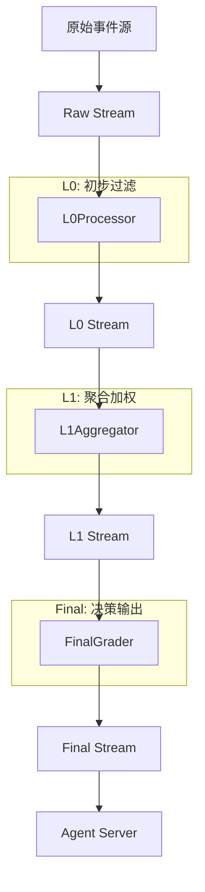
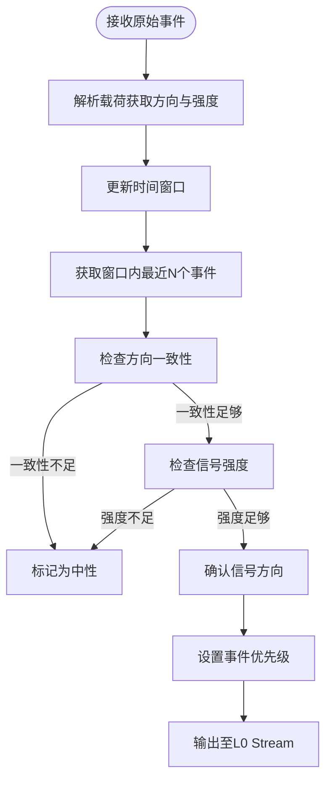
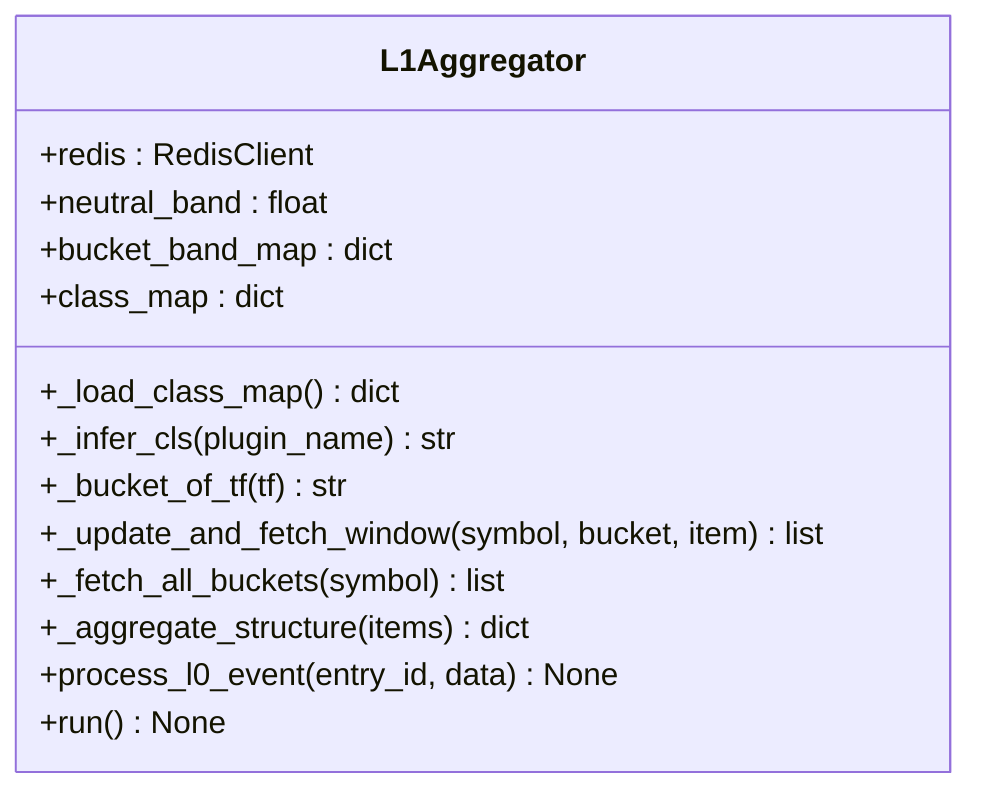
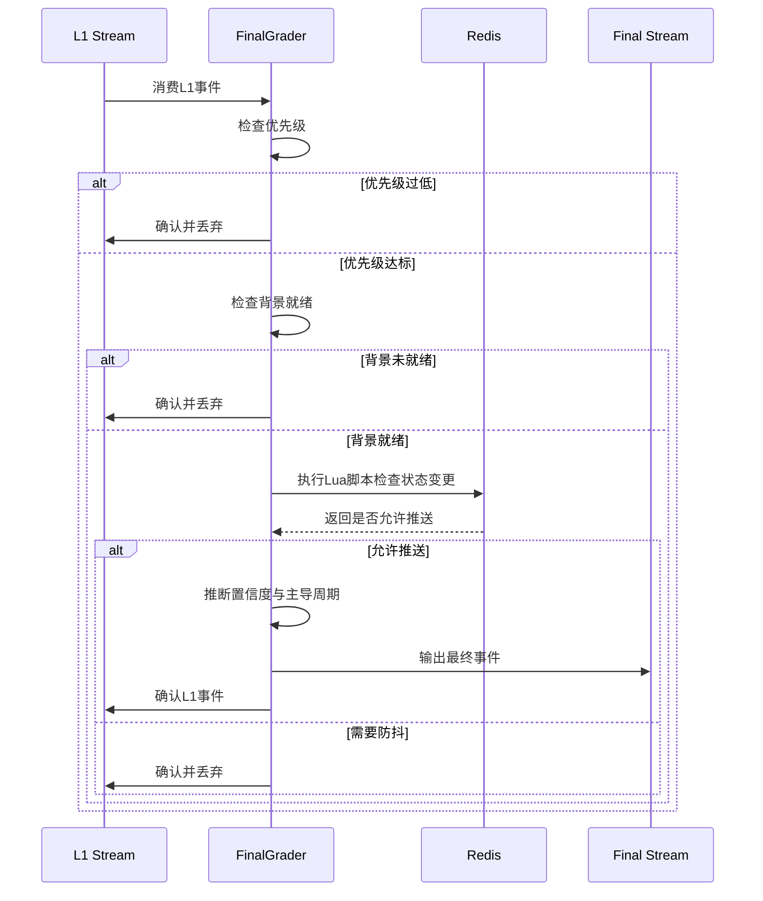

# 事件处理流水线

<cite>
**本文档中引用的文件**  
- [l0_processor.py](file://event_center/pipeline/l0_processor.py)
- [l1_aggregator.py](file://event_center/pipeline/l1_aggregator.py)
- [final_grader.py](file://event_center/pipeline/final_grader.py)
- [rules.yml](file://event_center/rules.yml)
- [indicator_class_map.yaml](file://event_center/indicators_event/config/indicator_class_map.yaml)
- [tf_buckets.yaml](file://event_center/indicators_event/config/tf_buckets.yaml)
- [config.py](file://event_center/config.py)
- [raw_event.py](file://event_center/pipeline/raw_event.py)
</cite>

## 目录
1. [引言](#引言)
2. [三级流水线总体架构](#三级流水线总体架构)
3. [L0Processor：基于时间窗口与一致性算法的初步过滤](#l0processor基于时间窗口与一致性算法的初步过滤)
4. [L1Aggregator：跨周期多源事件聚合与分类加权](#l1aggregator跨周期多源事件聚合与分类加权)
5. [FinalGrader：基于评分规则的最终决策生成](#finalgrader基于评分规则的最终决策生成)
6. [数据结构演变与Redis Stream交互模式](#数据结构演变与redis-stream交互模式)
7. [配置文件解析](#配置文件解析)
8. [结论](#结论)

## 引言
UTaker事件处理系统采用三级流水线架构（L0→L1→Final），对来自多个数据源的原始信号进行逐级过滤、聚合与决策。该系统通过Redis Stream实现异步解耦，确保高吞吐与低延迟。L0阶段基于时间窗口和方向一致性进行初步筛选；L1阶段跨时间框架聚合多源事件并分类加权；Final阶段依据评分规则生成结构化决策事件，供agent_server消费。本文将深入解析各阶段工作机制与数据流转。

## 三级流水线总体架构

**图示来源**  
- [l0_processor.py](file://event_center/pipeline/l0_processor.py#L266-L304)
- [l1_aggregator.py](file://event_center/pipeline/l1_aggregator.py#L383-L414)
- [final_grader.py](file://event_center/pipeline/final_grader.py#L96-L304)

## L0Processor：基于时间窗口与一致性算法的初步过滤

L0Processor是事件处理的第一道关卡，负责对原始信号进行初步过滤与方向确认。其核心机制包括时间窗口管理、方向一致性判断与信号强度评估。

### 时间窗口与信号确认机制
L0Processor通过`_update_and_fetch_window`方法维护一个滑动时间窗口（默认300秒），使用Redis的ZSET结构存储事件时间戳，并通过HSET存储事件详情。窗口内事件按时间倒序排列，仅保留最近`window_count`（默认5个）事件。

方向确认由`_confirm_signal`方法实现，主要逻辑如下：
- 统计窗口内“看涨”与“看跌”事件数量，计算多数方向（majority）
- 计算方向一致性比率（consistency_ratio），若低于`consistency_ratio`阈值（默认0.6）则判定为“中性”
- 计算平均信号强度（avg_abs_score），若低于`min_score`（默认2.0）则判定为“中性”
- 若方向频繁翻转（flip_count ≥ 2），则对信号强度施加0.6倍惩罚

### 参数调控作用
- `window_seconds`: 定义滑动窗口的时间跨度，影响信号的时效性与稳定性
- `min_score`: 信号强度最低阈值，低于此值的信号将被过滤
- `consistency_ratio`: 方向一致性最低要求，确保信号方向的可靠性
- `high_score`: 高优先级信号强度阈值，用于提升事件优先级

**图示来源**  
- [l0_processor.py](file://event_center/pipeline/l0_processor.py#L23-L151)

**本节来源**  
- [l0_processor.py](file://event_center/pipeline/l0_processor.py#L1-L305)

## L1Aggregator：跨周期多源事件聚合与分类加权

L1Aggregator负责跨时间框架聚合来自L0的事件，利用分类映射与周期融合策略生成市场结构判断。

### 多源事件聚合机制
L1Aggregator将时间周期划分为三个桶（bucket）：
- **short**: 1m, 5m
- **mid**: 15m, 30m, 1h
- **long**: 2h, 4h, 1d

每个桶独立维护一个时间窗口（默认300秒），通过`_update_and_fetch_window`方法更新与读取事件。`_fetch_all_buckets`方法从所有桶中获取有效事件，用于全局聚合。

### 分类加权与周期融合
- **分类映射**: 通过`indicator_class_map.yaml`文件定义插件与指标类别的映射关系（如ema_macd_combo → trend），若未匹配则通过关键词推断（如"macd" → trend）
- **周期融合**: 使用`bucket_band_map`（默认short:0.6, mid:0.8, long:1.2）作为各周期的中性带阈值。各桶内事件按优先级加权（low:1.0, medium:1.2, high:1.5, critical:2.0）后求和，得到带符号的分数
- **市场状态判定**: 
  - 若总分绝对值小于`neutral_band`（默认2.0），状态为"range"
  - 否则，若短周期与中周期方向一致，状态为"trend"；若仅短周期有方向，状态为"momentum"

**图示来源**  
- [l1_aggregator.py](file://event_center/pipeline/l1_aggregator.py#L11-L415)
- [indicator_class_map.yaml](file://event_center/indicators_event/config/indicator_class_map.yaml#L1-L22)
- [tf_buckets.yaml](file://event_center/indicators_event/config/tf_buckets.yaml#L1-L12)

**本节来源**  
- [l1_aggregator.py](file://event_center/pipeline/l1_aggregator.py#L1-L415)

## FinalGrader：基于评分规则的最终决策生成

FinalGrader是流水线的最终阶段，负责生成供agent_server消费的结构化决策事件。

### 评分规则与优先级配置
FinalGrader依据`rules.yml`中的规则进行最终决策：
- **优先级门控**: 仅处理优先级不低于`FINAL_MIN_PRIORITY`（默认low）的事件
- **背景就绪检查**: 可配置是否要求`market_structure`与`market_state`背景数据存在
- **防抖机制**: 使用Lua脚本实现状态变更与时间窗口防抖。若中周期有方向，防抖窗口为900秒；否则为300秒
- **置信度推断**: 基于`total_score`与`market_state`推断置信度（high/medium/low）

### 最终决策事件结构
输出事件包含三个核心字段：
- **structure**: 核心决策数据，包括market_state、direction、confidence等
- **analysis_context**: 分析上下文，包含主导周期、支持周期、时间框架提示等
- **meta**: 元信息，包含评分器版本、源事件ID等

**图示来源**  
- [final_grader.py](file://event_center/pipeline/final_grader.py#L96-L304)
- [rules.yml](file://event_center/rules.yml#L1-L88)

**本节来源**  
- [final_grader.py](file://event_center/pipeline/final_grader.py#L1-L305)

## 数据结构演变与Redis Stream交互模式

事件在流水线中经历三次结构演变，通过Redis Stream进行异步传递。

### 数据结构演变
| 阶段 | 核心字段 | 说明 |
|------|--------|------|
| Raw | event_id, timestamp, source, payload.raw | 原始信号，包含方向与强度 |
| L0 | l0_direction, l0_score, consistency_ratio | 经时间窗口过滤后的方向与强度 |
| L1 | direction, total_score, market_state, bucket_scores | 跨周期聚合后的市场结构判断 |
| Final | structure, analysis_context, meta | 结构化决策，供agent消费 |

### Redis Stream交互
- **流命名**: 由`config.py`定义，分别为`raw_stream`, `l0_stream`, `l1_stream`, `final_stream`
- **消费组模式**: 各处理器使用独立消费组（l0_group, l1_group, final_group）确保消息可靠处理
- **消息确认**: 处理成功后调用`XACK`确认消息，防止重复处理

**本节来源**  
- [config.py](file://event_center/config.py#L1-L23)
- [raw_event.py](file://event_center/pipeline/raw_event.py#L1-L55)

## 配置文件解析

### indicator_class_map.yaml
定义指标插件与类别的映射关系，支持精确匹配（by_plugin）与关键词匹配（如"macd" → trend）。

### tf_buckets.yaml
定义时间周期与分析周期（short/mid/long）的映射关系，用于多周期融合。

### rules.yml
定义事件优先级权重与聚合规则，如`a1_cumulative_losses`规则在30分钟内累计3次浮亏≥5%时触发高优先级事件。

**本节来源**  
- [indicator_class_map.yaml](file://event_center/indicators_event/config/indicator_class_map.yaml#L1-L22)
- [tf_buckets.yaml](file://event_center/indicators_event/config/tf_buckets.yaml#L1-L12)
- [rules.yml](file://event_center/rules.yml#L1-L88)

## 结论
UTaker三级事件处理流水线通过L0→L1→Final的逐级处理，实现了从原始信号到结构化决策的转化。L0阶段确保信号的可靠性，L1阶段实现多周期多源信息融合，Final阶段通过规则引擎与防抖机制生成最终决策。整个系统基于Redis Stream构建，具备高并发、低延迟与高可靠性特点，为上层智能体提供了稳定、高质量的市场状态输入。