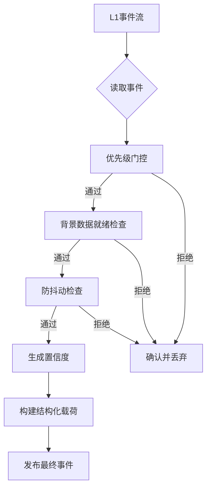
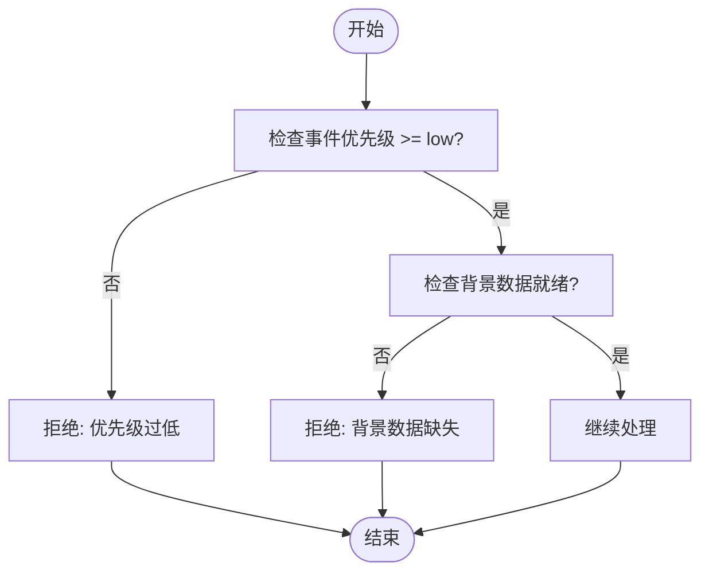
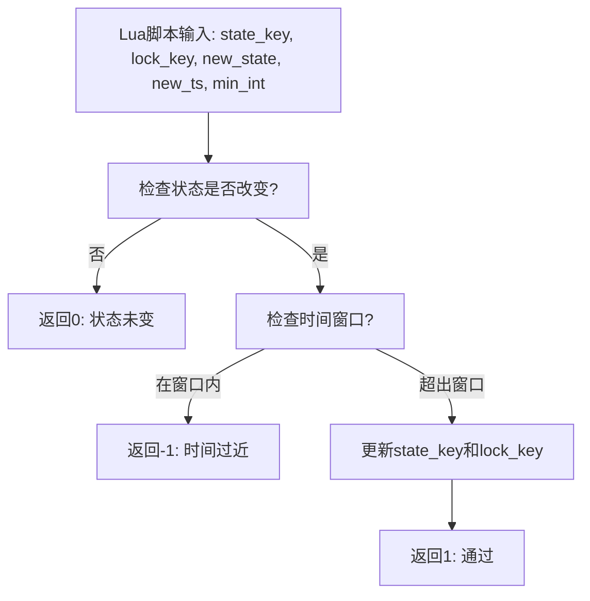
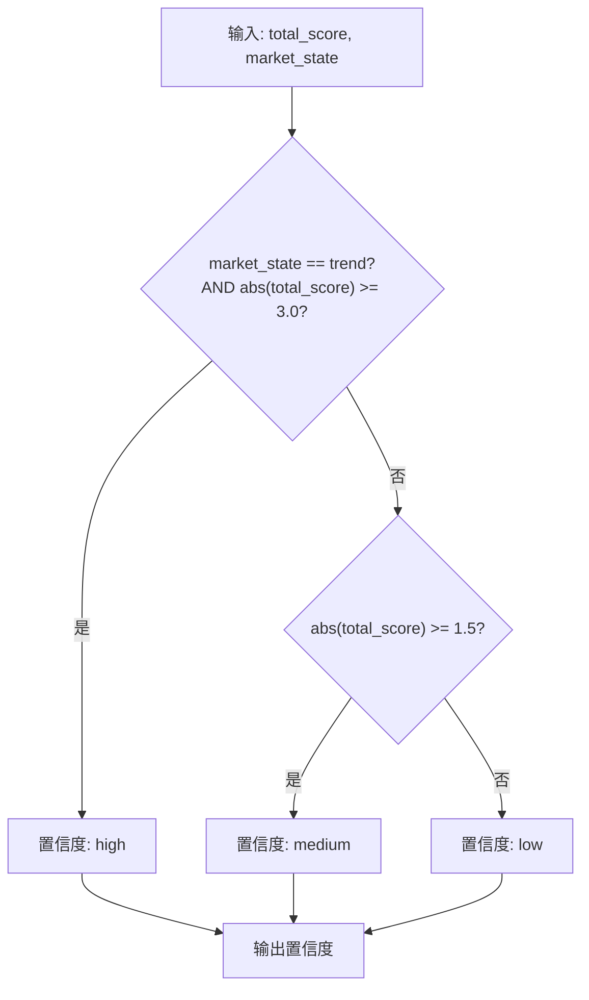
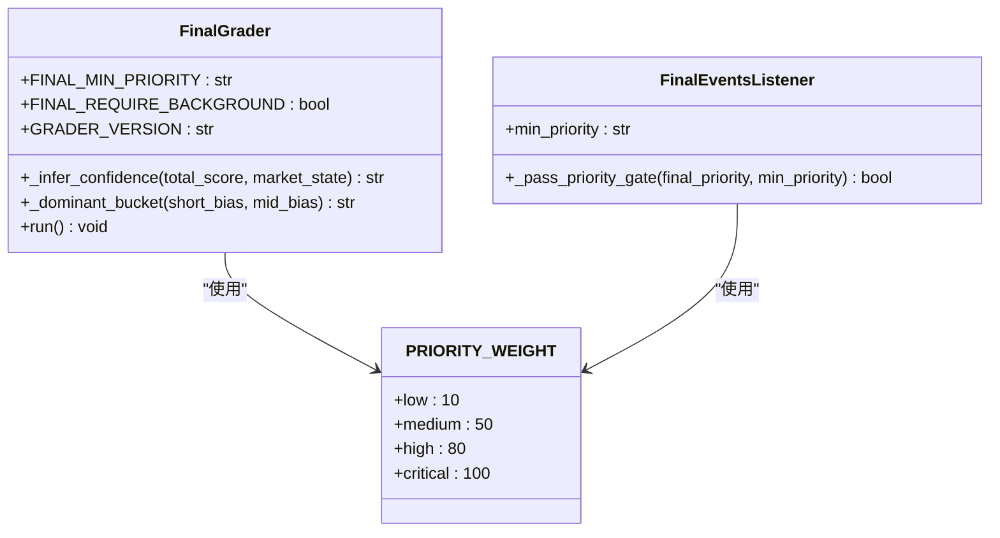

# 最终评分器

<cite>
**本文档引用的文件**
- [final_grader.py](file://event_center/pipeline/final_grader.py)
- [config.py](file://event_center/config.py)
- [l1_aggregator.py](file://event_center/pipeline/l1_aggregator.py)
- [market_state.py](file://agent_server/agents/experts/background/market_state.py)
- [market_state_view.py](file://api/application/apps/background/market_state_view.py)
- [final_events.py](file://agent_server/utils/watchers/final_events.py)
</cite>

## 目录
1. [简介](#简介)
2. [核心组件](#核心组件)
3. [最终决策事件生成流程](#最终决策事件生成流程)
4. [优先级门控与背景检查](#优先级门控与背景检查)
5. [防抖动机制](#防抖动机制)
6. [置信度与主导时间框架](#置信度与主导时间框架)
7. [核心载荷结构](#核心载荷结构)
8. [优先级权重映射](#优先级权重映射)

## 简介
本文档全面解析FinalGrader如何生成最终决策事件的完整流程。系统通过多阶段处理，从L1聚合事件中筛选出高质量的市场结构信号，并通过严格的门控、防抖和上下文包装机制，为下游智能体提供可靠、结构化的决策依据。

## 核心组件

FinalGrader是事件处理流水线的最终阶段，负责将L1聚合事件转化为可用于交易决策的最终事件。其核心功能包括优先级门控、状态与时间防抖、以及为下游智能体构建结构化上下文。

**Section sources**
- [final_grader.py](file://event_center/pipeline/final_grader.py#L9-L305)

## 最终决策事件生成流程

FinalGrader通过消费L1事件流，执行一系列过滤和增强操作，最终将合格的事件发布到final_events流。该流程确保了事件的质量和时效性。

**Diagram sources**
- [final_grader.py](file://event_center/pipeline/final_grader.py#L96-L299)

## 优先级门控与背景检查

### 优先级门控机制
系统通过`FINAL_MIN_PRIORITY`常量设置最低优先级阈值。所有低于此优先级的事件将被直接过滤。优先级权重由`PRIORITY_WEIGHT`字典定义，实现了从文本优先级到数值权重的映射。

### 市场背景数据就绪检查
当`FINAL_REQUIRE_BACKGROUND`为真时，系统会检查市场结构和市场状态两个关键背景数据是否已就绪。只有当`background:{exchange}:{symbol}:market_structure`和`background:{exchange}:{symbol}:market_state`两个Redis键都存在时，事件才会被处理。

**Diagram sources**
- [final_grader.py](file://event_center/pipeline/final_grader.py#L153-L168)

**Section sources**
- [final_grader.py](file://event_center/pipeline/final_grader.py#L18-L26)
- [final_grader.py](file://event_center/pipeline/final_grader.py#L105-L106)
- [market_state.py](file://agent_server/agents/experts/background/market_state.py#L179-L183)
- [market_state_view.py](file://api/application/apps/background/market_state_view.py#L31-L33)

## 防抖动机制

### Redis Lua脚本防抖
系统使用Redis Lua脚本实现原子性的防抖检查，确保在高并发环境下状态的一致性。脚本同时检查状态变更和时间窗口两个条件。

### state_key与lock_key
- `state_key`: `final:last_state:{account}:{symbol}`，用于记录上一次的市场状态和方向组合，防止重复状态的事件通过。
- `lock_key`: `final:lock:{account}:{symbol}:{market_state}:{direction}`，用于实现时间窗口锁定，防止过于频繁的相同事件。

### 动态调整min_interval_sec
防抖时间间隔根据中期偏置动态调整：
- 当存在中期偏置（mid_bias为真）时，`min_interval_sec`为900秒（15分钟）
- 当不存在中期偏置时，`min_interval_sec`为300秒（5分钟）

**Diagram sources**
- [final_grader.py](file://event_center/pipeline/final_grader.py#L40-L63)
- [final_grader.py](file://event_center/pipeline/final_grader.py#L170-L174)

**Section sources**
- [final_grader.py](file://event_center/pipeline/final_grader.py#L38-L63)
- [final_grader.py](file://event_center/pipeline/final_grader.py#L170-L174)

## 置信度与主导时间框架

### _infer_confidence置信度生成
置信度根据`total_score`和`market_state`共同决定：
- 当`market_state`为"trend"且`abs(total_score) >= 3.0`时，置信度为"high"
- 当`abs(total_score) >= 1.5`时，置信度为"medium"
- 其他情况置信度为"low"

### 主导时间框架判定
- `dominant_bucket`: 根据短期和中期偏置判断主导时间框架
  - 短期和中期均有偏置：返回"mixed"
  - 仅有中期偏置：返回"mid"
  - 仅有短期偏置：返回"short"
  - 无偏置：返回"unknown"
- `supporting`: 记录所有支持的时间框架
- `tf_hint`: 根据偏置提供时间框架提示，优先返回中期，其次短期

**Diagram sources**
- [final_grader.py](file://event_center/pipeline/final_grader.py#L72-L77)
- [final_grader.py](file://event_center/pipeline/final_grader.py#L87-L94)

**Section sources**
- [final_grader.py](file://event_center/pipeline/final_grader.py#L72-L94)
- [final_grader.py](file://event_center/pipeline/final_grader.py#L188-L193)
- [final_grader.py](file://event_center/pipeline/final_grader.py#L195-L202)

## 核心载荷结构

最终事件包含三个核心JSON载荷，为下游智能体提供不同层次的信息。

### structure载荷
核心决策信息，智能体主要读取此部分：
- `market_state`: 市场状态（如trend, range）
- `direction`: 方向（bullish/bearish）
- `signature`: 状态与方向的组合签名
- `confidence`: 置信度等级
- `confidence_numeric`: 数值化置信度
- `priority_weight`: 优先级权重

### analysis_context载荷
结构化分析上下文：
- `dominant_bucket`: 主导时间框架
- `supporting_buckets`: 支持的时间框架列表
- `tf_hint`: 时间框架提示
- `l1_total_score`: L1总分
- `bias`: 短期和中期偏置
- `reason_tags`: 触发原因标签
- `lock_window_sec`: 防抖窗口秒数
- `provenance`: 来源信息
- `_debug`: 调试信息

### meta载荷
元数据信息：
- `grader_version`: 评分器版本
- `source_event_id`: 源事件ID
- `ts_unit`: 时间戳单位
- `min_interval_sec`: 最小间隔秒数
- `origin_source_hint`: 原始来源提示

**Section sources**
- [final_grader.py](file://event_center/pipeline/final_grader.py#L253-L290)

## 优先级权重映射

`PRIORITY_WEIGHT`字典定义了文本优先级到数值权重的映射关系，用于量化比较不同事件的优先级：
- "low": 10
- "medium": 50
- "high": 80
- "critical": 100

此映射在多个组件中被复用，确保了系统内优先级判断的一致性。

**Diagram sources**
- [final_grader.py](file://event_center/pipeline/final_grader.py#L21-L26)
- [final_events.py](file://agent_server/utils/watchers/final_events.py#L8-L12)

**Section sources**
- [final_grader.py](file://event_center/pipeline/final_grader.py#L21-L26)
- [final_events.py](file://agent_server/utils/watchers/final_events.py#L8-L12)