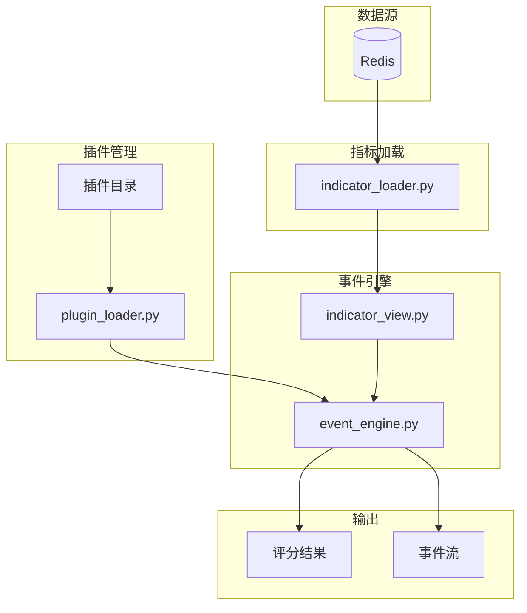
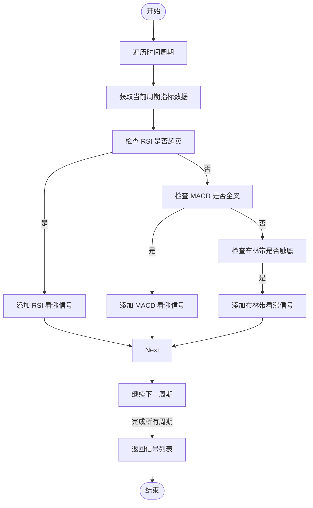
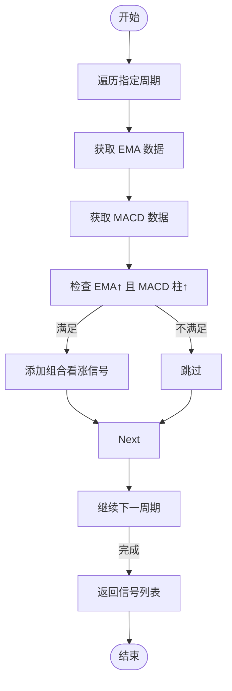
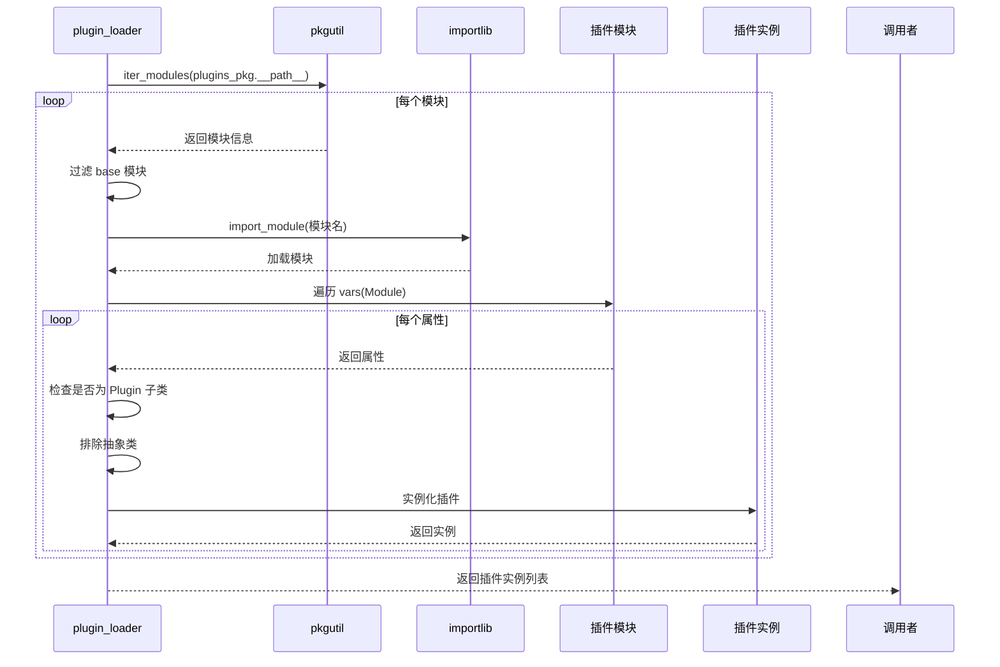
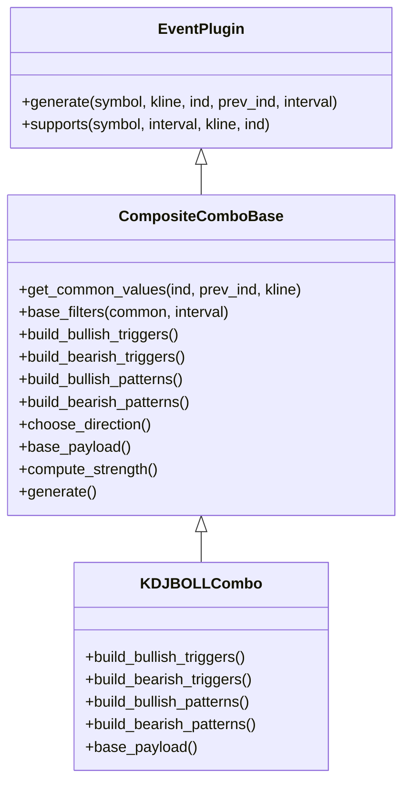
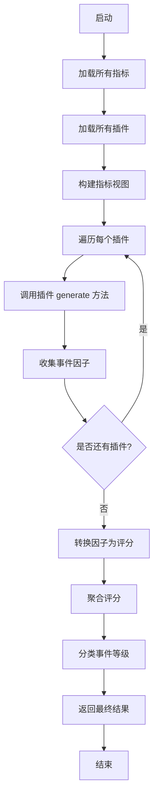

# 事件插件开发

<cite>
**本文档引用文件**  
- [base.py](file://event_center/indicators_event/plugins/base.py)
- [single_signal.py](file://event_center/indicators_event/plugins/single_signal.py)
- [ema_macd_combo.py](file://event_center/indicators_event/plugins/ema_macd_combo.py)
- [plugin_loader.py](file://event_center/indicators_event/engine/plugin_loader.py)
- [event_engine.py](file://event_center/indicators_event/engine/event_engine.py)
- [indicator_loader.py](file://event_center/indicators_event/engine/indicator_loader.py)
- [indicator_view.py](file://event_center/indicators_event/engine/indicator_view.py)
- [base.py](file://event_center/indicators_event_plugins/base.py)
- [boll_kdj_combo.py](file://event_center/indicators_event_plugins/boll_kdj_combo.py)
- [macd_rsi_combo.py](file://event_center/indicators_event_plugins/macd_rsi_combo.py)
- [meta_combo.py](file://event_center/indicators_event_plugins/meta_combo.py)
- [combo_params.yml](file://event_center/indicators_event_plugins/config/combo_params.yml)
- [meta_weights.yml](file://event_center/indicators_event_plugins/config/meta_weights.yml)
</cite>

## 目录
1. [插件系统概述](#插件系统概述)
2. [核心抽象基类 Plugin 接口规范](#核心抽象基类-plugin-接口规范)
3. [插件开发模式示例](#插件开发模式示例)
4. [动态加载机制解析](#动态加载机制解析)
5. [外部插件目录使用方式](#外部插件目录使用方式)
6. [完整开发流程实践指南](#完整开发流程实践指南)
7. [事件处理引擎工作流程](#事件处理引擎工作流程)

## 插件系统概述

UTaker 插件系统提供了一套灵活的事件检测机制，允许开发者通过编写自定义插件来扩展交易信号的识别能力。该系统基于 Python 的抽象基类（ABC）设计，通过 `Plugin` 抽象基类定义统一接口，并支持热插拔式的功能扩展。插件可基于单一技术指标或组合多个指标进行复杂策略判断，适用于不同时间周期和交易品种。

系统通过 `plugin_loader.py` 实现动态加载，利用 `pkgutil` 扫描模块并实例化插件类。插件运行时接收裁剪后的指标视图（indicator_view），输出中间态的事件因子（Factor），最终由事件引擎聚合评分并生成决策信号。整个流程实现了高内聚、低耦合的设计目标。

**插件系统架构图**


**图表来源**  
- [indicator_loader.py](file://event_center/indicators_event/engine/indicator_loader.py)
- [plugin_loader.py](file://event_center/indicators_event/engine/plugin_loader.py)
- [event_engine.py](file://event_center/indicators_event/engine/event_engine.py)

## 核心抽象基类 Plugin 接口规范

`Plugin` 抽象基类定义了所有事件插件必须遵循的接口规范，位于 `event_center/indicators_event/plugins/base.py`。该类继承自 `ABC`，强制子类实现 `generate` 方法，并声明了若干关键类属性用于配置插件行为。

### 必须声明的依赖属性

| 属性名 | 类型 | 说明 |
|-------|------|------|
| `name` | str | 插件唯一标识名称 |
| `tf_scope` | List[str] | 支持的时间周期列表（如 "1m", "5m"） |
| `indicators` | List[str] | 所需的技术指标列表（如 "rsi", "macd"） |
| `requires_prev` | bool | 是否需要前一时刻的指标数据 |

这些属性在插件类中必须显式定义，用于指导指标视图的构建和执行上下文的准备。

### generate 方法实现要求

`generate(indicator_view: dict) -> list` 是插件的核心逻辑入口，接收一个裁剪后的指标视图字典，返回一个包含事件因子的列表。每个事件因子为字典结构，通常包含以下字段：
- `plugin`: 插件名称
- `symbol`: 交易对符号
- `tf`: 时间周期
- `direction`: 信号方向（"bullish" 或 "bearish"）
- `strength`: 信号强度
- `src`: 信号来源指标
- `ts`: 时间戳

插件需遍历 `tf_scope` 中的每个时间周期，从 `indicator_view` 提取对应指标数据，根据预设规则判断是否触发事件，并将结果添加到返回列表中。

**代码结构来源**  
- [base.py](file://event_center/indicators_event/plugins/base.py#L1-L18)

## 插件开发模式示例

### 单一信号插件开发（single_signal.py）

`single_signal.py` 实现了一个基于单一指标的事件检测插件 `SingleSignal`，用于检测 RSI、MACD、布林带等常见技术指标的极端状态。

该插件覆盖了多个时间周期（1m, 5m, 15m, 1h），并监控多种指标。例如：
- 当 RSI 值低于 30 时，生成看涨信号
- 当 MACD 出现金叉（DIF 上穿 DEA）时，生成看涨信号
- 当布林带百分比（percent_b）低于 0.2 时，生成看涨信号

此类插件适用于快速响应单一指标变化的场景，逻辑清晰且易于维护。



**图表来源**  
- [single_signal.py](file://event_center/indicators_event/plugins/single_signal.py#L5-L85)

**本节来源**  
- [single_signal.py](file://event_center/indicators_event/plugins/single_signal.py)

### 组合策略插件开发（ema_macd_combo.py）

`ema_macd_combo.py` 实现了一个组合策略插件 `EMAMACDCombo`，通过同时分析 EMA 和 MACD 指标来提高信号的可靠性。

该插件要求 EMA 值上升且 MACD 柱状图（hist）也呈上升趋势，才生成看涨信号。这种双重确认机制有效减少了假信号的产生，适用于趋势跟踪策略。

与单一信号插件相比，组合策略插件能够捕捉更复杂的市场动态，提升交易系统的稳健性。



**图表来源**  
- [ema_macd_combo.py](file://event_center/indicators_event/plugins/ema_macd_combo.py#L12-L32)

**本节来源**  
- [ema_macd_combo.py](file://event_center/indicators_event/plugins/ema_macd_combo.py)

## 动态加载机制解析

插件系统的动态加载功能由 `plugin_loader.py` 实现，核心函数为 `load_plugins()`。

### 加载流程

1. 使用 `pkgutil.iter_modules` 遍历 `event_center.indicators_event.plugins` 包下的所有模块
2. 跳过名为 `base` 的基础模块
3. 使用 `importlib.import_module` 动态导入每个插件模块
4. 遍历模块中的所有属性，筛选出继承自 `Plugin` 的具体类（非抽象类）
5. 实例化符合条件的插件类并加入返回列表

此机制允许在不重启服务的情况下新增或移除插件，只需将 `.py` 文件放入插件目录即可自动加载。



**图表来源**  
- [plugin_loader.py](file://event_center/indicators_event/engine/plugin_loader.py#L7-L23)

**本节来源**  
- [plugin_loader.py](file://event_center/indicators_event/engine/plugin_loader.py)

## 外部插件目录使用方式

系统支持将插件放置在外部目录 `indicators_event_plugins` 中，实现热插拔式功能扩展。

### 插件注册机制

外部插件通过装饰器 `@register_plugin` 自动注册到全局插件列表中。`__init__.py` 文件中的 `get_plugins()` 函数负责扫描并导入所有插件模块。

### 配置文件支持

外部插件目录包含 `config` 子目录，支持 YAML 格式的配置文件：
- `combo_params.yml`: 定义各插件的参数阈值（如最小强度、波动率要求等）
- `meta_weights.yml`: 定义触发条件和模式的权重分配

这些配置文件允许在不修改代码的情况下调整插件行为，提高了系统的灵活性和可维护性。

### 示例插件结构

以 `boll_kdj_combo.py` 为例，该插件结合布林带和 KDJ 指标，检测带宽收窄后的突破信号。它继承自 `CompositeComboBase`，复用通用数据提取和过滤逻辑，专注于实现具体的交易策略。



**图表来源**  
- [base.py](file://event_center/indicators_event_plugins/base.py)
- [boll_kdj_combo.py](file://event_center/indicators_event_plugins/boll_kdj_combo.py)

**本节来源**  
- [base.py](file://event_center/indicators_event_plugins/base.py)
- [boll_kdj_combo.py](file://event_center/indicators_event_plugins/boll_kdj_combo.py)
- [combo_params.yml](file://event_center/indicators_event_plugins/config/combo_params.yml)

## 完整开发流程实践指南

### 1. 编写插件类

创建新的 `.py` 文件，继承 `Plugin` 类或 `CompositeComboBase`，定义必要的类属性和 `generate` 方法。

```python
from event_center.indicators_event.plugins.base import Plugin

class MyCustomPlugin(Plugin):
    name = "my_custom"
    tf_scope = ["1m", "5m"]
    indicators = ["rsi", "macd"]
    requires_prev = True

    def generate(self, symbol: str, indicator_view: dict):
        # 实现具体逻辑
        pass
```

### 2. 定义规则配置

在 `indicators_event_plugins/config/` 目录下添加或修改 YAML 配置文件，设置插件参数。

### 3. 集成测试

使用 `event_engine.py` 中的 `run_event_engine` 函数进行端到端测试，验证插件能否正确生成信号。

### 4. 部署上线

将插件文件放入 `indicators_event_plugins` 目录，系统将在下次加载时自动识别并启用。

**本节来源**  
- [event_engine.py](file://event_center/indicators_event/engine/event_engine.py)
- [base.py](file://event_center/indicators_event/plugins/base.py)

## 事件处理引擎工作流程

事件处理引擎是整个系统的核心，协调指标加载、插件执行和评分聚合。



**图表来源**  
- [event_engine.py](file://event_center/indicators_event/engine/event_engine.py#L19-L70)
- [indicator_loader.py](file://event_center/indicators_event/engine/indicator_loader.py#L16-L48)
- [indicator_view.py](file://event_center/indicators_event/engine/indicator_view.py#L1-L45)

**本节来源**  
- [event_engine.py](file://event_center/indicators_event/engine/event_engine.py)
- [indicator_loader.py](file://event_center/indicators_event/engine/indicator_loader.py)
- [indicator_view.py](file://event_center/indicators_event/engine/indicator_view.py)