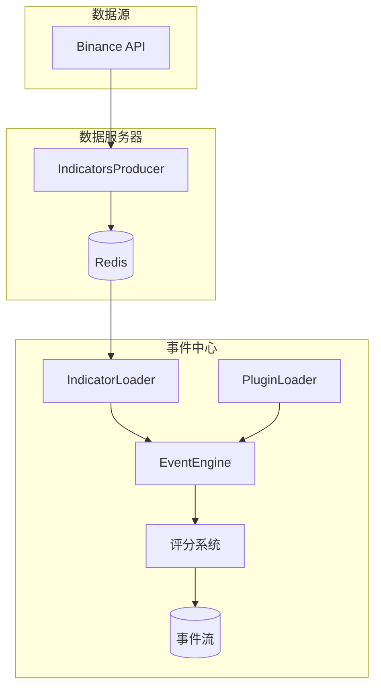
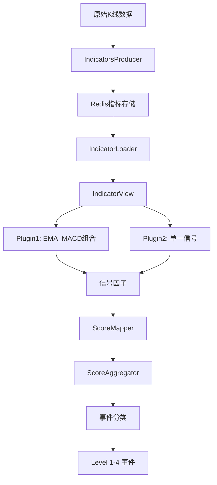
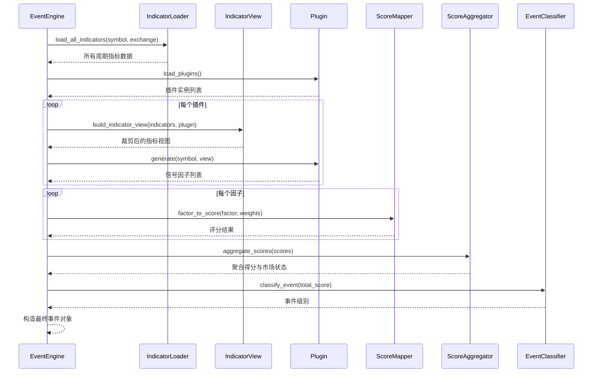
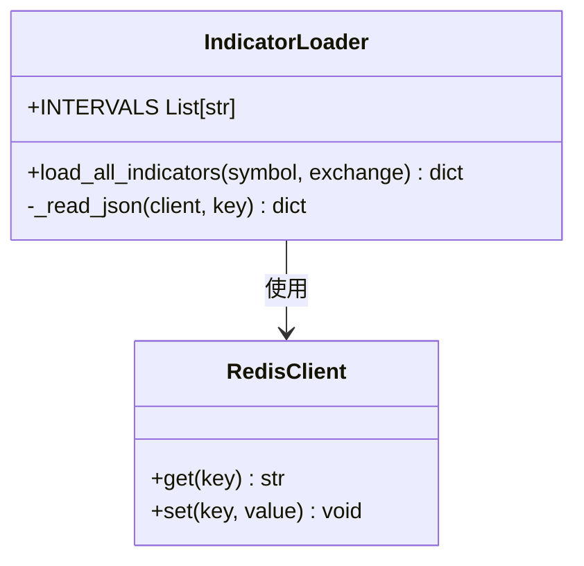
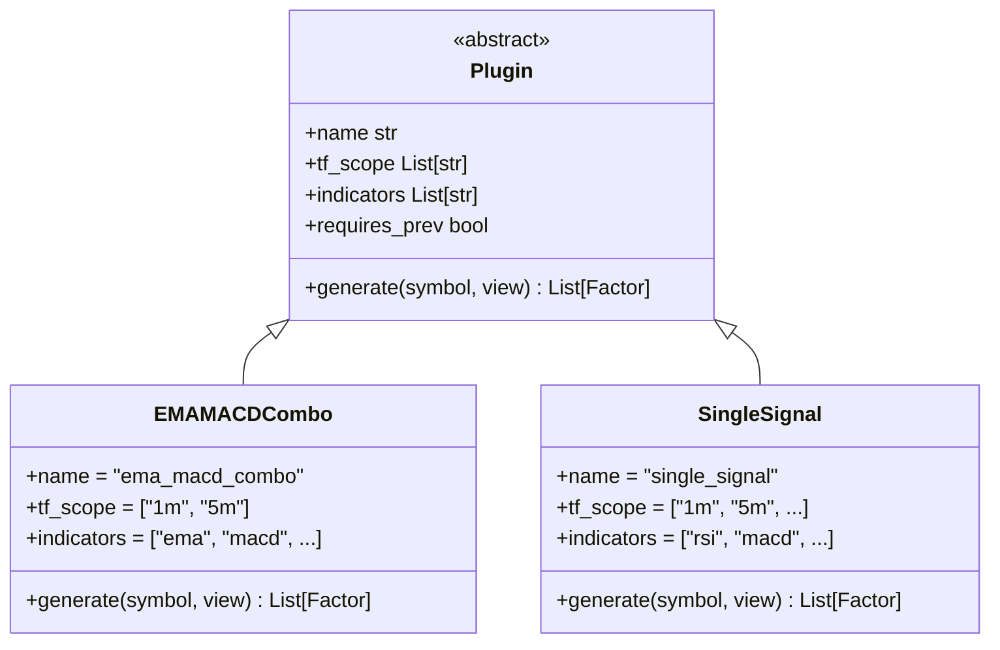
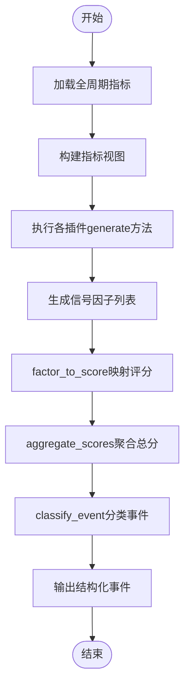
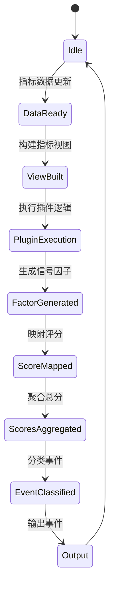
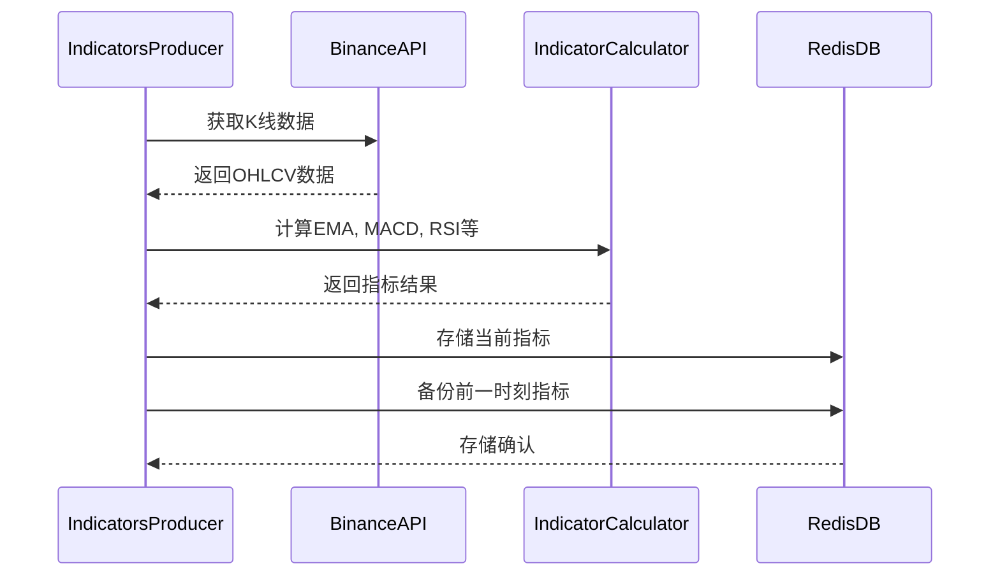
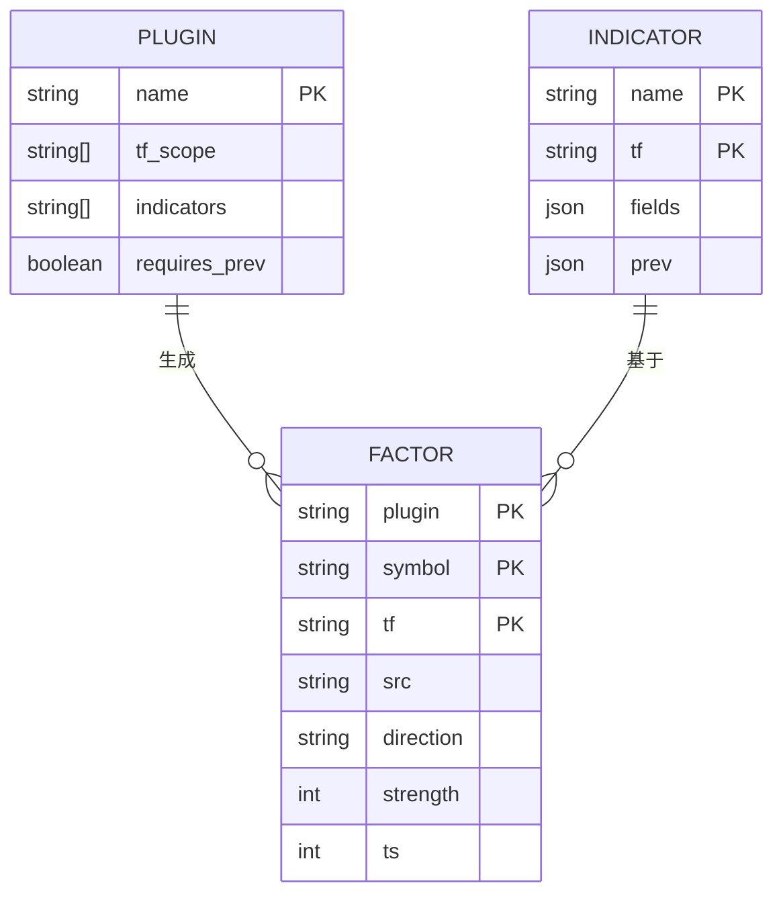
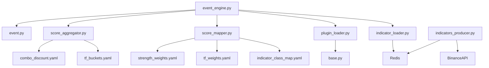

# 事件生成引擎

<cite>
**本文档中引用的文件**  
- [event_engine.py](file://event_center/indicators_event/engine/event_engine.py)
- [indicator_loader.py](file://event_center/indicators_event/engine/indicator_loader.py)
- [indicator_view.py](file://event_center/indicators_event/engine/indicator_view.py)
- [plugin_loader.py](file://event_center/indicators_event/engine/plugin_loader.py)
- [indicator.py](file://event_center/indicators_event/models/indicator.py)
- [event.py](file://event_center/indicators_event/models/event.py)
- [score_mapper.py](file://event_center/indicators_event/scoring/score_mapper.py)
- [score_aggregator.py](file://event_center/indicators_event/scoring/score_aggregator.py)
- [base.py](file://event_center/indicators_event/plugins/base.py)
- [ema_macd_combo.py](file://event_center/indicators_event/plugins/ema_macd_combo.py)
- [single_signal.py](file://event_center/indicators_event/plugins/single_signal.py)
- [indicator_class_map.yaml](file://event_center/indicators_event/config/indicator_class_map.yaml)
- [tf_weights.yaml](file://event_center/indicators_event/config/tf_weights.yaml)
- [indicators_producer.py](file://data_server/binance/rest_binance/app/indicators_producer.py)
</cite>

## 目录
1. [简介](#简介)
2. [项目结构](#项目结构)
3. [核心组件](#核心组件)
4. [架构概述](#架构概述)
5. [详细组件分析](#详细组件分析)
6. [依赖分析](#依赖分析)
7. [性能考量](#性能考量)
8. [故障排除指南](#故障排除指南)
9. [结论](#结论)

## 简介
UTaker事件生成引擎是一个基于插件化设计的信号提取系统，旨在从原始市场数据中识别并生成交易事件。该引擎通过动态加载技术指标分析器，结合多时间框架与多指标融合策略，实现对市场状态的综合判断。系统采用分层评分与事件分类机制，将原始信号转化为不同级别的事件输出，支持灵活的策略扩展与配置管理。

## 项目结构
事件生成引擎位于`event_center/indicators_event`目录下，主要由引擎核心、插件系统、评分模块和配置文件组成。指标数据由`data_server/binance`服务通过REST API采集并写入Redis，供事件引擎消费。

**图示来源**
- [indicators_producer.py](file://data_server/binance/rest_binance/app/indicators_producer.py)
- [indicator_loader.py](file://event_center/indicators_event/engine/indicator_loader.py)
- [event_engine.py](file://event_center/indicators_event/engine/event_engine.py)

**本节来源**
- [event_center/indicators_event](file://event_center/indicators_event)
- [data_server/binance](file://data_server/binance)

## 核心组件
事件生成引擎的核心包括事件引擎主控逻辑、指标加载器、插件管理系统、评分映射与聚合器，以及领域模型定义。这些组件协同工作，完成从原始数据到结构化事件的转化过程。

**本节来源**
- [event_engine.py](file://event_center/indicators_event/engine/event_engine.py)
- [indicator_loader.py](file://event_center/indicators_event/engine/indicator_loader.py)
- [score_mapper.py](file://event_center/indicators_event/scoring/score_mapper.py)
- [score_aggregator.py](file://event_center/indicators_event/scoring/score_aggregator.py)

## 架构概述
UTaker事件生成引擎采用插件化架构，支持灵活扩展。系统通过`indicator_loader`从Redis加载多周期技术指标，经`indicator_view`裁剪后交由各插件生成信号因子，再通过评分系统加权聚合，最终生成分级事件。

**图示来源**
- [event_engine.py](file://event_center/indicators_event/engine/event_engine.py)
- [indicator_loader.py](file://event_center/indicators_event/engine/indicator_loader.py)
- [plugin_loader.py](file://event_center/indicators_event/engine/plugin_loader.py)

## 详细组件分析
### 事件引擎主控逻辑
`event_engine.py`是整个系统的入口，负责协调各组件工作流程。它加载所有指标与插件，构建指标视图，执行插件生成因子，并进行评分聚合与事件分类。

**图示来源**
- [event_engine.py](file://event_center/indicators_event/engine/event_engine.py)
- [indicator_loader.py](file://event_center/indicators_event/engine/indicator_loader.py)
- [indicator_view.py](file://event_center/indicators_event/engine/indicator_view.py)

**本节来源**
- [event_engine.py](file://event_center/indicators_event/engine/event_engine.py)

### 指标加载与生命周期管理
`indicator_loader.py`负责从Redis中加载指定交易对的全周期技术指标数据。系统为每个时间框架（1m, 5m, 15m等）维护当前值与前一时刻值，支持趋势变化检测。

**图示来源**
- [indicator_loader.py](file://event_center/indicators_event/engine/indicator_loader.py)

**本节来源**
- [indicator_loader.py](file://event_center/indicators_event/engine/indicator_loader.py)

### 插件化指标分析器
系统通过`plugin_loader.py`动态加载`plugins`目录下的所有分析器插件。插件需继承`Plugin`基类，声明所依赖的时间框架与指标类型，并实现`generate`方法。

**图示来源**
- [base.py](file://event_center/indicators_event/plugins/base.py)
- [ema_macd_combo.py](file://event_center/indicators_event/plugins/ema_macd_combo.py)
- [single_signal.py](file://event_center/indicators_event/plugins/single_signal.py)

**本节来源**
- [plugin_loader.py](file://event_center/indicators_event/engine/plugin_loader.py)
- [base.py](file://event_center/indicators_event/plugins/base.py)

### 指标到事件的转化过程
系统通过`indicator_view.py`根据插件声明的依赖关系，从全量指标中裁剪出子集视图。插件基于此视图生成信号因子，再经评分系统转化为结构化事件。

**图示来源**
- [indicator_view.py](file://event_center/indicators_event/engine/indicator_view.py)
- [score_mapper.py](file://event_center/indicators_event/scoring/score_mapper.py)
- [score_aggregator.py](file://event_center/indicators_event/scoring/score_aggregator.py)

**本节来源**
- [indicator_view.py](file://event_center/indicators_event/engine/indicator_view.py)
- [event.py](file://event_center/indicators_event/models/event.py)

### 事件生成触发条件与控制策略
事件生成的触发基于技术指标的特定状态变化。系统通过`requires_prev`字段控制是否需要前一时刻数据，实现趋势判断。频率由外部调度器控制，去重通过Redis键值设计实现。

**图示来源**
- [event_engine.py](file://event_center/indicators_event/engine/event_engine.py)
- [indicator_loader.py](file://event_center/indicators_event/engine/indicator_loader.py)

**本节来源**
- [event_engine.py](file://event_center/indicators_event/engine/event_engine.py)

### 原始数据到信号流的转化
`indicators_producer.py`负责从Binance API获取原始K线数据，计算各类技术指标，并将结果写入Redis。该服务作为事件引擎的数据源，定期更新各时间框架的指标值。

**图示来源**
- [indicators_producer.py](file://data_server/binance/rest_binance/app/indicators_producer.py)

**本节来源**
- [indicators_producer.py](file://data_server/binance/rest_binance/app/indicators_producer.py)

### 自定义指标接入示例
要接入自定义指标，需在`plugins`目录下创建新模块，继承`Plugin`基类，声明依赖并实现`generate`方法。系统会自动发现并加载该插件。

**图示来源**
- [base.py](file://event_center/indicators_event/plugins/base.py)
- [indicator.py](file://event_center/indicators_event/models/indicator.py)

**本节来源**
- [base.py](file://event_center/indicators_event/plugins/base.py)

## 依赖分析
系统各组件间存在明确的依赖关系。事件引擎依赖指标加载器和插件加载器，插件依赖基础类定义，评分系统依赖配置文件。

**图示来源**
- [go.mod](file://go.mod)
- [requirements.txt](file://requirements.txt)

**本节来源**
- [event_engine.py](file://event_center/indicators_event/engine/event_engine.py)
- [plugin_loader.py](file://event_center/indicators_event/engine/plugin_loader.py)

## 性能考量
系统通过批处理、异步计算和缓存机制优化性能。指标计算在数据服务器端批量完成，事件引擎仅做轻量级聚合。Redis作为高速缓存层，减少重复计算。未来可引入异步任务队列进一步提升吞吐量。

## 故障排除指南
常见问题包括Redis连接失败、指标数据缺失、插件加载异常等。应检查Redis服务状态、网络连接、配置文件路径及插件语法正确性。可通过运行各模块的`__main__`测试代码进行独立验证。

**本节来源**
- [indicator_loader.py](file://event_center/indicators_event/engine/indicator_loader.py)
- [plugin_loader.py](file://event_center/indicators_event/engine/plugin_loader.py)
- [event_engine.py](file://event_center/indicators_event/engine/event_engine.py)

## 结论
UTaker事件生成引擎采用清晰的插件化架构，实现了技术指标到交易事件的高效转化。系统具备良好的扩展性与灵活性，支持多维度市场分析。通过合理的分层设计与配置管理，为量化策略开发提供了坚实基础。