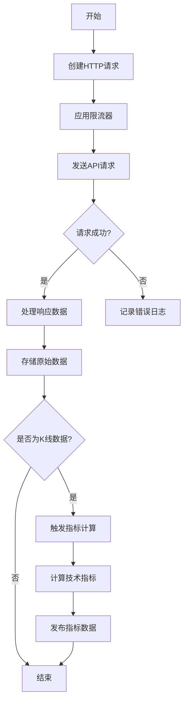
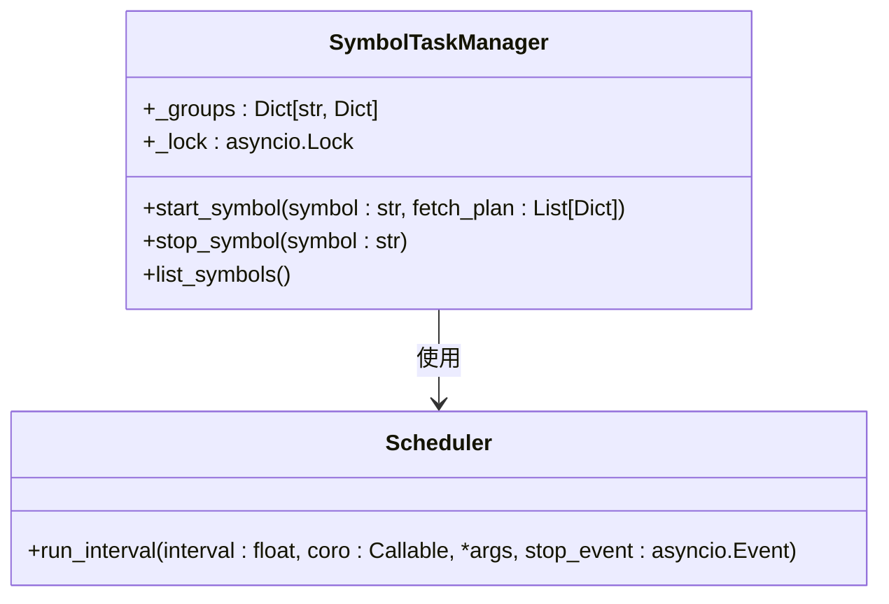
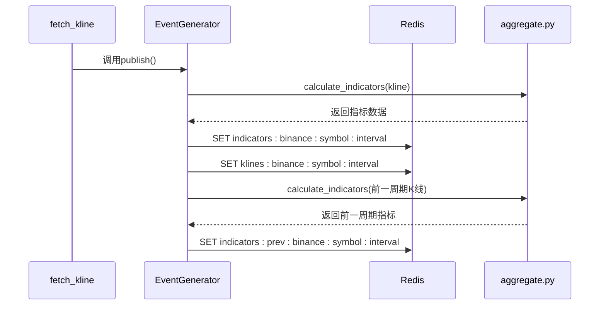
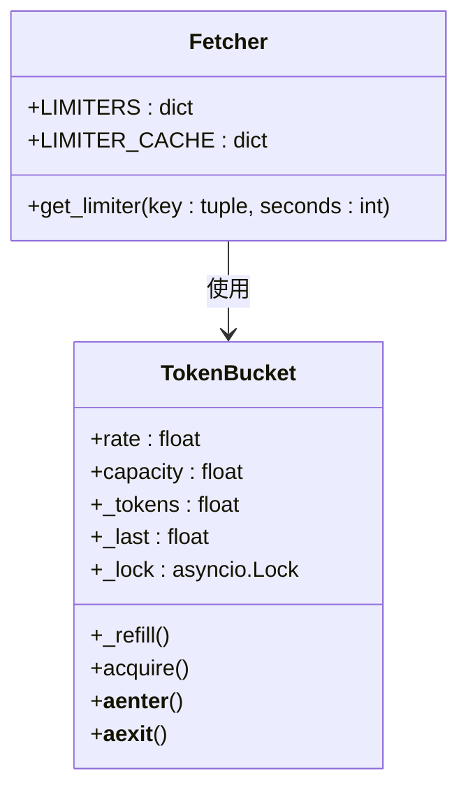

# REST数据采集

<cite>
**本文档引用的文件**
- [fetchers.py](file://data_server/binance/rest_binance/app/fetchers.py)
- [main.py](file://data_server/binance/rest_binance/app/main.py)
- [indicators_producer.py](file://data_server/binance/rest_binance/app/indicators_producer.py)
- [ratelimiter.py](file://data_server/binance/rest_binance/app/ratelimiter.py)
- [manager.py](file://data_server/binance/rest_binance/app/manager.py)
- [scheduler.py](file://data_server/binance/rest_binance/app/scheduler.py)
- [config.py](file://data_server/binance/rest_binance/app/config.py)
- [market_store.py](file://data_server/binance/rest_binance/app/market_store.py)
- [signals/aggregate.py](file://data_server/binance/rest_binance/app/signals/aggregate.py)
</cite>

## 目录
1. [引言](#引言)
2. [核心组件](#核心组件)
3. [数据采集机制](#数据采集机制)
4. [任务调度架构](#任务调度架构)
5. [技术指标计算与发布](#技术指标计算与发布)
6. [限流与异常处理](#限流与异常处理)
7. [系统集成与数据流](#系统集成与数据流)
8. [扩展性设计](#扩展性设计)

## 引言
UTaker系统通过REST API实现对Binance交易所的轮询式数据采集，支持K线、资金费率、持仓比例等多维度市场数据的实时获取。本系统采用异步架构，结合Redis作为中间存储，实现了高效、稳定的数据采集与处理流程。该机制为后续的事件中心分析提供基础数据支持。

## 核心组件

**本节来源**
- [fetchers.py](file://data_server/binance/rest_binance/app/fetchers.py#L1-L226)
- [main.py](file://data_server/binance/rest_binance/app/main.py#L1-L99)
- [indicators_producer.py](file://data_server/binance/rest_binance/app/indicators_producer.py#L1-L42)

## 数据采集机制

UTaker系统的数据采集基于`fetchers.py`模块实现，通过异步HTTP请求轮询Binance API获取各类市场数据。系统定义了多个专用采集函数，分别负责不同数据类型的获取：

- `fetch_kline`: 获取指定交易对和时间周期的K线数据
- `fetch_takerLongShortRatio`: 获取主动买卖量比率
- `fetch_topLongShortAccountRatio`: 获取大户账户多空比
- `fetch_topLongShortPositionRatio`: 获取大户持仓多空比
- `fetch_globalLongShortAccountRatio`: 获取全网账户多空比
- `fetch_ticker24hr`: 获取24小时价格变动情况
- `fetch_fundingRate`: 获取资金费率

这些采集函数通过`spider_poller`等轮询器持续运行，确保数据的实时性。每个采集函数都集成了限流控制和异常处理机制，保证系统稳定运行。

**本图来源**
- [fetchers.py](file://data_server/binance/rest_binance/app/fetchers.py#L33-L198)

**本节来源**
- [fetchers.py](file://data_server/binance/rest_binance/app/fetchers.py#L33-L198)
- [market_store.py](file://data_server/binance/rest_binance/app/market_store.py#L12-L25)

## 任务调度架构

系统通过`main.py`中的`SymbolTaskManager`实现动态任务调度。该管理器根据配置动态创建和管理不同时间周期的数据采集任务。`FETCH_PLAN`配置定义了各种采集任务的名称、执行函数和执行间隔。

`SymbolTaskManager`采用字典结构管理每个交易对的任务组，通过`start_symbol`和`stop_symbol`方法实现交易对的动态添加和移除。任务调度基于`scheduler.py`中的`run_interval`函数，该函数实现了精确的时间间隔控制，确保任务按预定频率执行。

**本图来源**
- [manager.py](file://data_server/binance/rest_binance/app/manager.py#L7-L52)
- [scheduler.py](file://data_server/binance/rest_binance/app/scheduler.py#L6-L24)

**本节来源**
- [main.py](file://data_server/binance/rest_binance/app/main.py#L22-L57)
- [manager.py](file://data_server/binance/rest_binance/app/manager.py#L7-L52)
- [scheduler.py](file://data_server/binance/rest_binance/app/scheduler.py#L6-L24)

## 技术指标计算与发布

系统通过`indicators_producer.py`模块实现技术指标的计算与发布。`EventGenerator`类负责接收原始K线数据，调用`signals/aggregate.py`中的`compute_all_indicators`函数计算多种技术指标，包括EMA、MACD、RSI、布林带等。

计算完成后，指标数据通过Redis存储在`indicators:binance:{symbol}:{interval}`键下，同时原始K线数据存储在`klines:binance:{symbol}:{interval}`键下。系统还计算并存储前一周期的指标数据，用于后续的指标变化分析。

**本图来源**
- [indicators_producer.py](file://data_server/binance/rest_binance/app/indicators_producer.py#L13-L34)
- [signals/aggregate.py](file://data_server/binance/rest_binance/app/signals/aggregate.py#L12-L44)

**本节来源**
- [indicators_producer.py](file://data_server/binance/rest_binance/app/indicators_producer.py#L13-L34)
- [signals/aggregate.py](file://data_server/binance/rest_binance/app/signals/aggregate.py#L1-L45)

## 限流与异常处理

系统采用令牌桶算法实现限流控制，通过`ratelimiter.py`中的`TokenBucket`类实现。`config.py`中定义了不同时间周期的限流策略，如1分钟周期每20秒请求一次，5分钟周期每150秒请求一次等。

`fetchers.py`中的`get_limiter`函数为每个数据源创建独立的限流器，避免不同数据源之间的请求干扰。所有HTTP请求都在限流器的上下文中执行，确保不会超出交易所的API限制。

异常处理机制贯穿整个数据采集流程，每个采集函数都包含try-catch块，捕获并记录异常，防止单个采集任务的失败影响整个系统。任务调度器也具备异常重试能力，确保数据采集的连续性。

**本图来源**
- [ratelimiter.py](file://data_server/binance/rest_binance/app/ratelimiter.py#L5-L33)
- [fetchers.py](file://data_server/binance/rest_binance/app/fetchers.py#L18-L27)

**本节来源**
- [ratelimiter.py](file://data_server/binance/rest_binance/app/ratelimiter.py#L5-L33)
- [config.py](file://data_server/binance/rest_binance/app/config.py#L9-L18)
- [fetchers.py](file://data_server/binance/rest_binance/app/fetchers.py#L18-L27)

## 系统集成与数据流

UTaker系统的REST数据采集模块与事件中心通过Redis实现数据流衔接。采集模块将原始数据和计算后的技术指标存储在Redis中，事件中心通过订阅这些数据键来获取最新市场信息。

数据流路径如下：Binance API → HTTP Client → 原始数据存储 → 技术指标计算 → 指标数据发布 → Redis → 事件中心消费。这种松耦合的设计使得数据采集和事件处理可以独立扩展和维护。

**本节来源**
- [fetchers.py](file://data_server/binance/rest_binance/app/fetchers.py#L46-L47)
- [indicators_producer.py](file://data_server/binance/rest_binance/app/indicators_producer.py#L23-L26)
- [market_store.py](file://data_server/binance/rest_binance/app/market_store.py#L15-L16)

## 扩展性设计

系统具有良好的扩展性，支持轻松添加新的技术指标或数据类型。要添加新的技术指标，只需在`signals/`目录下创建新的指标计算模块，并在`aggregate.py`中导入和调用即可。

要支持新的数据类型，可以在`fetchers.py`中添加新的采集函数，并在`FETCH_PLAN`中注册相应的任务。系统的模块化设计和清晰的接口定义使得扩展工作简单可靠。

**本节来源**
- [signals/aggregate.py](file://data_server/binance/rest_binance/app/signals/aggregate.py#L1-L45)
- [fetchers.py](file://data_server/binance/rest_binance/app/fetchers.py#L33-L198)
- [main.py](file://data_server/binance/rest_binance/app/main.py#L46-L57)