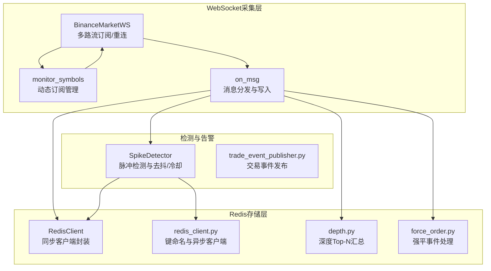
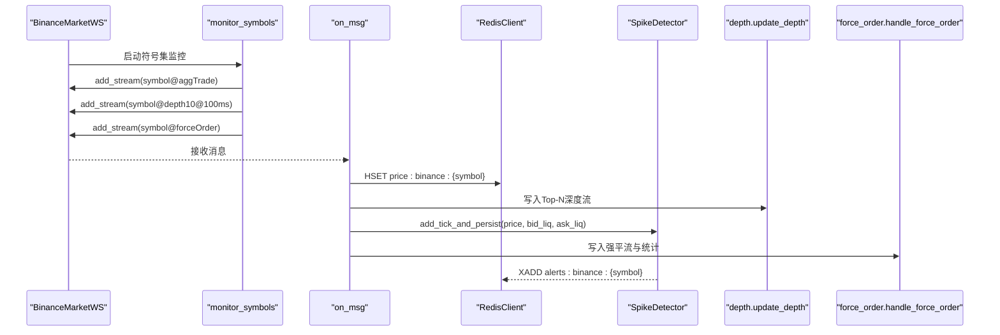
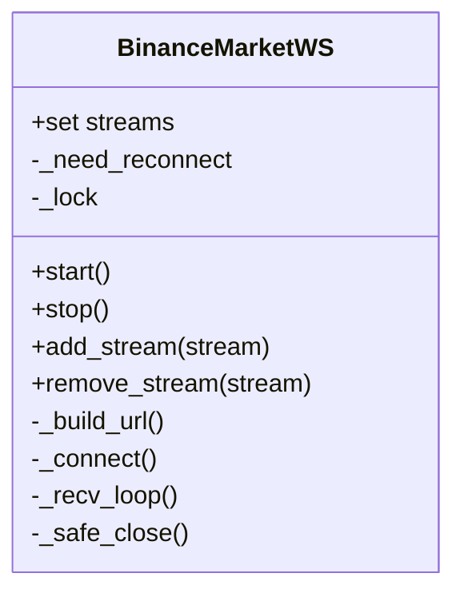
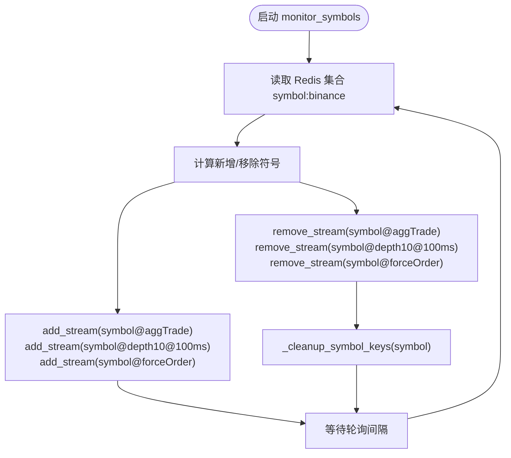
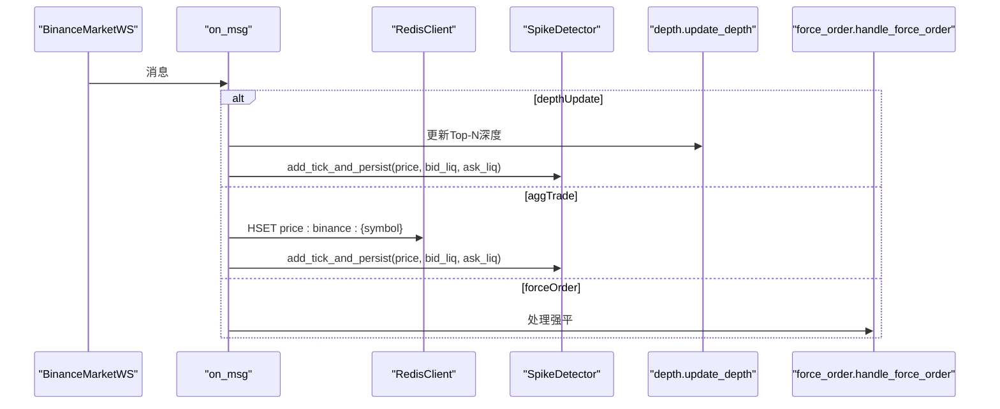
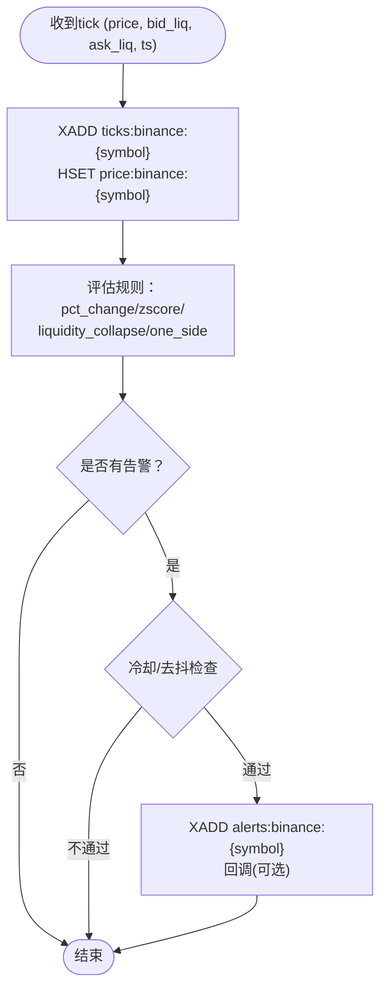
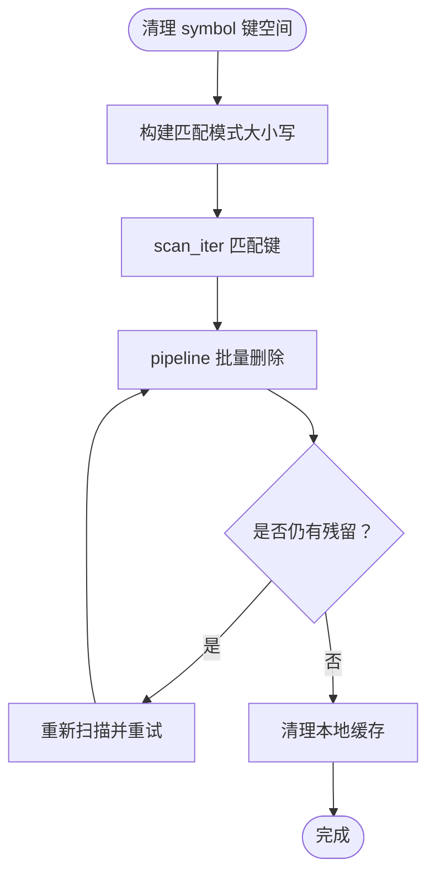
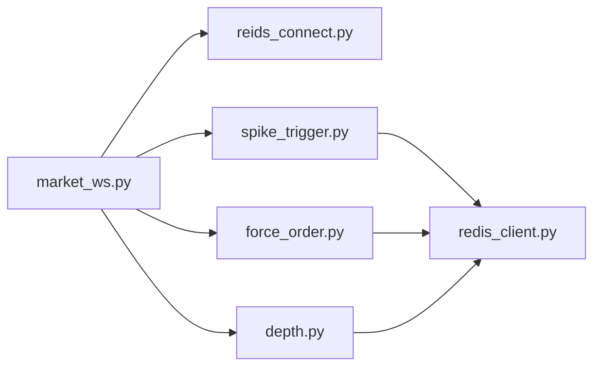

# WebSocket实时监听

<cite>
**本文引用的文件**
- [market_ws.py](file://data_server/binance/ws_binance/market_ws.py)
- [spike_trigger.py](file://data_server/binance/ws_binance/utils/spike_trigger.py)
- [redis_client.py](file://data_server/binance/ws_binance/utils/redis_client.py)
- [reids_connect.py](file://data_server/binance/ws_binance/utils/reids_connect.py)
- [force_order.py](file://data_server/binance/ws_binance/utils/force_order.py)
- [depth.py](file://data_server/binance/ws_binance/utils/depth.py)
- [trade_event_publisher.py](file://data_server/binance/ws_binance/utils/trade_event_publisher.py)
</cite>

## 目录
1. [简介](#简介)
2. [项目结构](#项目结构)
3. [核心组件](#核心组件)
4. [架构总览](#架构总览)
5. [详细组件分析](#详细组件分析)
6. [依赖关系分析](#依赖关系分析)
7. [性能考量](#性能考量)
8. [故障排查指南](#故障排查指南)
9. [结论](#结论)

## 简介
本文件深入解析UTaker系统通过WebSocket实现的实时市场数据监听架构，重点覆盖以下方面：
- BinanceMarketWS类如何管理聚合成交（aggTrade）、深度（depth10@100ms）和强平订单（forceOrder）的多路流订阅
- 利用RedisClient将价格、深度、强平事件实时写入Redis
- SpikeDetector如何结合价格变动、流动性变化与Z-Score算法检测市场脉冲事件，并通过回调触发警报
- 动态订阅管理机制（add_stream/remove_stream）与连接重连策略
- _cleanup_symbol_keys对Redis键空间的清理逻辑
- 实际代码片段路径说明事件处理流程与性能优化措施

## 项目结构
该模块位于data_server/binance/ws_binance目录下，围绕WebSocket市场数据采集、Redis存储与事件检测展开，形成“采集-存储-检测-告警”的闭环。

图表来源
- [market_ws.py](file://data_server/binance/ws_binance/market_ws.py#L119-L249)
- [market_ws.py](file://data_server/binance/ws_binance/market_ws.py#L251-L288)
- [market_ws.py](file://data_server/binance/ws_binance/market_ws.py#L290-L347)
- [depth.py](file://data_server/binance/ws_binance/utils/depth.py#L13-L103)
- [force_order.py](file://data_server/binance/ws_binance/utils/force_order.py#L15-L81)
- [redis_client.py](file://data_server/binance/ws_binance/utils/redis_client.py#L1-L116)
- [reids_connect.py](file://data_server/binance/ws_binance/utils/reids_connect.py#L1-L95)
- [spike_trigger.py](file://data_server/binance/ws_binance/utils/spike_trigger.py#L83-L165)
- [trade_event_publisher.py](file://data_server/binance/ws_binance/utils/trade_event_publisher.py#L1-L114)

章节来源
- [market_ws.py](file://data_server/binance/ws_binance/market_ws.py#L1-L379)
- [spike_trigger.py](file://data_server/binance/ws_binance/utils/spike_trigger.py#L1-L436)
- [redis_client.py](file://data_server/binance/ws_binance/utils/redis_client.py#L1-L116)
- [reids_connect.py](file://data_server/binance/ws_binance/utils/reids_connect.py#L1-L95)
- [force_order.py](file://data_server/binance/ws_binance/utils/force_order.py#L1-L129)
- [depth.py](file://data_server/binance/ws_binance/utils/depth.py#L1-L111)
- [trade_event_publisher.py](file://data_server/binance/ws_binance/utils/trade_event_publisher.py#L1-L114)

## 核心组件
- BinanceMarketWS：负责构建WebSocket URL、建立连接、接收消息、动态增删订阅与重连控制
- SpikeDetector：基于滑动窗口的价格变化、Z-Score与深度崩塌检测，支持去抖与冷却
- RedisClient与redis_client.py：提供Redis连接池、键命名规范与安全写入工具
- depth.py：将深度Top-N汇总写入Redis Stream，同时维护最新价格摘要
- force_order.py：解析强平订单，写入Stream与统计键，并提供监控
- trade_event_publisher.py：将交易事件标准化写入Redis Stream，供下游统一消费

章节来源
- [market_ws.py](file://data_server/binance/ws_binance/market_ws.py#L119-L249)
- [spike_trigger.py](file://data_server/binance/ws_binance/utils/spike_trigger.py#L83-L165)
- [redis_client.py](file://data_server/binance/ws_binance/utils/redis_client.py#L1-L116)
- [reids_connect.py](file://data_server/binance/ws_binance/utils/reids_connect.py#L1-L95)
- [depth.py](file://data_server/binance/ws_binance/utils/depth.py#L13-L103)
- [force_order.py](file://data_server/binance/ws_binance/utils/force_order.py#L15-L81)
- [trade_event_publisher.py](file://data_server/binance/ws_binance/utils/trade_event_publisher.py#L1-L114)

## 架构总览
WebSocket采集层通过BinanceMarketWS统一管理多路流订阅，on_msg根据事件类型分别写入Redis并喂给SpikeDetector进行脉冲检测；深度与强平事件分别由depth.py与force_order.py处理；最终通过Redis Stream向下游（如Agent、Dashboard、通知系统）广播。

图表来源
- [market_ws.py](file://data_server/binance/ws_binance/market_ws.py#L251-L347)
- [depth.py](file://data_server/binance/ws_binance/utils/depth.py#L13-L103)
- [force_order.py](file://data_server/binance/ws_binance/utils/force_order.py#L15-L81)
- [spike_trigger.py](file://data_server/binance/ws_binance/utils/spike_trigger.py#L190-L244)

## 详细组件分析

### BinanceMarketWS：多路流订阅与动态管理
- 多路流URL构建：单路直接拼接，多路通过“/stream?streams=...”合并
- 连接与重连：异常捕获后安全关闭，短暂休眠后重连；_need_reconnect为True时立即break并强制重连
- 动态订阅：add_stream/remove_stream在锁保护下修改streams集合，并置位_need_reconnect以触发重连
- 消息分发：on_message统一处理，区分aggTrade、depthUpdate、forceOrder三类事件

图表来源
- [market_ws.py](file://data_server/binance/ws_binance/market_ws.py#L119-L249)

章节来源
- [market_ws.py](file://data_server/binance/ws_binance/market_ws.py#L145-L170)
- [market_ws.py](file://data_server/binance/ws_binance/market_ws.py#L171-L215)
- [market_ws.py](file://data_server/binance/ws_binance/market_ws.py#L234-L249)

### 动态订阅管理与连接重连策略
- monitor_symbols持续轮询Redis集合“symbol:binance”，根据差集新增/移除订阅
- 新增订阅：为每个symbol添加aggTrade、depth10@100ms、forceOrder三路流
- 移除订阅：同步移除三路流，并调用_cleanup_symbol_keys清理Redis键空间
- 重连策略：_recv_loop中捕获异常后安全关闭连接，短暂休眠后重连；_need_reconnect为True时立即break并强制重连

图表来源
- [market_ws.py](file://data_server/binance/ws_binance/market_ws.py#L251-L288)

章节来源
- [market_ws.py](file://data_server/binance/ws_binance/market_ws.py#L251-L288)

### 事件处理流程：价格、深度、强平
- 聚合成交（aggTrade）：提取价格与时间戳，写入Redis Hash（price:binance:{symbol}），同时缓存价格并喂给SpikeDetector
- 深度（depthUpdate）：汇总Top10买卖深度，写入深度流（ticks:binance:{symbol}），并喂给SpikeDetector
- 强平（forceOrder）：解析强平订单，写入强平流与统计键，提供监控输出

图表来源
- [market_ws.py](file://data_server/binance/ws_binance/market_ws.py#L290-L347)
- [depth.py](file://data_server/binance/ws_binance/utils/depth.py#L13-L103)
- [force_order.py](file://data_server/binance/ws_binance/utils/force_order.py#L15-L81)
- [spike_trigger.py](file://data_server/binance/ws_binance/utils/spike_trigger.py#L190-L244)

章节来源
- [market_ws.py](file://data_server/binance/ws_binance/market_ws.py#L290-L347)
- [depth.py](file://data_server/binance/ws_binance/utils/depth.py#L13-L103)
- [force_order.py](file://data_server/binance/ws_binance/utils/force_order.py#L15-L81)

### SpikeDetector：脉冲检测与告警
- 输入：每个tick的price、bid_liq、ask_liq、ts（毫秒）
- 检测指标：
  - 简单百分比变化（pct_change_up/down）
  - Z-Score异常（收益序列，需numpy）
  - 深度崩塌（bid/ask liquidity相对历史均值显著下降，需连续确认）
  - 单边行情（连续上涨/下跌且总幅度达标）
- 去抖与冷却：同类型事件在debounce_ms内忽略，触发后cooldown_s内不再重复
- 聚合窗口：在aggregate_window_ms内合并多个相似事件
- 输出：将告警写入Redis Stream（alerts:binance:{symbol}），并可选回调

图表来源
- [spike_trigger.py](file://data_server/binance/ws_binance/utils/spike_trigger.py#L190-L244)
- [spike_trigger.py](file://data_server/binance/ws_binance/utils/spike_trigger.py#L245-L374)
- [spike_trigger.py](file://data_server/binance/ws_binance/utils/spike_trigger.py#L352-L374)

章节来源
- [spike_trigger.py](file://data_server/binance/ws_binance/utils/spike_trigger.py#L83-L165)
- [spike_trigger.py](file://data_server/binance/ws_binance/utils/spike_trigger.py#L190-L374)

### Redis键空间管理与清理
- 键命名规范：price:binance:{symbol}、depth:binance:{symbol}、ticks:binance:{symbol}、alerts:binance:{symbol}、force_stream:binance:{symbol}、stats:binance:{symbol}
- _cleanup_symbol_keys：扫描匹配多种大小写形式的pattern，批量删除并重试，同时清理本地缓存，避免残留写入
- RedisClient：提供set_hash等安全写入方法，自动处理键类型不匹配问题

图表来源
- [market_ws.py](file://data_server/binance/ws_binance/market_ws.py#L49-L117)
- [redis_client.py](file://data_server/binance/ws_binance/utils/redis_client.py#L33-L69)

章节来源
- [market_ws.py](file://data_server/binance/ws_binance/market_ws.py#L49-L117)
- [redis_client.py](file://data_server/binance/ws_binance/utils/redis_client.py#L1-L116)

### 强平事件处理与统计
- handle_force_order：解析强平订单，写入强平流（保留有限条目），并维护统计键（含BUY/SELL计数与总量）
- 提供监控函数定期输出当前强度，便于下游感知爆仓压力

章节来源
- [force_order.py](file://data_server/binance/ws_binance/utils/force_order.py#L15-L81)
- [force_order.py](file://data_server/binance/ws_binance/utils/force_order.py#L105-L117)

### 交易事件发布（与脉冲检测协同）
- TradeEventPublisher：将交易变更事件标准化写入Redis Stream（final_events），便于下游统一订阅与处理

章节来源
- [trade_event_publisher.py](file://data_server/binance/ws_binance/utils/trade_event_publisher.py#L1-L114)

## 依赖关系分析
- BinanceMarketWS依赖RedisClient进行价格与深度写入，依赖SpikeDetector进行脉冲检测，依赖force_order处理强平事件
- SpikeDetector依赖redis.asyncio进行异步Redis操作，依赖numpy进行Z-Score计算
- depth.py与force_order.py共享redis_client.py提供的键命名与异步/同步客户端
- reids_connect.py提供同步RedisClient封装，兼容HSET类型校验与批量删除

图表来源
- [market_ws.py](file://data_server/binance/ws_binance/market_ws.py#L1-L379)
- [spike_trigger.py](file://data_server/binance/ws_binance/utils/spike_trigger.py#L1-L436)
- [redis_client.py](file://data_server/binance/ws_binance/utils/redis_client.py#L1-L116)
- [reids_connect.py](file://data_server/binance/ws_binance/utils/reids_connect.py#L1-L95)
- [depth.py](file://data_server/binance/ws_binance/utils/depth.py#L1-L111)
- [force_order.py](file://data_server/binance/ws_binance/utils/force_order.py#L1-L129)

## 性能考量
- 异步非阻塞：SpikeDetector在add_tick_and_persist中将评估逻辑放入异步任务，避免阻塞WebSocket接收循环
- 批量写入：RedisClient提供pipeline批量删除；depth.py在写入前进行Top-N过滤与数值校验，减少无效写入
- 去抖与冷却：降低高频误报与重复告警，减轻下游压力
- 窗口长度与确认次数：通过window_seconds、confirm_ticks与min_depth_liq平衡灵敏度与稳定性
- Redis写入策略：同时写入Stream与Latest Hash，兼顾回溯与快速查询

章节来源
- [spike_trigger.py](file://data_server/binance/ws_binance/utils/spike_trigger.py#L190-L244)
- [market_ws.py](file://data_server/binance/ws_binance/market_ws.py#L290-L347)
- [depth.py](file://data_server/binance/ws_binance/utils/depth.py#L13-L103)
- [redis_client.py](file://data_server/binance/ws_binance/utils/redis_client.py#L65-L90)

## 故障排查指南
- WebSocket连接异常
  - 现象：日志出现Disconnected警告
  - 排查：检查SSL上下文、ping_interval与timeout配置；确认_Bneed_reconnect触发后是否及时重连
  - 参考路径：[连接与重连](file://data_server/binance/ws_binance/market_ws.py#L171-L215)
- Redis写入错误
  - 现象：HSET/XADD写入错误日志
  - 排查：确认键类型（hash/stream）与Redis连接状态；使用RedisClient的安全写入方法
  - 参考路径：[安全写入与类型检查](file://data_server/binance/ws_binance/utils/reids_connect.py#L33-L69)，[键命名与异步客户端](file://data_server/binance/ws_binance/utils/redis_client.py#L93-L116)
- 强平事件缺失
  - 现象：强平流无数据
  - 排查：确认订阅了symbol@forceOrder；检查handle_force_order写入逻辑与统计键过期
  - 参考路径：[强平处理](file://data_server/binance/ws_binance/utils/force_order.py#L15-L81)
- 脉冲告警未触发
  - 现象：SpikeDetector未产生告警
  - 排查：检查pct_change_th、zscore_th、depth_ratio_th、confirm_ticks与min_depth_liq；确认去抖/冷却时间设置
  - 参考路径：[检测评估与去抖冷却](file://data_server/binance/ws_binance/utils/spike_trigger.py#L245-L374)
- 键空间残留
  - 现象：移除symbol后仍存在历史键
  - 排查：调用_cleanup_symbol_keys清理；确认大小写与pattern匹配
  - 参考路径：[键空间清理](file://data_server/binance/ws_binance/market_ws.py#L49-L117)

章节来源
- [market_ws.py](file://data_server/binance/ws_binance/market_ws.py#L171-L215)
- [reids_connect.py](file://data_server/binance/ws_binance/utils/reids_connect.py#L33-L69)
- [redis_client.py](file://data_server/binance/ws_binance/utils/redis_client.py#L93-L116)
- [force_order.py](file://data_server/binance/ws_binance/utils/force_order.py#L15-L81)
- [spike_trigger.py](file://data_server/binance/ws_binance/utils/spike_trigger.py#L245-L374)
- [market_ws.py](file://data_server/binance/ws_binance/market_ws.py#L49-L117)

## 结论
该架构通过BinanceMarketWS实现多路流的动态订阅与稳健重连，配合RedisClient与键命名规范，将价格、深度与强平事件高效写入Redis；SpikeDetector以滑动窗口与Z-Score为核心，结合深度崩塌与单边行情检测，提供去抖/冷却与事件聚合能力，最终通过Redis Stream将告警广播至下游。整体设计在高并发与高频数据场景下具备良好的稳定性与扩展性。